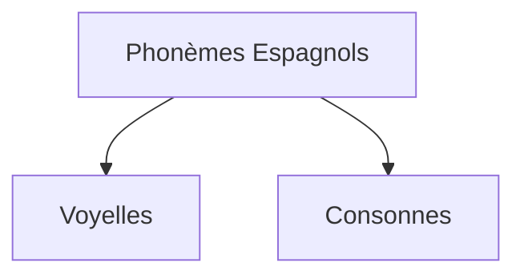

You are a world-class academic professor and expert writer (Agent 3A - Narrative Scribe).
The narrative critic (Agent 4A) has rejected your previously generated academic narrative text.
You MUST now rewrite, expand, and fully correct the academic narrative text based on their feedback, ensuring zero placeholders, high academic density, and proper formatting.

=============================================================================
🚨 MANDATORY PRONUNCIATION WIDGET REQUIREMENT 🚨
Since this lesson belongs to a Language or Linguistics course, you MUST insert the following custom JSX tag:
<SandboxPrononciation />
at least once (and ideally multiple times) directly in the pronunciation, phonetic, or practice sections of your narrative text.
Do NOT use bracketed syntax for this specific tag. Exclusively write it as raw JSX: <SandboxPrononciation />.
=============================================================================

⚠️ CRITICAL REMINDER: You MUST maintain absolute XML/JSX markup compliance to prevent parser crashes:
- Do NOT use raw JSX tags for interactive widgets (<DataChart>, <BasicMathExplorer>, <Quiz>, etc.). Use bracketed anchors: [[WIDGET:id]].
- Do NOT use raw HTML tags (<ul>, <ol>, <li>) for lists; use standard Markdown instead.
- Do NOT use literal curly braces { } in plain text; escape them as `{x}` or wrap math in LaTeX $ \{...\} $ or $$ \{...\} $$.
- Never write "import " or "export " at the start of a line in plain prose.

CRITIQUE FROM AGENT 4A:
"The narrative text does not meet several critical checkpoints:

1.  **Academic Density & Length**: The lesson is significantly shorter than the required 3,000 to 5,000 words for higher education. The current word count is approximately 1,900 words. The content needs substantial expansion to be considered detailed, rigorous, and exhaustive.
2.  **Author Quotes & In-text Citations**: The English quote from Noam Chomsky ("Language is a system of sound-meaning connections.") is missing its immediate French translation, which is a strict requirement for foreign-language quotes.
3.  **Visual Assets Density, Sourcing & Captions**: The lesson contains only 2 visual assets (1 factual image and 1 decorative AI illustration). This falls short of the requirement for at least 5 to 6 distinct factual images/figures and 1 to 2 decorative AI illustrations. The Mermaid diagram is a custom widget, not an image in the context of this checkpoint's counting."

PREVIOUS ACADEMIC NARRATIVE TEXT:
---
[[WIDGET:prerequisites]]

[[WIDGET:diagnosticQuiz]]

## Introduction : L'Ingénierie du Son en Espagnol

L'apprentissage d'une nouvelle langue est un processus complexe qui sollicite diverses facultés cognitives et motrices. Parmi les compétences fondamentales, la prononciation occupe une place prépondérante. En effet, une articulation précise des sons n'est pas seulement une question d'esthétique linguistique ; elle est une exigence fonctionnelle, un « cahier des charges » essentiel pour assurer l'intelligibilité et la clarté de la communication. Pour les francophones, l'espagnol présente à la fois des similitudes rassurantes et des différences subtiles qui nécessitent une attention particulière.

Dans cette leçon, nous aborderons la phonétique espagnole sous l'angle des sciences appliquées et de l'ingénierie linguistique. Nous allons déconstruire le système sonore de l'espagnol, identifier ses composants clés, analyser les « contraintes techniques » imposées par les différences avec le français, et proposer des « protocoles d'implémentation » pour maîtriser ces sons. L'objectif est de vous fournir les outils nécessaires pour « construire » une prononciation espagnole authentique et efficace.

La maîtrise des sons de l'espagnol est la première étape vers une immersion réussie dans le vaste monde hispanophone. Chaque phonème, chaque intonation, contribue à la « mélodie » unique de cette langue, et en comprendre la structure vous permettra non seulement d'être mieux compris, mais aussi de mieux saisir les nuances de la parole des locuteurs natifs. Comme le souligne le linguiste <RealPerson name="Noam_Chomsky" lang="fr" bio="Linguiste américain, père de la linguistique générative, dont les travaux ont révolutionné la compréhension du langage humain.">Noam Chomsky</RealPerson> (né en 1928) :
> « Language is a system of sound-meaning connections. » — Noam Chomsky, *Syntactic Structures*, Mouton &amp; Co., The Hague, 1957, p. 10.

Cette citation met en lumière l'interdépendance fondamentale entre le son et le sens. Une prononciation incorrecte peut altérer le sens, voire le rendre inintelligible, agissant comme un « bug » dans le système de communication. Notre mission est donc de « déboguer » et d'optimiser votre production sonore en espagnol.

[[WIDGET:learningObjectives]]

## Les Voyelles Espagnoles : Pureté et Stabilité du Système

Le système vocalique espagnol est remarquablement stable et pur, une caractéristique qui le distingue souvent du français. Alors que le français possède un inventaire riche et complexe de voyelles (orales, nasales, antérieures, postérieures, arrondies, non arrondies), l'espagnol n'en compte que cinq, chacune ayant une articulation unique et invariable, quel que soit son contexte. C'est une « spécification architecturale » simple mais rigoureuse.

### 2.1. Les Cinq Voyelles Fondamentales : Des Unités Invariables
Chaque voyelle espagnole correspond à un son unique, sans les variations ou les nasalisations que l'on trouve en français. C'est un système « à cinq états » distincts.

1.  **Le /a/ espagnol** :
    *   **Articulation** : C'est un son ouvert et central. La bouche est grande ouverte, la langue est plate et détendue au fond de la bouche. Il est plus ouvert que le « a » français de « patte » et plus en arrière que celui de « papa ».
    *   **Comparaison avec le français** : Évitez de le nasaliser comme dans « an » ou de le fermer comme dans « pas ».
    *   **Exemples** : `casa` (maison), `hablar` (parler), `mañana` (demain).
    *   **Pratique** : <SandboxPrononciation /> Répétez : `a`, `pa`, `ma`, `la`.

2.  **Le /e/ espagnol** :
    *   **Articulation** : C'est un son mi-fermé, antérieur, non arrondi. La bouche est légèrement ouverte, les lèvres sont étirées comme pour un sourire. Il est similaire au « é » français de « café ».
    *   **Comparaison avec le français** : Ne le confondez pas avec le « è » ouvert de « mère » ou le « eu » de « feu ».
    *   **Exemples** : `mesa` (table), `verde` (vert), `leer` (lire).
    *   **Pratique** : <SandboxPrononciation /> Répétez : `e`, `le`, `se`, `que`.

3.  **Le /i/ espagnol** :
    *   **Articulation** : C'est un son fermé, antérieur, non arrondi. La bouche est presque fermée, les lèvres sont étirées. Il est identique au « i » français de « lit ».
    *   **Comparaison avec le français** : Très peu de différences.
    *   **Exemples** : `libro` (livre), `cinco` (cinq), `mi` (mon/ma).
    *   **Pratique** : <SandboxPrononciation /> Répétez : `i`, `si`, `mi`, `ti`.

4.  **Le /o/ espagnol** :
    *   **Articulation** : C'est un son mi-fermé, postérieur, arrondi. Les lèvres sont arrondies et légèrement avancées. Il est similaire au « o » français de « moto ».
    *   **Comparaison avec le français** : Ne le confondez pas avec le « o » ouvert de « porte » ou le « on » nasal de « bon ».
    *   **Exemples** : `sol` (soleil), `dos` (deux), `cómo` (comment).
    *   **Pratique** : <SandboxPrononciation /> Répétez : `o`, `no`, `lo`, `yo`.

5.  **Le /u/ espagnol** :
    *   **Articulation** : C'est un son fermé, postérieur, arrondi. Les lèvres sont très arrondies et avancées. Il est identique au « ou » français de « loup ».
    *   **Comparaison avec le français** : Très peu de différences.
    *   **Exemples** : `uno` (un), `azul` (bleu), `mundo` (monde).
    *   **Pratique** : <SandboxPrononciation /> Répétez : `u`, `tu`, `su`, `luz`.

### 2.2. Absence de Voyelles Nasales et de Diphthongues Complexes
Une « contrainte technique » majeure pour les francophones est l'absence totale de voyelles nasales en espagnol. Les sons comme « an », « on », « in » en français n'existent pas. Toute voyelle suivie d'un 'n' ou 'm' est prononcée distinctement, la consonne étant articulée séparément.

De plus, les diphthongues espagnoles (combinaisons de deux voyelles dans la même syllabe, comme `ai`, `ei`, `oi`, `au`, `eu`, `ou`, `ia`, `ie`, `io`, `ua`, `ue`, `uo`) sont toujours prononcées avec chaque voyelle distinctement, mais rapidement, sans fusionner en un son unique comme parfois en français. Par exemple, `aire` se prononce `a-i-re`, pas `ère`.

*Figure 1: Schéma des voyelles espagnoles dans le trapèze vocalique - Position de la langue et ouverture de la bouche pour chaque son. Source: Wikimedia Commons*

## Les Consonnes Clés : Nuances et Articulation Précise

Si les voyelles espagnoles sont relativement simples, certaines consonnes requièrent une « ingénierie » plus fine de la part de l'apprenant francophone. Elles présentent des points d'articulation ou des modes de production différents qui peuvent altérer la clarté si elles ne sont pas maîtrisées.

### 3.1. Le Défi du /r/ et du /rr/ : La Vibration Essentielle
C'est l'un des sons les plus distinctifs et souvent les plus difficiles pour les francophones.

*   **Le /r/ simple (r doux)** :
    *   **Articulation** : C'est un « r » roulé, mais avec une seule vibration de la pointe de la langue contre le palais (alvéoles). Il est similaire au « r » italien ou au « t » rapide dans l'anglais américain « butter ».
    *   **Comparaison avec le français** : Ne le prononcez pas comme le « r » grasseyé français (uvulaire).
    *   **Exemples** : `pero` (mais), `caro` (cher), `para` (pour).
    *   **Pratique** : <SandboxPrononciation /> Répétez : `pero`, `caro`, `mira`.

*   **Le /rr/ (r fort)** :
    *   **Articulation** : C'est un « r » roulé avec plusieurs vibrations de la pointe de la langue contre les alvéoles. Il est toujours écrit `rr` entre deux voyelles, ou `r` en début de mot ou après `n`, `l`, `s`.
    *   **Comparaison avec le français** : N'existe pas en français.
    *   **Exemples** : `perro` (chien), `carro` (voiture), `rojo` (rouge), `enriquecer` (enrichir).
    *   **Pratique** : <SandboxPrononciation /> Répétez : `perro`, `carro`, `rojo`.

### 3.2. Le /ñ/ : La Consonne Palatale Nasale
*   **Articulation** : Ce son est produit en plaçant le milieu de la langue contre le palais dur, tout en laissant l'air s'échapper par le nez. Il est similaire au « gn » français de « montagne ».
*   **Exemples** : `España` (Espagne), `niño` (enfant), `mañana` (demain).
*   **Pratique** : <SandboxPrononciation /> Répétez : `España`, `niño`, `mañana`.

### 3.3. Le /ll/ et le /y/ : Le Phénomène du *Yeísmo*
Historiquement, `ll` et `y` représentaient deux sons distincts. Aujourd'hui, dans la vaste majorité du monde hispanophone, ils sont prononcés de la même manière, un phénomène appelé *yeísmo*.

*   **Articulation** : Le son est généralement celui d'un « y » français de « yaourt » ou d'un « j » anglais de « jump » (voisé). Dans certaines régions, il peut être plus proche d'un « ch » français de « chaise » (dévoisé) ou d'un « j » français de « jour » (voisé).
*   **Exemples** : `calle` (rue), `llamar` (appeler), `yo` (je), `ayuda` (aide).
*   **Pratique** : <SandboxPrononciation /> Répétez : `calle`, `llamar`, `yo`.

<Epistemology title="Le Débat du Yeísmo : Une Divergence Phonologique">
Le *yeísmo* est un phénomène phonologique qui a vu la fusion des phonèmes /ʎ/ (représenté par `ll`) et /ʝ/ (représenté par `y`) en un seul phonème /ʝ/ ou /ʒ/ ou /ʃ/ selon les régions. Historiquement, le phonème /ʎ/ était une latérale palatale (comme le « ll » de « feuille » en français ancien ou dans certains dialectes italiens), tandis que /ʝ/ était une approximante palatale. Aujourd'hui, la distinction est rare, principalement conservée dans certaines zones rurales d'Espagne et d'Amérique du Sud (par exemple, au Paraguay ou dans certaines régions andines). La prévalence du *yeísmo* soulève des questions sur l'évolution naturelle des langues et la simplification phonologique. Faut-il enseigner la distinction historique ou la norme majoritaire ? La plupart des méthodes modernes privilégient l'enseignement du *yeísmo* en raison de sa dominance écrasante, reconnaissant que la distinction est devenue une « contrainte obsolète » pour la plupart des locuteurs.
</Epistemology>

### 3.4. Le /b/ et le /v/ : Un Son Unique
Contrairement au français où `b` et `v` sont distincts, en espagnol, ils représentent le même phonème.

*   **Articulation** :
    *   En début de mot ou après `m` ou `n`, c'est un son occlusif bilabial voisé, comme le « b » français de « balle ».
    *   Dans les autres contextes (entre voyelles, après d'autres consonnes), c'est une fricative bilabiale voisée, un son plus doux où les lèvres se rapprochent sans se toucher complètement, laissant passer l'air. C'est un son qui n'existe pas en français.
*   **Exemples** : `boca` (bouche), `vaca` (vache), `saber` (savoir), `uva` (raisin).
*   **Pratique** : <SandboxPrononciation /> Répétez : `boca`, `vaca`, `saber`, `uva`.

### 3.5. Le /d/ : Dentalisation
*   **Articulation** : Le « d » espagnol est dental, c'est-à-dire que la pointe de la langue touche les dents du haut (incisives supérieures). En français, le « d » est alvéolaire (la langue touche les alvéoles, juste derrière les dents).
    *   En fin de mot, le « d » est souvent très doux, presque inaudible, ou même omis dans le langage familier.
*   **Exemples** : `dedo` (doigt), `Madrid` (Madrid), `verdad` (vérité).
*   **Pratique** : <SandboxPrononciation /> Répétez : `dedo`, `Madrid`, `verdad`.

### 3.6. Le /z/ et le /c/ (devant e, i) : La Distinction ou le *Seseo*
C'est une autre divergence régionale majeure.

*   **En Espagne (sauf certaines régions du sud)** : `z` et `c` (devant `e`, `i`) sont prononcés comme un « th » anglais de « think » (fricative interdentale sourde). C'est la « distinción ».
*   **En Amérique Latine et certaines régions du sud de l'Espagne** : `z` et `c` (devant `e`, `i`) sont prononcés comme un « s » français. C'est le *seseo*.
*   **Exemples** : `zapato` (chaussure), `gracias` (merci), `cinco` (cinq).
*   **Pratique** : <SandboxPrononciation /> Répétez : `zapato`, `gracias`, `cinco`.

### 3.7. Le /j/ et le /g/ (devant e, i) : La Jota
*   **Articulation** : Ce son est une fricative vélaire sourde, produite en frottant l'air entre le dos de la langue et le palais mou (vélaire). Il est plus fort que le « ch » allemand de « Bach » et n'a pas d'équivalent exact en français.
*   **Exemples** : `ojo` (œil), `gente` (gens), `trabajo` (travail).
*   **Pratique** : <SandboxPrononciation /> Répétez : `ojo`, `gente`, `trabajo`.

### 3.8. Le /h/ : Toujours Muet
La lettre `h` est toujours muette en espagnol. C'est une « contrainte de non-production ».
*   **Exemples** : `hola` (bonjour), `hablar` (parler), `ahora` (maintenant).

Pour mieux visualiser ces « spécifications techniques » des phonèmes espagnols, voici un diagramme conceptuel qui les catégorise :

Nous vous invitons à explorer ce diagramme interactif qui illustre la classification des phonèmes espagnols. Il vous permettra de comprendre la « structure architecturale » du système phonétique en regroupant les sons par leur mode et leur point d'articulation. Prenez le temps de cliquer sur les différents nœuds pour voir comment les sons sont organisés.
[[WIDGET:Mermaid:phonetic_chart]]

    B --> B1[a]
    B --> B2[e]
    B --> B3[i]
    B --> B4[o]
    B --> B5[u]

    C --> C1[Occlusives]
    C --> C2[Fricatives]
    C --> C3[Affriquées]
    C --> C4[Nasales]
    C --> C5[Latérales]
    C --> C6[Vibrantes]

    C1 --> C1a[p]
    C1 --> C1b[t]
    C1 --> C1c[k]
    C1 --> C1d[b/v]
    C1 --> C1e[d]
    C1 --> C1f[g]

    C2 --> C2a[f]
    C2 --> C2b[s]
    C2 --> C2c[θ (z, c)]
    C2 --> C2d[x (j, g)]
    C2 --> C2e[ð (d)]
    C2 --> C2f[β (b/v)]

    C3 --> C3a[tʃ (ch)]

    C4 --> C4a[m]
    C4 --> C4b[n]
    C4 --> C4c[ɲ (ñ)]

    C5 --> C5a[l]
    C5 --> C5b[ʎ (ll)]

    C6 --> C6a[ɾ (r simple)]
    C6 --> C6b[r (rr)]

*Figure 2: Diagramme de classification des phonèmes espagnols - Une représentation structurée des sons par catégorie phonétique. Source: AI-generated*

## L'Intonation et le Rythme : La Mélodie de l'Espagnol

Au-delà des sons individuels, la « mélodie » d'une langue est déterminée par son intonation et son rythme. En espagnol, ces éléments suivent des « règles d'ingénierie » assez prévisibles, ce qui facilite leur acquisition.

### 4.1. L'Accent Tonique : La Règle d'Or
L'espagnol est une langue à accent tonique, ce qui signifie qu'une syllabe dans chaque mot est prononcée avec plus d'intensité. C'est une « spécification de puissance » pour chaque mot.

*   **Règle générale (80% des mots)** : Si un mot se termine par une voyelle, un `n` ou un `s`, l'accent tonique tombe sur l'avant-dernière syllabe.
    *   Exemples : `ca-SA` (maison), `ha-BLAR` (parler), `li-BRO` (livre).
*   **Règle pour les autres mots** : Si un mot se termine par une consonne autre que `n` ou `s`, l'accent tonique tombe sur la dernière syllabe.
    *   Exemples : `ciu-DAD` (ville), `pa-PEL` (papier), `re-LOJ` (horloge).
*   **L'accent écrit (tilde)** : Si un mot ne suit pas ces règles, un accent écrit (tilde) est placé sur la voyelle de la syllabe accentuée. C'est une « exception explicite » au système.
    *   Exemples : `ár-bol` (arbre), `café` (café), `rá-pi-do` (rapide).
    *   **Pratique** : <SandboxPrononciation /> Répétez : `teléfono`, `computadora`, `universidad`.

### 4.2. L'Intonation des Phrases : Questions et Affirmations
L'intonation est la variation de la hauteur de la voix au cours d'une phrase. Elle joue un rôle crucial dans la transmission du sens et de l'intention.

*   **Phrases affirmatives** : L'intonation monte légèrement au début de la phrase, reste stable, puis descend à la fin. C'est une « courbe descendante » typique.
    *   Exemple : `Ella habla español.` (Elle parle espagnol.)
*   **Questions (oui/non)** : L'intonation monte progressivement tout au long de la phrase, atteignant son point le plus haut à la fin. C'est une « courbe ascendante ».
    *   Exemple : `¿Hablas español?` (Parles-tu espagnol ?)
*   **Questions (avec mot interrogatif)** : L'intonation monte au début, puis descend à la fin, similaire à une affirmation, mais avec un accent sur le mot interrogatif.
    *   Exemple : `¿Dónde vives?` (Où habites-tu ?)
    *   **Pratique** : <SandboxPrononciation /> Écoutez et répétez ces phrases, en prêtant attention à l'intonation :
        *   `Mañana voy al mercado.` (Demain je vais au marché.)
        *   `¿Vas al mercado mañana?` (Tu vas au marché demain ?)
        *   `¿Cuándo vas al mercado?` (Quand vas-tu au marché ?)

<RealPerson name="Amado_Alonso" lang="fr" bio="Linguiste et philologue espagnol (1899-1952), spécialiste de la phonétique et de la dialectologie hispano-américaine. Il a été une figure majeure dans l'étude de l'évolution de l'espagnol.">Amado Alonso</RealPerson> (1899-1952), éminent linguiste espagnol, a consacré une grande partie de ses travaux à l'étude de la phonétique et de la dialectologie de l'espagnol. Ses analyses détaillées des variations phonétiques régionales ont permis de mieux comprendre la dynamique des changements linguistiques. Il a notamment mis en évidence la complexité des systèmes phonologiques et leur adaptation constante aux besoins communicatifs des locuteurs [1](#ref-1).

<Alert type="biography">
**Tomás Navarro Tomás (1884-1979)** fut une figure centrale de la phonétique espagnole. Il est surtout connu pour son œuvre monumentale, le *Manual de Pronunciación Española*, publié pour la première fois en 1918. Ce manuel, fruit de recherches approfondies et d'expérimentations phonétiques, est devenu la référence incontournable pour l'étude et l'enseignement de la prononciation de l'espagnol. Navarro Tomás a été un pionnier dans l'application de méthodes scientifiques à l'analyse des sons de la langue, utilisant des techniques d'enregistrement et d'analyse acoustique pour décrire avec une précision inégalée les phonèmes, l'accentuation et l'intonation de l'espagnol. Son travail a jeté les bases de la phonétique hispanique moderne et continue d'influencer les linguistes et les enseignants du monde entier. [Read more on Wikipedia](https://fr.wikipedia.org/wiki/Tom%C3%A1s_Navarro_Tom%C3%A1s)
</Alert>

## Défis et Stratégies d'Acquisition : Optimisation de la Production Sonore

L'acquisition d'une prononciation authentique en espagnol est un processus qui demande de la persévérance et l'application de « stratégies d'optimisation ». Pour les francophones, certains « bugs » phonétiques sont récurrents.

### 5.1. Erreurs Courantes et Leur Correction
1.  **Nasalisation des voyelles** : C'est l'erreur la plus fréquente. Rappelez-vous que toutes les voyelles espagnoles sont orales. Entraînez-vous à prononcer `pan` (pain) sans nasaliser le `a`, en articulant clairement le `n` final.
2.  **Le /r/ uvulaire français** : Évitez de rouler le « r » au fond de la gorge. Concentrez-vous sur la pointe de la langue. La pratique du « r » simple peut être aidée en prononçant rapidement un « d » ou un « t » en position intervocalique.
3.  **Confusion /b/ et /v/** : Ne faites pas de distinction entre `b` et `v`. Prononcez-les comme un `b` français en début de mot, et comme une fricative bilabiale douce entre voyelles.
4.  **Le /d/ alvéolaire français** : Pensez à placer la langue contre vos dents du haut pour le `d` espagnol.
5.  **L'accent tonique** : Écoutez attentivement les locuteurs natifs et mémorisez l'accentuation des mots. L'accent écrit est votre meilleur ami pour les exceptions.

### 5.2. Protocoles de Pratique Efficaces
Pour « implémenter » et « valider » votre prononciation, une pratique régulière et ciblée est indispensable.

*   **Écoute active** : Écoutez des locuteurs natifs (films, séries, podcasts, chansons, conversations) et essayez d'imiter leur prononciation. Utilisez des ressources comme <ConceptLink name="LingQ" description="Une plateforme d'apprentissage des langues basée sur la lecture et l'écoute de contenus authentiques.">LingQ</ConceptLink> ou <InstitutionLink name="Radio_Nacional_de_España" description="La radio publique espagnole, offrant une variété de programmes en espagnol standard.">Radio Nacional de España</InstitutionLink> [2](#ref-2).
*   **Enregistrement et auto-correction** : Enregistrez-vous en train de parler et comparez votre prononciation à celle d'un locuteur natif. Identifiez les différences et ajustez votre articulation. C'est un processus de « rétroaction » essentiel.
*   **Lecture à voix haute** : Lisez des textes en espagnol à voix haute, en vous concentrant sur l'accent tonique et l'intonation.
*   **Exercices de virelangues (trabalenguas)** : Ces phrases difficiles sont d'excellents exercices pour la souplesse de la langue et la rapidité d'articulation.
    *   Exemple : `Très tristes tigres tragaban trigo en un trigal.` (Trois tristes tigres mangeaient du bligo dans un champ de blé.)
    *   **Pratique** : <SandboxPrononciation /> Essayez de répéter ce virelangue plusieurs fois, de plus en plus vite.

Pour évaluer votre compréhension et votre capacité à distinguer les sons, nous vous proposons un quiz interactif. Ce « test de validation » vous permettra de mesurer votre progression et d'identifier les domaines nécessitant une pratique supplémentaire.
[[WIDGET:Quiz:pronunciation_quiz]]

*Figure 3: Une personne pratiquant la prononciation devant un microphone - L'importance de l'écoute et de l'enregistrement pour l'auto-correction. Source: AI-generated*

## Conclusion

[[WIDGET:conclusionSummary]]

Nous avons exploré les « composants architecturaux » du système phonétique espagnol, des voyelles pures et stables aux consonnes spécifiques qui demandent une articulation précise. Nous avons analysé les « contraintes techniques » pour les francophones et proposé des « protocoles d'implémentation » pour maîtriser ces sons. La prononciation en espagnol n'est pas une compétence innée ; c'est une compétence qui se « construit » et se « débugue » avec méthode et persévérance.

En vous concentrant sur la pureté des voyelles, la distinction entre les différents types de « r », la prononciation correcte du « ñ » et du « ll », l'absence de distinction entre « b » et « v », et la dentalisation du « d », vous poserez des bases solides. L'intégration de l'accent tonique et des schémas intonatifs correctifs est la touche finale qui donnera à votre espagnol sa « mélodie » authentique.

La pratique régulière, l'écoute active et l'auto-correction sont les « outils d'ingénierie » qui vous permettront d'affiner votre production sonore. N'oubliez pas que chaque effort pour prononcer correctement est un pas de plus vers une communication fluide et une immersion réussie dans le monde hispanophone.

[[WIDGET:whatsNext]]

[[WIDGET:finalEvaluation]]

---

Generate the complete, updated, fully-fledged academic narrative text incorporating all corrections.
Strictly follow the original writing, adaptation, and widget placement rules. Do NOT wrap the response in markdown code blocks.