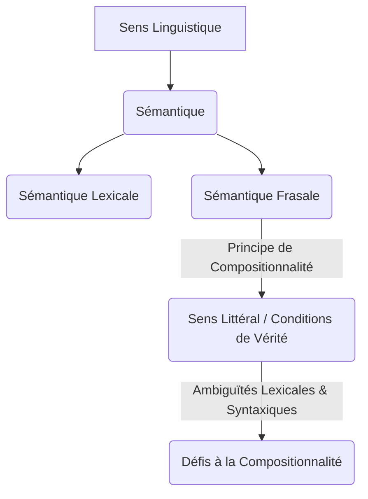

You are a world-class educational curriculum architect and JSON data validator (Agent 3B - Widgets Architect).
Your task is to parse the approved academic narrative draft of the lesson, extract all custom and standard bracketed widget anchors (`[[WIDGET:id]]`), and generate a valid JSON object conforming strictly to the requested `lessonWidgetsSchema` to fully define each anchor.

=============================================================================
⚠️ CRITICAL DATA INTEGRITY & MDX SAFETY RULES ⚠️
To ensure that the generated JSON translates to correct MDX attributes:

1. NO RAW CODE IN ANCHORS OR PROPS:
   - Ensure that interactive component JSON attributes (such as "props") do NOT contain raw javascript arrow functions, backticks (`), or complex unescaped double quotes.
   - Keep MCQ options as simple, plain text strings. Never place markdown list items (- or *) or HTML tags inside of quiz "options" or "question" strings.
=============================================================================

---

### METADATA
- **Course Name**: "Introduction à la sémantique et à la phonétique"
- **Academic Level**: "L1"
- **Lesson Title**: "Le Sens en Contexte : Sémantique Frasale et Pragmatique"
- **Target Language**: "FR"
- **Course Discipline**: "Général"
- **Citation Style**: "Chicago 17 (Author–Date)"

---

### INPUT APPROVED NARRATIVE DRAFT
Review the approved narrative text to identify all placed `[[WIDGET:id]]` anchors and the bibliography citation links (e.g. `[1](#ref-1)`):
---
[[WIDGET:prerequisites]]

[[WIDGET:diagnosticQuiz]]

## Introduction : Du Mot à l'Énoncé, le Voyage du Sens et de l'Usage

La sémantique, en tant que discipline fondamentale de la linguistique, se consacre à l'étude systématique du sens. Si nos explorations précédentes nous ont permis de déconstruire la sémantique lexicale – l'analyse des significations intrinsèques des mots et de leurs relations paradigmatiques et syntagmatiques – et la sémantique phrastique – l'examen du sens des phrases en tant qu'entités grammaticalement structurées et compositionnelles –, il est impératif de reconnaître que la richesse et la complexité du sens linguistique ne se réduisent pas à la simple agrégation des significations de ses constituants. Le langage est un phénomène éminemment dynamique, profondément enraciné dans son usage contextuel et inextricablement lié aux circonstances de sa production et de sa réception. Une phrase, même si elle est irréprochable sur le plan grammatical et cohérente sur le plan sémantique, est capable de véhiculer une pluralité de significations, qu'elles soient explicites, implicites, ou même potentiellement contradictoires, en fonction de la situation de communication, des intentions profondes du locuteur, des attentes cognitives de l'auditeur, et de l'ensemble des connaissances partagées.

Cette leçon se propose d'élargir et d'approfondir notre compréhension du sens en nous immergeant dans les domaines complémentaires de la sémantique frasale avancée et de la pragmatique. Nous opérerons une transition conceptuelle et analytique, passant de l'étude du sens « en soi » – c'est-à-dire le sens tel qu'il est intrinsèquement encodé et structuré au sein du système linguistique – à l'étude du sens « en usage » – c'est-à-dire le sens tel qu'il est activement construit, négocié et interprété dans le cadre complexe de l'interaction humaine. Nous examinerons avec rigueur comment la structure syntaxique des phrases contribue de manière déterminante à l'élaboration du sens, comment les locuteurs, par l'acte même de parler, accomplissent des actions sociales et cognitives, et comment les principes régissant la coopération conversationnelle guident et structurent nos échanges linguistiques, permettant ainsi la transmission et l'inférence d'informations qui ne sont pas explicitement verbalisées.

La maîtrise de ces mécanismes est d'une importance capitale pour quiconque aspire à **analyser** avec finesse et profondeur la communication humaine dans toute sa diversité, à **évaluer** la complexité inhérente aux interactions linguistiques quotidiennes et spécialisées, et, ultimement, à **créer** des messages d'une efficacité et d'une nuance accrues, adaptés à des contextes communicatifs variés.

[[WIDGET:learningObjectives]]

<figure>
  
  <figcaption><i>Figure A: L'architecture du sens. Une illustration conceptuelle des multiples couches et interconnexions qui composent la signification linguistique, de la structure à l'usage.</i></figcaption>


## 1. La Sémantique Frasale : La Construction Compositionnelle du Sens au Niveau de la Phrase

La sémantique frasale, souvent désignée sous le terme de sémantique compositionnelle ou sémantique formelle, constitue un champ d'étude crucial qui s'intéresse à la manière dont le sens des phrases complexes est systématiquement dérivé du sens de leurs constituants lexicaux (les mots) et de la façon dont ces constituants sont agencés et combinés selon les règles de la syntaxe. C'est dans ce domaine que le <ConceptLink name="Principe_de_compositionnalité" lang="fr" description="Principe fondamental selon lequel le sens d'une expression linguistique complexe est entièrement déterminé par le sens de ses parties et par la manière dont ces parties sont combinées syntaxiquement.">principe de compositionnalité</ConceptLink> revêt une importance épistémologique et méthodologique centrale. Ce principe, formulé de diverses manières depuis Frege, stipule que le sens d'une expression linguistique complexe est une fonction directe du sens de ses parties constitutives et de la manière dont ces parties sont syntaxiquement structurées et combinées [1](#ref-1). Il postule une relation isomorphique entre la structure syntaxique et la structure sémantique.

### 1.1. Le Principe de Compositionnalité : Fondements et Implications

Pour illustrer ce principe, considérons une phrase d'une simplicité apparente telle que « Le chat dort ».
*   Le déterminant « Le » indique une spécificité ou une référence définie.
*   Le nom commun « chat » réfère à une entité spécifique du monde (si le contexte le permet) ou à une classe d'entités félines. Sa sémantique lexicale inclut des traits comme [+animal], [+félin], etc.
*   Le verbe « dort » réfère à une action ou un état transitoire caractérisé par l'inactivité et le repos. Sa sémantique lexicale implique un agent capable de dormir.
*   La structure syntaxique de la phrase (Déterminant + Nom [Sujet] + Verbe [Prédicat]) indique que l'entité désignée par le syntagme nominal « Le chat » est l'agent qui accomplit l'action ou se trouve dans l'état décrit par le verbe « dort ».

Le sens global de la phrase n'est donc pas une simple juxtaposition ou addition des sens individuels de « le », « chat » et « dort », mais plutôt le résultat de leur combinaison structurée selon les règles grammaticales et sémantiques du français. Le principe de compositionnalité est intuitivement puissant, car il explique comment un nombre fini de mots et de règles syntaxiques peut générer un nombre potentiellement infini de phrases dotées de sens. Cependant, sa mise en œuvre formelle est confrontée à des défis considérables, notamment en présence d'ambiguïtés, d'expressions idiomatiques, de métaphores ou de phénomènes de quantification.

<figure>
  
  <figcaption><i>Figure 1: Arbre syntaxique d'une phrase anglaise simple. Cet arbre illustre comment les mots se combinent en constituants (syntagmes nominaux, syntagmes verbaux) pour former une phrase, reflétant la structure hiérarchique qui sous-tend le principe de compositionnalité. Source: <a href="https://en.wikipedia.org/wiki/Syntax_tree">Syntax tree</a></i></figcaption>


### 1.2. Ambiguïtés Sémantiques et Syntaxiques : Les Limites de la Compositionnalité Pure

Les langues naturelles sont intrinsèquement riches en ambiguïtés, qui constituent des tests rigoureux pour le principe de compositionnalité et nécessitent des mécanismes d'interprétation plus sophistiqués.

*   **Ambiguïté lexicale (ou polysémie)** : Un mot unique peut posséder plusieurs sens distincts, souvent sans lien étymologique évident, ou des sens liés mais différenciés.
    *   Exemple classique : « Il a posé sa *banque*. »
        *   Interprétation 1 : « Banque » au sens de siège, banc public.
        *   Interprétation 2 : « Banque » au sens d'établissement financier.
    *   La levée de cette ambiguïté dépend crucialement du contexte extra-linguistique, de la situation de communication et des connaissances encyclopédiques des interlocuteurs. Un locuteur ne « pose » généralement pas un établissement financier.
    *   Autre exemple : « Il a un *avocat* dans son assiette. » (Fruit ou professionnel du droit ?)

*   **Ambiguïté syntaxique (ou structurelle)** : La structure grammaticale d'une phrase peut admettre plusieurs analyses syntaxiques valides, chacune conduisant à une interprétation sémantique différente.
    *   Exemple paradigmatique : « Il a vu l'homme avec le télescope. »
        *   Interprétation 1 : Le syntagme prépositionnel « avec le télescope » modifie le syntagme nominal « l'homme ». L'homme était en possession d'un télescope, et le sujet l'a vu. (Structure : [Il a vu [l'homme [avec le télescope]]]).
        *   Interprétation 2 : Le syntagme prépositionnel « avec le télescope » modifie le verbe « a vu ». Le sujet a utilisé un télescope pour voir l'homme. (Structure : [Il a vu [l'homme] [avec le télescope]]).
    *   Dans ce cas, la même séquence linéaire de mots peut correspondre à deux arbres syntaxiques sous-jacents distincts, chacun générant un sens distinct. La préposition « avec » peut s'attacher soit au nom « homme » (complément du nom), soit au verbe « voir » (complément de manière ou d'instrument).

*   **Ambiguïté de portée (scope ambiguity)** : Liée à l'étendue d'action des opérateurs logiques (négation, modalités) ou des quantificateurs (chaque, un, plusieurs).
    *   Exemple : « Chaque étudiant n'a pas lu un livre. »
        *   Interprétation 1 (Portée large de la négation sur le quantificateur universel) : Il n'est pas vrai que chaque étudiant a lu un livre. Cela signifie que certains étudiants n'ont pas lu de livre, mais d'autres peuvent en avoir lu. ($\neg \forall x (\text{étudiant}(x) \rightarrow \exists y (\text{livre}(y) \land \text{lu}(x,y)))$).
        *   Interprétation 2 (Portée large du quantificateur universel sur la négation) : Pour chaque étudiant, il n'y a pas un livre qu'il ait lu. Cela signifie que chaque étudiant n'a lu aucun livre. ($\forall x (\text{étudiant}(x) \rightarrow \neg \exists y (\text{livre}(y) \land \text{lu}(x,y)))$).
    *   L'ordre implicite des quantificateurs et de la négation peut radicalement altérer le sens de la phrase, illustrant la nécessité d'une représentation logique sous-jacente pour désambiguïser.

La sémantique frasale utilise des outils formels, souvent empruntés à la logique mathématique (logique des prédicats, lambda-calcul), pour représenter ces structures sémantiques et leurs interprétations. Elle vise à modéliser comment le système linguistique lui-même, par ses règles syntaxiques et sémantiques, contraint et guide l'interprétation du sens littéral.

<RealPerson name="Richard_Montague" lang="fr" bio="Logicien, mathématicien et philosophe américain, Richard Montague (1930-1971) a révolutionné la sémantique linguistique en démontrant que les langues naturelles pouvaient être analysées avec la même rigueur formelle que les langages logiques. Sa 'grammaire de Montague' est un système compositionnel unifié pour la syntaxe et la sémantique, où chaque règle syntaxique est systématiquement associée à une règle sémantique correspondante, permettant ainsi de calculer le sens d'une phrase de manière algorithmique et compositionnelle.">Richard Montague</RealPerson> a profondément révolutionné la sémantique linguistique. Il a soutenu avec force que la sémantique des langues naturelles pouvait et devait être traitée avec la même rigueur formelle et la même précision que la sémantique des langages logiques et mathématiques. Sa « grammaire de Montague » (Montague Grammar) propose un système unifié et compositionnel pour la syntaxe et la sémantique, où chaque règle syntaxique est systématiquement associée à une règle sémantique correspondante, permettant ainsi de calculer le sens d'une phrase de manière algorithmique et compositionnelle. Son approche, bien que complexe, a jeté les bases de la sémantique formelle moderne et a démontré la faisabilité d'une analyse logique des langues naturelles.
[Read more on Wikipedia](https://fr.wikipedia.org/wiki/Richard_Montague)

### 1.3. Le Rôle Crucial de la Structure Syntaxique dans la Détermination du Sens

La syntaxe n'est pas une simple armature grammaticale ou un arrangement superficiel de mots ; elle est une architecture profonde qui organise et structure le sens. La position relative d'un mot, la présence ou l'absence d'éléments de ponctuation comme une virgule, l'ordre des constituants majeurs (sujet, verbe, objet), tout cela peut fondamentalement altérer l'interprétation sémantique d'une phrase.

*   **Changement de rôle thématique** :
    *   « Le chien mord l'homme. » (Le chien est l'agent, l'homme est le patient).
    *   « L'homme mord le chien. » (L'homme est l'agent, le chien est le patient).
    *   Le simple échange des positions sujet/objet modifie radicalement les rôles sémantiques attribués aux entités.

*   **Portée des modificateurs et ponctuation** :
    *   « Les petits enfants et les bébés. » (Ici, l'adjectif « petits » ne modifie que « enfants ». Les bébés ne sont pas nécessairement petits par opposition à d'autres bébés, mais sont simplement des bébés).
    *   « Les petits, enfants et bébés. » (La virgule isole « petits » comme un groupe nominal à part entière, ou comme un adjectif s'appliquant à l'ensemble « enfants et bébés ». Dans ce cas, les petits sont des enfants et des bébés).
    *   La ponctuation, bien que souvent négligée dans l'analyse sémantique formelle, joue un rôle crucial dans la délimitation des constituants et donc dans la détermination de la portée des modificateurs.

*   **Structures passives et actives** :
    *   « Marie a lu le livre. » (Active : Marie est l'agent, le livre est le patient).
    *   « Le livre a été lu par Marie. » (Passive : Le livre est le sujet grammatical, mais reste le patient sémantique ; Marie est l'agent sémantique).
    *   Bien que le sens propositionnel (qui a lu quoi) soit souvent conservé, la structure syntaxique modifie la perspective, l'emphase et les informations nouvelles/anciennes.

Ces exemples illustrent de manière éloquente que le sens d'une phrase est profondément ancré et structuré par sa forme syntaxique. Cependant, même avec une analyse sémantique frasale d'une rigueur exemplaire, une part significative du sens communiqué dans l'interaction humaine échappe encore à cette approche purement compositionnelle. C'est précisément à ce point que la pragmatique intervient, offrant une perspective complémentaire et indispensable.

## 2. Introduction à la Pragmatique : Le Sens en Usage, les Actes de Langage et le Contexte

La pragmatique est la branche de la linguistique qui se consacre à l'étude de l'usage du langage en contexte. Contrairement à la sémantique, qui se focalise sur le sens littéral, conventionnel ou dénotationnel des expressions linguistiques indépendamment de leur situation d'énonciation, la pragmatique s'intéresse à la manière dont les locuteurs utilisent ces expressions pour accomplir des actions, communiquer des significations implicites, et influencer leur environnement, en tenant compte de l'ensemble des facteurs contextuels, des intentions communicatives et des connaissances partagées entre les interlocuteurs [2](#ref-2). Elle explore le fossé entre le sens littéral et le sens voulu.

<figure>
  
  <figcaption><i>Figure B: L'interaction communicative. Une visualisation artistique de la dynamique complexe de la communication humaine, où les intentions et le contexte façonnent le sens partagé.</i></figcaption>


### 2.1. Sémantique vs. Pragmatique : Une Distinction Épistémologique Cruciale

La distinction entre sémantique et pragmatique est l'une des dichotomies les plus fondamentales et les plus éclairantes en philosophie du langage et en linguistique contemporaine :

*   **Sémantique** : Concerne le sens *des mots et des phrases* en tant qu'unités abstraites du système linguistique, indépendamment de leur usage spécifique. C'est le sens conventionnel, ce qui est encodé dans la langue elle-même, souvent appelé « sens littéral » ou « condition de vérité ».
    *   Exemple : La phrase « Il fait chaud » signifie sémantiquement que la température ambiante est élevée. Cette signification est constante quelle que soit la personne qui l'énonce ou le lieu où elle est énoncée.
    *   La sémantique répond à la question : « Que signifie cette expression ? »

*   **Pragmatique** : Concerne le sens *des énoncés* en situation d'usage. C'est le sens que le locuteur *entend communiquer* (l'intention communicative) et que l'auditeur *interprète*, en intégrant activement le contexte d'énonciation.
    *   Exemple : Si « Il fait chaud » est prononcé dans une pièce fermée, par un locuteur transpirant, cela peut être interprété pragmatiquement comme une requête implicite pour ouvrir la fenêtre, une plainte, ou une simple observation.
    *   La pragmatique répond à la question : « Que veut dire le locuteur en énonçant cette expression dans ce contexte ? »

Le contexte est l'élément pivot qui permet de transiter du sens sémantique (ce qui est dit) au sens pragmatique (ce qui est communiqué). Le contexte englobe non seulement la situation physique immédiate (le lieu, le moment, les objets présents), mais aussi les connaissances partagées entre les interlocuteurs (connaissances encyclopédiques, culturelles, historiques), leurs relations sociales (hiérarchie, amitié), leurs intentions mutuelles, et l'historique de leur interaction.

<figure>
  
  <figcaption><i>Figure 2: Diagramme illustrant le rôle du contexte. Le contexte, englobant les connaissances partagées, la situation physique et les intentions, est essentiel pour l'interprétation pragmatique du sens. Source: <a href="https://en.wikipedia.org/wiki/Context_(linguistics)">Context (linguistics)</a></i></figcaption>


### 2.2. La Théorie des Actes de Langage : Faire des Choses avec des Mots

L'une des contributions les plus fondamentales et les plus influentes à la pragmatique est sans conteste la <ConceptLink name="Acte_de_langage" lang="fr" description="Théorie selon laquelle le langage n'est pas seulement un moyen de décrire la réalité, mais aussi un outil performatif permettant d'accomplir des actions sociales et cognitives.">théorie des actes de langage</ConceptLink>, développée par le philosophe britannique <RealPerson name="John_Langshaw_Austin" lang="fr" bio="Philosophe du langage britannique, pionnier de la théorie des actes de langage et auteur de 'Quand dire, c'est faire'.">J.L. Austin</RealPerson> dans son ouvrage posthume et séminal *Quand dire, c'est faire* (1962) [3](#ref-3). Austin a radicalement remis en question la vision traditionnelle selon laquelle le langage servirait principalement à décrire ou à rapporter des faits sur la réalité. Il a démontré de manière convaincante que, par l'acte même de prononcer des mots dans des circonstances appropriées, nous *faisons* des choses, nous accomplissons des actions.

Austin a distingué trois types d'actes simultanés qui sont intrinsèquement liés à la production de tout énoncé :

1.  **Acte locutoire** : Il s'agit de l'acte de dire quelque chose. C'est la production physique d'une séquence de sons (phonétique), de mots (lexique), et de phrases grammaticalement correctes (syntaxe) dotées d'un sens et d'une référence. C'est l'acte de prononcer des mots avec une certaine signification.
    *   Exemple : Dire « Je te promets de venir demain. » L'acte locutoire est la simple émission de ces sons et mots, avec leur signification littérale.

2.  **Acte illocutoire** : C'est l'acte accompli *en disant* quelque chose. Il représente l'intention communicative du locuteur, la force ou la valeur conventionnelle de l'énoncé. Il peut s'agir d'une promesse, d'un ordre, d'une question, d'une affirmation, d'une menace, d'une excuse, d'un baptême, etc. L'acte illocutoire est ce que le locuteur *fait* en disant ce qu'il dit.
    *   Exemple : En disant « Je te promets de venir demain », l'acte illocutoire est de *faire une promesse*. La force illocutoire est celle d'une promesse.

3.  **Acte perlocutoire** : C'est l'acte accompli *par le fait de dire* quelque chose. Ce sont les effets ou les conséquences produits sur l'auditeur ou sur la situation à la suite de l'énoncé. Ces effets peuvent être intentionnels de la part du locuteur ou non.
    *   Exemple : En disant « Je te promets de venir demain », l'acte perlocutoire peut être de *rassurer* l'auditeur, de le *convaincre* de quelque chose, de le *décevoir* s'il ne souhaitait pas votre venue, ou de le *motiver*.

La théorie d'Austin a été par la suite affinée et systématisée par son élève, le philosophe américain <RealPerson name="John_Searle" lang="fr" bio="Philosophe américain, a développé et systématisé la théorie des actes de langage d'Austin, proposant une classification des forces illocutoires.">John Searle</RealPerson>, qui a proposé une classification influente des actes illocutoires en cinq catégories principales, basées sur leur fonction communicative et la relation entre les mots et le monde [4](#ref-4) :

*   **Assertifs (ou Représentatifs)** : Engagent le locuteur sur la vérité de la proposition énoncée. Ils décrivent un état de choses dans le monde. (Ex: affirmer, décrire, conclure, prédire). Ex: « Il pleut dehors. »
*   **Directifs** : Visent à amener l'auditeur à faire quelque chose. (Ex: ordonner, demander, conseiller, supplier, inviter). Ex: « Ouvre la porte, s'il te plaît ! »
*   **Commissifs** : Engagent le locuteur à accomplir une action future. (Ex: promettre, jurer, s'engager, menacer). Ex: « Je viendrai te voir demain. »
*   **Expressifs** : Expriment un état psychologique du locuteur concernant un état de choses. (Ex: remercier, s'excuser, féliciter, plaindre, saluer). Ex: « Je suis sincèrement désolé pour mon retard. »
*   **Déclaratifs** : Créent une nouvelle réalité ou modifient un état de choses institutionnel par le fait même d'être prononcés, à condition que le locuteur ait l'autorité nécessaire. (Ex: baptiser, marier, déclarer la guerre, démissionner, condamner). Ex: « Je vous déclare mari et femme. » (Prononcé par un officier d'état civil).

La compréhension approfondie des actes de langage est essentielle pour quiconque souhaite **analyser** la fonction communicative sous-jacente des énoncés, **évaluer** les intentions implicites ou explicites des locuteurs, et **créer** des messages dont la force illocutoire est précisément adaptée à l'objectif visé.

<figure>
  
  <figcaption><i>Figure 3: John Langshaw Austin (1911-1960). Philosophe britannique dont les travaux sur la théorie des actes de langage ont fondé une grande partie de la pragmatique moderne. Source: <a href="https://en.wikipedia.org/wiki/J._L._Austin">J. L. Austin</a></i></figcaption>


## 3. La Coopération Conversationnelle et les Implicatures : Le Sens Inféré

Au-delà de la force illocutoire des énoncés individuels, la pragmatique explore également comment les interlocuteurs collaborent activement pour construire et interpréter le sens dans le cadre d'échanges conversationnels. <RealPerson name="Paul_Grice" lang="fr" bio="Philosophe du langage britannique, célèbre pour sa théorie des implicatures conversationnelles et le Principe de Coopération.">H.P. Grice</RealPerson>, un autre philosophe britannique majeur, a proposé une théorie extrêmement influente sur la manière dont les participants à une conversation s'attendent mutuellement à un certain niveau de rationalité, de pertinence et de coopération [5](#ref-5).

### 3.1. Le Principe de Coopération de Grice : Un Cadre Fondamental

Grice a postulé que les échanges conversationnels ne sont pas une succession aléatoire de remarques décousues, mais plutôt des efforts concertés et rationnels de coopération. Il a formulé le <ConceptLink name="Principe_de_coopération" lang="fr" description="Principe pragmatique selon lequel les participants à une conversation s'attendent à ce que chaque contribution soit pertinente, informative, véridique et claire, en vue d'un objectif commun.">Principe de Coopération</ConceptLink> :

> « Que votre contribution conversationnelle soit telle qu'elle est requise, au stade où elle a lieu, par l'objectif ou la direction acceptée de l'échange de conversation dans lequel vous êtes engagé. »
> — H.P. Grice, *Logic and Conversation*, Harvard University Press, Cambridge, MA, 1975, p. 45

Ce principe sous-tend l'idée que les locuteurs et les auditeurs s'attendent implicitement à ce que chacun contribue de manière significative, pertinente et efficace à la conversation, en vue d'un objectif commun ou mutuellement accepté. Pour faciliter cette coopération, Grice a identifié quatre catégories de <ConceptLink name="Maxime_conversationnelle" lang="fr" description="Règles tacites ou attentes qui guident les échanges conversationnels selon H.P. Grice, permettant l'inférence d'implicatures.">maximes conversationnelles</ConceptLink>, qui ne sont pas des règles prescriptives à suivre à la lettre, mais plutôt des attentes normatives que les participants ont les uns envers les autres :

1.  **Maxime de Quantité** : Concerne la quantité d'informations à fournir.
    *   Faites en sorte que votre contribution contienne autant d'informations que nécessaire pour l'objectif actuel de l'échange.
    *   Ne faites pas en sorte que votre contribution contienne plus d'informations que nécessaire. (Évitez la redondance ou l'excès d'informations non pertinentes).
2.  **Maxime de Qualité** : Concerne la véracité de l'information.
    *   N'affirmez pas ce que vous croyez être faux.
    *   N'affirmez pas ce pour quoi vous manquez de preuves adéquates. (Soyez sincère et fondé).
3.  **Maxime de Relation (ou Pertinence)** : Concerne la pertinence de la contribution.
    *   Soyez pertinent. (Vos contributions doivent être en rapport avec le sujet de la conversation).
4.  **Maxime de Manière** : Concerne la clarté et l'organisation de l'expression.
    *   Évitez l'obscurité d'expression.
    *   Évitez l'ambiguïté.
    *   Soyez bref (évitez la prolixité inutile).
    *   Soyez ordonné dans votre exposé.

Ces maximes ne sont pas des commandements rigides, mais plutôt des descriptions des attentes implicites que les participants *entretiennent* les uns envers les autres dans une interaction coopérative. Elles servent de base pour l'inférence de significations non dites.

<figure>
  
  <figcaption><i>Figure 4: Herbert Paul Grice (1913-1988). Philosophe du langage britannique, dont le travail sur le Principe de Coopération et les implicatures conversationnelles a profondément marqué la pragmatique. Source: <a href="https://en.wikipedia.org/wiki/Paul_Grice">Paul Grice</a></i></figcaption>


### 3.2. Les Implicatures Conversationnelles : Le Sens Inféré au-delà du Dit

L'intérêt majeur et la contribution la plus originale des maximes de Grice résident dans leur capacité à expliquer le phénomène des <ConceptLink name="Implicature_conversationnelle" lang="fr" description="Sens implicite communiqué par un locuteur sans être explicitement dit, que l'auditeur peut inférer en supposant que le locuteur respecte ou exploite le principe de coopération et ses maximes.">implicatures conversationnelles</ConceptLink>. Une implicature est une signification implicite, non explicitement énoncée par les mots, mais que l'auditeur peut inférer ou calculer en supposant que le locuteur respecte (ou, de manière délibérée et ostentatoire, « viole » ou « floute ») le principe de coopération et ses maximes.

Les implicatures surviennent fréquemment lorsque le locuteur semble délibérément s'écarter d'une maxime, mais le fait d'une manière reconnaissable et intentionnelle, invitant ainsi l'auditeur à chercher un sens sous-jacent qui restaure la conformité au principe de coopération.

*   **Exploitation de la Maxime de Quantité** (donner moins ou plus d'informations que nécessaire) :
    *   A : « Où habite Jean ? »
    *   B : « Quelque part dans le sud de la France. »
    *   Implicature : B ne connaît pas l'adresse exacte de Jean, ou ne souhaite pas la communiquer. Si B connaissait l'adresse précise et ne la donnait pas, il violerait la maxime de quantité sans raison apparente, ce qui serait non coopératif. L'auditeur infère donc l'ignorance ou la réticence de B.

*   **Exploitation de la Maxime de Qualité** (dire quelque chose de manifestement faux pour communiquer le contraire, ou une attitude) :
    *   « Quel temps magnifique ! » (Dit sous une pluie battante et un ciel gris).
    *   Implicature : Le locuteur pense que le temps est horrible (ironie). L'auditeur comprend que la maxime de qualité est violée intentionnellement et cherche le sens opposé.
    *   Autre exemple : « Pierre est un vrai génie. » (Dit de quelqu'un qui vient de faire une erreur stupide). Implicature : Pierre est stupide (sarcasme).

*   **Exploitation de la Maxime de Relation** (répondre de manière apparemment non pertinente) :
    *   A : « Peux-tu me prêter 10 euros ? »
    *   B : « Je n'ai pas d'argent sur moi. »
    *   Implicature : B ne peut pas prêter 10 euros. Bien que la réponse de B ne réponde pas directement par « oui » ou « non » à la question, elle est pertinente car elle explique pourquoi il ne peut pas satisfaire la demande, restaurant ainsi la coopération.

*   **Exploitation de la Maxime de Manière** (être obscur, ambigu, ou trop prolixe) :
    *   « Le professeur a produit une série de sons articulés qui ressemblaient à une conférence. »
    *   Implicature : La conférence était ennuyeuse, inintelligible ou de très mauvaise qualité. Le locuteur aurait pu dire simplement « Le professeur a fait une conférence », mais a choisi une formulation alambiquée pour exprimer un jugement négatif et une attitude critique.

L'intonation, le ton de voix, les pauses et d'autres éléments prosodiques peuvent également signaler une exploitation des maximes, notamment celle de Qualité pour l'ironie ou le sarcasme.
<SandboxPrononciation />
Par exemple, prononcer « Quel temps *magnifique* ! » avec un ton sarcastique, une intonation montante sur « magnifique » suivie d'une chute, ou un débit ralenti, indique clairement que le sens littéral n'est pas le sens voulu. L'auditeur utilise ces indices prosodiques, en conjonction avec le contexte, pour calculer l'implicature et comprendre l'attitude du locuteur.

Les implicatures conversationnelles possèdent plusieurs propriétés distinctives : elles sont **calculables** (l'auditeur peut reconstruire le raisonnement qui y mène), **annulables** (on peut les nier sans contradiction explicite, par exemple « Je n'ai pas d'argent sur moi, mais je peux aller en chercher »), et **non détachables** (elles sont liées au contenu sémantique et non à la forme exacte de l'énoncé, donc reformuler l'énoncé de manière équivalente ne les fait pas disparaître). Elles représentent un mécanisme puissant et économique pour la communication, permettant de transmettre une grande quantité d'informations avec un minimum d'effort linguistique explicite.

### 3.3. Exercice d'Analyse d'Implicatures

Pour mieux comprendre la dynamique des implicatures et affiner votre capacité à les identifier, nous allons **analyser** un scénario conversationnel interactif.

[[WIDGET:Quiz:implicature_analysis]]

*Instructions pour le quiz :*
Le quiz présentera un court dialogue. Pour chaque énoncé clé, vous devrez identifier l'implicature potentielle et la maxime de Grice qui semble être exploitée (ou violée de manière ostentatoire) pour générer cette implicature. Des options multiples seront proposées pour les maximes et les implicatures, vous invitant à une réflexion critique.

## 4. Au-delà de Grice : Critiques, Développements et la Théorie de la Pertinence

Bien que la théorie de Grice ait été révolutionnaire, établissant les fondations de la pragmatique moderne et restant un pilier incontournable de la discipline, elle a également fait l'objet de critiques constructives et a inspiré de nombreux développements théoriques. Ces critiques ont souvent porté sur la nature des maximes (sont-elles universelles ?), leur nombre (sont-elles exhaustives ?), et la complexité du processus de calcul des implicatures.

<Epistemology title="La Portée Universelle des Maximes de Grice : Un Débat Culturel et Cognitif">
Les maximes de Grice sont-elles des principes universels de la communication humaine, transcendant les frontières culturelles, ou sont-elles des conventions spécifiques à certaines cultures, notamment occidentales ? C'est une question qui a animé de nombreux débats en pragmatique interculturelle et en anthropologie linguistique. Certains chercheurs ont avancé que si le principe de coopération lui-même est probablement universel – toute communication efficace repose sur une forme de collaboration et d'attentes mutuelles – la manière dont les maximes sont interprétées, appliquées, et surtout « floutées » peut varier considérablement d'une culture à l'autre. Par exemple, la maxime de Quantité peut être perçue différemment : dans certaines cultures, la concision est valorisée, tandis que dans d'autres, la politesse ou l'harmonie sociale peut exiger des circonlocutions, des informations indirectes ou une certaine prolixité pour éviter la brusquerie. De même, la maxime de Qualité peut être modulée par des considérations de « face » (concept de Goffman) ou d'harmonie sociale dans certaines sociétés, où dire la vérité brute pourrait être considéré comme impoli ou destructeur de liens sociaux. La communication indirecte, riche en implicatures, est souvent privilégiée dans les cultures à « contexte élevé » (Edward T. Hall). Cette controverse souligne l'importance cruciale de contextualiser les théories linguistiques et de ne pas les considérer comme des vérités absolues applicables uniformément à toutes les formes de communication humaine, mais plutôt comme des cadres d'analyse à adapter et à tester empiriquement.
</Epistemology>

### 4.1. La Théorie de la Pertinence : Une Alternative Cognitive

L'une des théories les plus influentes et les plus développées post-Grice est la <ConceptLink name="Théorie_de_la_pertinence" lang="fr" description="Approche pragmatique qui explique la communication comme un processus de reconnaissance d'intentions, guidé par le principe de pertinence, où l'auditeur cherche à maximiser les effets cognitifs pour un coût de traitement minimal.">théorie de la pertinence</ConceptLink>, élaborée par les linguistes et psychologues cognitifs <RealPerson name="Dan_Sperber" lang="fr" bio="Linguiste et anthropologue français, co-fondateur de la théorie de la pertinence, qui propose une approche cognitive de la communication.">Dan Sperber</RealPerson> et <RealPerson name="Deirdre_Wilson" lang="fr" bio="Linguiste britannique, co-fondatrice de la théorie de la pertinence, une théorie pragmatique influente.">Deirdre Wilson</RealPerson> [6](#ref-6). Cette théorie propose une approche plus unifiée et cognitivement fondée de la communication, cherchant à remplacer les multiples maximes de Grice par un unique et puissant principe de pertinence.

Selon Sperber et Wilson, la communication est avant tout un processus de reconnaissance d'intentions. Chaque énoncé est une « preuve ostensive » de l'intention communicative du locuteur. L'auditeur, en cherchant à interpréter l'énoncé, est guidé par le **Principe Cognitif de Pertinence** (les processus cognitifs humains tendent à maximiser la pertinence) et le **Principe Communicatif de Pertinence** (tout acte de communication ostensive communique une présomption de sa propre pertinence optimale).

Un énoncé est d'autant plus pertinent qu'il génère un maximum d'effets cognitifs (nouvelles informations, renforcement ou révision de croyances, suppression de croyances erronées) pour un coût de traitement minimal. L'auditeur choisit l'interprétation qui lui semble la plus pertinente, c'est-à-dire celle qui offre le meilleur équilibre entre les effets cognitifs obtenus et l'effort mental nécessaire pour les obtenir.

*   **Effets cognitifs** : Représentent les changements positifs dans l'environnement cognitif de l'auditeur. Ils peuvent inclure l'ajout de nouvelles informations, le renforcement de croyances existantes, la suppression de croyances fausses, ou la réorganisation de schémas cognitifs.
*   **Coût de traitement** : Désigne l'effort mental nécessaire pour interpréter l'énoncé. Ce coût est influencé par des facteurs tels que la complexité syntaxique, l'ambiguïté lexicale, la distance contextuelle (combien d'inférences sont nécessaires pour relier l'énoncé au contexte), et la familiarité avec les concepts.

La théorie de la pertinence explique comment les implicatures sont calculées non pas par la reconnaissance d'une violation de maximes, mais par la recherche de l'interprétation la plus pertinente dans un contexte donné. L'ironie, par exemple, n'est pas une violation de la maxime de qualité, mais une utilisation du langage pour exprimer une attitude dissociative ou échoïque, qui est pertinente car elle communique plus que la simple négation du sens littéral, en invitant l'auditeur à inférer l'attitude du locuteur.

### 4.2. L'Importance du Contexte Mutuellement Manifeste et de l'Environnement Cognitif

La théorie de la pertinence met également un accent particulier sur le concept d'« environnement cognitif mutuellement manifeste ». Pour qu'une communication réussisse, il n'est pas nécessaire que les interlocuteurs partagent exactement les mêmes connaissances ou croyances (ce qui est souvent impossible), mais plutôt que certaines informations soient mutuellement manifestes. Une information est mutuellement manifeste pour deux individus si elle est accessible à la conscience des deux parties, et si chaque partie sait que l'autre y a accès.

Ce concept est crucial pour la compréhension des implicatures. Lorsque A dit à B « Il fait chaud » en espérant que B ouvre la fenêtre, A suppose que le fait qu'il fait chaud, que la fenêtre est fermée, et que B est capable d'ouvrir la fenêtre sont des informations mutuellement manifestes dans leur environnement cognitif partagé. Si B ne peut pas ouvrir la fenêtre (par exemple, elle est bloquée ou B a les mains prises), l'implicature de requête échoue, car l'interprétation pertinente n'est pas accessible.

### 4.3. Exemples Concrets et Études de Cas Comparatives

Considérons un exemple simple pour illustrer la différence d'approche entre la théorie de Grice et la théorie de la pertinence :

*   **Scénario** : A et B discutent d'un film qu'ils viennent de voir.
    *   A : « As-tu aimé le nouveau film de Dupont ? »
    *   B : « Les acteurs étaient très professionnels. »

*   **Analyse Gricéenne** :
    *   B semble violer la maxime de Quantité (ne donne pas une réponse directe « oui » ou « non », qui serait plus informative) et potentiellement la maxime de Relation (ne répond pas directement à la question sur l'appréciation globale du film).
    *   Implicature calculée : B n'a pas aimé le film, ou du moins, n'a pas grand-chose de positif à en dire au-delà de la performance technique des acteurs. En ne mentionnant que cet aspect, B implique que les autres aspects (scénario, réalisation, etc.) n'étaient pas à la hauteur.

*   **Analyse par la Théorie de la Pertinence** :
    *   L'énoncé de B est pertinent car il fournit l'information la plus pertinente et la plus positive que B puisse donner sur le film. Si B avait adoré le film, il aurait fourni des informations plus positives et directes (ex: « Oui, c'était génial ! »). L'absence d'une évaluation positive directe est elle-même une information pertinente.
    *   Le coût de traitement est faible. Les effets cognitifs sont que A infère que B n'a pas aimé le film, car si B l'avait aimé, il aurait dit quelque chose de plus pertinent et positif. L'énoncé de B, bien que non directement évaluatif, est la meilleure preuve ostensive de son état d'esprit concernant le film.

La théorie de la pertinence offre une explication plus économique et cognitivement plausible de la manière dont les implicatures sont calculées, en se basant sur des mécanismes inférentiels généraux plutôt que sur la reconnaissance de violations de règles spécifiques. Elle met l'accent sur l'optimisation de la communication par la recherche de la pertinence maximale.

Pour **évaluer** votre compréhension de ces concepts fondamentaux, nous allons **analyser** un diagramme conceptuel qui synthétise les relations complexes entre la sémantique, la pragmatique, et les théories majeures de Grice et Sperber/Wilson.




    A --> C(Pragmatique)
    C -- Contexte &amp; Intention --> C1(Sens en Usage / Signification du Locuteur)
    C1 --> C1a(Actes de Langage)
    C1a -- J.L. Austin &amp; J. Searle --> C1a1(Acte Locutoire: Dire)
    C1a1 --> C1a2(Acte Illocutoire: Faire en disant)
    C1a2 --> C1a3(Acte Perlocutoire: Faire par le fait de dire)
    C1a2 -- Classification de Searle --> C1a4(Assertifs, Directifs, Commissifs, Expressifs, Déclaratifs)

    C1 --> C1b(Implicatures Conversationnelles)
    C1b -- H.P. Grice --> C1b1(Principe de Coopération)
    C1b1 --> C1b2(Maximes: Quantité, Qualité, Relation, Manière)
    C1b2 -- Exploitation / Flouting --> C1b3(Calcul d'Implicatures)

    C1b -- D. Sperber &amp; D. Wilson --> C1b4(Théorie de la Pertinence)
    C1b4 -- Principe de Pertinence --> C1b5(Optimisation: Effets Cognitifs vs. Coût de Traitement)
    C1b4 -- Environnement Cognitif Mutuellement Manifeste --> C1b6(Contexte Partagé)

    B2a -- Inférence Pragmatique --> C1
    C1a3 -- Effets sur l'Auditeur --> C1a5(Conséquences)


<figure>
  
  <figcaption><i>Figure 5: Représentation schématique des couches du web sémantique. Bien que spécifique à l'informatique, ce diagramme illustre la superposition et l'interdépendance des couches de sens, de la syntaxe aux ontologies, reflétant la complexité de la construction du sens en linguistique. Source: <a href="https://en.wikipedia.org/wiki/Semantic_Web">Semantic Web</a></i></figcaption>


[[WIDGET:Mermaid:semantique_pragmatique_map]]

*Instructions pour le diagramme Mermaid :*
Le diagramme ci-dessus représente les concepts clés que nous avons abordés dans cette leçon, illustrant leurs interconnexions. Prenez le temps de l'examiner attentivement. **Identifiez** les liens hiérarchiques et fonctionnels entre les différentes branches de la sémantique et de la pragmatique. **Analysez** comment la Théorie de la Pertinence et le Principe de Coopération de Grice se positionnent par rapport aux actes de langage et comment ils contribuent à l'inférence du sens. **Réfléchissez** à la manière dont ce schéma pourrait être enrichi pour inclure d'autres aspects de la communication, tels que la déixis, la politesse ou les présuppositions.

## Conclusion

[[WIDGET:conclusionSummary]]

Cette leçon nous a permis de franchir une étape cruciale et sophistiquée dans notre compréhension du sens linguistique, en opérant une transition analytique fondamentale : de l'analyse des unités minimales de sens (les mots) et des structures grammaticales (les phrases) à l'étude du langage en action, dans son contexte d'usage dynamique et interactif. Nous avons d'abord approfondi la sémantique frasale, en réaffirmant le rôle central du principe de compositionnalité pour déchiffrer le sens littéral des énoncés, tout en reconnaissant les défis significatifs posés par les ambiguïtés lexicales, syntaxiques et de portée.

Par la suite, nous nous sommes immergés dans le vaste et complexe domaine de la pragmatique, où le sens n'est pas seulement interprété passivement, mais activement construit et négocié par les interlocuteurs. La théorie des actes de langage, initiée par Austin et systématisée par Searle, nous a révélé que « dire, c'est faire », en distinguant les dimensions locutoire, illocutoire et perlocutoire de chaque énoncé et en classifiant les fonctions communicatives fondamentales du langage.

Enfin, la contribution fondamentale de H.P. Grice, avec son Principe de Coopération et ses maximes conversationnelles (Quantité, Qualité, Relation, Manière), a éclairé de manière magistrale le mécanisme des implicatures conversationnelles. Ces significations implicites, que nous inférons constamment dans nos interactions quotidiennes, sont le fruit d'un raisonnement pragmatique basé sur l'attente de rationalité et de coopération. Nous avons également exploré la théorie de la pertinence de Sperber et Wilson comme une alternative puissante et cognitivement fondée pour expliquer ces phénomènes inférentiels, en mettant l'accent sur l'optimisation des effets cognitifs pour un coût de traitement minimal.

La capacité à **analyser** le sens au-delà des mots explicites, à **évaluer** avec discernement les intentions communicatives sous-jacentes, et à **créer** des messages qui exploitent la richesse et la subtilité des implicatures est une compétence essentielle pour tout linguiste, communicant, ou professionnel de la langue. La pragmatique nous rappelle avec force que le langage est avant tout un outil social et cognitif, un moyen puissant d'interagir, d'influencer, de négocier et de construire collectivement le sens dans le tissu complexe de l'expérience humaine.

[[WIDGET:whatsNext]]

[[WIDGET:finalEvaluation]]

---
**Références**

[1](#ref-1) Partee, B. H. (1984). Compositionality. In F. Landman &amp; F. Veltman (Eds.), *Varieties of Formal Semantics* (pp. 281-311). Foris.
[2](#ref-2) Levinson, S. C. (1983). *Pragmatics*. Cambridge University Press.
[3](#ref-3) Austin, J. L. (1962). *How to Do Things with Words*. Harvard University Press.
[4](#ref-4) Searle, J. R. (1969). *Speech Acts: An Essay in the Philosophy of Language*. Cambridge University Press.
[5](#ref-5) Grice, H. P. (1975). Logic and Conversation. In P. Cole &amp; J. L. Morgan (Eds.), *Syntax and Semantics, Vol. 3: Speech Acts* (pp. 41-58). Academic Press. (Réédité dans *Studies in the Way of Words*, Harvard University Press, 1989).
[6](#ref-6) Sperber, D., &amp; Wilson, D. (1986). *Relevance: Communication and Cognition*. Blackwell.

</figure></figure></figure></figure></figure></figure></figure>

---

---

### 1. CURATION-FIRST INTERACTIVE COMPONENTS MANDATE
For every custom interactive widget anchor you find in the approved narrative draft (other than standard structural ones), you must define a corresponding item inside the `interactiveComponents` JSON array:

#### A. Approved Pruned Widgets for this Discipline:
- ID: "Mermaid"
  Name: "Mermaid Diagram Engine" (Moteur de diagrammes Mermaid)
  Description: "Render rich flowcharts, timelines, and concept maps from descriptive text markup."
  Disciplines: [All Disciplines]
  Educational Level: "All levels"

#### B. Selection Heuristics & Budget Enforcer:
1. **Simple Discursive Components (Can be generated from scratch)**:
   - `Quiz`: Multiple-choice question sets with questions, options, correct indices, and detailed explanations.
   - `FillInBlanks`: Sentence structures with blank gaps.
   - `SolvedExercise`: Step-by-step worked analytical or mathematical solution.
   - `UnsolvedExercise`: Conceptual or mathematical question with an explanation and correct answer string.
2. **Complex Structural Tools (Matchmaker Database-Curated Widgets)**:
   - If the narrative draft places a database widget (e.g. `[[WIDGET:FunctionPlotter:my_plot]]`), you must select it from the approved catalog list above.
   - **Crucial Curation-First Rule**: For all database-curated widgets, set "props" to `{}` (empty object), as their pre-configured behaviors and schemas are handled programmatically by the system.
   - **Strict Budget Constraints**:
     - Remaining database widget budget for this lesson: 1.
     - If the remaining budget is 0, do NOT select any database-curated widgets. Use simple discursives instead.
     - Never repeat a database widget ID that has already been used in this course: Already used list: "Mermaid".

---

### 2. CORE SCHEMA FIELDS TO GENERATE (CONFORMING TO lessonWidgetsSchema)
Your generated JSON must contain the following top-level keys:

1. **`prerequisites`**:
   - Provide 1 to 2 logical prerequisite lessons. Each must have `title`, `slug`, `level`, and `subject` (in target language "FR").
2. **`diagnosticQuiz`**:
   - A single premium multiple-choice question designed to allow advanced students to bypass this lesson. Include `question`, `options` array, `correctIndex`, `targetSectionId` (anchor of the bypass section), and `sectionTitle`.
3. **`learningObjectives`**:
   - Provide learning objectives broken down into `knowledge` (concepts), `skills` (capabilities), and `attitudes` (metacognition) arrays.
   - **Bloom's Taxonomy Rule**: For University levels, use Revised Bloom's Taxonomy verbs (Analyze, Evaluate, Create / Analyser, Évaluer, Créer depending on target language "FR").
4. **`conclusionSummary`**:
   - Provide exactly 3 to 4 complete, grammatically whole and self-contained sentences summarizing the key takeaways (each item in the `items` array must end with a period).
5. **`whatsNext`**:
   - Provide 2 to 3 engaging next steps or follow-up courses, each with `title`, `description`, and `slug`.
6. **`finalEvaluation`**:
   - A comprehensive final test. This must be a structured JSON object representing either an `EssayEvaluation` with a detailed prompt, or a high-fidelity MCQ `Quiz`.
   - **MCQ Quiz Pool Size and Display Limit (CRITICAL - NO GUESSING)**:
     - You MUST generate a pool of EXACTLY 60 questions in the `props.questions` array.
     - You MUST specify `props.limit`: 30 in the `props` object.
     - This ensures there are enough extra questions in the pool so that the platform randomly shuffles and selects 30 questions at runtime, preventing repetition.
7. **`glossary`**:
   - An array of at least 3 key academic terms with clear definitions.
8. **`references`**:
   - An array of 3 to 5 complete, real, authoritative scholarly references (exclude for primary school).
   - Ensure book/article titles are in standard quotes (or French guillemets « ... »), not asterisks.
   - The references MUST match the designated style: **Chicago Manual of Style, 17th edition — Author–Date system (general academic fallback)**.
   - Make sure any inline citations used in the narrative draft (e.g. `[1](#ref-1)`) map perfectly to their respective index in this array (e.g., `references[0]` is index 1).
9. **`interactiveComponents`**:
   - An array of all custom interactive components. Every custom `[[WIDGET:id]]` anchor in the narrative draft MUST have a corresponding object here where `id` matches the anchor suffix exactly, `componentType` matches the selected widget ID, `sectionAnchor` is the heading title of the parent section, and `props` specifies its data properties.
   - **Quiz Pool Size and Display Limit (CRITICAL - NO GUESSING)**:
     - For any `Quiz` component in this array, you MUST generate EXACTLY 20 questions in its `props.questions` array.
     - You MUST specify `props.limit`: 10 in its `props` object.
     - This guarantees the pool is larger than the visible slice for retry randomisation.

---

### 3. OUTPUT FORMAT
- Return ONLY a valid JSON object matching the `lessonWidgetsSchema` schema.
- Do NOT wrap your JSON response in markdown code blocks (```).
- Ensure all string values are fully written in "FR".
