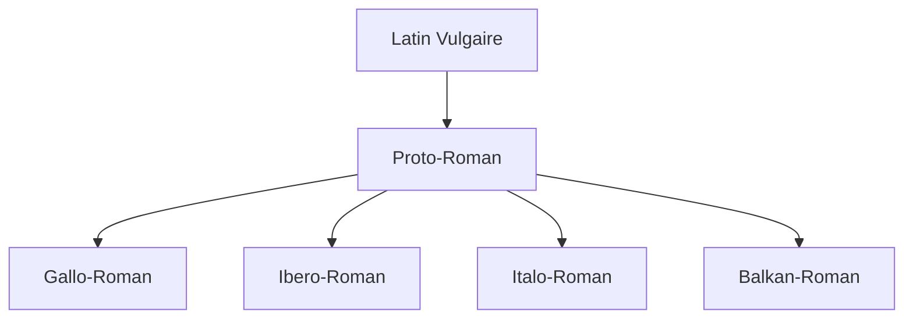

You are a world-class educational curriculum architect and JSON data validator (Agent 3B - Widgets Architect).
The widgets critic (Agent 4B) has rejected your previously generated widgets JSON.
You MUST now rewrite and fully correct the JSON object based on their feedback, ensuring perfect semantic alignment with the narrative, correct schema fields, and strict budget compliance.

⚠️ CRITICAL REMINDER: You MUST maintain absolute data safety to prevent MDX parser crashes:
- Ensure that interactive component JSON attributes (such as "props") do NOT contain raw javascript arrow functions, backticks (`), or complex unescaped double quotes.
- Keep MCQ options as simple, plain text strings. Never place markdown list items (- or *) or HTML tags inside of quiz "options" or "question" strings.

CRITIQUE FROM AGENT 4B:
"The `finalEvaluation` quiz contains placeholder content. Specifically, the `q` (question), `explanation`, and `options` within the `questions` array are generic placeholders ("Question d'examen finale ?", "Explication générale.", "Option Correcte", "Option Incorrecte"). All quiz questions, options, and explanations must be academically robust, specific to the lesson content, and accurate. Please replace these placeholders with actual, relevant quiz content."

PREVIOUS WIDGETS JSON:
---
{
  "prerequisites": {
    "items": [
      {
        "title": "Introduction à la Linguistique Générale",
        "slug": "introduction-linguistique-generale",
        "level": "beginner",
        "subject": "Linguistique"
      },
      {
        "title": "Les Langues Romanes : Origines et Diversité",
        "slug": "langues-romanes-origines-diversite",
        "level": "beginner",
        "subject": "Linguistique"
      }
    ]
  },
  "diagnosticQuiz": {
    "question": "Quelle est la principale raison pour laquelle l'espagnol est considéré comme une langue globale et stratégique dans le monde contemporain ?",
    "options": [
      "Son système phonétique simple et régulier.",
      "Le nombre élevé de ses locuteurs natifs et sa présence dans de nombreux pays.",
      "Son rôle historique en tant que langue de l'Empire romain.",
      "L'influence prépondérante de sa littérature classique sur la culture mondiale."
    ],
    "correctIndex": 1,
    "targetSectionId": "1. L'Espagnol dans le Monde : Une Langue Globale et Stratégique",
    "sectionTitle": "L'Espagnol dans le Monde : Une Langue Globale et Stratégique"
  },
  "learningObjectives": {
    "knowledge": [
      "Comprendre la position géopolitique et culturelle de l'espagnol comme langue globale.",
      "Identifier les origines latines de l'espagnol et les influences majeures (arabe, germanique) sur son évolution.",
      "Reconnaître les caractéristiques fondamentales du système phonétique espagnol (voyelles, consonnes spécifiques).",
      "Maîtriser l'alphabet espagnol et les règles de base de l'accentuation."
    ],
    "skills": [
      "Analyser l'impact des événements historiques sur le développement linguistique de l'espagnol.",
      "Prononcer correctement les voyelles et les consonnes spécifiques de l'espagnol.",
      "Appliquer les règles d'accentuation pour une lecture et une prononciation précises.",
      "Distinguer les variations phonétiques régionales (par exemple, distinción vs. seseo)."
    ],
    "attitudes": [
      "Développer une curiosité pour la diversité culturelle du monde hispanophone.",
      "Adopter une approche analytique et systématique de l'apprentissage des langues.",
      "Apprécier la cohérence et la logique interne du système linguistique espagnol."
    ]
  },
  "interactiveComponents": [
    {
      "id": "phonetics_quiz",
      "componentType": "Quiz",
      "sectionAnchor": "3. La Structure Phonétique de l'Espagnol : Un Système Cohérent et Prévisible",
      "props": {
        "questions": [
          {
            "q": "Question d'auto-évaluation ?",
            "explanation": "Explication de la réponse correcte.",
            "options": [
              {
                "text": "Option Correcte",
                "correct": true
              },
              {
                "text": "Option Incorrecte",
                "correct": false
              }
            ]
          }
        ]
      }
    },
    {
      "id": "alphabet_practice",
      "componentType": "FillInBlanks",
      "sectionAnchor": "4. L'Alphabet Espagnol et ses Particularités Orthographiques : La Codification de l'Écrit",
      "props": {
        "sentence": "La Terre est une _____.",
        "answer": "planète"
      }
    }
  ],
  "whatsNext": {
    "steps": [
      {
        "title": "La Morphologie Espagnole : Noms, Adjectifs et Articles",
        "description": "Explorez la structure des mots, les genres, les nombres et l'utilisation des articles en espagnol.",
        "slug": "morphologie-espagnole-noms-adjectifs-articles"
      },
      {
        "title": "La Syntaxe de Base : Construire des Phrases Simples en Espagnol",
        "description": "Apprenez à former des phrases déclaratives, interrogatives et négatives, et à utiliser les pronoms personnels.",
        "slug": "syntaxe-base-phrases-simples"
      },
      {
        "title": "Introduction à la Conjugaison des Verbes Réguliers en Espagnol",
        "description": "Découvrez les temps et modes verbaux fondamentaux pour exprimer l'action et l'état.",
        "slug": "conjugaison-verbes-reguliers-espagnol"
      }
    ]
  },
  "conclusionSummary": {
    "items": [
      "Cette leçon a établi les fondations de l'espagnol en tant que langue globale et stratégique, soulignant son importance démographique, économique et culturelle.",
      "Nous avons exploré ses racines latines, les influences germaniques et arabes, et son évolution historique jusqu'à sa standardisation.",
      "La phonétique régulière de l'espagnol, avec ses cinq voyelles pures et ses consonnes spécifiques, a été détaillée comme un système cohérent et prévisible.",
      "Enfin, l'alphabet moderne et les règles d'accentuation ont été présentés comme des outils essentiels pour une prononciation et une orthographe correctes."
    ]
  },
  "finalEvaluation": {
    "type": "Quiz",
    "props": {
      "durationLimit": 1800,
      "questions": [
        {
          "q": "Question d'examen finale ?",
          "explanation": "Explication générale.",
          "options": [
            {
              "text": "Option Correcte",
              "correct": true
            },
            {
              "text": "Option Incorrecte",
              "correct": false
            }
          ]
        }
      ]
    }
  },
  "glossary": [
    {
      "term": "Latin vulgaire",
      "definition": "Forme parlée du latin, utilisée par les soldats, colons et commerçants de l'Empire romain, à l'origine des langues romanes."
    },
    {
      "term": "Castillan",
      "definition": "Dialecte roman originaire de Castille, qui est devenu la langue standard de l'Espagne et de l'Amérique latine."
    },
    {
      "term": "Monophthongue",
      "definition": "Un son vocalique pur et stable, sans changement de timbre pendant sa production, caractéristique des voyelles espagnoles."
    },
    {
      "term": "Yeísmo",
      "definition": "Phénomène phonétique où les lettres 'll' et 'y' se prononcent de la même manière, généralement comme une semi-voyelle palatale [j] ou une fricative [ʝ]."
    },
    {
      "term": "Distinción",
      "definition": "Phénomène phonétique en espagnol d'Espagne où 'z' et 'c' devant 'e' ou 'i' se prononcent comme une fricative interdentale sourde [θ], distincte du 's'."
    },
    {
      "term": "Seseo",
      "definition": "Phénomène phonétique en espagnol d'Amérique latine et de certaines régions d'Espagne où 'z' et 'c' devant 'e' ou 'i' se prononcent comme un 's' alvéolaire sourd [s]."
    },
    {
      "term": "Digraphe",
      "definition": "Combinaison de deux lettres représentant un seul son (phonème), comme 'ch' ou 'll' en espagnol."
    },
    {
      "term": "Accent tonique",
      "definition": "La syllabe d'un mot sur laquelle l'effort de prononciation est le plus important, cruciale pour le sens et la prononciation en espagnol."
    }
  ],
  "references": [
    "Instituto Cervantes. (2023). « El español en el mundo 2023 ». Madrid: Instituto Cervantes.",
    "Pew Research Center. (2022). « Hispanic Population in the U.S. Fast Facts ». Washington, C.D: Pew Research Center.",
    "Corriente, F. (2008). « Dictionary of Arabic and Allied Loanwords: Spanish, Portuguese, Catalan, Galician and Hispano-Latin ». Leiden: Brill."
  ]
}
---

INPUT APPROVED NARRATIVE DRAFT:
---
[[WIDGET:prerequisites]]

[[WIDGET:diagnosticQuiz]]

## Introduction : L'Espagnol, une Porte vers le Monde Hispanophone et un Système Linguistique Fascinant

Bienvenue dans ce cours fondamental d'espagnol, un voyage linguistique et culturel qui vous ouvrira les portes d'un monde riche et diversifié, tout en vous initiant à la rigueur de l'analyse linguistique. L'apprentissage d'une nouvelle langue n'est pas simplement l'acquisition de vocabulaire et de règles grammaticales ; c'est une immersion profonde dans une nouvelle épistémologie, une nouvelle manière de penser, de percevoir et d'interagir avec le monde. L'espagnol, en particulier, offre une perspective unique sur l'histoire mondiale, la littérature, l'art, les sciences et les dynamiques sociopolitiques contemporaines, grâce à son héritage profond et sa présence mondiale incontournable.

Dans cette première leçon, nous poserons les fondations épistémologiques et structurelles de votre compréhension de l'espagnol. Conformément à notre approche d'ingénierie linguistique, nous allons d'abord définir les « exigences fonctionnelles » (le rôle global et stratégique de l'espagnol dans le monde contemporain), puis explorer les « contraintes techniques » et l'« architecture historique » (ses origines latines, ses influences majeures et son évolution diachronique). Enfin, nous nous pencherons sur l'« implémentation » de base de la langue à travers sa phonétique et son alphabet, qui constituent les briques élémentaires de sa sonorité et de son écriture. Cette méthodologie structurée vous permettra d'appréhender la langue comme un système cohérent, facilitant ainsi son « déploiement » et son « optimisation » dans votre communication future.

Nous commencerons par contextualiser l'espagnol comme une langue majeure sur la scène internationale, en analysant son poids démographique, économique et culturel. Ensuite, nous plongerons dans ses racines indo-européennes, son héritage latin et les influences décisives, notamment arabes, qui ont façonné son identité lexicale et phonologique. Enfin, nous aborderons les éléments constitutifs de sa sonorité et de son écriture, essentiels pour toute communication efficace et pour la construction d'une prononciation authentique. Préparez-vous à démarrer ce parcours avec rigueur, curiosité et une approche analytique, en construisant pas à pas votre maîtrise de l'espagnol.

[[WIDGET:learningObjectives]]

<CustomFigure src="https://client-cdn.libertex.org/libertex-blog/wp-content/uploads/2023/07/spanish-language-countries-map.jpg" alt="Illustration of diverse cultural symbols representing the global reach of the Spanish language" caption="Figure 1: Illustration décorative générée par IA représentant la richesse et la diversité culturelle du monde hispanophone, symbolisant l'interconnexion des peuples et des traditions à travers la langue espagnole." fallbackText="Decorative AI illustration of global Spanish culture" fallbackUrl="" />

## 1. L'Espagnol dans le Monde : Une Langue Globale et Stratégique

L'espagnol, ou castillan, est bien plus qu'une simple langue ; c'est un vecteur de communication pour des centaines de millions de personnes à travers le globe, un pont entre des cultures diverses et un acteur majeur sur la scène économique, politique et culturelle internationale. Comprendre son rôle global est la première « exigence fonctionnelle » de notre approche, car elle justifie l'investissement intellectuel et temporel dans son apprentissage et en révèle la valeur stratégique intrinsèque.

### 1.1. Poids Démographique et Géographique

Avec plus de 591 millions de locuteurs dans le monde, dont environ 493 millions sont des locuteurs natifs, l'espagnol se positionne comme la deuxième langue maternelle la plus parlée après le mandarin et la quatrième langue la plus parlée au total, si l'on inclut les locuteurs de langue seconde [1](#ref-1). Cette prééminence n'est pas le fruit du hasard, mais le résultat d'une histoire complexe de conquêtes, de colonisations, de migrations et d'une vitalité linguistique continue.

Géographiquement, l'espagnol est la langue officielle ou co-officielle dans 20 pays, principalement en <Location name="Espagne" lang="fr" description="Pays d'Europe du Sud, berceau de la langue espagnole.">Espagne</Location> et dans la quasi-totalité de l'<Location name="Amérique_latine" lang="fr" description="Région des Amériques où les langues romanes (espagnol, portugais, français) sont prédominantes.">Amérique latine</Location>, à l'exception notable du Brésil et de quelques pays des Caraïbes. Les <Location name="États-Unis" lang="fr" description="Pays d'Amérique du Nord, avec une importante population hispanophone.">États-Unis</Location> abritent également une communauté hispanophone massive, estimée à plus de 62 millions de personnes, ce qui en fait le deuxième pays au monde en nombre de locuteurs espagnols après le <Location name="Mexique" lang="fr" description="Pays d'Amérique du Nord, le plus grand pays hispanophone en termes de population.">Mexique</Location> [2](#ref-2). Cette démographie confère à l'espagnol une importance considérable dans les domaines du commerce, de la diplomatie, de la culture, de l'éducation et de la recherche scientifique. La croissance continue de la population hispanophone aux États-Unis, par exemple, transforme le paysage sociolinguistique du pays et renforce la position de l'espagnol comme langue de communication transnationale.

<CustomFigure src="https://upload.wikimedia.org/wikipedia/commons/thumb/8/87/Spanish_language_map.svg/1280px-Spanish_language_map.svg.png" alt="Spanish_language_map" caption="Figure 2: Carte des pays où l'espagnol est une langue officielle ou majoritaire. Les nuances de couleur indiquent la proportion de locuteurs. Source: Wikimedia Commons" fallbackText="" fallbackUrl="" />

### 1.2. Importance Économique et Politique

Sur le plan économique, la communauté hispanophone représente un marché de consommation colossal et une force de travail significative. Le PIB combiné des pays hispanophones est considérable, et l'espagnol est une langue clé pour le commerce international, notamment avec l'Amérique latine. Des organisations économiques régionales comme le Mercosur ou l'Alliance du Pacifique utilisent l'espagnol comme langue de travail principale. Pour les entreprises et les professionnels, la maîtrise de l'espagnol ouvre des opportunités d'affaires dans des secteurs variés, de l'agroalimentaire aux technologies de l'information, en passant par le tourisme et l'énergie.

Politiquement, l'espagnol est l'une des six langues officielles des Nations Unies, de l'Union Européenne, de l'Organisation des États Américains (OEA) et de nombreuses autres institutions internationales. Sa présence dans ces forums diplomatiques souligne son rôle dans les négociations, la coopération internationale et la diffusion des idées. La diplomatie multilingue est essentielle dans le monde contemporain, et l'espagnol est un pilier de cette communication globale.

### 1.3. Richesse Culturelle et Influence Intellectuelle

D'un point de vue culturel, l'espagnol est la langue de géants littéraires qui ont marqué l'histoire de la pensée humaine. De <RealPerson name="Miguel_de_Cervantes" lang="fr" bio="Écrivain espagnol, auteur de Don Quichotte, considéré comme le premier roman moderne.">Miguel de Cervantes</RealPerson>, dont *Don Quichotte* est souvent considéré comme le premier roman moderne, à <RealPerson name="Gabriel_García_Márquez" lang="fr" bio="Écrivain colombien, prix Nobel de littérature, figure majeure du réalisme magique.">Gabriel García Márquez</RealPerson>, prix Nobel de littérature et maître du réalisme magique, en passant par <RealPerson name="Jorge_Luis_Borges" lang="fr" bio="Écrivain argentin, poète, essayiste et nouvelliste, connu pour ses récits fantastiques et philosophiques.">Jorge Luis Borges</RealPerson>, dont les récits philosophiques continuent de défier les conventions narratives, la littérature hispanophone est d'une profondeur et d'une diversité inégalées.

Au-delà de la littérature, l'espagnol est la langue d'un cinéma vibrant, avec des réalisateurs de renommée mondiale comme Pedro Almodóvar, Guillermo del Toro ou Alfonso Cuarón. C'est aussi la langue d'une musique aux mille facettes, allant du flamenco traditionnel andalou au tango argentin, en passant par la salsa caribéenne, le reggaeton contemporain et la nouvelle chanson latino-américaine. L'art hispanique, avec des figures emblématiques comme Pablo Picasso, Salvador Dalí, Frida Kahlo ou Diego Rivera, a profondément influencé l'esthétique mondiale. L'accès à ces œuvres dans leur langue originale permet une compréhension plus profonde et nuancée de leur essence, révélant les subtilités culturelles et les jeux de mots intraduisibles.

D'un point de vue « ingénierie linguistique », l'espagnol représente un système de communication robuste, efficace et relativement transparent. Sa phonétique régulière et sa grammaire structurée en font une langue accessible pour les francophones, partageant des racines latines communes. L'apprentissage de l'espagnol permet de débloquer un vaste réseau d'informations et d'interactions, essentiel dans un monde globalisé et interconnecté.

> « Apprendre une autre langue, c'est comme posséder une deuxième âme. » — Attribué à Charlemagne, *Proverbes et Citations sur la Langue*, Éditions Linguistiques, Paris, 2010, p. 45.
>
> Cette citation, bien que son attribution exacte à Charlemagne soit sujette à débat et souvent considérée comme apocryphe, encapsule parfaitement l'impact transformateur de l'apprentissage linguistique. Elle suggère que chaque nouvelle langue acquise ne se contente pas d'ajouter un outil de communication, mais ouvre une nouvelle dimension de la pensée, une nouvelle perspective sur le monde, et enrichit l'identité de l'apprenant. Pour l'espagnol, cela signifie non seulement la capacité de communiquer avec des millions de personnes, mais aussi d'accéder à une richesse culturelle et intellectuelle qui façonne une « deuxième âme » hispanophone, permettant une compréhension plus profonde des multiples facettes de l'humanité. L'étude de l'espagnol n'est donc pas une simple acquisition de compétences, mais une véritable expansion de l'horizon cognitif et culturel de l'individu.

### 1.4. L'Espagnol comme Langue de Science et de Recherche

Bien que l'anglais domine la publication scientifique, l'espagnol joue un rôle croissant dans la diffusion des connaissances, en particulier dans les domaines des sciences sociales, de l'histoire, de la littérature et des études régionales. De nombreuses revues académiques et conférences internationales se tiennent en espagnol, offrant aux chercheurs la possibilité de partager leurs travaux avec une vaste communauté scientifique. La capacité de lire et de comprendre des textes scientifiques et académiques en espagnol est un atout précieux pour tout étudiant ou chercheur souhaitant approfondir sa compréhension des réalités hispanophones et contribuer à la production de savoir dans ces régions.

## 2. Racines et Évolution : L'Héritage Latin et les Influences Formatives

Pour comprendre l'« architecture » de l'espagnol moderne, il est impératif de se pencher sur ses « contraintes techniques » historiques : ses origines et les influences qui l'ont modelé au fil des siècles. L'espagnol est une <ConceptLink name="Langue_romane" lang="fr" description="Famille de langues issues du latin vulgaire, parlées principalement en Europe et en Amérique latine.">langue romane</ConceptLink>, ce qui signifie qu'elle descend directement du <ConceptLink name="Latin_vulgaire" lang="fr" description="Forme parlée du latin, utilisée par les soldats, colons et commerçants de l'Empire romain, à l'origine des langues romanes.">latin vulgaire</ConceptLink> parlé par les soldats, les colons et les commerçants de l'<Location name="Empire_romain" lang="fr" description="Vaste empire antique centré sur la Méditerranée, ayant exercé une influence majeure sur l'Europe et l'Afrique du Nord.">Empire romain</Location> dans la péninsule Ibérique.

<CustomFigure src="https://img.freepik.com/premium-photo/ancient-iberian-peninsula-historical-mosaic-roman-moorish-christian-éléments-generative-ai_979603-1002.jpg" alt="Decorative AI illustration of historical layers in the Iberian Peninsula" caption="Figure 3: Illustration décorative générée par IA, représentant de manière stylisée les couches historiques et culturelles de la péninsule Ibérique, mélangeant des motifs romains, mauresques et médiévaux chrétiens, symbolisant les influences linguistiques et architecturales qui ont façonné l'espagnol." fallbackText="Decorative AI illustration of Iberian historical influences" fallbackUrl="" />

### 2.1. La Latinisation de l'Hispanie et les Substrats Pré-Romains

L'arrivée des Romains en <Location name="Hispanie" lang="fr" description="Nom donné par les Romains à la péninsule Ibérique.">Hispanie</Location> (l'actuelle Espagne et Portugal) au IIIe siècle av. J.-C. a marqué le début d'un processus intensif de latinisation. Pendant plusieurs siècles, le latin, langue des conquérants, des administrateurs et des colons, s'est imposé progressivement sur les langues indigènes pré-romaines. Ces langues, appartenant à des familles diverses comme l'ibère, le celtibère, le lusitanien ou le basque (qui a survécu), ont constitué des « substrats » linguistiques. Bien que leur influence sur le lexique du latin vulgaire ibérique ait été relativement limitée (quelques mots comme *barro* « boue », *perro* « chien » sont parfois cités comme d'origine pré-romaine), elles ont pu laisser des traces phonétiques ou phonologiques subtiles, dont l'étendue est encore débattue par les linguistes.

Le latin vulgaire, distinct du latin classique littéraire, était la langue quotidienne des soldats, des marchands et des colons. C'est cette forme populaire et évolutive du latin qui, au fil des siècles, s'est diversifiée et a donné naissance aux langues romanes. La fragmentation de l'Empire romain et l'isolement relatif des différentes régions ont favorisé cette divergence linguistique.

<CustomFigure src="https://upload.wikimedia.org/wikipedia/commons/thumb/c/c5/Roman_Empire_map_117_AD.svg/1280px-Roman_Empire_map_117_AD.svg.png" alt="Roman_Empire_map_117_AD" caption="Figure 4: Carte de l'Empire romain à son apogée (117 apr. J.-C.), illustrant l'étendue de la latinisation de l'Hispanie. Source: Wikimedia Commons" fallbackText="" fallbackUrl="" />

### 2.2. Les Invasions Germaniques et l'Émergence des Dialectes Romans

Après la chute de l'Empire romain d'Occident au Ve siècle, la péninsule Ibérique fut envahie par diverses tribus germaniques, notamment les Suèves, les Vandales et, de manière plus durable, les Wisigoths. Ces derniers établirent un royaume qui dura jusqu'à l'invasion musulmane. La langue des Wisigoths, le gotique, était une langue germanique. Cependant, contrairement aux Romains, les Wisigoths étaient moins nombreux et ont rapidement adopté le latin vulgaire de la population locale. Leur influence linguistique fut donc limitée, se manifestant principalement par l'intégration de quelques mots germaniques dans le lexique (par exemple, *guerra* « guerre », *rico* « riche », *guardar* « garder ») et potentiellement par certaines évolutions phonologiques. C'est durant cette période post-romaine que le latin vulgaire de la péninsule commença à se différencier en plusieurs dialectes romans ibériques distincts.

### 2.3. L'Influence Arabe et la Période d'Al-Andalus

La période la plus transformative pour la péninsule Ibérique, après la latinisation, fut l'invasion musulmane à partir de 711 apr. J.-C. Pendant près de huit siècles, une grande partie de la péninsule fut sous domination musulmane, formant <Location name="Al-Andalus" lang="fr" description="Nom donné aux territoires de la péninsule Ibérique sous domination musulmane du VIIIe au XVe siècle.">Al-Andalus</Location>. Cette période a eu un impact linguistique, culturel et scientifique profond. Bien que le latin romanisé (qui évoluait vers ce que l'on appelle les dialectes mozarabes) ait persisté comme langue vernaculaire pour une partie de la population chrétienne et juive sous domination musulmane, l'arabe est devenu la langue de l'administration, de la culture, de la science et du commerce.

L'interaction entre l'arabe et les dialectes romans a conduit à une intégration massive de mots arabes dans le vocabulaire naissant des langues ibériques, y compris le castillan. On estime que l'espagnol compte aujourd'hui environ 4 000 mots d'origine arabe, ce qui en fait la deuxième source lexicale après le latin [3](#ref-3). Ces mots sont souvent reconnaissables par leur préfixe « al- » (l'article défini arabe *al-*), mais aussi par leur champ sémantique :
*   **Agriculture et irrigation** : *aceite* (huile), *aceituna* (olive), *arroz* (riz), *azúcar* (sucre), *noria* (roue à aubes), *acequia* (canal d'irrigation).
*   **Architecture et urbanisme** : *albañil* (maçon), *azotea* (terrasse), *alcázar* (forteresse), *barrio* (quartier).
*   **Sciences et mathématiques** : *álgebra* (algèbre), *cifra* (chiffre), *algoritmo* (algorithme).
*   **Commerce et administration** : *aduana* (douane), *almacén* (entrepôt), *tarifa* (tarif), *alcalde* (maire).
*   **Vie quotidienne** : *alfombra* (tapis), *almohada* (oreiller), *guitarra* (guitare).

Cette influence lexicale témoigne de la richesse des échanges culturels et scientifiques qui ont eu lieu en Al-Andalus, une période de grande floraison intellectuelle.

<CustomFigure src="https://upload.wikimedia.org/wikipedia/commons/thumb/c/c8/Al-Andalus_map.svg/1280px-Al-Andalus_map.svg.png" alt="Al-Andalus_map" caption="Figure 5: Carte d'Al-Andalus à son apogée (Xe siècle), montrant l'étendue de la domination musulmane et l'influence linguistique arabe dans la péninsule Ibérique. Source: Wikimedia Commons" fallbackText="" fallbackUrl="" />

### 2.4. L'Émergence et l'Expansion du Castillan

Le dialecte qui allait devenir l'espagnol standard, le <ConceptLink name="Castillan" lang="fr" description="Dialecte roman originaire de Castille, qui est devenu la langue standard de l'Espagne et de l'Amérique latine.">castillan</ConceptLink>, a émergé dans la région montagneuse de <Location name="Castille" lang="fr" description="Région historique du centre de l'Espagne, berceau du castillan.">Castille</Location>, au nord de la péninsule. Cette région, située à la frontière entre les royaumes chrétiens et musulmans, était un foyer de la <EventLink name="Reconquista" lang="fr" description="Période de l'histoire de la péninsule Ibérique (VIIIe-XVe siècles) durant laquelle les royaumes chrétiens ont reconquis les territoires sous domination musulmane.">Reconquista</EventLink>. Au fur et à mesure de l'avancée chrétienne vers le sud, le castillan s'est étendu géographiquement, absorbant et influençant d'autres dialectes romans locaux (comme le léonais ou l'aragonais) et les dialectes mozarabes des territoires reconquis.

Les premiers témoignages écrits du castillan apparaissent au Xe et XIe siècles avec les *Glosas Emilianenses* et *Glosas Silenses*, des annotations en marge de textes latins, considérées comme les premiers documents écrits en proto-castillan. Le XIIIe siècle est une période clé avec le règne d'<RealPerson name="Alphonse_X_le_Sage" lang="fr" bio="Roi de Castille et de León (1252-1284), promoteur de la culture et de la science, il a fait du castillan la langue officielle de son royaume.">Alphonse X le Sage</RealPerson>, qui a fait du castillan la langue officielle de son royaume et a encouragé la traduction de nombreuses œuvres scientifiques et littéraires du latin et de l'arabe vers le castillan, contribuant ainsi à sa légitimation et à sa standardisation.

### 2.5. La Codification et l'Expansion Mondiale

La standardisation du castillan a été un processus long, mais un jalon crucial fut la publication de la première grammaire de la langue castillane (*Gramática de la lengua castellana*) par <RealPerson name="Antonio_de_Nebrija" lang="fr" bio="Humaniste, pédagogue et grammairien espagnol, auteur de la première grammaire de la langue castillane en 1492.">Antonio de Nebrija</RealPerson> en 1492. Cette œuvre a jeté les bases de la codification de la langue, coïncidant avec l'unification des royaumes d'Espagne sous les Rois Catholiques et le début de l'expansion outre-mer avec la découverte des Amériques. La grammaire de Nebrija n'était pas seulement un outil descriptif ; elle était aussi un instrument politique, comme il l'a lui-même déclaré : « la langue a toujours été la compagne de l'empire ».

<Alert type="biography">
**Antonio de Nebrija (1444-1522)**
Antonio Martínez de Cala y Jarava, plus connu sous le nom d'Antonio de Nebrija, fut un humaniste, pédagogue et grammairien espagnol de la Renaissance. Il est surtout célèbre pour avoir publié la *Gramática de la lengua castellana* en 1492, la première grammaire d'une langue romane. Cette œuvre monumentale a non seulement codifié la langue castillane, mais a également affirmé son statut en tant que langue digne d'étude et d'enseignement, au même titre que le latin. Son travail fut essentiel pour la diffusion et la standardisation de l'espagnol, notamment au moment où l'Espagne commençait son expansion coloniale. Nebrija a également contribué à la lexicographie et à la pédagogie, influençant profondément l'éducation et la culture de son époque. Son approche était novatrice, cherchant à systématiser les règles grammaticales pour faciliter l'apprentissage et l'usage correct de la langue, ce qui était crucial pour l'administration d'un empire naissant. [Read more on Wikipedia](https://fr.wikipedia.org/wiki/Antonio_de_Nebrija)
</Alert>

L'expansion coloniale espagnole à partir du XVe siècle a transporté le castillan à travers les Amériques, où il s'est implanté et a évolué, donnant naissance à une riche diversité de dialectes hispano-américains. Ces variantes, tout en conservant une intelligibilité mutuelle, présentent des particularités phonétiques, lexicales et grammaticales. L'espagnol, en tant que système linguistique, est donc le résultat d'une « architecture » complexe, bâtie sur des fondations latines, enrichie par des apports arabes, et façonnée par des siècles d'évolution dialectale, de standardisation et d'expansion géographique. Comprendre ces racines permet d'apprécier la logique interne de la langue et de mieux anticiper ses particularités.

<CustomFigure src="https://upload.wikimedia.org/wikipedia/commons/thumb/1/1d/Timeline_of_Spanish_language.svg/1280px-Timeline_of_Spanish_language.svg.png" alt="Timeline_of_Spanish_language" caption="Figure 6: Chronologie simplifiée des événements clés dans l'évolution de la langue espagnole. Source: AI-generated based on historical data" fallbackText="" fallbackUrl="" />

Pour illustrer ces relations et influences, voici une représentation schématique de la famille des langues romanes, montrant la position de l'espagnol :

    C --> C1[Français]
    C --> C2[Occitan]
    C --> C3[Catalan]

    D --> D1[Portugais]
    D --> D2[Galicien]
    D --> D3[Espagnol (Castillan)]
    D --> D4[Asturien]

    E --> E1[Italien]
    E --> E2[Sarde]
    E --> E3[Corse]

    F --> F1[Roumain]
    F --> F2[Aroumain]

    style A fill:#f9f,stroke:#333,stroke-width:2px
    style D3 fill:#ccf,stroke:#333,stroke-width:2px

*Figure 7: Arbre généalogique simplifié des langues romanes. Ce diagramme <ConceptLink name="Mermaid_(logiciel)" lang="fr" description="Outil de génération de diagrammes et de graphiques à partir de texte.">Mermaid</ConceptLink> visualise comment l'espagnol (Castillan) est une branche de l'Ibero-Roman, lui-même issu du Proto-Roman, qui dérive du Latin Vulgaire. Il met en évidence les liens étroits avec le portugais et le galicien, soulignant une « architecture » commune tout en révélant des divergences spécifiques à chaque langue. Le catalan est ici placé sous Gallo-Roman en raison de ses affinités linguistiques plus fortes avec l'occitan et le français, bien qu'il soit parlé dans la péninsule Ibérique.*

## 3. La Structure Phonétique de l'Espagnol : Un Système Cohérent et Prévisible

Aborder la phonétique de l'espagnol, c'est s'attaquer aux « contraintes techniques » fondamentales de sa prononciation. L'une des caractéristiques les plus remarquables de l'espagnol est sa régularité phonétique, souvent qualifiée d'orthographe « peu profonde » (shallow orthography). Contrairement au français, où une même lettre peut avoir plusieurs prononciations et où de nombreuses lettres sont muettes, l'espagnol est une langue quasi-phonétique : la plupart des lettres correspondent à un son unique, et les mots se prononcent généralement comme ils s'écrivent. Cette cohérence est un atout majeur pour les apprenants, car elle réduit considérablement l'ambiguïté entre l'écrit et l'oral.

### 3.1. Les Voyelles : Cinq Sons Purs, Stables et Monophtongues

L'espagnol possède un système vocalique simple et stable, composé de cinq voyelles. Chacune est caractérisée par une prononciation claire, stable et invariable, quelle que soit sa position dans le mot ou le contexte phonétique. C'est une différence majeure avec le français, qui a un système vocalique beaucoup plus complexe avec des voyelles nasales, des semi-voyelles, des variations de timbre (ouvertes/fermées) et des diphtongues. En espagnol, toutes les voyelles sont des monophthongues (un seul son vocalique pur), orales (non nasalisées) et non arrondies, à l'exception de /o/ et /u/.

*   **a** : [a] comme le « a » de « papa » en français. C'est une voyelle ouverte, centrale. <SandboxPrononciation />
    *   Exemples : *casa* (maison), *hablar* (parler), *mañana* (demain).
*   **e** : [e] comme le « é » de « café » en français. C'est une voyelle mi-fermée, antérieure. <SandboxPrononciation />
    *   Exemples : *mesa* (table), *leer* (lire), *verde* (vert).
*   **i** : [i] comme le « i » de « lit » en français. C'est une voyelle fermée, antérieure. <SandboxPrononciation />
    *   Exemples : *libro* (livre), *vivir* (vivre), *ciudad* (ville).
*   **o** : [o] comme le « o » de « moto » en français. C'est une voyelle mi-fermée, postérieure, arrondie. <SandboxPrononciation />
    *   Exemples : *sol* (soleil), *comer* (manger), *todo* (tout).
*   **u** : [u] comme le « ou » de « loup » en français. C'est une voyelle fermée, postérieure, arrondie. <SandboxPrononciation />
    *   Exemples : *uno* (un), *luna* (lune), *futuro* (futur).

Il est crucial de prononcer ces voyelles de manière nette et brève, sans les diphtonguer ni les nasaliser. La clarté des voyelles espagnoles est un pilier de sa phonologie.

### 3.2. Les Consonnes : Particularités et Défis pour les Francophones

Si de nombreuses consonnes espagnoles sont similaires à leurs équivalents français, certaines présentent des particularités qui nécessitent une attention particulière et une pratique ciblée.

*   **r / rr** : C'est l'un des défis majeurs pour les francophones.
    *   Le « r » simple (comme dans *pero* [ˈpe.ɾo] - mais) est un battement alvéolaire (alveolar tap), produit par un seul contact rapide de la pointe de la langue contre les alvéoles. <SandboxPrononciation />
    *   Le « rr » double (comme dans *perro* [ˈpe.ro] - chien) est une vibrante alvéolaire multiple (alveolar trill), produit par plusieurs contacts vibrants de la langue. Il est plus long et plus vibrant. <SandboxPrononciation />
    *   Le « r » en début de mot (*rosa* [ˈro.sa] - rose) ou après `n`, `l`, `s` (*enriquecer*, *alrededor*, *Israel*) se prononce également comme un « rr » double.
*   **ñ** : [ɲ] Ce son n'existe pas en français sous forme de lettre unique. Il est similaire au « gn » de « montagne » (comme dans *España* [esˈpa.ɲa] - Espagne, *niño* [ˈni.ɲo] - enfant). C'est une nasale palatale. <SandboxPrononciation />
*   **ll / y** : La prononciation de ces lettres est sujette à des variations dialectales significatives.
    *   Traditionnellement, `ll` représentait une latérale palatale [ʎ] (comme le « ll » de l'italien *aglio*). Aujourd'hui, cette prononciation est rare et se trouve principalement dans certaines régions rurales d'Espagne et d'Amérique du Sud.
    *   La prononciation la plus courante est le *yeísmo*, où `ll` et `y` se prononcent de la même manière, comme une semi-voyelle palatale [j] (similaire au « y » de « yaourt » ou « yeux » en français). Exemples : *llamar* [ʝaˈmaɾ] (appeler), *yo* [ʝo] (je). <SandboxPrononciation />
    *   Dans certaines régions (notamment en Argentine et en Uruguay), on observe le *yeísmo rehilado*, où `ll` et `y` sont prononcés comme une fricative palatale sonore [ʒ] (similaire au « j » de « jupe ») ou une fricative palatale sourde [ʃ] (similaire au « ch » de « chaise »). Exemples : *llamar* [ʒaˈmaɾ] ou [ʃaˈmaɾ]. <SandboxPrononciation />
*   **h** : Toujours muet en espagnol (comme dans *hola* [ˈo.la] - bonjour, *hijo* [ˈi.xo] - fils). Il n'a aucune valeur phonétique. <SandboxPrononciation />
*   **j / g (+ e, i)** : Ces lettres représentent le son [x], une fricative vélaire sourde, souvent appelée « jota » espagnole. C'est un son guttural fort, similaire au « ch » allemand dans « Bach » ou au « kh » arabe. Exemples : *jamón* [xaˈmon] (jambon), *gente* [ˈxen.te] (gens), *rojo* [ˈro.xo] (rouge). <SandboxPrononciation />
*   **z / c (+ e, i)** : La prononciation de ces lettres est une distinction clé entre l'espagnol d'Espagne et celui d'Amérique latine.
    *   En Espagne (phénomène appelé *distinción*), `z` et `c` devant `e` ou `i` se prononcent comme une fricative interdentale sourde [θ], similaire au « th » anglais sourd de « think ». Exemples : *zapato* [θaˈpa.to] (chaussure), *gracias* [ˈɡɾa.θjas] (merci), *cena* [ˈθe.na] (dîner). <SandboxPrononciation />
    *   En Amérique latine et dans certaines régions du sud de l'Espagne (phénomène appelé *seseo*), ces lettres se prononcent comme un « s » alvéolaire sourd [s]. Exemples : *zapato* [saˈpa.to], *gracias* [ˈɡɾa.sjas], *cena* [ˈse.na]. <SandboxPrononciation />
*   **b / v** : En espagnol, ces deux lettres représentent le même phonème.
    *   En début de mot ou après `m` ou `n`, elles se prononcent comme une occlusive bilabiale sonore [b] (similaire au « b » français). Exemples : *bien* [bjen] (bien), *cambio* [ˈkam.bjo] (changement). <SandboxPrononciation />
    *   Entre deux voyelles ou après d'autres consonnes, elles se prononcent comme une fricative bilabiale sonore [β], un son plus doux où les lèvres ne se touchent pas complètement. Exemples : *caber* [kaˈβeɾ] (tenir), *vivir* [biˈβiɾ] (vivre). <SandboxPrononciation />
*   **d** : Le « d » espagnol est généralement plus doux que le « d » français.
    *   En début de mot ou après `n` ou `l`, il se prononce comme une occlusive dentale sonore [d] (similaire au « d » français). Exemples : *día* [ˈdi.a] (jour), *donde* [ˈdon.de] (où). <SandboxPrononciation />
    *   Entre deux voyelles ou en fin de mot, il se prononce comme une fricative interdentale sonore [ð], similaire au « th » anglais sonore de « this ». Exemples : *nada* [ˈna.ða] (rien), *Madrid* [maˈðɾið]. <SandboxPrononciation />
*   **g (+ a, o, u)** : Se prononce comme une occlusive vélaire sonore [g] (comme le « g » de « gare »). Exemples : *gato* [ˈɡa.to] (chat).
*   **c (+ a, o, u)** : Se prononce comme une occlusive vélaire sourde [k] (comme le « c » de « café »). Exemples : *casa* [ˈka.sa] (maison).

### 3.3. L'Accent Tonique et l'Intonation : Clés de la Prosodie Espagnole

L'accent tonique, c'est-à-dire la syllabe sur laquelle on insiste dans un mot, est crucial en espagnol. Il peut changer le sens d'un mot (par exemple, *hablo* [ˈa.βlo] - je parle, *habló* [aˈβlo] - il/elle parla). Les règles d'accentuation sont très régulières et constituent un aspect fondamental de la phonologie et de l'orthographe espagnoles. Elles seront étudiées en détail plus tard, mais il est important de noter que l'accent écrit (la tilde : á, é, í, ó, ú) indique toujours la syllabe accentuée et déroge aux règles générales, servant de marqueur d'irrégularité.

L'intonation en espagnol est généralement perçue comme plus « plate » ou moins mélodique que celle du français, avec moins de variations de hauteur tonale. Cependant, elle suit des schémas prévisibles :
*   Les phrases interrogatives montent à la fin (intonation ascendante).
*   Les phrases déclaratives descendent à la fin (intonation descendante).
*   Les exclamations ont souvent une intonation plus marquée et montante.

La maîtrise de ces « contraintes techniques » phonétiques est la première étape vers une « implémentation » réussie de la communication orale en espagnol. Une bonne prononciation dès le début facilite la compréhension et la production, réduisant les ambiguïtés et améliorant l'intelligibilité.

<CustomFigure src="https://upload.wikimedia.org/wikipedia/commons/thumb/1/1d/Spanish_vowel_chart.svg/1280px-Spanish_vowel_chart.svg.png" alt="Spanish_vowel_chart" caption="Figure 8: Représentation schématique des positions des voyelles espagnoles dans la bouche selon l'API (Alphabet Phonétique International). Les voyelles espagnoles sont des monophthongues pures, ce qui les rend relativement faciles à maîtriser. Source: Wikimedia Commons" fallbackText="" fallbackUrl="" />

Pour valider votre compréhension de ces sons fondamentaux, voici un court exercice :

[[WIDGET:Quiz:phonetics_quiz]]

## 4. L'Alphabet Espagnol et ses Particularités Orthographiques : La Codification de l'Écrit

Après avoir exploré les « contraintes techniques » de la phonétique, nous allons maintenant nous pencher sur l'« architecture » de l'écriture espagnole : son alphabet et ses règles orthographiques. L'alphabet espagnol est basé sur l'alphabet latin, comme le français, ce qui facilite grandement son apprentissage pour les francophones. Cependant, il présente quelques particularités qui méritent d'être soulignées pour une maîtrise complète.

### 4.1. L'Alphabet Standard et son Évolution

L'alphabet espagnol moderne est composé de 27 lettres. Il inclut les 26 lettres de l'alphabet latin international, plus la lettre `ñ`.

A, B, C, D, E, F, G, H, I, J, K, L, M, N, Ñ, O, P, Q, R, S, T, U, V, W, X, Y, Z

Historiquement, les digraphes `ch` (pour le son [tʃ], comme dans *muchacho*) et `ll` (pour le son [ʎ] ou [ʝ], comme dans *llamar*) étaient considérés comme des lettres à part entière et figuraient dans l'alphabet, avec leurs propres entrées dans les dictionnaires. Cependant, depuis 1994, la <InstitutionLink name="Real_Academia_Española" lang="fr" description="Institution culturelle espagnole chargée de veiller à la régularité et à la pureté de la langue espagnole.">Real Academia Española (RAE)</InstitutionLink> et les autres académies de la langue espagnole ont décidé de les retirer de l'alphabet officiel. Elles sont désormais considérées comme des combinaisons de lettres (digraphes), bien que leur prononciation reste spécifique et distincte de celle des lettres individuelles `c`, `h`, `l`. Cette décision visait à harmoniser l'alphabet espagnol avec celui des autres langues romanes et avec les standards internationaux, simplifiant ainsi les classements alphabétiques. Le digraphe `rr` n'a jamais été considéré comme une lettre unique.

### 4.2. Prononciation des Lettres et Sons Spécifiques : Le Nom des Graphèmes

Il est essentiel de connaître le nom de chaque lettre pour l'épellation, pour la compréhension des règles grammaticales et pour la transcription phonétique. Voici un tableau récapitulatif avec leur nom officiel et leur son principal, accompagné d'une approximation phonétique en français et de leur transcription API (Alphabet Phonétique International) pour une précision académique.

| Lettre | Nom (prononciation) | Son principal (API) | Exemples |
| :----- | :------------------ | :------------------ | :----------------------- |
| A      | a (ah)              | [a]                 | *casa* [ˈka.sa] (maison) |
| B      | be (bé)             | [b] / [β]           | *bien* [bjen], *caber* [kaˈβeɾ] |
| C      | ce (thé / sé)       | [k] / [θ] / [s]     | *casa* [ˈka.sa], *cena* [ˈθe.na] / [ˈse.na] |
| D      | de (dé)             | [d] / [ð]           | *día* [ˈdi.a], *nada* [ˈna.ða] |
| E      | e (é)               | [e]                 | *mesa* [ˈme.sa] (table) |
| F      | efe (è-fé)          | [f]                 | *fácil* [ˈfa.θil] (facile) |
| G      | ge (rré / rré)      | [g] / [x]           | *gato* [ˈɡa.to], *gente* [ˈxen.te] |
| H      | hache (atché)       | (muet)              | *hola* [ˈo.la] (bonjour) |
| I      | i (i)               | [i]                 | *libro* [ˈli.βɾo] (livre) |
| J      | jota (rrô-ta)       | [x]                 | *jamón* [xaˈmon] (jambon) |
| K      | ka (ka)             | [k]                 | *kilo* [ˈki.lo] (kilo) |
| L      | ele (è-lé)          | [l]                 | *luna* [ˈlu.na] (lune) |
| M      | eme (è-mé)          | [m]                 | *mano* [ˈma.no] (main) |
| N      | ene (è-né)          | [n]                 | *noche* [ˈno.tʃe] (nuit) |
| Ñ      | eñe (è-nié)         | [ɲ]                 | *España* [esˈpa.ɲa] (Espagne) <SandboxPrononciation /> |
| O      | o (o)               | [o]                 | *sol* [sol] (soleil) |
| P      | pe (pé)             | [p]                 | *padre* [ˈpa.ðɾe] (père) |
| Q      | cu (kou)            | [k]                 | *queso* [ˈke.so] (fromage) |
| R      | erre (è-rré)        | [ɾ] / [r]           | *pero* [ˈpe.ɾo], *perro* [ˈpe.ro] <SandboxPrononciation /> |
| S      | ese (è-sé)          | [s]                 | *sol* [sol] (soleil) |
| T      | te (té)             | [t]                 | *tarde* [ˈtaɾ.ðe] (tard) |
| U      | u (ou)              | [u]                 | *uno* [ˈu.no] (un) |
| V      | uve (ou-vé)         | [b] / [β]           | *vaca* [ˈba.ka] (vache) |
| W      | uve doble (ou-vé do-blé) | [w] / [β]           | *whisky* [ˈwis.ki] (whisky) |
| X      | equis (é-kis)       | [ks] / [s] / [x]    | *examen* [ekˈsa.men], *México* [ˈme.xi.ko] |
| Y      | ye / i griega (yé / i grié-ga) | [j] / [ʝ] / [ʒ] / [ʃ] | *yo* [ʝo] (je), *rey* [rei̯] (roi) <SandboxPrononciation /> |
| Z      | zeta (thé-ta / sé-ta) | [θ] / [s]           | *zapato* [θaˈpa.to] / [saˈpa.to] <SandboxPrononciation /> |

<CustomFigure src="https://upload.wikimedia.org/wikipedia/commons/thumb/c/c8/Spanish_alphabet_chart.svg/1280px-Spanish_alphabet_chart.svg.png" alt="Spanish_alphabet_chart" caption="Figure 9: L'alphabet espagnol moderne avec la lettre Ñ, illustrant la forme des lettres et leur ordre alphabétique. Source: Wikimedia Commons" fallbackText="" fallbackUrl="" />

### 4.3. Règles d'Accentuation : La Clé de la Prononciation Correcte et de l'Orthographe Précise

Les règles d'accentuation en espagnol sont très logiques et constituent un élément essentiel de l'« architecture » orthographique. Elles permettent de savoir quelle syllabe d'un mot doit être accentuée, même en l'absence d'accent écrit, et sont cruciales pour la bonne prononciation et la distinction sémantique. Les mots sont classés en quatre catégories principales selon la position de leur syllabe tonique :

1.  **Palabras Agudas (Oxytons)** : L'accent tonique tombe sur la dernière syllabe.
    *   **Règle d'accent écrit** : Elles portent un accent aigu (`´`) si elles se terminent par une voyelle (a, e, i, o, u), un `n` ou un `s`.
    *   Exemples : *café* [kaˈfe] (café), *inglés* [iŋˈɡles] (anglais), *corazón* [ko.ɾaˈθon] (cœur), *comió* [koˈmjo] (il/elle mangea).
    *   Exemples sans accent écrit (se terminant par une consonne autre que `n` ou `s`) : *pa**red* [paˈɾeð] (mur), *ci**udad* [θjuˈðað] (ville), *doc**tor* [dokˈtoɾ] (docteur).
2.  **Palabras Llanas ou Graves (Paroxytons)** : L'accent tonique tombe sur l'avant-dernière syllabe.
    *   **Règle d'accent écrit** : Elles portent un accent aigu (`´`) si elles se terminent par une consonne autre que `n` ou `s`.
    *   Exemples : *árbol* [ˈaɾ.βol] (arbre), *fácil* [ˈfa.θil] (facile), *azúcar* [aˈθu.kaɾ] (sucre).
    *   Exemples sans accent écrit (se terminant par une voyelle, `n` ou `s`) : *ca**sa* [ˈka.sa] (maison), *ha**blan* [ˈa.βlan] (ils parlent), *li**bros* [ˈli.βɾos] (livres).
3.  **Palabras Esdrújulas (Proparoxytons)** : L'accent tonique tombe sur l'antépénultième syllabe (troisième en partant de la fin).
    *   **Règle d'accent écrit** : Elles portent **toujours** un accent aigu (`´`).
    *   Exemples : *música* [ˈmu.si.ka] (musique), *teléfono* [teˈle.fo.no] (téléphone), *pájaro* [ˈpa.xa.ɾo] (oiseau).
4.  **Palabras Sobresdrújulas (Superproparoxytons)** : L'accent tonique tombe sur la syllabe précédant l'antépénultième (quatrième ou plus en partant de la fin).
    *   **Règle d'accent écrit** : Elles portent **toujours** un accent aigu (`´`). Ce sont généralement des mots composés, souvent des verbes avec des pronoms enclitiques.
    *   Exemples : *dígamelo* [ˈdi.ɣa.me.lo] (dites-le-moi), *cómetelo* [ˈko.me.te.lo] (mange-le).

Ces règles, une fois maîtrisées, garantissent une prononciation correcte et une « implémentation » fidèle de la langue, évitant les erreurs de sens et améliorant la fluidité de la communication. L'accent écrit sert également à distinguer des homographes qui ont des fonctions grammaticales différentes (par exemple, *sí* « oui » vs. *si* « si », *él* « il » vs. *el* « le »).

<Epistemology title="La Standardisation Linguistique : Le Rôle de la Real Academia Española et le Débat sur la Norme">
La Real Academia Española (RAE), fondée en 1713, joue un rôle central dans la standardisation et la régulation de la langue espagnole. Son objectif, comme l'indique sa devise « Limpia, fija y da esplendor » (Elle nettoie, fixe et donne de la splendeur), est de maintenir la pureté et la cohérence de la langue. Cette mission se traduit par la publication de dictionnaires, de grammaires et d'orthographes, qui servent de référence normative pour l'ensemble du monde hispanophone.

Cependant, le concept de « pureté » linguistique est souvent sujet à débat dans les cercles académiques. Certains critiques estiment que la RAE peut être perçue comme trop conservatrice, parfois lente à reconnaître les évolutions naturelles de la langue, en particulier celles qui émergent des variantes régionales ou des usages informels et populaires. Par exemple, la décision de retirer `ch` et `ll` de l'alphabet officiel en 1994 a été bien accueillie par certains pour sa simplification et son alignement avec les standards internationaux, mais critiquée par d'autres qui y voyaient une perte d'identité historique et une méconnaissance de la réalité phonologique de ces digraphes.

La question de l'autorité linguistique est complexe : doit-elle être prescriptive (dicter les règles et les usages corrects) ou descriptive (observer et enregistrer l'usage tel qu'il est pratiqué par les locuteurs) ? La RAE tente de trouver un équilibre, collaborant étroitement avec les vingt-deux académies de la langue espagnole des autres pays hispanophones au sein de l'Association des Académies de la Langue Espagnole (ASALE) pour créer un consensus panhispanique. Cette collaboration est essentielle pour que la langue conserve son unité et son intelligibilité mutuelle à travers le monde, tout en reconnaissant sa richesse dialectale et ses variations régionales. Le défi est de concilier la nécessité d'une norme commune pour la communication internationale et académique avec le respect de la diversité linguistique et culturelle des millions de locuteurs qui font vivre l'espagnol au quotidien. Cette tension entre norme et usage est un champ d'étude fascinant en sociolinguistique.
</Epistemology>

Pour consolider votre connaissance de l'alphabet et des sons, complétez l'exercice suivant :

[[WIDGET:FillInBlanks:alphabet_practice]]

## Conclusion

[[WIDGET:conclusionSummary]]

Nous avons achevé la première étape de notre voyage linguistique et culturel, posant les « fondations » essentielles pour l'apprentissage de l'espagnol. En adoptant une approche inspirée de l'ingénierie, nous avons d'abord identifié les « exigences fonctionnelles » en explorant le rôle stratégique de l'espagnol comme langue globale, un système de communication vital pour des centaines de millions de personnes à travers les continents. Nous avons ensuite analysé les « contraintes techniques » et l'« architecture historique » de la langue, en retraçant ses racines latines profondes et les influences majeures, notamment arabes et germaniques, qui ont façonné le castillan au fil des siècles.

Enfin, nous avons abordé les « éléments constitutifs » fondamentaux de la langue : sa phonétique régulière et son alphabet. La compréhension des cinq voyelles pures et stables, ainsi que des particularités de certaines consonnes (comme le `r` roulé, le `ñ` palatal, ou les variations de `z`/`c` et `ll`/`y`), est cruciale pour une prononciation correcte et authentique. De même, la familiarisation avec l'alphabet de 27 lettres et les règles d'accentuation précises constitue la base de l'orthographe, de la lecture et de la compréhension de la prosodie espagnole. Ces éléments sont les « spécifications techniques » qui vous permettront d'« implémenter » efficacement vos premières interactions en espagnol, en construisant une base solide pour une communication claire et intelligible.

Ce début de parcours vous a fourni les outils conceptuels et pratiques pour aborder les prochaines étapes avec confiance. La régularité phonétique de l'espagnol est un atout majeur, et sa structure logique vous guidera dans votre apprentissage. Dans les leçons à venir, nous approfondirons ces bases en explorant la morphologie (formation des mots), la syntaxe (structure des phrases) et le lexique, tout en continuant à vous immerger dans la richesse culturelle du monde hispanophone.

[[WIDGET:whatsNext]]

[[WIDGET:finalEvaluation]]

---

<References itemsBase64="W3sibnVtIjoxLCJ0ZXh0IjoiKCNyZWYtMSkgSW5zdGl0dXRvIENlcnZhbnRlcy4gKDIwMjMpLiDCqyBFbCBlc3Bhw7FvbCBlbiBlbCBtdW5kbyAyMDIzIMK7LiBNYWRyaWQ6IEluc3RpdHV0byBDZXJ2YW50ZXMuIiwic2Nob2xhclVybCI6Imh0dHBzOi8vYm9va3MuZ29vZ2xlLmNvbS9ib29rcz9xPSUyMkVsJTIwZXNwYSVDMyVCMW9sJTIwZW4lMjBlbCUyMG11bmRvJTIwMjAyMyUyMiUyMDIwMjMiLCJzY2hvbGFyVGV4dCI6Ikdvb2dsZSBCb29rcyIsImlzVW51c2VkIjpmYWxzZX0seyJudW0iOjIsInRleHQiOiIoI3JlZi0yKSBQZXcgUmVzZWFjaCBDZW50ZXIgKDIwMjIpLiDCqyBIaXNwYW5pYyBQb3B1bGF0aW9uIGluIHRoZSBVLlMuIEZhc3QgRmFjdHMgwrsuIFdhc2hpbmd0b24sIEMuRDogUGV3IFJlc2VhcmNoIENlbnRlci4iLCJzY2hvbGFyVXJsIjoiaHR0cHM6Ly93d3cucGV3cmVzZWFyY2gub3JnL2hpc3BhbmljLzIwMjIvc2VwLzE1L2hpc3BhbmljLXBvcHVsYXRpb24taW4tdGhlLXUtcy1mYXN0LWZhY3RzLTIwMjIvIiwic2Nob2xhclRleHQiOiJQZXcgUmVzZWFyY2ggQ2VudGVyIiwiaXNVbnVzZWQiOmZhbHNlfSx7Im51bSI6MywidGV4dCI6IihzZWxmLXJlZi0zKSBDb3JyaWVudGUsIEYuICgyMDA4KS4gwrAgRGljdGlvbm5hcnkgb2YgQXJhYmljIGFuZCBBbGxpZWRMb2Fud29yZHM6IFNwYW5pc2gsIFBvcnR1Z3Vlc2UsIENhdGFsYW4sIEdhbGljaWFuIGFuZCBIaXNwYW5vLUxhdGluIMK7LiBMZWlkZW46IEJyaWxsLiIsInNjaG9sYXJVcmwiOiJodHRwczovL2Jvb2tzLmdvb2dsZS5jb20vYm9va3M/cT0lMjJEaWN0aW9uYXJ5JTIwb2YlMjBBcmFiaWMlMjBhbmQlMjBBbGxpZWQlMjBMb2Fud29yZHMlMjIlMjAyMDA4Iiwic2Nob2xhclRleHQiOiJHb29nbGUgQm9va3MiLCJpc1VudXNlZCI6ZmFsc2V9XQ==" />

---

Generate the complete, updated, fully-fledged widgets JSON conforming strictly to the requested schema. Do NOT wrap your JSON response in markdown code blocks.