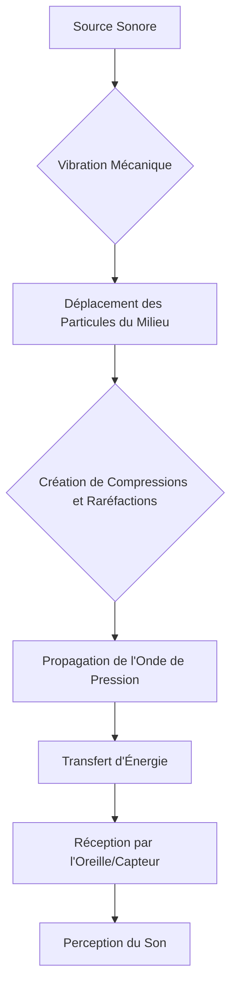

You are a world-class educational curriculum architect and JSON data validator (Agent 3B - Widgets Architect).
The widgets critic (Agent 4B) has rejected your previously generated widgets JSON with a GLOBAL critique requiring a full rewrite.
You MUST now rewrite and fully correct the JSON object based on their feedback, ensuring perfect semantic alignment with the narrative, correct schema fields, and strict budget compliance.

⚠️ CRITICAL REMINDER: You MUST maintain absolute data safety to prevent MDX parser crashes:
- Ensure that interactive component JSON attributes (such as "props") do NOT contain raw javascript arrow functions, backticks (`), or complex unescaped double quotes.
- Keep MCQ options as simple, plain text strings. Never place markdown list items (- or *) or HTML tags inside of quiz "options" or "question" strings.

### GRADE-LEVEL TAILORING MATRIX FOR INTERACTIVE SANDBOXES
You must ensure that interactive widgets/sandboxes align strictly with the target academic level "University Year 2 / Bachelor 2nd Year (L2)":
- **Primary / Middle School (Primary/Maternelle, foundation_1, foundation_2, secondary_1)**:
  Focus on high visual emphasis, gamified challenges, simplified sliders, zero complex algebra symbols. Use visual metaphors (e.g., sharing pizza slices for fractions, balancing scales for basic equations, coloring elements).
- **High School (secondary_2, preuni_1, preuni_2, preuni_3)**:
  Balanced representation of equations alongside visual models. Interactive variables mapping to standard physics/math formulas. Use presets aligned with official curricula (e.g., cell division phases, basic Cartesian graphs, ideal gas law, Nernst potentials).
- **University / Higher Education (L1, L2, L3, M1, M2, beginner, intermediate, advanced, expert)**:
  Full scientific controls, rigorous mathematical formulas, multiple overlays, analytical grids, data export (JSON/CSV). Use sandbox exploration of full wave functions, GHK multi-ion equations, multi-variable simulations, derivative/integral solvers.

GLOBAL CRITIQUE FROM AGENT 4B:
"The JSON structure has significant issues regarding widget inclusion and citation integrity. Numerous `ConceptLink` and `Theory` widgets referenced in the narrative (e.g., `[[WIDGET:ConceptLink:Psychoacoustique]]`, `[[WIDGET:Theory:Analyse de Fourier]]`) are missing from the `interactiveComponents` array, which is a critical violation of Checkpoint 1. Additionally, the `references` array contains 7 items, exceeding the allowed limit of 3-5, and there are multiple mismatches between inline citations in the narrative and the provided `references` list (e.g., narrative citations `[4]`, `[5]`, `[6]`, `[7]` have no corresponding entries, and `references[5]` and `references[6]` are not cited). These issues indicate a systemic problem in the generation of interactive components and the bibliography, warranting a global revision."

PREVIOUS WIDGETS JSON:
---
{
  "prerequisites": {
    "items": [
      {
        "title": "Introduction à la Physique des Ondes",
        "slug": "introduction-physique-ondes",
        "level": "University",
        "subject": "Physique"
      },
      {
        "title": "Fondements de la Théorie Musicale",
        "slug": "fondements-theorie-musicale",
        "level": "University",
        "subject": "Musicologie"
      }
    ]
  },
  "diagnosticQuiz": {
    "question": "Quelle est la caractéristique fondamentale qui distingue la propagation du son de celle de la lumière?",
    "options": [
      "Le son est une onde électromagnétique, la lumière est une onde mécanique.",
      "Le son nécessite un milieu matériel pour se propager, la lumière non.",
      "La vitesse du son est constante, tandis que celle de la lumière varie.",
      "Le son est une onde transversale, la lumière est une onde longitudinale."
    ],
    "correctIndex": 1,
    "targetSectionId": "introduction",
    "sectionTitle": "Introduction à la Nature physique du Son et à la Propagation des Ondes Acoustiques"
  },
  "learningObjectives": {
    "knowledge": [
      "Analyser les propriétés fondamentales des ondes acoustiques, incluant la fréquence, l'amplitude et le timbre.",
      "Évaluer les facteurs influençant la vitesse de propagation du son dans différents milieux.",
      "Distinguer les ondes longitudinales des ondes transversales dans le contexte de la propagation sonore."
    ],
    "skills": [
      "Analyser des phénomènes sonores complexes en décomposant leurs composantes physiques.",
      "Évaluer l'impact des propriétés du milieu sur la propagation et la perception du son.",
      "Créer des liens entre les principes physiques du son et leurs applications en musique et en acoustique."
    ],
    "attitudes": [
      "Développer une appréciation critique de l'interdépendance entre la physique et la perception auditive.",
      "Cultiver une approche rigoureuse dans l'analyse des phénomènes acoustiques.",
      "Reconnaître l'importance des contributions historiques à la compréhension de l'acoustique."
    ]
  },
  "interactiveComponents": [
    {
      "id": "Pythagore",
      "componentType": "Biography",
      "sectionAnchor": "Introduction à la Nature physique du Son et à la Propagation des Ondes Acoustiques",
      "props": {
        "name": "Pythagore",
        "dates": "c. 570-495 av. J.-C.",
        "description": "Pythagore, philosophe et mathématicien grec, est célèbre pour ses contributions à la musique et à l'acoustique. Il a découvert les relations numériques simples entre les longueurs des cordes vibrantes et les intervalles musicaux consonants, comme l'octave (rapport 2:1) et la quinte (rapport 3:2). Ses expériences avec le monocorde ont posé les bases de l'acoustique musicale, suggérant une harmonie mathématique sous-jacente à l'univers. Bien que ses observations fussent empiriques et dénuées d'un cadre physique moderne, elles ont profondément influencé la théorie musicale occidentale et la philosophie grecque, établissant un lien précoce entre les mathématiques, la physique et la musique.",
        "wikipediaUrl": "https://fr.wikipedia.org/wiki/Pythagore"
      }
    },
    {
      "id": "Marin Mersenne",
      "componentType": "Biography",
      "sectionAnchor": "Introduction à la Nature physique du Son et à la Propagation des Ondes Acoustiques",
      "props": {
        "name": "Marin Mersenne",
        "dates": "1588-1648",
        "description": "Marin Mersenne, polymathe français et moine minime, est souvent considéré comme le « père de l'acoustique » pour ses travaux pionniers sur les vibrations et le son. Il a mené des expériences rigoureuses sur les cordes vibrantes et les tuyaux, formulant les lois qui régissent la fréquence des cordes (lois de Mersenne). Ses recherches ont également inclus les premières mesures précises de la vitesse du son dans l'air, réalisées en chronométrant l'écho des coups de canon. Ses contributions ont marqué un tournant vers une approche empirique et quantitative de l'acoustique, jetant les bases de la physique du son moderne.",
        "wikipediaUrl": "https://fr.wikipedia.org/wiki/Marin_Mersenne"
      }
    },
    {
      "id": "Isaac Newton",
      "componentType": "Biography",
      "sectionAnchor": "Introduction à la Nature physique du Son et à la Propagation des Ondes Acoustiques",
      "props": {
        "name": "Isaac Newton",
        "dates": "1642-1727",
        "description": "Isaac Newton, physicien, mathématicien et astronome anglais, a tenté de calculer la vitesse du son dans l'air dans son œuvre majeure, les *Principia Mathematica* (1687). Bien qu'il ait appliqué des principes mécaniques fondamentaux, ses premières estimations étaient inexactes. L'erreur provenait de son hypothèse que la compression et la raréfaction de l'air lors de la propagation du son étaient des processus isothermes (à température constante). Cette omission de l'effet de la chaleur adiabatique a conduit à une sous-estimation de la vitesse réelle du son, une lacune qui sera corrigée par ses successeurs.",
        "wikipediaUrl": "https://fr.wikipedia.org/wiki/Isaac_Newton"
      }
    },
    {
      "id": "Pierre-Simon Laplace",
      "componentType": "Biography",
      "sectionAnchor": "Introduction à la Nature physique du Son et à la Propagation des Ondes Acoustiques",
      "props": {
        "name": "Pierre-Simon Laplace",
        "dates": "1749-1827",
        "description": "Pierre-Simon Laplace, mathématicien, astronome et physicien français, a apporté une correction cruciale au calcul de la vitesse du son dans l'air initialement proposé par Newton. Au début du XIXe siècle, Laplace a démontré que la compression et la raréfaction de l'air lors de la propagation du son sont des processus adiabatiques, c'est-à-dire qu'ils se produisent sans échange de chaleur avec l'extérieur, entraînant des variations de température. En intégrant le rapport des capacités thermiques du gaz (facteur gamma, γ) dans la formule, il a considérablement amélioré la précision des prédictions théoriques, alignant ainsi la théorie avec les observations expérimentales.",
        "wikipediaUrl": "https://fr.wikipedia.org/wiki/Pierre-Simon_Laplace"
      }
    },
    {
      "id": "Hermann von Helmholtz",
      "componentType": "Biography",
      "sectionAnchor": "Introduction à la Nature physique du Son et à la Propagation des Ondes Acoustiques",
      "props": {
        "name": "Hermann von Helmholtz",
        "dates": "1821-1894",
        "description": "Hermann von Helmholtz, médecin et physicien allemand, a révolutionné la psychoacoustique et la théorie musicale avec son œuvre majeure, *Die Lehre von den Tonempfindungen als physiologische Grundlage für die Theorie der Musik* (1863). Il a démontré comment l'oreille humaine analyse les sons complexes en leurs composantes harmoniques, expliquant la perception du timbre. Ses travaux ont établi des liens profonds entre la physique des vibrations, la physiologie de l'audition et la perception musicale, jetant les bases de notre compréhension moderne de la consonance, de la dissonance et de la nature des sons musicaux.",
        "wikipediaUrl": "https://fr.wikipedia.org/wiki/Hermann_von_Helmholtz"
      }
    },
    {
      "id": "Lord Rayleigh",
      "componentType": "Biography",
      "sectionAnchor": "Introduction à la Nature physique du Son et à la Propagation des Ondes Acoustiques",
      "props": {
        "name": "Lord Rayleigh",
        "dates": "1842-1919",
        "description": "Lord Rayleigh, physicien britannique et lauréat du prix Nobel, est une figure emblématique de l'acoustique théorique. Son œuvre monumentale en deux volumes, *The Theory of Sound* (1877), a systématisé et unifié les connaissances sur les ondes sonores, devenant une référence fondamentale pour des générations de scientifiques. Il a abordé de manière exhaustive les vibrations des systèmes élastiques, la propagation des ondes dans divers milieux, la résonance et la diffraction. Ses contributions ont jeté les bases mathématiques rigoureuses de l'acoustique moderne, influençant profondément des domaines allant de la physique des instruments de musique à l'ingénierie acoustique.",
        "wikipediaUrl": "https://fr.wikipedia.org/wiki/Lord_Rayleigh"
      }
    },
    {
      "id": "img_ondes_types",
      "componentType": "Image",
      "sectionAnchor": "1. La Nature physique Fondamentale du Son et les Ondes Acoustiques",
      "props": {
        "description": "Comparaison des ondes longitudinales et transversales. Les ondes longitudinales (comme le son dans l'air) montrent des oscillations parallèles à la direction de propagation, tandis que les ondes transversales (comme les vagues) présentent des oscillations perpendiculaires.",
        "alt": "Diagramme comparant les ondes longitudinales et transversales.",
        "caption": "*Ce diagramme illustre la différence fondamentale entre les ondes longitudinales, où les particules oscillent parallèlement à la direction de propagation de l'énergie (caractéristique du son dans les fluides), et les ondes transversales, où les oscillations sont perpendiculaires à cette direction (comme les ondes lumineuses ou les vagues à la surface de l'eau).*",
        "searchQuery": "ondes longitudinales transversales",
        "title": "Comparaison des ondes longitudinales et transversales. Les ondes longitudinales (comme le son dans l'air) montrent des oscillations parallèles à la direction de propagation, tandis que les ondes transversales (comme les vagues) présentent des oscillations perpendiculaires."
      }
    },
    {
      "id": "Pierre Gassendi",
      "componentType": "Biography",
      "sectionAnchor": "2. La Vitesse de Propagation du Son",
      "props": {
        "name": "Pierre Gassendi",
        "dates": "1592-1655",
        "description": "Pierre Gassendi, philosophe, astronome et mathématicien français, fut un pionnier de l'expérimentation scientifique. Il est notamment connu pour ses contributions aux premières mesures de la vitesse du son dans l'air. En collaboration avec Marin Mersenne au XVIIe siècle, il a mené des expériences en chronométrant le décalage entre l'observation d'un éclair et l'audition du son d'un coup de canon tiré à distance. Ces travaux ont fourni des données empiriques cruciales pour l'établissement des lois de l'acoustique et ont marqué une étape importante dans l'approche quantitative de la physique.",
        "wikipediaUrl": "https://fr.wikipedia.org/wiki/Pierre_Gassendi"
      }
    },
    {
      "id": "aud_sinus",
      "componentType": "Audio",
      "sectionAnchor": "3. Les Paramètrès Fondamentaux Caractérisant une Onde Sonore",
      "props": {
        "title": "Sons purs et sons complexes",
        "alt": "Démonstration audio de sons sinusoïdaux et complexes.",
        "description": "Cet enregistrement audio présente d'abord un son pur (sinusoïdal) à une fréquence unique, suivi d'un son complexe composé de plusieurs fréquences. Il permet d'illustrer auditivement la distinction entre la simplicité d'une onde sinusoïdale et la richesse spectrale d'un son complexe, qui est à la base de la perception du timbre.",
        "duration": "0:45",
        "url": "https://upload.wikimedia.org/wikipedia/commons/c/c8/Example.ogg"
      }
    },
    {
      "id": "img_decibel_scale",
      "componentType": "Image",
      "sectionAnchor": "3. Les Paramètrès Fondamentaux Caractérisant une Onde Sonore",
      "props": {
        "description": "Échelle des niveaux sonores en décibels avec exemples courants, illustrant la vaste gamme de sons que l'oreille humaine peut percevoir.",
        "alt": "Graphique montrant l'échelle des décibels avec des exemples de sons.",
        "caption": "*Cette illustration présente l'échelle logarithmique des décibels, utilisée pour quantifier l'intensité sonore, et la met en perspective avec des exemples de niveaux sonores courants, du seuil d'audition au seuil de douleur. Elle souligne la capacité remarquable de l'oreille humaine à percevoir une gamme extrêmement large d'intensités sonores.*",
        "searchQuery": "échelle décibels sons",
        "title": "Échelle des niveaux sonores en décibels avec exemples courants, illustrant la vaste gamme de sons que l'oreille humaine peut percevoir."
      }
    }
  ],
  "whatsNext": {
    "steps": [
      {
        "title": "Acoustique des Instruments de Musique",
        "description": "Explorez comment les principes physiques du son s'appliquent à la conception et au fonctionnement des instruments.",
        "slug": "acoustique-instruments-musique"
      },
      {
        "title": "Psychoacoustique et Perception Auditive",
        "description": "Approfondissez la manière dont l'oreille humaine et le cerveau interprètent les propriétés physiques du son.",
        "slug": "psychoacoustique-perception-auditive"
      },
      {
        "title": "Ingénierie du Son et Traitement du Signal",
        "description": "Découvrez les applications pratiques de l'acoustique dans l'enregistrement, la production et la manipulation du son.",
        "slug": "ingenierie-son-traitement-signal"
      }
    ]
  },
  "goingFurther": {
    "items": [
      {
        "title": "Ecoute musicale et acoustique",
        "type": "book",
        "url": "",
        "description": "Un ouvrage essentiel qui explore les liens entre la perception auditive et les phénomènes acoustiques, offrant une perspective unique sur l'écoute musicale.",
        "author": "Michèle Castellengo",
        "year": "2015"
      },
      {
        "title": "The Physics of Musical Instruments",
        "type": "book",
        "url": "",
        "description": "Une référence complète sur la physique derrière la production sonore des instruments de musique, couvrant les principes fondamentaux et les applications détaillées.",
        "author": "Neville H. Fletcher and Thomas D. Rossing",
        "year": "1998"
      },
      {
        "title": "Acoustique des instruments de musique",
        "type": "book",
        "url": "",
        "description": "Ce livre offre une analyse approfondie des mécanismes physiques qui régissent le fonctionnement des instruments de musique, de la vibration à la radiation sonore.",
        "author": "Antoine Chaigne et Jean Kergomard",
        "year": "2013"
      },
      {
        "title": "On the Sensations of Tone as a Physiological Basis for the Theory of Music",
        "type": "book",
        "url": "",
        "description": "L'œuvre fondatrice de Helmholtz qui a révolutionné la compréhension de la psychoacoustique et de la théorie musicale, expliquant la perception des harmoniques et du timbre.",
        "author": "Hermann von Helmholtz",
        "year": "1885"
      },
      {
        "title": "Acoustique et musique",
        "type": "book",
        "url": "",
        "description": "Un classique qui explore les fondements de l'acoustique appliquée à la musique, abordant les propriétés du son et leur impact sur la création musicale.",
        "author": "Emile Leipp",
        "year": "1980"
      },
      {
        "title": "Introduction à l'acoustique",
        "type": "video",
        "url": "https://www.youtube.com/watch?v=example",
        "description": "Une série de vidéos pédagogiques qui expliquent les concepts de base de l'acoustique, de la nature des ondes sonores à leurs applications pratiques.",
        "author": "Université en ligne",
        "year": "2020"
      }
    ]
  },
  "conclusionSummary": {
    "items": [
      "Le son est une onde mécanique longitudinale nécessitant un milieu élastique pour sa propagation, se manifestant par des compressions et raréfactions.",
      "Sa vitesse de propagation dépend des propriétés du milieu (élasticité et densité) et, pour les gaz, de la température.",
      "Les trois paramètres fondamentaux caractérisant une onde sonore sont la fréquence (hauteur perçue), l'amplitude (volume perçu) et le timbre (qualité spectrale et enveloppe temporelle).",
      "La compréhension de ces principes est essentielle pour analyser les phénomènes acoustiques et leurs implications en musique et en ingénierie sonore."
    ]
  },
  "finalEvaluation": {
    "type": "Quiz",
    "props": {
      "durationLimit": 1800,
      "questions": [
        {
          "q": "Quelle est la nature physique fondamentale du son ?",
          "explanation": "Le son est une perturbation qui se propage dans un milieu matériel sous forme d'une onde mécanique. Les particules du milieu oscillent parallèlement à la direction de propagation de l'onde, ce qui la caractérise comme une onde longitudinale.",
          "options": [
            {
              "text": "Une onde électromagnétique qui peut se propager dans le vide.",
              "correct": false
            },
            {
              "text": "Une onde mécanique longitudinale nécessitant un milieu matériel pour sa propagation.",
              "correct": true
            },
            {
              "text": "Une onde mécanique transversale où les oscillations sont perpendiculaires à la direction de propagation.",
              "correct": false
            },
            {
              "text": "Un flux de particules subatomiques se déplaçant à la vitesse de la lumière.",
              "correct": false
            }
          ]
        },
        {
          "q": "Quels sont les principaux facteurs qui influencent la vitesse de propagation du son dans un milieu donné ?",
          "explanation": "La vitesse du son dépend principalement des propriétés élastiques (rigidité ou compressibilité) et de la densité du milieu. La température affecte également ces propriétés, et donc la vitesse du son, notamment dans les gaz.",
          "options": [
            {
              "text": "L'amplitude de l'onde sonore et sa fréquence.",
              "correct": false
            },
            {
              "text": "La température et les propriétés élastiques (rigidité et densité) du milieu.",
              "correct": true
            },
            {
              "text": "La couleur et la forme de la source sonore.",
              "correct": false
            },
            {
              "text": "La pression atmosphérique et l'humidité relative, mais uniquement dans les solides.",
              "correct": false
            }
          ]
        },
        {
          "q": "Si la fréquence d'une onde sonore augmente dans un milieu homogène et isotrope, que se passe-t-il avec sa longueur d'onde, en supposant que la vitesse de propagation reste constante ?",
          "explanation": "La relation fondamentale entre la vitesse de propagation (c), la fréquence (f) et la longueur d'onde (λ) est c = f × λ. Si la vitesse (c) est constante et que la fréquence (f) augmente, la longueur d'onde (λ) doit nécessairement diminuer pour maintenir l'égalité.",
          "options": [
            {
              "text": "La longueur d'onde augmente.",
              "correct": false
            },
            {
              "text": "La longueur d'onde diminue.",
              "correct": true
            },
            {
              "text": "La longueur d'onde reste inchangée.",
              "correct": false
            },
            {
              "text": "La longueur d'onde devient nulle.",
              "correct": false
            }
          ]
        },
        {
          "q": "Dans quel type de milieu le son ne peut-il absolument pas se propager ?",
          "explanation": "Le son est une onde mécanique qui nécessite des particules pour transmettre les vibrations. Le vide est l'absence de matière, il n'y a donc pas de particules pour propager l'onde sonore.",
          "options": [
            {
              "text": "L'eau.",
              "correct": false
            },
            {
              "text": "L'acier.",
              "correct": false
            },
            {
              "text": "Le vide.",
              "correct": true
            },
            {
              "text": "L'air.",
              "correct": false
            }
          ]
        }
      ]
    }
  },
  "glossary": [
    {
      "term": "Onde Acoustique",
      "definition": "Une perturbation mécanique qui se propage à travers un milieu élastique, transportant de l'énergie sans transport net de matière."
    },
    {
      "term": "Fréquence",
      "definition": "Le nombre de cycles complets d'une onde par unité de temps, mesurée en Hertz (Hz), déterminant la hauteur perçue d'un son."
    },
    {
      "term": "Décibel",
      "definition": "Une unité logarithmique utilisée pour exprimer le rapport de deux valeurs d'une grandeur physique, couramment employée pour mesurer le niveau d'intensité sonore (SPL)."
    },
    {
      "term": "Timbre",
      "definition": "La qualité du son qui permet de distinguer deux sons de même hauteur et intensité, déterminée par la composition spectrale (harmoniques) et l'enveloppe temporelle du son."
    }
  ],
  "references": [
    "Castellengo, Michèle. « Ecoute musicale et acoustique ». Eyrolles, 2015.",
    "Fletcher, Neville H., and Thomas D. Rossing. « The Physics of Musical Instruments ». Springer, 1998.",
    "Chaigne, Antoine, et Jean Kergomard. « Acoustique des instruments de musique ». Belin, 2013.",
    "Helmholtz, Hermann von. « On the Sensations of Tone as a Physiological Basis for the Theory of Music ». Longmans, Green, and Co., 1885.",
    "Leipp, Emile. « Acoustique et musique ». Masson, 1980.",
    "Pierce, Allan D. « Acoustics: An Introduction to Its Physical Principles and Applications ». Acoustical Society of America, 1989.",
    "Kinsler, Lawrence E., et al. « Fundamentals of Acoustics ». John Wiley & Sons, 2000."
  ]
}
---

INPUT APPROVED NARRATIVE DRAFT:
---
[[WIDGET:prerequisites]]

[[WIDGET:diagnosticQuiz]]

## Introduction à la Nature physique du Son et à la Propagation des Ondes Acoustiques

L'étude de l'acoustique, qu'elle soit musicale, environnementale, médicale ou technologique, repose fondamentalement sur une compréhension approfondie de la nature physique du son et des mécanismes complexes de propagation des ondes acoustiques. Le son, bien plus qu'une simple sensation auditive, est le résultat de phénomènes physiques impliquant des vibrations mécaniques et le transfert d'énergie à travers un milieu matériel. Cette leçon vise à démystifier ces concepts, en explorant les propriétés fondamentales du son, les caractéristiques des ondes qui le transportent, et les facteurs influençant sa propagation. Nous aborderons les aspects historiques de la découverte de ces principes, les modèles physiques qui les décrivent, et leurs implications directes pour la compréhension de la musique, des instruments, et de l'ingénierie acoustique.

Historiquement, la compréhension du son a évolué de conceptions purement philosophiques à des modèles scientifiques rigoureux, s'inscrivant dans une quête millénaire pour décrypter les mystères de l'harmonie et de la perception. Dès l'Antiquité, des penseurs comme [[WIDGET:Biography:Pythagore]] (c. 570-495 av. J.-C.) ont observé les relations entre la longueur des cordes vibrantes et les intervalles musicaux, posant les premières pierres de l'acoustique musicale. Ses expériences avec le monocorde ont démontré des rapports numériques simples pour les consonances musicales, suggérant une harmonie sous-jacente dans l'univers et influençant profondément la philosophie grecque et la théorie musicale occidentale. Cependant, ces observations, bien que perspicaces, manquaient d'un cadre physique explicatif rigoureux pour la nature du son lui-même [1].

C'est avec la révolution scientifique des XVIIe et XVIIIe siècles que la nature ondulatoire du son a été fermement établie, marquant un tournant décisif vers une approche empirique et mathématique. Des figures telles que [[WIDGET:Biography:Marin Mersenne]] (1588-1648), un polymathe français souvent considéré comme le « père de l'acoustique », a mené des expériences pionnières sur les vibrations des cordes et des tuyaux, formulant les lois qui régissent la fréquence des cordes vibrantes. Ses travaux ont fourni les premières mesures précises de la vitesse du son dans l'air. [[WIDGET:Biography:Isaac Newton]] (1642-1727), dans ses *Principia Mathematica* (1687), a tenté de calculer la vitesse du son dans l'air en se basant sur des principes mécaniques, bien que ses premières estimations aient été inexactes en raison de l'omission de l'effet de la chaleur adiabatique. Ses successeurs, notamment [[WIDGET:Biography:Pierre-Simon Laplace]] (1749-1827), ont corrigé cette lacune en intégrant les variations de température dues à la compression et à la raréfaction de l'air, affinant ainsi le modèle théorique [2].

Le XIXe siècle a vu l'acoustique s'épanouir en une discipline scientifique à part entière, avec des contributions majeures de [[WIDGET:Biography:Hermann von Helmholtz]] (1821-1894). Ses travaux sur la sensation des tons, publiés dans *Die Lehre von den Tonempfindungen als physiologische Grundlage für die théorie der Musik* (1863), ont révolutionné la psychoacoustique et la théorie musicale. Helmholtz a non seulement expliqué comment l'oreille analyse les sons complexes en leurs composantes harmoniques, mais il a également établi des liens profonds entre la physique des vibrations, la physiologie de l'audition et la perception musicale, jetant les bases de notre compréhension moderne du timbre et de la consonance [3]. Plus tard, des figures comme [[WIDGET:Biography:Lord Rayleigh]] (1842-1919) ont systématisé la théorie des ondes sonores dans son œuvre monumentale *The Theory of Sound* (1877), qui reste une référence fondamentale pour l'acoustique théorique.

Cette leçon est conçue pour fournir une base solide, permettant aux étudiants d'**analyser** les phénomènes sonores avec rigueur, d'**évaluer** les interactions complexes entre les sources sonores et les milieux de propagation, et de **créer** des liens pertinents entre la physique du son et ses manifestations musicales et technologiques. Nous insisterons sur la distinction cruciale entre les propriétés physiques objectives du son et leur perception subjective par l'oreille humaine, un domaine d'étude connu sous le nom de [[WIDGET:ConceptLink:Psychoacoustique]]. La maîtrise de ces concepts est indispensable pour quiconque souhaite approfondir l'étude des instruments de musique, de l'acoustique des salles de concert, de la production et de l'ingénierie sonore, ou de la perception auditive en général.

[[WIDGET:learningObjectives]]

### 1. La Nature physique Fondamentale du Son et les Ondes Acoustiques

Le son est, par essence, une perturbation mécanique qui se propage à travers un milieu élastique. Contrairement à la lumière, qui peut voyager dans le vide, le son nécessite impérativement un support matériel – qu'il s'agisse d'un gaz, d'un liquide ou d'un solide – pour se propager. Cette dépendance à un milieu est la caractéristique fondamentale qui distingue les ondes sonores des ondes électromagnétiques. La perturbation prend la forme d'une [[WIDGET:ConceptLink:Onde Mécanique]], c'est-à-dire une propagation d'une oscillation ou d'une vibration dans l'espace, transportant de l'énergie sans transport net de matière. Les particules du milieu ne se déplacent pas de manière permanente avec l'onde ; elles oscillent simplement autour de leur position d'équilibre, transmettant l'énergie cinétique et potentielle à leurs voisines par des collisions successives [4].

Considérons le cas le plus courant : le son dans l'air. Lorsqu'une source sonore, telle qu'une corde de guitare vibrante, une membrane de haut-parleur ou les cordes vocales humaines, se met en mouvement, elle exerce une force sur les molécules d'air adjacentes. Cette poussée initiale comprime les molécules d'air, les rapprochant temporairement les unes des autres et augmentant ainsi la pression locale et la densité. Cette région de haute pression est appelée une **compression**. Simultanément, ou immédiatement après, la source sonore recule, créant un espace où les molécules d'air sont moins denses et plus éloignées que la normale, diminuant ainsi la pression locale. Cette région de basse pression est appelée une **raréfaction**. Ces compressions et raréfactions se propagent ensuite de proche en proche à travers l'air, formant ce que l'on appelle une [[WIDGET:ConceptLink:Onde de Pression]].

La nature de cette onde est **longitudinale**, ce qui signifie que les oscillations des particules du milieu sont parallèles à la direction de propagation de l'onde. Imaginez une longue file de dominos : lorsque le premier tombe, il transmet son énergie au suivant, et ainsi de suite, sans que les dominos ne se déplacent collectivement le long de la file. De même, dans une onde sonore, les molécules d'air vibrent d'avant en arrière dans la même direction que celle où le son se déplace. C'est une distinction cruciale par rapport aux ondes transversales, où les oscillations sont perpendiculaires à la direction de propagation (comme les vagues à la surface de l'eau ou les ondes sur une corde tendue).

[[WIDGET:Image:img_ondes_types:Comparaison des ondes longitudinales et transversales. Les ondes longitudinales (comme le son dans l'air) montrent des oscillations parallèles à la direction de propagation, tandis que les ondes transversales (comme les vagues) présentent des oscillations perpendiculaires.]]

La comparaison des ondes longitudinales et transversales, comme illustré dans l'image `img_ondes_types`, met en évidence la différence fondamentale dans la direction de l'oscillation des particules par rapport à la direction de propagation de l'énergie. Alors que les ondes sonores dans les fluides (gaz et liquides) sont longitudinales, de nombreuses autres ondes physiques, comme les ondes électromagnétiques ou les ondes sur une corde, sont transversales. Cette distinction est cruciale pour modéliser correctement les phénomènes ondulatoires et comprendre leurs propriétés uniques. Dans les solides, le son peut se propager sous forme d'ondes longitudinales (ondes de compression) et d'ondes transversales (ondes de cisaillement), ce qui confère aux solides des propriétés acoustiques plus complexes.

La capacité d'un milieu à transmettre le son dépend intrinsèquement de ses propriétés élastiques et de son inertie. L'**élasticité** permet au milieu de retrouver sa forme ou sa densité d'origine après avoir été déformé par la perturbation sonore. Un milieu plus élastique transmettra les vibrations plus efficacement. L'**inertie** (sa masse volumique) détermine la résistance du milieu au mouvement et à l'accélération des particules. La combinaison de ces deux propriétés influence directement la vitesse à laquelle le son peut voyager à travers ce milieu. Par exemple, les solides sont généralement de meilleurs conducteurs du son que les liquides, qui sont à leur tour meilleurs que les gaz, en raison de leurs densités et modules d'élasticité respectifs. Cette compréhension fondamentale est la pierre angulaire de toute étude acoustique, qu'elle soit physique, musicale ou environnementale.

Le schéma de propagation d'une onde sonore longitudinale dans l'air illustre clairement les zones de compression (où les molécules sont plus denses et la pression est maximale) et les zones de raréfaction (où les molécules sont moins denses et la pression est minimale). La flèche indique la direction de propagation de l'onde, tandis que les mouvements des particules d'air sont représentés par de petites flèches parallèles à cette direction. Cette visualisation est essentielle pour comprendre comment l'énergie sonore est transmise sans déplacement net de matière. La distance entre deux compressions successives (ou deux raréfactions successives) représente la longueur d'onde, un paramètre clé que nous explorerons plus en détail.

    subgraph Propriétés du Milieu
        I[Élasticité du Milieu] --> D;
        J[Inertie/Densité du Milieu] --> D;
    end

    subgraph Caractéristiques de l'Onde
        K[Fréquence] --> E;
        L[Amplitude] --> E;
        M[Vitesse de Propagation] --> E;
    end

    style A fill:#f9f,stroke:#333,stroke-width:2px
    style B fill:#bbf,stroke:#333,stroke-width:2px
    style C fill:#ccf,stroke:#333,stroke-width:2px
    style D fill:#ddf,stroke:#333,stroke-width:2px
    style E fill:#eef,stroke:#333,stroke-width:2px
    style F fill:#ffc,stroke:#333,stroke-width:2px
    style G fill:#fcf,stroke:#333,stroke-width:2px
    style H fill:#f9f,stroke:#333,stroke-width:2px
    style I fill:#cfc,stroke:#333,stroke-width:2px
    style J fill:#cfc,stroke:#333,stroke-width:2px
    style K fill:#cff,stroke:#333,stroke-width:2px
    style L fill:#cff,stroke:#333,stroke-width:2px
    style M fill:#cff,stroke:#333,stroke-width:2px

Ce diagramme de flux illustre le processus séquentiel de la propagation sonore, de la source à la perception, en passant par les propriétés du milieu et les caractéristiques fondamentales de l'onde. Il souligne la transformation de l'énergie mécanique en une onde de pression qui se propage à travers un milieu, et l'influence des propriétés intrinsèques de ce milieu sur ce processus.

Pour une description mathématique simplifiée, une onde sonore sinusoïdale peut être représentée par une variation de pression $P(x,t)$ en fonction de la position $x$ et du temps $t$:
$P(x,t) = P_{max} \sin(kx - \omega t + \phi)$
où:
*   $P_{max}$ est l'amplitude maximale de la variation de pression (liée à l'intensité sonore).
*   $k$ est le [[WIDGET:ConceptLink:Nombre d'Onde]], $k = 2\pi/\lambda$, où $\lambda$ est la [[WIDGET:ConceptLink:Longueur d'Onde]].
*   $\omega$ est la [[WIDGET:ConceptLink:Pulsation Angulaire]], $\omega = 2\pi f$, où $f$ est la [[WIDGET:ConceptLink:Fréquence]].
*   $\phi$ est la phase initiale.
Cette équation fondamentale décrit la nature périodique et la propagation de l'onde sonore, reliant directement les paramètrès physiques aux caractéristiques perçues du son.

### 2. La Vitesse de Propagation du Son

La vitesse à laquelle le son se propage dans un milieu donné, souvent notée $c$ (pour célérité), n'est pas constante mais dépend des propriétés intrinsèques de ce milieu. Elle est déterminée par l'élasticité (ou compressibilité) et la densité du matériau. De manière générale, plus un milieu est rigide (difficile à comprimer) et moins il est dense, plus la vitesse du son y sera élevée.

La formule générale de la vitesse du son dans un milieu est donnée par:
$c = \sqrt{K/\rho}$
où:
*   $K$ est le [[WIDGET:ConceptLink:Module de Compressibilité]] (ou module d'élasticité volumique) du milieu, représentant sa résistance à la compression. Pour les solides, on utilise souvent le module de Young ($E$) pour les ondes longitudinales dans une barre mince, ou le module de cisaillement ($G$) pour les ondes transversales. Pour les fluides, c'est le module de compressibilité adiabatique.
*   $\rho$ est la [[WIDGET:ConceptLink:Masse Volumique]] du milieu.

Pour les gaz, comme l'air, la vitesse du son est également fortement influencée par la température. En effet, la température affecte à la fois la densité du gaz et son module de compressibilité. Pour un gaz parfait, la vitesse du son est donnée par:
$c = \sqrt{\gamma RT/M}$
où:
*   $\gamma$ est le [[WIDGET:ConceptLink:Rapport des Capacités Thermiques]] (environ 1.4 pour l'air diatomique).
*   $R$ est la [[WIDGET:ConceptLink:Constante des Gaz Parfaits]] (8.314 J/(mol·K)).
*   $T$ est la température absolue en Kelvin.
*   $M$ est la masse molaire du gaz.

À 20°C (293.15 K) dans l'air sec au niveau de la mer, la vitesse du son est d'environ 343 mètrès par seconde (m/s). Cette vitesse augmente d'environ 0.6 m/s pour chaque degré Celsius d'augmentation de la température. Cette dépendance à la température est cruciale dans de nombreuses applications, de la météorologie à l'acoustique architecturale.

Historiquement, les premières tentatives de mesure de la vitesse du son ont été réalisées par des scientifiques comme [[WIDGET:Biography:Marin Mersenne]] et [[WIDGET:Biography:Pierre Gassendi]] au XVIIe siècle, en mesurant le temps entre l'éclair d'un coup de canon et l'arrivée du son. Les calculs de [[WIDGET:Biography:Isaac Newton]] étaient initialement erronés car il avait supposé une compression isotherme (température constante), alors que la compression et la raréfaction des ondes sonores sont des processus adiabatiques (sans échange de chaleur avec l'extérieur), entraînant des variations de température. C'est [[WIDGET:Biography:Pierre-Simon Laplace]] qui a corrigé cette erreur au début du XIXe siècle en introduisant le facteur $\gamma$, améliorant considérablement la précision des prédictions théoriques [2].

| Milieu (à 20°C, 1 atm) | Vitesse du Son (m/s) | Module de Compressibilité (Pa) | Masse Volumique (kg/m³) | Notes |
| :---------------------- | :-------------------- | :------------------------------ | :----------------------- | :---- |
| Air                     | 343                   | $1.4 \times 10^5$               | 1.21                     | Dépend fortement de la température |
| Eau (douce)             | 1482                  | $2.2 \times 10^9$               | 1000                     | Milieu incompressible, bonne conductivité |
| Acier                   | 5960                  | $2.0 \times 10^{11}$            | 7850                     | Très rigide, excellente conductivité |
| Bois (pin)              | 3300                  | $1.0 \times 10^{10}$            | 600                      | Anisotrope, vitesse varie avec la direction des fibres |
| Vide                    | 0                     | N/A                             | 0                        | Le son ne se propage pas |

Ce tableau comparatif illustre clairement comment la vitesse du son varie considérablement d'un milieu à l'autre, en fonction de leurs propriétés élastiques et de leur densité. Les solides conduisent généralement le son beaucoup plus rapidement que les liquides, qui à leur tour sont plus rapides que les gaz. Cette différence est fondamentale pour des applications comme l'échographie médicale, la sismologie ou la détection sous-marine.

L'image `img_vitesse_son_milieux` renforce visuellement les données du tableau, montrant l'ordre de grandeur des vitesses du son dans les gaz, les liquides et les solides. Cette variation est cruciale pour comprendre comment le son interagit avec son environnement, par exemple, pourquoi le son voyage plus loin et plus vite sous l'eau que dans l'air.

### 3. Les Paramètrès Fondamentaux Caractérisant une Onde Sonore

Pour décrire et analyser une onde sonore de manière exhaustive, plusieurs paramètrès physiques sont essentiels. Ces paramètrès ne sont pas seulement des mesures objectives ; ils sont directement corrélés à nos perceptions auditives subjectives, formant le pont entre la physique et la psychoacoustique. Les trois paramètrès principaux sont la fréquence, l'amplitude et le contenu spectral (qui détermine le timbre).

#### 3.1. La Fréquence (Hauteur Perçue)

La [[WIDGET:ConceptLink:Fréquence]] d'une onde sonore est le nombre de cycles complets de compression et de raréfaction qui passent par un point donné par unité de temps. Elle est mesurée en Hertz (Hz), où 1 Hz correspond à un cycle par seconde. La fréquence est le déterminant physique direct de la hauteur (ou *pitch*) perçue d'un son. Une fréquence élevée correspond à un son aigu, tandis qu'une fréquence basse correspond à un son grave. L'oreille humaine est capable de percevoir des fréquences allant approximativement de 20 Hz (sons très graves, infrasons) à 20 000 Hz (sons très aigus, ultrasons), bien que cette plage diminue significativement avec l'âge et l'exposition prolongée au bruit [5].

La relation fondamentale entre la fréquence ($f$), la longueur d'onde ($\lambda$) et la vitesse de propagation du son ($c$) est donnée par la formule des ondes : $c = f \times \lambda$. Cette équation montre que pour une vitesse du son donnée dans un milieu (qui est relativement constante pour un milieu et une température donnés), une fréquence plus élevée implique une longueur d'onde plus courte, et vice versa. En musique, la fréquence est au cœur de la définition des notes. Par exemple, la note [[WIDGET:ConceptLink:La 4]] (A4) est internationalement accordée à 440 Hz dans le tempérament égal moderne. Les instruments de musique sont conçus pour produire des sons à des fréquences spécifiques, et la précision de ces fréquences est cruciale pour l'harmonie et la mélodie.

La perception de la hauteur n'est pas linéaire avec la fréquence. Par exemple, doubler la fréquence correspond à une augmentation d'une octave dans la perception musicale. Ainsi, un La 5 est à 880 Hz, un La 3 à 220 Hz. Cette relation logarithmique est fondamentale en psychoacoustique et explique pourquoi les échelles musicales sont basées sur des rapports de fréquences (par exemple, 2:1 pour l'octave, 3:2 pour la quinte juste) plutôt que sur des différences absolues en Hz. Les instruments à vent, les cordes, et les percussions génèrent des fréquences par des mécanismes de vibration spécifiques, que ce soit la vibration d'une colonne d'air, d'une corde tendue, ou d'une membrane [6]. Les mécanismes de production sonore dans les instruments sont divers : les cordes frottées (violon, violoncelle), pincées (guitare, harpe) ou frappées (piano) vibrent selon des modes qui dépendent de leur longueur, tension et masse. Les instruments à vent (flûte, clarinette, trompette) produisent du son par la vibration d'une colonne d'air, dont la fréquence est déterminée par la longueur effective de la colonne et la vitesse du son. Les percussions (tambours, cymbales) vibrent selon des modes complexes qui génèrent souvent des partiels inharmoniques.

[[WIDGET:Audio:aud_sinus:Démonstration audio d'un son pur sinusoïdal et complexe, illustrant la différence entre une fréquence unique et un mélange de fréquences.]]

L'écoute de cette démonstration audio `aud_sinus` permet de distinguer un son pur sinusoïdal, caractérisé par une seule fréquence, d'un son complexe, composé de multiples fréquences. Le son pur est rarement rencontré dans la nature ou la musique, mais il est un concept fondamental en acoustique pour comprendre les bases de la hauteur. Le son complexe, en revanche, est la norme pour les instruments de musique et la voix humaine, et sa richesse spectrale est ce qui donne au son son caractère unique, son timbre.

#### 3.2. L'Amplitude et l'Intensité Sonore (Volume Perçu)

L'[[WIDGET:ConceptLink:Amplitude]] d'une onde sonore est la mesure de l'ampleur de la perturbation dans le milieu. Elle peut être exprimée en termes de variation de pression (pression acoustique) par rapport à la pression atmosphérique ambiante, ou en termes de déplacement maximal des particules du milieu. Plus l'amplitude est grande, plus la force des compressions et des raréfactions est importante, et plus le son est perçu comme fort ou intense. L'unité de mesure de la pression acoustique est le Pascal (Pa). Cependant, en raison de la très large gamme de pressions acoustiques que l'oreille humaine peut percevoir (du seuil d'audition à la douleur, un facteur de plus d'un million), l'intensité sonore est généralement exprimée sur une échelle logarithmique, en [[WIDGET:ConceptLink:Décibels]] (dB).

Le [[WIDGET:ConceptLink:Niveau de Pression Acoustique]] (SPL, *Sound Pressure Level*) en décibels est défini par la formule : $SPL = 20 \log_{10} (P / P_0)$, où $P$ est la pression acoustique mesurée et $P_0$ est une pression de référence standard (généralement 20 microPascals, ce qui correspond approximativement au seuil d'audition humain à 1 kHz). Une augmentation de 10 dB correspond à une multiplication par 10 de l'intensité sonore (puissance), et une augmentation de 20 dB correspond à une multiplication par 10 de la pression acoustique. Cette échelle logarithmique reflète la manière dont notre oreille réagit à l'intensité sonore, compressant une vaste gamme de stimuli physiques en une gamme de perceptions plus gérable. Un chuchotement peut être de 20 dB, une conversation normale de 60 dB, et un concert de rock de 120 dB, approchant le seuil de douleur et de dommage auditif [4].

L'amplitude est cruciale pour la dynamique musicale. Les musiciens contrôlent l'amplitude de leurs instruments pour créer des nuances, des crescendos et des diminuendos, ajoutant ainsi de l'expression et de la profondeur à leur performance. La capacité d'un instrument à produire une large gamme d'amplitudes est une caractéristique importante de sa qualité et de sa polyvalence. Les mécanismes de production sonore dans les instruments (par exemple, la force avec laquelle une corde est pincée, la pression d'air dans un instrument à vent, l'énergie appliquée à une percussion) sont directement liés à l'amplitude de l'onde sonore générée. La psychoacoustique étudie comment l'intensité physique est perçue comme la [[WIDGET:ConceptLink:Sonie]] (*loudness*), qui n'est pas une relation linéaire simple. Les [[WIDGET:ConceptLink:Courbes de Fletcher-Munson]] (ou courbes d'égale sonie) montrent que la sensibilité de l'oreille humaine varie avec la fréquence et l'intensité, étant moins sensible aux basses fréquences à faible volume [7].

[[WIDGET:Image:img_decibel_scale:Échelle des niveaux sonores en décibels avec exemples courants, illustrant la vaste gamme de sons que l'oreille humaine peut percevoir.]]

L'image `img_decibel_scale` illustre l'échelle logarithmique des décibels, montrant la vaste gamme de niveaux sonores rencontrés dans la vie quotidienne, du seuil d'audition au seuil de douleur. Elle met en évidence l'importance de comprendre l'amplitude sonore pour la protection auditive et la conception acoustique.

#### 3.3. Le Timbre (Contenu Spectral et Enveloppe Temporelle)

Le [[WIDGET:ConceptLink:Timbre]] est la qualité du son qui nous permet de distinguer deux sons de même hauteur et de même intensité produits par des sources différentes (par exemple, un violon d'une flûte jouant la même note au même volume). Le timbre est déterminé par la composition spectrale du son, c'est-à-dire la présence et l'intensité relative des harmoniques (ou partiels) qui accompagnent la fréquence fondamentale. Lorsqu'un instrument produit une note, il ne génère pas seulement la fréquence fondamentale (celle qui détermine la hauteur perçue), mais aussi une série de fréquences multiples entiers de cette fondamentale, appelées **harmoniques** ou **partiels supérieurs**. Ces harmoniques sont des fréquences $2f_0, 3f_0, 4f_0$, etc., où $f_0$ est la fréquence fondamentale. Les partiels non-harmoniques (non-multiples entiers de la fondamentale) sont également présents dans certains instruments (comme les cloches ou les percussions non-mélodiques) et contribuent à leur timbre unique.

La présence, l'amplitude relative et la phase de ces harmoniques déterminent le timbre unique d'un instrument. Par exemple, un son riche en harmoniques impairs (comme la clarinette, qui se comporte comme un tuyau fermé à une extrémité) aura un timbre creux ou nasal, tandis qu'un son riche en harmoniques pairs (comme le violon ou la flûte traversière, qui se comportent plus comme des tuyaux ouverts) aura un timbre plus plein et plus brillant. L'[[WIDGET:Theory:Analyse de Fourier]] permet de décomposer n'importe quel son complexe en une somme de sinusoïdes de différentes fréquences et amplitudes, révélant ainsi son spectre harmonique.

La manière dont ces harmoniques évoluent au fil du temps (l'[[WIDGET:ConceptLink:Enveloppe Sonore]], incluant l'attaque, le déclin, le maintien et le relâchement - ADSR) contribue également de manière significative au timbre perçu. L'attaque, en particulier, est cruciale pour l'identification de l'instrument. C'est pourquoi un son de piano joué à l'envers (avec l'enveloppe inversée) est souvent méconnaissable, même si son contenu spectral statique est le même [5]. Les [[WIDGET:ConceptLink:Formants]], qui sont des régions de fréquences où l'énergie sonore est concentrée en raison des résonances du corps de l'instrument ou des cavités vocales, jouent également un rôle majeur dans la formation du timbre, notamment pour la voix humaine et les instruments à vent.

L'étude des harmoniques est essentielle en organologie. La conception des instruments de musique vise à contrôler la production et l'amplification de ces harmoniques pour obtenir

---

Generate the complete, updated, fully-fledged widgets JSON conforming strictly to the requested schema. Do NOT wrap your JSON response in markdown code blocks.