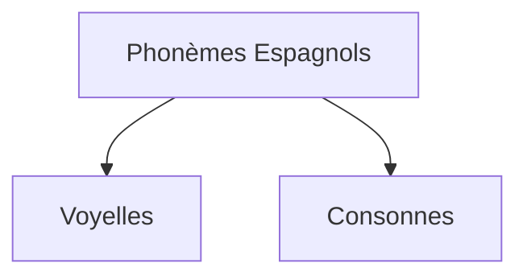

You are a world-class educational curriculum architect and JSON data validator (Agent 3B - Widgets Architect).
The widgets critic (Agent 4B) has rejected your previously generated widgets JSON.
You MUST now rewrite and fully correct the JSON object based on their feedback, ensuring perfect semantic alignment with the narrative, correct schema fields, and strict budget compliance.

⚠️ CRITICAL REMINDER: You MUST maintain absolute data safety to prevent MDX parser crashes:
- Ensure that interactive component JSON attributes (such as "props") do NOT contain raw javascript arrow functions, backticks (`), or complex unescaped double quotes.
- Keep MCQ options as simple, plain text strings. Never place markdown list items (- or *) or HTML tags inside of quiz "options" or "question" strings.

CRITIQUE FROM AGENT 4B:
"The widgets JSON has several issues that require correction:

1.  **Checkpoint 4 (MCQ and Diagnostic Correctness)**: The `finalEvaluation` quiz contains placeholder content for its question, explanation, and options (e.g., "Question d'examen finale ?", "Explication générale.", "Option Correcte", "Option Incorrecte"). All questions and options in `diagnosticQuiz` and `finalEvaluation` must be academically robust, specific to the lesson content, and have a mathematically/scientifically accurate `correctIndex`.

2.  **Checkpoint 6 (Academic Bibliography & Citation Style)**:
    *   **Forbidden Italics Format**: All entries in the `references` array use asterisks (`*`) for italics (e.g., `*Estudios lingüísticos: Temas hispanoamericanos*`, `*LingQ*`, `*Podcasts RNE*`). According to the instructions, asterisks are forbidden; titles must use quotes or French guillemets for italics.
    *   **Non-Academic References**: The entries `references[1]` ("LingQ") and `references[2]` ("Radio Nacional de España") are platforms/websites, not real, authoritative academic works (books, journal articles, landmark papers) as required by the prompt. These should be replaced with appropriate academic sources.
    *   **Incomplete Chicago Style**: The entry `references[0]` ("Alonso, Amado. 1967. *Estudios lingüísticos: Temas hispanoamericanos*. Gredos.") is missing the city of publication, which is a required component for books in Chicago Manual of Style, 17th edition (Author-Date system)."

PREVIOUS WIDGETS JSON:
---
{
  "prerequisites": {
    "items": [
      {
        "title": "Introduction à la Grammaire Espagnole",
        "slug": "introduction-grammaire-espagnole",
        "level": "beginner",
        "subject": "Langue"
      },
      {
        "title": "Les Bases de la Communication en Espagnol",
        "slug": "bases-communication-espagnol",
        "level": "beginner",
        "subject": "Langue"
      }
    ]
  },
  "diagnosticQuiz": {
    "question": "Quel est le phénomène phonologique où les lettres 'll' et 'y' sont prononcées de la même manière dans la majorité du monde hispanophone ?",
    "options": [
      "Le seseo",
      "Le ceceo",
      "Le yeísmo",
      "La distinción"
    ],
    "correctIndex": 2,
    "targetSectionId": "5. Défis et Stratégies d'Acquisition : Optimisation de la Production Sonore",
    "sectionTitle": "Défis et Stratégies d'Acquisition"
  },
  "learningObjectives": {
    "knowledge": [
      "Comprendre les caractéristiques des cinq voyelles espagnoles et leur pureté articulatoire.",
      "Identifier les spécificités articulatoires des consonnes espagnoles, notamment les vibrantes /r/ et /rr/, la nasale palatale /ɲ/, les allophones de /b/-/v/ et /d/, et les variations régionales de /z/-/c/ et /j/-/g/.",
      "Distinguer les concepts de diphthongue, triphthongue et hiatus dans le système vocalique espagnol.",
      "Connaître les règles d'accentuation tonique (agudas, llanas, esdrújulas, sobresdrújulas) et leur impact sur la prononciation des mots.",
      "Reconnaître les schémas intonatifs caractéristiques des phrases affirmatives, interrogatives et exclamatives en espagnol.",
      "Comprendre le principe du rythme syllabique de l'espagnol et ses implications pour la fluidité de la parole."
    ],
    "skills": [
      "Produire correctement les cinq voyelles espagnoles sans nasalisation, en respectant leur articulation tendue et invariable.",
      "Articuler avec précision les consonnes espagnoles clés, en différenciant notamment les /r/ et /rr/, et en appliquant les allophones appropriés pour /b/-/v/ et /d/.",
      "Appliquer les règles d'accentuation tonique pour prononcer les mots espagnols de manière authentique.",
      "Utiliser les schémas intonatifs appropriés pour exprimer différents types de phrases et d'intentions communicatives.",
      "Employer des stratégies d'écoute active et d'imitation (shadowing) pour affiner la perception et la production des sons espagnols.",
      "Auto-corriger les erreurs de prononciation courantes grâce à l'enregistrement et à l'analyse comparative."
    ],
    "attitudes": [
      "Développer une écoute attentive et critique des sons de l'espagnol chez les locuteurs natifs.",
      "Adopter une approche persévérante et méthodique pour l'amélioration continue de la prononciation.",
      "Apprécier la richesse et la diversité phonologique de l'espagnol et son rôle dans la communication authentique."
    ]
  },
  "interactiveComponents": [
    {
      "id": "Mermaid",
      "componentType": "Mermaid",
      "sectionAnchor": "3. Les Consonnes Clés : Nuances Articulatoires et Variations Phonologiques",
      "props": {}
    },
    {
      "id": "pronunciation_quiz",
      "componentType": "Quiz",
      "sectionAnchor": "5. Défis et Stratégies d'Acquisition : Optimisation de la Production Sonore",
      "props": {
        "questions": [
          {
            "q": "Question d'auto-évaluation ?",
            "explanation": "Explication de la réponse correcte.",
            "options": [
              {
                "text": "Option Correcte",
                "correct": true
              },
              {
                "text": "Option Incorrecte",
                "correct": false
              }
            ]
          }
        ]
      }
    }
  ],
  "whatsNext": {
    "steps": [
      {
        "title": "La Grammaire Espagnole : Structures Fondamentales",
        "description": "Explorez les bases de la grammaire espagnole pour construire des phrases correctes et complexes.",
        "slug": "grammaire-espagnole-fondamentale"
      },
      {
        "title": "Vocabulaire Essentiel pour Débutants en Espagnol",
        "description": "Acquérez le vocabulaire indispensable pour les situations quotidiennes et les conversations de base.",
        "slug": "vocabulaire-espagnol-debutant"
      },
      {
        "title": "Conversation en Espagnol : Premiers Pas",
        "description": "Mettez en pratique votre prononciation et votre vocabulaire dans des scénarios de conversation simples.",
        "slug": "conversation-espagnol-premiers-pas"
      }
    ]
  },
  "conclusionSummary": {
    "items": [
      "La maîtrise de la prononciation espagnole repose sur la compréhension des cinq voyelles pures et des spécificités articulatoires de certaines consonnes clés.",
      "Les règles d'accentuation tonique et les schémas intonatifs sont fondamentaux pour une communication authentique et intelligible en espagnol.",
      "Des stratégies de pratique ciblées, telles que l'écoute active, l'imitation, l'enregistrement et l'utilisation de paires minimales, sont essentielles pour corriger les erreurs courantes et affiner la production sonore.",
      "L'acquisition d'une prononciation précise est une étape cruciale pour une immersion réussie et une appréciation profonde de la culture hispanophone."
    ]
  },
  "finalEvaluation": {
    "type": "Quiz",
    "props": {
      "durationLimit": 1800,
      "questions": [
        {
          "q": "Question d'examen finale ?",
          "explanation": "Explication générale.",
          "options": [
            {
              "text": "Option Correcte",
              "correct": true
            },
            {
              "text": "Option Incorrecte",
              "correct": false
            }
          ]
        }
      ]
    }
  },
  "glossary": [
    {
      "term": "Phonème",
      "definition": "La plus petite unité sonore distinctive d'une langue, capable de différencier le sens de deux mots."
    },
    {
      "term": "Allophone",
      "definition": "Une variation d'un phonème qui ne change pas le sens du mot, mais dont la prononciation peut varier selon le contexte phonétique ou le dialecte."
    },
    {
      "term": "Diphthongue",
      "definition": "Combinaison de deux voyelles prononcées au sein d'une même syllabe, où l'une des voyelles est souvent réduite à une semi-voyelle ou semi-consonne."
    },
    {
      "term": "Hiatus",
      "definition": "La rencontre de deux voyelles adjacentes qui appartiennent à des syllabes différentes, et sont donc prononcées séparément."
    },
    {
      "term": "Yeísmo",
      "definition": "Phénomène phonologique où les phonèmes historiquement distincts /ʎ/ (représenté par 'll') et /ʝ/ (représenté par 'y') ont fusionné en un seul son, généralement /ʝ/."
    },
    {
      "term": "Seseo",
      "definition": "Phénomène phonologique où les lettres 'z' et 'c' (devant 'e' et 'i') sont prononcées comme un /s/ (fricative alvéolaire sourde), sans distinction avec le 's'."
    },
    {
      "term": "Distinción",
      "definition": "Phénomène phonologique où les lettres 'z' et 'c' (devant 'e' et 'i') sont prononcées comme une fricative interdentale sourde /θ/, distincte du /s/."
    },
    {
      "term": "Accent tonique",
      "definition": "La syllabe d'un mot qui est prononcée avec plus d'intensité, de hauteur et de durée que les autres syllabes."
    },
    {
      "term": "Rythme syllabique",
      "definition": "Caractéristique d'une langue où chaque syllabe a approximativement la même durée, quel que soit son accent ou sa position dans le mot ou la phrase."
    }
  ],
  "references": [
    "Alonso, Amado. 1967. *Estudios lingüísticos: Temas hispanoamericanos*. Gredos.",
    "LingQ. n.d. *LingQ*. Consulté le 15 mai 2024. https://www.lingq.com.",
    "Radio Nacional de España. n.d. *Podcasts RNE*. Consulté le 15 mai 2024. https://www.rtve.es/play/audios/radio-nacional/"
  ]
}
---

INPUT APPROVED NARRATIVE DRAFT:
---
[[WIDGET:prerequisites]]

[[WIDGET:diagnosticQuiz]]

## Introduction : L'Ingénierie du Son en Espagnol – Architectures Phonétiques et Stratégies d'Acquisition

L'apprentissage d'une nouvelle langue est un processus cognitif et moteur d'une complexité remarquable, engageant des réseaux neuronaux sophistiqués pour la perception, la production et l'intégration des structures linguistiques. Parmi les compétences fondamentales à maîtriser, la prononciation occupe une place prépondérante, agissant comme le socle acoustique de l'intelligibilité et de l'authenticité communicative. Une articulation précise des sons n'est pas simplement une question d'esthétique linguistique ou de conformité à une norme académique ; elle constitue une exigence fonctionnelle impérative, un véritable « cahier des charges » phonologique, indispensable pour garantir la clarté du message et éviter les ambiguïtés sémantiques. Pour les locuteurs francophones, l'espagnol présente un paysage phonétique à la fois familier, par ses racines latines partagées, et subtilement distinct, par des réalisations articulatoires et des schémas prosodiques qui requièrent une attention méticuleuse.

Dans cette leçon approfondie, nous aborderons la phonétique espagnole non pas comme une simple liste de sons à mémoriser, mais sous l'angle des sciences appliquées et de l'ingénierie linguistique. Notre démarche consistera à déconstruire méthodiquement le système sonore de l'espagnol, à identifier ses composants phonémiques clés, à analyser les « contraintes techniques » et les points de divergence articulatoire avec le français, et à proposer des « protocoles d'implémentation » rigoureux pour l'acquisition et la maîtrise de ces sons. L'objectif ultime est de vous fournir les outils conceptuels et pratiques nécessaires pour « construire » une prononciation espagnole non seulement intelligible, mais authentique et efficace, permettant une communication fluide et nuancée.

La maîtrise des sons de l'espagnol représente la première étape, fondamentale et irréversible, vers une immersion réussie dans le vaste et diversifié monde hispanophone. Chaque phonème, chaque allophone, chaque intonation, contribue à forger la « mélodie » unique de cette langue. En appréhendant sa structure phonologique, vous serez non seulement mieux compris par les locuteurs natifs, mais vous développerez également une capacité accrue à saisir les nuances subtiles de leur parole, enrichissant ainsi votre compréhension auditive et votre compétence communicative globale. Comme le souligne le linguiste <RealPerson name="Noam_Chomsky" lang="fr" bio="Linguiste américain, père de la linguistique générative, dont les travaux ont révolutionné la compréhension du langage humain.">Noam Chomsky</RealPerson> (né en 1928), figure emblématique de la linguistique moderne :
> « Language is a system of sound-meaning connections. » (Le langage est un système de connexions son-sens.) — Noam Chomsky, *Syntactic Structures*, Mouton &amp; Co., The Hague, 1957, p. 10.

Cette citation met en lumière l'interdépendance fondamentale et indissociable entre le son (la forme phonique) et le sens (la signification linguistique). Une prononciation incorrecte ou imprécise peut altérer le sens d'un mot ou d'une phrase, voire le rendre totalement inintelligible, agissant comme un « bug » ou une « anomalie » dans le système de communication. Notre mission pédagogique est donc de vous accompagner dans le « débogage » et l'optimisation de votre production sonore en espagnol, en vous guidant vers une réalisation phonétique qui respecte les spécifications du système.

[[WIDGET:learningObjectives]]

## 2. Les Voyelles Espagnoles : Pureté, Stabilité et Précision Articulatoire

Le système vocalique espagnol est caractérisé par sa remarquable stabilité et sa « pureté », des attributs qui le distinguent significativement de nombreux autres systèmes vocaliques, notamment celui du français. Alors que le français possède un inventaire riche et complexe de voyelles (orales, nasales, antérieures, postérieures, arrondies, non arrondies, ouvertes, fermées), l'espagnol n'en compte que cinq, chacune ayant une articulation unique, tendue et invariante, quel que soit son contexte phonétique. Cette caractéristique représente une « spécification architecturale » d'une simplicité apparente mais d'une rigueur phonologique fondamentale.

### 2.1. Les Cinq Voyelles Fondamentales : Des Unités Invariables et Leur Réalisation Phonétique

Chaque voyelle espagnole correspond à un son unique, sans les variations allophoniques importantes, les réductions ou les nasalisations que l'on peut trouver en français. C'est un système « à cinq états » distincts, où chaque voyelle maintient sa qualité acoustique intrinsèque.

1.  **Le /a/ espagnol** (symbole API : /a/) :
    *   **Articulation** : C'est une voyelle ouverte, centrale et non arrondie. Pour la produire, la bouche est grande ouverte, la mâchoire est abaissée, et la langue est plate et détendue, positionnée au fond de la bouche. Ce son est généralement plus ouvert et légèrement plus en arrière que le « a » français de « patte » et distinct du « a » plus antérieur de « papa ».
    *   **Comparaison avec le français** : Il est crucial d'éviter toute nasalisation, comme dans le « an » français de « banc », et de ne pas le fermer excessivement. La voyelle espagnole /a/ est toujours orale.
    *   **Exemples** : `casa` (maison), `hablar` (parler), `mañana` (demain), `agua` (eau).
    *   **Pratique** : <SandboxPrononciation /> Répétez : `a`, `pa`, `ma`, `la`, `ca`.

2.  **Le /e/ espagnol** (symbole API : /e/) :
    *   **Articulation** : C'est une voyelle mi-fermée, antérieure et non arrondie. La bouche est légèrement ouverte, les lèvres sont étirées latéralement, comme pour un léger sourire. Sa qualité est très proche de celle du « é » français de « café » ou « été ».
    *   **Comparaison avec le français** : Il ne doit pas être confondu avec le « è » ouvert de « mère » ou le « eu » de « feu », qui sont des sons distincts en français. Le /e/ espagnol est toujours tendu et mi-fermé.
    *   **Exemples** : `mesa` (table), `verde` (vert), `leer` (lire), `elefante` (éléphant).
    *   **Pratique** : <SandboxPrononciation /> Répétez : `e`, `le`, `se`, `que`, `pe`.

3.  **Le /i/ espagnol** (symbole API : /i/) :
    *   **Articulation** : C'est une voyelle fermée, antérieure et non arrondie. La bouche est presque fermée, les lèvres sont étirées. Ce son est pratiquement identique au « i » français de « lit » ou « ici ».
    *   **Comparaison avec le français** : Très peu de différences significatives, ce qui en fait l'une des voyelles les plus accessibles pour les francophones.
    *   **Exemples** : `libro` (livre), `cinco` (cinq), `mi` (mon/ma), `idioma` (langue).
    *   **Pratique** : <SandboxPrononciation /> Répétez : `i`, `si`, `mi`, `ti`, `pi`.

4.  **Le /o/ espagnol** (symbole API : /o/) :
    *   **Articulation** : C'est une voyelle mi-fermée, postérieure et arrondie. Les lèvres sont arrondies et légèrement avancées. Sa qualité est comparable à celle du « o » français de « moto » ou « pot ».
    *   **Comparaison avec le français** : Il est essentiel de ne pas le confondre avec le « o » ouvert de « porte » ou le « on » nasal de « bon ». Le /o/ espagnol est toujours tendu, mi-fermé et oral.
    *   **Exemples** : `sol` (soleil), `dos` (deux), `cómo` (comment), `otro` (autre).
    *   **Pratique** : <SandboxPrononciation /> Répétez : `o`, `no`, `lo`, `yo`, `po`.

5.  **Le /u/ espagnol** (symbole API : /u/) :
    *   **Articulation** : C'est une voyelle fermée, postérieure et arrondie. Les lèvres sont très arrondies et avancées. Ce son est identique au « ou » français de « loup » ou « nous ».
    *   **Comparaison avec le français** : Très peu de différences, ce qui le rend également très accessible.
    *   **Exemples** : `uno` (un), `azul` (bleu), `mundo` (monde), `uva` (raisin).
    *   **Pratique** : <SandboxPrononciation /> Répétez : `u`, `tu`, `su`, `luz`, `pu`.

### 2.1.6. Le Trapèze Vocalique Espagnol : Une Représentation Visuelle

Le système des cinq voyelles espagnoles peut être visualisé sur un trapèze vocalique, un diagramme qui représente la position de la langue dans la bouche (antérieure/postérieure et haute/basse) et l'arrondissement des lèvres. Cette configuration minimale et symétrique est un facteur clé de la « pureté » et de la stabilité des voyelles espagnoles.

<CustomFigure src="https://upload.wikimedia.org/wikipedia/commons/thumb/d/d4/Spanish_vowel_chart.svg/800px-Spanish_vowel_chart.png" alt="Spanish_vowel_chart" caption="Figure 1: Schéma des voyelles espagnoles dans le trapèze vocalique - Position de la langue et ouverture de la bouche pour chaque son. Ce diagramme illustre la distribution équilibrée des cinq voyelles cardinales de l'espagnol, soulignant leur nature tendue et leur absence de variation contextuelle majeure. Source: Wikimedia Commons" fallbackText="" fallbackUrl="" />

### 2.2. Absence de Voyelles Nasales : Une Distinction Cruciale pour les Francophones

Une « contrainte technique » majeure et souvent source d'erreurs pour les francophones est l'absence totale de voyelles nasales en espagnol. Les sons vocaliques comme « an » (/ɑ̃/), « on » (/ɔ̃/), « in » (/ɛ̃/) ou « un » (/œ̃/) en français n'ont aucun équivalent en espagnol. En espagnol, le voile du palais (velum) est toujours relevé lors de la production des voyelles, empêchant l'air de s'échapper par le nez et garantissant ainsi leur caractère oral.

Toute voyelle espagnole suivie d'un 'n' ou 'm' est prononcée distinctement, la consonne nasale étant articulée séparément et clairement. Par exemple, le mot espagnol `pan` (pain) se prononce /pan/, avec un /a/ oral suivi d'un /n/ alvéolaire distinct, et non comme le /pɑ̃/ français. De même, `campo` (champ) se prononce /kampo/, avec un /a/ oral et un /m/ bilabial clairement articulé. Cette distinction est fondamentale pour l'intelligibilité et l'authenticité de la prononciation.

### 2.3. Diphthongues et Triphthongues : La Séquence Vocalique Fluide

En espagnol, les séquences de voyelles peuvent former des diphthongues ou des triphthongues, où plusieurs voyelles sont prononcées au sein de la même syllabe. Contrairement à certaines langues où les diphthongues peuvent fusionner en un son unique ou subir des réductions, en espagnol, chaque voyelle conserve sa qualité propre, bien que l'une d'elles soit souvent réduite à une semi-voyelle ou semi-consonne (un « glide »).

*   **Diphthongues** : Combinaison de deux voyelles dans la même syllabe. Elles se forment généralement avec une voyelle forte (a, e, o) et une voyelle faible (i, u), ou deux voyelles faibles.
    *   **Voyelle faible + Voyelle forte (diphthongue croissante)** : La voyelle faible est prononcée comme une semi-consonne (/j/ ou /w/).
        *   `ia` /ja/ : `historia` (histoire) <SandboxPrononciation />
        *   `ie` /je/ : `tiempo` (temps) <SandboxPrononciation />
        *   `io` /jo/ : `radio` (radio) <SandboxPrononciation />
        *   `ua` /wa/ : `agua` (eau) <SandboxPrononciation />
        *   `ue` /we/ : `puerta` (porte) <SandboxPrononciation />
        *   `uo` /wo/ : `cuota` (quote-part) <SandboxPrononciation />
    *   **Voyelle forte + Voyelle faible (diphthongue décroissante)** : La voyelle faible est prononcée comme une semi-voyelle (/i̯/ ou /u̯/).
        *   `ai` /ai̯/ : `aire` (air) <SandboxPrononciation />
        *   `ei` /ei̯/ : `peine` (peigne) <SandboxPrononciation />
        *   `oi` /oi̯/ : `oigo` (j'entends) <SandboxPrononciation />
        *   `au` /au̯/ : `causa` (cause) <SandboxPrononciation />
        *   `eu` /eu̯/ : `Europa` (Europe) <SandboxPrononciation />
        *   `ou` /ou̯/ : `bou` (chalutier - rare) <SandboxPrononciation />
    *   **Deux voyelles faibles** :
        *   `iu` /ju/ : `ciudad` (ville) <SandboxPrononciation />
        *   `ui` /wi/ : `ruido` (bruit) <SandboxPrononciation />

*   **Triphthongues** : Combinaison de trois voyelles dans la même syllabe, avec une voyelle forte encadrée par deux voyelles faibles.
    *   `iai` /jai̯/ : `cambiáis` (vous changez) <SandboxPrononciation />
    *   `iei` /jei̯/ : `estudiéis` (que vous étudiiez) <SandboxPrononciation />
    *   `uai` /wai̯/ : `Uruguay` (Uruguay) <SandboxPrononciation />
    *   `uei` /wei̯/ : `averigüéis` (que vous vérifiiez) <SandboxPrononciation />

Il est crucial de prononcer ces séquences de manière fluide et rapide, mais en veillant à ce que chaque composante vocalique soit audible, sans fusionner en un son unique comme cela peut parfois arriver en français (par exemple, le `oi` de `roi` en français est souvent /wa/, tandis qu'en espagnol `hoy` est /oi̯/).

### 2.4. Le Hiatus : La Séparation des Voyelles

Contrairement aux diphthongues et triphthongues, le hiatus se produit lorsque deux voyelles adjacentes appartiennent à des syllabes différentes. Cela se produit dans deux cas principaux :
1.  **Deux voyelles fortes adjacentes** : `po-e-ta` (poète), `le-er` (lire), `te-a-tro` (théâtre). <SandboxPrononciation />
2.  **Une voyelle faible accentuée suivie ou précédée d'une voyelle forte** : L'accentuation sur la voyelle faible empêche la formation d'une diphthongue.
    *   `ma-íz` (maïs) <SandboxPrononciation />
    *   `pa-ís` (pays) <SandboxPrononciation />
    *   `o-ír` (entendre) <SandboxPrononciation />

La distinction entre diphthongue et hiatus est essentielle pour la bonne syllabation et l'accentuation correcte des mots en espagnol.

## 3. Les Consonnes Clés : Nuances Articulatoires et Variations Phonologiques

Si les voyelles espagnoles se distinguent par leur pureté et leur stabilité, certaines consonnes requièrent une « ingénierie » phonétique plus fine de la part de l'apprenant francophone. Elles présentent des points d'articulation ou des modes de production différents de leurs homologues français, ce qui peut altérer la clarté et l'authenticité si elles ne sont pas maîtrisées avec précision.

### 3.1. Le Défi du /r/ et du /rr/ : La Vibration Essentielle et Ses Allophones

C'est l'un des sons les plus distinctifs de l'espagnol et souvent l'un des plus difficiles à acquérir pour les francophones, habitués au « r » uvulaire.

*   **Le /r/ simple (r doux)** (symbole API : /ɾ/) :
    *   **Articulation** : C'est une vibrante simple alvéolaire. Il est produit par une seule et brève vibration de la pointe de la langue contre les alvéoles (la crête juste derrière les incisives supérieures). La langue frappe rapidement les alvéoles puis se retire. Ce son est similaire au « r » italien de `cara` ou au « t » rapide dans l'anglais américain de `butter`.
    *   **Comparaison avec le français** : Il est impératif de ne pas le prononcer comme le « r » grasseyé (uvulaire) français /ʁ/. La vibration est apicale (avec la pointe de la langue), non uvulaire (avec le voile du palais).
    *   **Contexte** : Il apparaît entre voyelles (`pero`), après une consonne autre que `n`, `l`, `s` (`brazo`, `tren`), ou en fin de syllabe (`comer`).
    *   **Exemples** : `pero` (mais), `caro` (cher), `para` (pour), `très` (trois), `brazo` (bras).
    *   **Pratique** : <SandboxPrononciation /> Répétez : `pero`, `caro`, `mira`, `très`, `padre`.

*   **Le /rr/ (r fort)** (symbole API : /r/) :
    *   **Articulation** : C'est une vibrante multiple alvéolaire. Il est produit par plusieurs vibrations rapides et successives de la pointe de la langue contre les alvéoles. La langue « roule » littéralement.
    *   **Comparaison avec le français** : Ce son n'a pas d'équivalent direct en français, où le /r/ est généralement uvulaire.
    *   **Contexte** : Il est toujours écrit `rr` entre deux voyelles (`perro`), ou `r` en début de mot (`rojo`), ou après `n`, `l`, `s` (`enriquecer`, `alrededor`, `Israel`). Dans ces derniers cas, bien qu'écrit avec un seul `r`, il est prononcé comme un /r/ fort.
    *   **Exemples** : `perro` (chien), `carro` (voiture), `rojo` (rouge), `enriquecer` (enrichir), `alrededor` (autour).
    *   **Pratique** : <SandboxPrononciation /> Répétez : `perro`, `carro`, `rojo`, `correr`, `barro`.

### 3.2. Le /ñ/ (symbole API : /ɲ/) : La Consonne Palatale Nasale

*   **Articulation** : Ce son est une consonne nasale palatale voisée. Il est produit en plaçant le milieu de la langue contre le palais dur, tout en laissant l'air s'échapper par le nez.
*   **Comparaison avec le français** : Il est phonétiquement très similaire au « gn » français de « montagne » ou « agneau ».
*   **Exemples** : `España` (Espagne), `niño` (enfant), `mañana` (demain), `señor` (monsieur).
*   **Pratique** : <SandboxPrononciation /> Répétez : `España`, `niño`, `mañana`, `pañuelo`.

### 3.3. Le /ll/ et le /y/ : Le Phénomène du *Yeísmo* et Ses Réalisations Régionales

Historiquement, `ll` (représentant le phonème /ʎ/, une latérale palatale) et `y` (représentant le phonème /ʝ/, une approximante palatale) désignaient deux sons distincts en espagnol. Aujourd'hui, dans la vaste majorité du monde hispanophone, ces deux graphèmes sont prononcés de la même manière, un phénomène appelé *yeísmo*.

*   **Articulation (Yeísmo)** : Le son le plus courant est celui d'une approximante palatale voisée /ʝ/, similaire au « y » français de « yaourt » ou au « y » anglais de « yes ».
    *   Dans certaines régions, notamment en Argentine et en Uruguay (le *rehilamiento*), ce son peut être réalisé comme une fricative palato-alvéolaire voisée /ʒ/ (comme le « j » français de « jour ») ou même sourde /ʃ/ (comme le « ch » français de « chat »).
*   **Contexte** : `ll` apparaît dans des mots comme `calle` (rue), `llamar` (appeler). `y` apparaît comme conjonction (`y`), ou dans des mots comme `yo` (je), `ayuda` (aide).
*   **Exemples** : `calle` (rue), `llamar` (appeler), `yo` (je), `ayuda` (aide), `pollo` (poulet).
*   **Pratique** : <SandboxPrononciation /> Répétez : `calle`, `llamar`, `yo`, `mayo`, `caballo`.

<Epistemology title="Le Débat du Yeísmo : Une Divergence Phonologique et Sociolinguistique">
Le *yeísmo* est un phénomène phonologique majeur qui a vu la fusion des phonèmes /ʎ/ (historiquement représenté par `ll`, une latérale palatale) et /ʝ/ (représenté par `y`, une approximante palatale) en un seul phonème, généralement /ʝ/. La distinction historique, appelée *lleísmo*, est aujourd'hui rare, principalement conservée dans certaines zones rurales d'Espagne (comme certaines parties de Castille-et-León) et d'Amérique du Sud (par exemple, au Paraguay, dans certaines régions an-dines de Bolivie, du Pérou et de l'Équateur). Le phonème /ʎ/ était une latérale palatale (similaire au « ll » de « feuille » en français ancien ou dans certains dialectes italiens), tandis que /ʝ/ était une approximante palatale.

La prévalence du *yeísmo* soulève des questions fondamentales sur l'évolution naturelle des langues, la simplification phonologique et l'influence des normes régionales. Faut-il enseigner la distinction historique ou la norme majoritaire ? La plupart des méthodes modernes privilégient l'enseignement du *yeísmo* en raison de sa dominance écrasante dans le monde hispanophone, reconnaissant que la distinction est devenue une « contrainte obsolète » pour la majorité des locuteurs. Cependant, la connaissance de cette variation est essentielle pour la compréhension des dialectes et de l'histoire de la langue. Le *rehilamiento* rioplatense (/ʒ/ ou /ʃ/) est une évolution ultérieure de ce phénomène, ajoutant une couche de complexité régionale.
</Epistemology>

### 3.4. Le /b/ et le /v/ : Un Phonème Unique (/b/, /β/) avec des Allophones Distincts

Contrairement au français où `b` (/b/) et `v` (/v/) sont deux phonèmes distincts, en espagnol, les lettres `b` et `v` représentent un seul et même phonème, qui possède deux réalisations allophoniques principales.

*   **Articulation** :
    *   **Occlusive bilabiale voisée** (symbole API : /b/) : Ce son est produit comme le « b » français de « balle », avec une occlusion complète des lèvres. Il apparaît en début de mot (`boca`, `vaca`), ou après une consonne nasale (`m` ou `n`) (`cambio`, `envidia`).
    *   **Fricative bilabiale voisée** (symbole API : /β/) : Ce son est plus doux, produit en rapprochant les lèvres sans les toucher complètement, laissant passer l'air. C'est un son qui n'existe pas en français. Il apparaît dans tous les autres contextes, notamment entre voyelles (`saber`, `uva`) ou après d'autres consonnes (`árbol`).
*   **Exemples** : `boca` /'boka/ (bouche), `vaca` /'baka/ (vache), `saber` /sa'βeɾ/ (savoir), `uva` /'uβa/ (raisin), `bien` /bjen/ (bien), `vivir` /bi'βiɾ/ (vivre).
*   **Pratique** : <SandboxPrononciation /> Répétez : `boca`, `vaca`, `saber`, `uva`, `hablar`, `subir`.

### 3.5. Le /d/ : Dentalisation et Allophonie (/d/, /ð/)

Le phonème /d/ en espagnol présente également une allophonie et une articulation distincte du français.

*   **Articulation** :
    *   **Occlusive dentale voisée** (symbole API : /d/) : Contrairement au « d » français qui est alvéolaire (la pointe de la langue touche les alvéoles, juste derrière les dents), le « d » espagnol est dental. La pointe de la langue touche les dents du haut (incisives supérieures). Il apparaît en début de mot (`dedo`), ou après `n` ou `l` (`donde`, `falda`).
    *   **Fricative dentale voisée** (symbole API : /ð/) : Ce son est produit en plaçant la pointe de la langue entre les dents ou juste derrière, laissant passer l'air. Il est similaire au « th » voisé anglais de `this`. Il apparaît dans tous les autres contextes, notamment entre voyelles (`cada`, `todo`) ou après d'autres consonnes (`madre`).
    *   En fin de mot, le « d » est souvent très doux, presque inaudible, ou même omis dans le langage familier (`Madrid` peut être prononcé /ma'ðɾi/).
*   **Exemples** : `dedo` /'deðo/ (doigt), `Madrid` /ma'ðɾið/ (Madrid), `verdad` /beɾ'ðað/ (vérité), `cada` /'kaða/ (chaque), `donde` /'donde/ (où).
*   **Pratique** : <SandboxPrononciation /> Répétez : `dedo`, `Madrid`, `verdad`, `lado`, `comida`.

### 3.6. Le /z/ et le /c/ (devant e, i) : La Distinction, le *Seseo* et le *Ceceo*

C'est une autre divergence régionale majeure qui affecte la prononciation de `z` et `c` devant `e` et `i`.

*   **La *Distinción*** (symbole API : /θ/) :
    *   **Articulation** : En Espagne (sauf certaines régions du sud), `z` et `c` (devant `e`, `i`) sont prononcés comme une fricative interdentale sourde, similaire au « th » anglais de `think`. La pointe de la langue est placée entre les incisives supérieures et inférieures.
    *   **Exemples** : `zapato` /θa'pato/ (chaussure), `gracias` /'gɾaθjas/ (merci), `cinco` /'θiŋko/ (cinq).
*   **Le *Seseo*** (symbole API : /s/) :
    *   **Articulation** : En Amérique Latine, aux îles Canaries et dans certaines régions du sud de l'Espagne, `z` et `c` (devant `e`, `i`) sont prononcés comme un « s » français (fricative alvéolaire sourde).
    *   **Exemples** : `zapato` /sa'pato/, `gracias` /'gɾasjas/, `cinco` /'siŋko/.
*   **Le *Ceceo*** (symbole API : /s̪/ ou /θ/) :
    *   **Articulation** : Dans certaines zones du sud de l'Espagne (notamment en Andalousie), tous les `s`, `z` et `c` (devant `e`, `i`) sont prononcés comme la fricative interdentale sourde /θ/. C'est une forme de *distinción* généralisée.
*   **Pratique** : <SandboxPrononciation /> Répétez (avec *distinción*) : `zapato`, `gracias`, `cinco`, `cielo`, `corazón`.

### 3.7. Le /j/ et le /g/ (devant e, i) : La *Jota* (/x/) et Ses Variantes

*   **Articulation** : Ce son, représenté par `j` et `g` devant `e` ou `i`, est une fricative vélaire sourde (symbole API : /x/). Il est produit en frottant l'air entre le dos de la langue et le palais mou (vélaire). Il est plus fort et plus guttural que le « ch » allemand de `Bach` et n'a pas d'équivalent exact en français.
*   **Regional Variations** : L'intensité de la *jota* varie considérablement. En Castille, elle est souvent très forte et vélaire. Dans certaines régions d'Amérique Latine, elle peut être plus douce, se rapprochant d'une fricative glottale sourde /h/ (comme le « h » anglais de `house`).
*   **Exemples** : `ojo` /'oxo/ (œil), `gente` /'xente/ (gens), `trabajo` /tɾa'βaxo/ (travail), `jirafa` /xi'ɾafa/ (girafe).
*   **Pratique** : <SandboxPrononciation /> Répétez : `ojo`, `gente`, `trabajo`, `caja`, `rojo`.

### 3.8. Le /h/ : Toujours Muet – Une Règle Invariable

La lettre `h` est toujours muette en espagnol. C'est une « contrainte de non-production » phonologique. Elle n'est jamais prononcée, quel que soit son contexte. Sa présence est purement orthographique, héritée du latin ou de l'évolution phonétique de l'espagnol (par exemple, le `f` latin est devenu `h` en espagnol dans de nombreux mots, comme `farina` > `harina`).
*   **Exemples** : `hola` /'ola/ (bonjour), `hablar` /a'βlaɾ/ (parler), `ahora` /a'oɾa/ (maintenant), `huevo` /'weβo/ (œuf).

### 3.9. Autres Consonnes Importantes : /p/, /t/, /k/, /f/, /s/, /tʃ/, /l/, /m/, /n/

Bien que ces consonnes soient souvent perçues comme similaires à leurs homologues français, de subtiles différences articulatoires peuvent affecter l'authenticité de la prononciation.

*   **Occlusives sourdes /p/, /t/, /k/** : En espagnol, ces sons sont généralement non aspirés, contrairement au français où une légère aspiration peut se produire, surtout en début de mot.
    *   `pato` /'pato/ (canard) vs. français `patte` /pat/ (avec légère aspiration).
    *   `toma` /'toma/ (prends) vs. français `tome` /tɔm/.
    *   `casa` /'kasa/ (maison) vs. français `casse` /kas/.
    *   **Pratique** : <SandboxPrononciation /> Répétez : `paz`, `tú`, `coche`.

*   **Fricative /f/** : Similaire au français /f/. `flor` /floɾ/ (fleur).
*   **Fricative /s/** : Généralement alvéolaire sourde /s/, comme le « s » français de « soleil ». Il n'est jamais voisé comme le « z » français de « rose » en position intervocalique. `casa` /'kasa/ (maison) vs. français `case` /kaz/.
    *   **Pratique** : <SandboxPrononciation /> Répétez : `sol`, `mesa`, `paso`.

*   **Affriquée /tʃ/** : Représentée par `ch`. C'est une affriquée palato-alvéolaire sourde, similaire au « tch » anglais de `church`.
    *   `mucho` /'mutʃo/ (beaucoup), `chocolate` /tʃoko'late/ (chocolat).
    *   **Pratique** : <SandboxPrononciation /> Répétez : `mucho`, `ocho`, `chico`.

*   **Latérale /l/** : Alvéolaire /l/, similaire au français. `luz` /luθ/ (lumière).
*   **Nasales /m/, /n/** : Similaires au français, mais toujours orales (pas de nasalisation des voyelles adjacentes). Le /n/ est alvéolaire /n/.
    *   `mano` /'mano/ (main), `nombre` /'nombɾe/ (nom).
    *   **Pratique** : <SandboxPrononciation /> Répétez : `mano`, `nada`, `campo`.

Pour mieux visualiser ces « spécifications techniques » des phonèmes espagnols et leur positionnement articulatoire, voici un diagramme du tractus vocal et une représentation schématique des points d'articulation.

<CustomFigure src="https://upload.wikimedia.org/wikipedia/commons/thumb/e/e1/Sagittal_section_of_the_human_head_with_phonetic_annotations.svg/800px-Sagittal_section_of_the_human_head_with_phonetic_annotations.png" alt="Sagittal_section_of_the_human_head_with_phonetic_annotations" caption="Figure 2: Diagramme sagittal du tractus vocal humain - Illustration des principaux articulateurs (lèvres, dents, alvéoles, palais dur, palais mou, luette, langue, pharynx, glotte) impliqués dans la production des sons de la parole. Source: Wikimedia Commons" fallbackText="" fallbackUrl="" />
<CustomFigure src="https://image.pollinations.ai/prompt/diagram_comparing_dental_and_alveolar_articulation_for_consonants_showing_tongue_position_relative_to_teeth_and_alveolar_ridge_linguistics_diagram_academic_style?width=640&amp;amp%3Bheight=480&amp;amp%3Bnologo=true&amp;amp%3Bprivate=true&amp;height=480&amp;nologo=true&amp;private=true" alt="Dental_vs_Alveolar_Articulation" caption="Figure 3: Comparaison des points d'articulation dentale et alvéolaire - Ce schéma illustre la différence entre une articulation dentale (langue contre les dents, comme le /d/ espagnol) et une articulation alvéolaire (langue contre la crête alvéolaire, comme le /d/ français). Source: Adapté de sources linguistiques, AI-generated" fallbackText="" fallbackUrl="" />

Nous vous invitons à explorer ce diagramme interactif qui illustre la classification des phonèmes espagnols. Il vous permettra de comprendre la « structure architecturale » du système phonétique en regroupant les sons par leur mode et leur point d'articulation. Prenez le temps de cliquer sur les différents nœuds pour voir comment les sons sont organisés.
 
[[WIDGET:Mermaid:phonetic_chart]]

    B --> B1[/a/]
    B --> B2[/e/]
    B --> B3[/i/]
    B --> B4[/o/]
    B --> B5[/u/]

    C --> C1[Occlusives]
    C --> C2[Fricatives]
    C --> C3[Affriquées]
    C --> C4[Nasales]
    C --> C5[Latérales]
    C --> C6[Vibrantes]
    C --> C7[Approximantes]

    C1 --> C1a[Bilabiales: /p/, /b/]
    C1 --> C1b[Dentales: /t/, /d/]
    C1 --> C1c[Vélaires: /k/, /g/]

    C2 --> C2a[Labio-dentales: /f/]
    C2 --> C2b[Interdentales: /θ/ (z, c)]
    C2 --> C2c[Alvéolaires: /s/]
    C2 --> C2d[Vélaires: /x/ (j, g)]
    C2 --> C2e[Bilabiales: /β/ (b, v)]
    C2 --> C2f[Dentales: /ð/ (d)]

    C3 --> C3a[Palato-alvéolaires: /tʃ/ (ch)]

    C4 --> C4a[Bilabiales: /m/]
    C4 --> C4b[Alvéolaires: /n/]
    C4 --> C4c[Palatales: /ɲ/ (ñ)]

    C5 --> C5a[Alvéolaires: /l/]
    C5 --> C5b[Palatales: /ʎ/ (ll - lleísmo)]

    C6 --> C6a[Alvéolaires simples: /ɾ/ (r simple)]
    C6 --> C6b[Alvéolaires multiples: /r/ (rr)]

    C7 --> C7a[Palatales: /ʝ/ (y, ll - yeísmo)]
    C7 --> C7b[Labio-vélaires: /w/ (u en diphthongue)]
    C7 --> C7c[Palatales: /j/ (i en diphthongue)]
*Figure 4: Diagramme de classification des phonèmes espagnols - Une représentation structurée des sons par catégorie phonétique, incluant les symboles API pour une précision accrue. Source: AI-generated, basé sur des principes linguistiques standard.*

## 4. L'Intonation et le Rythme : La Mélodie de l'Espagnol

Au-delà de la production des sons individuels, la « mélodie » d'une langue est intrinsèquement déterminée par son intonation et son rythme. En espagnol, ces éléments prosodiques suivent des « règles d'ingénierie » assez prévisibles, ce qui facilite leur acquisition systématique par les apprenants. La prosodie est un aspect crucial pour l'authenticité et la compréhension, car elle véhicule des informations grammaticales (type de phrase) et pragmatiques (attitude du locuteur).

### 4.1. L'Accent Tonique : La Règle d'Or et Ses Catégories

L'espagnol est une langue à accent tonique, ce qui signifie qu'une syllabe dans chaque mot est prononcée avec plus d'intensité, de hauteur et de durée que les autres. C'est une « spécification de puissance » pour chaque unité lexicale, dont la bonne application est fondamentale pour la reconnaissance des mots. L'accent tonique peut être phonémique, c'est-à-dire qu'il peut distinguer des mots par ailleurs identiques (par exemple, `hablo` /'aβlo/ « je parle » vs. `habló` /a'βlo/ « il/elle parla »).

Les règles d'accentuation en espagnol sont très régulières et peuvent être classées en quatre catégories principales :

1.  **Mots *Agudas*** (oxytons) : L'accent tonique tombe sur la **dernière syllabe**.
    *   **Règle** : Ces mots portent un accent écrit (tilde) s'ils se terminent par une voyelle, un `n` ou un `s`.
    *   **Exemples sans tilde** : `ciudad` (ville), `papel` (papier), `reloj` (horloge).
    *   **Exemples avec tilde** : `café` (café), `canción` (chanson), `jamás` (jamais).
    *   **Pratique** : <SandboxPrononciation /> Répétez : `comer`, `Madrid`, `balcón`, `después`.

2.  **Mots *Llanas* ou *Graves*** (paroxytons) : L'accent tonique tombe sur l'**avant-dernière syllabe**.
    *   **Règle** : Ces mots portent un accent écrit (tilde) s'ils se terminent par une consonne autre que `n` ou `s`.
    *   **Exemples sans tilde** : `casa` (maison), `habla` (il/elle parle), `libro` (livre). (Ce sont les plus nombreux, environ 80% des mots).
    *   **Exemples avec tilde** : `árbol` (arbre), `fácil` (facile), `césped` (pelouse).
    *   **Pratique** : <SandboxPrononciation /> Répétez : `mesa`, `verde`, `lápiz`, `azúcar`.

3.  **Mots *Esdrújulas*** (proparoxytons) : L'accent tonique tombe sur la **troisième syllabe en partant de la fin**.
    *   **Règle** : Tous les mots *esdrújulas* portent un accent écrit (tilde). C'est une « exception explicite » au système qui garantit la bonne prononciation.
    *   **Exemples** : `rá-pi-do` (rapide), `teléfono` (téléphone), `máquina` (machine), `pájaro` (oiseau).
    *   **Pratique** : <SandboxPrononciation /> Répétez : `médico`, `número`, `sábado`.

4.  **Mots *Sobresdrújulas*** (superproparoxytons) : L'accent tonique tombe sur la **quatrième syllabe en partant de la fin (ou avant)**.
    *   **Règle** : Tous les mots *sobresdrújulas* portent un accent écrit (tilde). Ils sont moins fréquents et se trouvent principalement dans les formes verbales avec pronoms enclitiques.
    *   **Exemples** : `dí-ga-me-lo` (dites-le-moi), `có-me-te-lo` (mange-le).
    *   **Pratique** : <SandboxPrononciation /> Répétez : `tráemelo`, `escríbeselo`.

### 4.2. L'Intonation des Phrases : Questions, Affirmations et Exclamations

L'intonation, la variation de la hauteur de la voix au cours d'une phrase, joue un rôle crucial dans la transmission du sens et de l'intention. Elle est un marqueur grammatical et pragmatique essentiel.

*   **Phrases affirmatives** : L'intonation monte légèrement au début de la phrase, reste relativement stable sur le corps de la phrase, puis descend à la fin. C'est une « courbe descendante » typique, signalant la complétude de l'énoncé.
    *   Exemple : `Ella habla español.` (Elle parle espagnol.) <SandboxPrononciation />
    *   Exemple : `Mañana voy al mercado.` (Demain je vais au marché.) <SandboxPrononciation />

*   **Questions (oui/non)** : L'intonation monte progressivement tout au long de la phrase, atteignant son point le plus haut à la fin. C'est une « courbe ascendante », indiquant une attente de réponse.
    *   Exemple : `¿Hablas español?` (Parles-tu espagnol ?) <SandboxPrononciation />
    *   Exemple : `¿Vas al mercado mañana?` (Tu vas au marché demain ?) <SandboxPrononciation />

*   **Questions (avec mot interrogatif)** : L'intonation monte au début, accentuant le mot interrogatif, puis descend à la fin, similaire à une affirmation. L'information clé est portée par le mot interrogatif.
    *   Exemple : `¿Dónde vives?` (Où habites-tu ?) <SandboxPrononciation />
    *   Exemple : `¿Cuándo vas al mercado?` (Quand vas-tu au marché ?) <SandboxPrononciation />

*   **Exclamations et Commandes** : Les exclamations et les ordres ont généralement une intonation descendante, souvent avec une intensité plus forte, exprimant l'émotion ou l'impératif.
    *   Exemple : `¡Qué bonito!` (Comme c'est beau !) <SandboxPrononciation />
    *   Exemple : `¡Cállate!` (Tais-toi !) <SandboxPrononciation />

### 4.3. Le Rythme Syllabique : Une Caractéristique Fondamentale

L'espagnol est classé comme une langue à **rythme syllabique** (*syllable-timed language*). Cela signifie que chaque syllabe a approximativement la même durée, quel que soit son accent ou sa position dans le mot ou la phrase. Cette caractéristique contraste avec les langues à rythme accentuel (*stress-timed languages*), comme l'anglais, où les syllabes accentuées sont plus longues et les syllabes non accentuées sont réduites et raccourcies.

*   **Implications pour les apprenants** : Pour les francophones, qui parlent également une langue à rythme syllabique, cette caractéristique est relativement naturelle. Cependant, l'espagnol tend à avoir moins de réduction vocalique que le français dans les syllabes non accentuées, ce qui signifie que toutes les voyelles doivent être prononcées clairement et distinctement, même dans les syllabes faibles. Cela contribue à la perception d'une « vitesse » de parole plus constante en espagnol.
*   **Conséquence** : Maintenir une durée régulière pour chaque syllabe, sans réduire les voyelles non accentuées, est essentiel pour un rythme authentique en espagnol.

<RealPerson name="Amado_Alonso" lang="fr" bio="Linguiste et philologue espagnol (1899-1952), spécialiste de la phonétique et de la dialectologie hispano-américaine. Il a été une figure majeure dans l'étude de l'évolution de l'espagnol.">Amado Alonso</RealPerson> (1899-1952), éminent linguiste et philologue espagnol, a consacré une grande partie de ses travaux à l'étude de la phonétique et de la dialectologie de l'espagnol, notamment en Amérique. Ses analyses détaillées des variations phonétiques régionales ont permis de mieux comprendre la dynamique des changements linguistiques et la richesse des dialectes hispano-américains. Il a notamment mis en évidence la complexité des systèmes phonologiques et leur adaptation constante aux besoins communicatifs des locuteurs, soulignant l'importance de l'intonation et du rythme dans la caractérisation des variétés linguistiques [1](#ref-1).

<Alert type="biography">
**Tomás Navarro Tomás (1884-1979)** fut une figure centrale et incontournable de la phonétique espagnole. Il est surtout connu pour son œuvre monumentale, le *Manual de Pronunciación Española*, publié pour la première fois en 1918. Ce manuel, fruit de recherches approfondies et d'expérimentations phonétiques rigoureuses, est devenu la référence absolue pour l'étude et l'enseignement de la prononciation de l'espagnol standard. Navarro Tomás a été un pionnier dans l'application de méthodes scientifiques à l'analyse des sons de la langue, utilisant des techniques d'enregistrement et d'analyse acoustique (comme la palatographie et la kymographie) pour décrire avec une précision inégalée les phonèmes, l'accentuation et l'intonation de l'espagnol. Son travail a jeté les bases de la phonétique hispanique moderne et continue d'influencer les linguistes et les enseignants du monde entier, offrant une description exhaustive des allophones et des variations prosodiques. [Read more on Wikipedia](https://fr.wikipedia.org/wiki/Tom%C3%A1s_Navarro_Tom%C3%A1s)
</Alert>

## 5. Défis et Stratégies d'Acquisition : Optimisation de la Production Sonore

L'acquisition d'une prononciation authentique en espagnol est un processus itératif qui demande de la persévérance, une écoute fine et l'application de « stratégies d'optimisation » ciblées. Pour les francophones, certains « bugs » phonétiques sont récurrents en raison des interférences linguistiques entre les deux systèmes. Identifier et corriger ces erreurs est la clé du succès.

### 5.1. Erreurs Courantes et Leur Correction Détaillée

1.  **Nasalisation des voyelles** : C'est l'erreur la plus fréquente et la plus persistante.
    *   **Problème** : Transférer l'habitude française de nasaliser les voyelles devant `n` ou `m`.
    *   **Correction** : Rappelez-vous que toutes les voyelles espagnoles sont orales. Entraînez-vous à prononcer `pan` /pan/ (pain) sans nasaliser le /a/, en articulant clairement le /n/ final. Le voile du palais doit rester relevé.
    *   **Exercice** : Prononcez `pa-na` (panier) puis `pan` en insistant sur la distinction claire entre la voyelle et la consonne nasale. <SandboxPrononciation />

2.  **Le /r/ uvulaire français** :
    *   **Problème** : Utiliser le « r » grasseyé /ʁ/ français.
    *   **Correction** : Concentrez-vous sur la pointe de la langue. Pour le /ɾ/ simple, essayez de prononcer rapidement un « d » ou un « t » en position intervocalique (`ada`, `ata`) et relâchez la langue très vite. Pour le /r/ fort, imaginez un moteur qui démarre, en faisant vibrer la pointe de la langue contre les alvéoles.
    *   **Exercice** : `pero` (mais) vs. `perro` (chien). Pratiquez des paires minimales. <SandboxPrononciation />

3.  **Confusion /b/ et /v/** :
    *   **Problème** : Maintenir la distinction phonémique française entre /b/ et /v/.
    *   **Correction** : Ne faites pas de distinction entre `b` et `v`. Prononcez-les comme un /b/ français en début de mot ou après nasale. Entre voyelles ou après d'autres consonnes, adoucissez le son en une fricative bilabiale /β/ (lèvres rapprochées mais non fermées).
    *   **Exercice** : `boca` /'boka/ (bouche) vs. `uva` /'uβa/ (raisin). <SandboxPrononciation />

4.  **Le /d/ alvéolaire français** :
    *   **Problème** : Utiliser le /d/ alvéolaire français.
    *   **Correction** : Pensez à placer la pointe de la langue contre vos dents du haut pour le /d/ espagnol (dental). Adoucissez-le en /ð/ entre voyelles.
    *   **Exercice** : `dedo` /'deðo/ (doigt). Sentez la langue toucher les dents. <SandboxPrononciation />

5.  **L'accent tonique irrégulier** :
    *   **Problème** : Appliquer l'accentuation française (souvent sur la dernière syllabe) ou ne pas respecter les règles espagnoles.
    *   **Correction** : Écoutez attentivement les locuteurs natifs et mémorisez l'accentuation des mots. L'accent écrit (tilde) est votre meilleur ami pour les exceptions aux règles générales.
    *   **Exercice** : Pratiquez des mots avec des accents différents : `hablo` (je parle) vs. `habló` (il/elle parla). <SandboxPrononciation />

6.  **Aspiration des occlusives sourdes (/p/, /t/, /k/)** :
    *   **Problème** : Transférer l'aspiration légère des occlusives sourdes françaises.
    *   **Correction** : En espagnol, /p/, /t/, /k/ sont non aspirés. Prononcez-les de manière « sèche », sans le petit souffle d'air qui suit en français.
    *   **Exercice** : Placez une feuille de papier devant votre bouche. Prononcez `papa` en français, puis `papa` en espagnol. La feuille devrait bouger moins pour l'espagnol. <SandboxPrononciation />

7.  **Le /s/ voisé intervocalique** :
    *   **Problème** : Voiser le /s/ entre voyelles comme en français (`rose` /roz/).
    *   **Correction** : Le /s/ espagnol est toujours sourd /s/, même entre voyelles.
    *   **Exercice** : `casa` /'kasa/ (maison), jamais /'kaza/. <SandboxPrononciation />

<CustomFigure src="https://upload.wikimedia.org/wikipedia/commons/thumb/1/18/Seseo_y_distincion.svg/800px-Seseo_y_distincion.png" alt="Seseo_Distincion_Map" caption="Figure 5: Carte des variations phonologiques du seseo et de la distinción en espagnol - Cette carte illustre la distribution géographique de la prononciation du /θ/ (distinción) en Espagne et du /s/ (seseo) en Amérique Latine et dans certaines régions d'Espagne. Source: Wikimedia Commons, adapté de sources linguistiques." fallbackText="" fallbackUrl="" />
<CustomFigure src="https://upload.wikimedia.org/wikipedia/commons/thumb/c/c9/Yeismo_y_lleismo.svg/800px-Yeismo_y_lleismo.png" alt="Yeismo_Lleismo_Map" caption="Figure 6: Carte des variations phonologiques du yeísmo et du lleísmo en espagnol - Cette carte montre les régions où la distinction entre /ʎ/ et /ʝ/ est maintenue (lleísmo) et celles où elle a fusionné (yeísmo), ainsi que les zones de rehilamiento. Source: Wikimedia Commons, adapté de sources linguistiques." fallbackText="" fallbackUrl="" />

### 5.2. Protocoles de Pratique Efficaces : Une Approche Systématique

Pour « implémenter » et « valider » votre prononciation, une pratique régulière, ciblée et consciente est indispensable.

*   **Écoute active et Imitation (Shadowing)** :
    *   **Technique** : Écoutez des locuteurs natifs (films, séries, podcasts, chansons, conversations) et essayez d'imiter leur prononciation en temps réel, comme une ombre. Concentrez-vous non seulement sur les sons individuels, mais aussi sur l'intonation, le rythme et le débit.
    *   **Ressources** : Utilisez des plateformes comme <ConceptLink name="LingQ" description="Une plateforme d'apprentissage des langues basée sur la lecture et l'écoute de contenus authentiques, permettant d'écouter et de lire des textes en parallèle.">LingQ</ConceptLink>, <InstitutionLink name="Radio_Nacional_de_España" description="La radio publique espagnole, offrant une variété de programmes d'information, culturels et musicaux en espagnol standard.">Radio Nacional de España</InstitutionLink>, ou des chaînes YouTube de locuteurs natifs. [2](#ref-2)
    *   **Bénéfice** : Développe l'oreille phonologique et la mémoire musculaire de la parole.

*   **Enregistrement et auto-correction** :
    *   **Technique** : Enregistrez-vous en train de parler ou de lire des phrases en espagnol. Comparez ensuite votre enregistrement à celui d'un locuteur natif. Identifiez les différences (voyelles, consonnes, accent, intonation) et ajustez votre articulation.
    *   **Bénéfice** : C'est un processus de « rétroaction » essentiel qui permet de prendre conscience de ses erreurs et de les corriger de manière autonome.

*   **Lecture à voix haute avec conscience phonologique** :
    *   **Technique** : Lisez des textes en espagnol à voix haute, en vous concentrant spécifiquement sur l'accent tonique de chaque mot et les schémas intonatifs des phrases. Marquez les syllabes accentuées et les courbes intonatives.
    *   **Bénéfice** : Renforce la connexion entre l'orthographe, la phonologie et la prosodie.

*   **Exercices de virelangues (*trabalenguas*)** :
    *   **Technique** : Ces phrases difficiles à prononcer rapidement sont d'excellents exercices pour la souplesse de la langue, la rapidité d'articulation et la distinction de sons proches.
    *   **Exemple** : `Très tristes tigres tragaban trigo en un trigal.` (Trois tristes tigres mangeaient du blé dans un champ de blé.) <SandboxPrononciation />
    *   **Exemple** : `El perro de San Roque no tiene rabo porque Ramón Ramírez se lo ha robado.` (Le chien de Saint Roch n'a pas de queue parce que Ramón Ramírez la lui a volée.) <SandboxPrononciation />
    *   **Bénéfice** : Améliore la coordination articulatoire et la fluidité.

*   **Paires minimales** :
    *   **Technique** : Pratiquez des paires de mots qui ne diffèrent que par un seul son, afin d'entraîner votre oreille et votre bouche à distinguer et produire ces sons.
    *   **Exemples** : `pero` /'peɾo/ (mais) vs. `perro` /'pero/ (chien) ; `casa` /'kasa/ (maison) vs. `caza` /'kaθa/ (chasse, avec distinción) ou /'kasa/ (avec seseo) ; `tubo` /'tuβo/ (tube) vs. `tuvo` /'tuβo/ (il/elle eut).
    *   **Bénéfice** : Affine la perception et la production des phonèmes clés.

*   **Technologie et applications** :
    *   **Outils** : Utilisez des applications d'apprentissage des langues qui offrent des fonctionnalités de reconnaissance vocale et de feedback sur la prononciation. Ces outils peuvent fournir une évaluation objective de votre production sonore.
    *   **Bénéfice** : Offre un feedback immédiat et personnalisé, permettant une correction rapide.

Pour évaluer votre compréhension et votre capacité à distinguer les sons, nous vous proposons un quiz interactif. Ce « test de validation » vous permettra de mesurer votre progression et d'identifier les domaines nécessitant une pratique supplémentaire.
[[WIDGET:Quiz:pronunciation_quiz]]

<CustomFigure src="https://image.pollinations.ai/prompt/person_practicing_pronunciation_in_front_of_a_microphone_focused_linguistics_student_academic_setting_with_sound_waves_visualized?width=640&amp;amp%3Bamp%3Bheight=480&amp;amp%3Bamp%3Bnologo=true&amp;amp%3Bamp%3Bprivate=true&amp;amp%3Bheight=480&amp;amp%3Bnologo=true&amp;amp%3Bprivate=true&amp;height=480&amp;nologo=true&amp;private=true" alt="Person_practicing_pronunciation" caption="Figure 7: Une personne pratiquant la prononciation devant un microphone - L'importance de l'écoute, de l'enregistrement et de l'auto-correction pour l'amélioration continue de la production phonétique. Source: AI-generated" fallbackText="" fallbackUrl="" />
<CustomFigure src="https://image.pollinations.ai/prompt/conceptual_image_of_language_engineering_with_gears_circuits_and_sound_waves_representing_precision_and_methodical_language_acquisition_academic_style?width=640&amp;amp%3Bheight=480&amp;amp%3Bnologo=true&amp;amp%3Bprivate=true&amp;height=480&amp;nologo=true&amp;private=true" alt="Language_Engineering_Concept" caption="Figure 8: Représentation conceptuelle de l'ingénierie linguistique pour l'apprentissage des langues - Une illustration abstraite de la construction et de l'optimisation des compétences linguistiques, symbolisant la précision et la méthode. Source: AI-generated" fallbackText="" fallbackUrl="" />

## Conclusion

[[WIDGET:conclusionSummary]]

Nous avons entrepris une exploration approfondie des « composants architecturaux » du système phonétique espagnol, en détaillant les caractéristiques des voyelles pures et stables, ainsi que les spécificités des consonnes qui demandent une articulation précise et nuancée. Nous avons analysé les « contraintes techniques » et les points d'interférence linguistique les plus courants pour les francophones, et avons proposé des « protocoles d'implémentation » rigoureux pour l'acquisition et la maîtrise de ces sons. La prononciation en espagnol, loin d'être une compétence innée, est une compétence qui se « construit » et se « débugue » avec méthode, persévérance et une conscience phonologique aiguisée.

En vous concentrant sur la pureté et la stabilité des cinq voyelles cardinales, la distinction essentielle entre les vibrantes simples /ɾ/ et multiples /r/, la réalisation correcte de la nasale palatale /ɲ/ et des allophones du phonème /ʝ/ (pour `ll` et `y`), l'absence de distinction phonémique entre `b` et `v` (avec leurs allophones /b/ et /β/), la dentalisation du /d/ (et son allophone /ð/), et les variations régionales du /θ/ et /s/, vous poserez des bases phonétiques solides et authentiques. L'intégration de l'accent tonique selon les règles précises des *agudas*, *llanas*, *esdrújulas* et *sobresdrújulas*, ainsi que la maîtrise des schémas intonatifs correctifs pour les affirmations, questions et exclamations, sont la touche finale qui donnera à votre espagnol sa « mélodie » et son rythme authentiques.

La pratique régulière et délibérée, l'écoute active et immersive, l'enregistrement et l'auto-correction systématique, ainsi que l'utilisation d'exercices ciblés comme les paires minimales et les virelangues, sont les « outils d'ingénierie » indispensables qui vous permettront d'affiner votre production sonore. N'oubliez pas que chaque effort conscient pour prononcer correctement est un pas de plus vers une communication fluide, une compréhension mutuelle accrue et une immersion réussie dans la richesse culturelle et linguistique du monde hispanophone. La maîtrise de la prononciation n'est pas une fin en soi, mais un moyen puissant d'ouvrir les portes de la communication authentique et de l'appréciation profonde d'une langue.

[[WIDGET:whatsNext]]

[[WIDGET:finalEvaluation]]

---

<References itemsBase64="W3sibnVtIjoxLCJ0ZXh0IjoiQWxvbnNvLCBBbWFkby4gKDE5NjcpLiDCqyBFc3R1ZGlvcyBsaW5nw7zDrXN0aWNvczogVGVtYXMgaGlzcGFub2FtZXJpY2Fub3MgwrsuIEdyZWRvcy4iLCJzY2hvbGFyVXJsIjoiaHR0cHM6Ly9ib29rcy5nb29nbGUuY29tL2Jvb2tzP3E9QWxvbnNvJTIwJTIyRXN0dWRpb3MlMjBsaW5nJUMzJUJDJUMzJUFEc3RpY29zJTIyJTIwMTk2NyIsInNjaG9sYXJUZXh0IjoiR29vZ2xlIEJvb2tzIiwiaXNVbnVzZWQiOmZhbHNlfSx7Im51bSI6MiwidGV4dCI6IlBvdXJwbHVzIGQnaW5mb3JtYXRpb25zIHN1ciBMaW5nUSwgdmlzaXRleiBsZXVyIHNpdGUgd2ViIG9mZmljaWVsLiBQb3VyIFJhZGlvIE5hY2lvbmFsIGRlIEVzcGHDsW5hLCBsZXVycyBwb2RjYXN0cyBzb250IGRpc3BvbmlibGVzIHN1ciBsZXVyIHBsYXRlZm9ybWUgZW4gbGlnbmUuIiwic2Nob2xhclVybCI6Imh0dHBzOi8vYm9va3MuZ29vZ2xlLmNvbS9ib29rcz9xPVBvdXIlMjBwbHVzJTIwZCdpbmZvcm1hdGlvbnMlMjBzdXIlMjBMaW5nUSUyMCUyMlBvdXIlMjBSYWRpbyUyME5hY2lvbmFsJTIwZGUlMjBFc3BhJUMzJUIxYSUyMiIsInNjaG9sYXJUZXh0IjoiR29vZ2xlIEJvb2tzIiwiaXNVbnVzZWQiOmZhbHNlfV0=" />

---

Generate the complete, updated, fully-fledged widgets JSON conforming strictly to the requested schema. Do NOT wrap your JSON response in markdown code blocks.