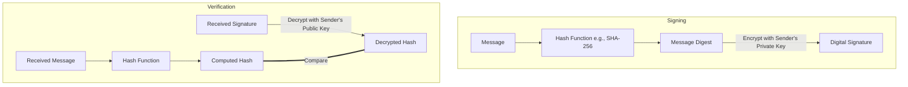

You are the Translation Critic Agent (Agent 4 - Specialized in Translation Quality Assurance). Your job is to strictly validate the translated academic MDX content against the original source content.
Source Language: English
Target Language: "ES"

Original MDX Content (JSX components shown as placeholders for fair comparison):
---
title: "4. The RSA Cryptosystem & Digital Signatures"
subject: "Computer_Science"
level: "L1"
module: "Asymmetric Cryptography"
order: 4
---

__JSX_SELF_Prerequisites_8__

# 4. The RSA Cryptosystem & Digital Signatures

While Diffie-Hellman revolutionized key exchange, it did not provide a general mechanism for encrypting files or signing documents. In 1977, Ron Rivest, Adi Shamir, and Leonard Adleman introduced **RSA**, the first fully realized public-key cryptosystem.

RSA relies on a different mathematical problem than Diffie-Hellman: the **computational difficulty of factoring the product of two large prime numbers**. In this lesson, we will dissect the elegant mathematics of RSA and understand how it forms the basis of both modern encryption and **digital signatures**.

__JSX_OPEN_Objectives_9__
  __JSX_OPEN_Knowledge_10__
    * State the prime factorization problem that secures the RSA algorithm.
    * Explain Euler's totient function \(\phi(n)\) and how it is used in RSA.
    * Describe the mathematical process of RSA key generation, encryption, and decryption.
    * Explain how digital signatures provide authenticity and non-repudiation.
  __JSX_CLOSE_Knowledge_0__
  __JSX_OPEN_Skills_11__
    * Calculate public and private RSA exponents for small prime factors.
    * Execute RSA encryption and decryption operations mathematically.
    * Use Euler's totient function to compute the number of coprimes of a number.
  __JSX_CLOSE_Skills_1__
  __JSX_OPEN_Attitudes_12__
    * Appreciate the simplicity and power of modular arithmetic in solving complex cryptographic goals.
    * Grasp the absolute necessity of choosing sufficiently large prime factors to prevent factoring attacks.
  __JSX_CLOSE_Attitudes_2__
__JSX_CLOSE_Objectives_3__

---

## The Mathematical Foundation: Prime Factorization

The mathematical security of RSA is based on the **Factoring Problem**. While it is computationally trivial to multiply two large prime numbers \(p\) and \(q\) to get a composite number \(n = pq\), it is extremely difficult to do the reverse: given a large composite number \(n\), finding its prime factors \(p\) and \(q\) is one of the hardest problems in computer science.

### Euler's Totient Function \(\phi(n)\)
Euler's totient function, \(\phi(n)\), measures the number of positive integers less than or equal to \(n\) that are relatively prime (coprime) to \(n\).

For any prime number \(p\):
\[\phi(p) = p - 1\]

Since the totient function is multiplicative, if \(n = pq\) is the product of two distinct primes \(p\) and \(q\), then:
\[\phi(n) = \phi(p)\phi(q) = (p-1)(q-1)\]

__JSX_ATTR_DiagnosticQuiz_13__  |||  |||  __JSX_END_13__

---

## The RSA Algorithm

RSA consists of three distinct phases: **Key Generation**, **Encryption**, and **Decryption**.

### 1. Key Generation
1. Select two distinct, massive prime numbers \(p\) and \(q\).
2. Compute their product:
   \[n = pq\]
   The number \(n\) is called the **modulus**.
3. Compute the totient:
   \[\phi(n) = (p-1)(q-1)\]
4. Choose an integer \(e\) (the **public exponent**) such that:
   \[1 < e < \phi(n) \quad \text{and} \quad \gcd(e, \phi(n)) = 1\]
   (Typically, \(e = 65537\) is chosen in real-world implementations).
5. Compute the secret exponent \(d\) (the **private exponent**) as the multiplicative inverse of \(e\) modulo \(\phi(n)\):
   \[d \equiv e^{-1} \pmod{\phi(n)}\]
   This is computed using the **Extended Euclidean Algorithm**, satisfying the relation:
   \[ed \equiv 1 \pmod{\phi(n)}\]

- **Public Key**: \((e, n)\)
- **Private Key**: \((d, n)\) (The prime factors \(p\) and \(q\) must also be securely destroyed).

### 2. Encryption
Given a plaintext message \(m\) represented as an integer such that \(0 \le m < n\), the ciphertext \(c\) is computed as:
\[c = m^e \pmod n\]

### 3. Decryption
Given a ciphertext \(c\), the plaintext \(m\) is recovered using the private exponent \(d\):
\[m = c^d \pmod n\]

### Proof of Correctness
The correctness of RSA is guaranteed by **Euler's Theorem**, which states that if \(\gcd(m, n) = 1\), then:
\[m^{\phi(n)} \equiv 1 \pmod n\]

Since \(ed \equiv 1 \pmod{\phi(n)}\), we can write \(ed = k\cdot\phi(n) + 1\) for some integer \(k\). Thus:
\[c^d \equiv (m^e)^d \equiv m^{ed} \equiv m^{k\cdot\phi(n) + 1} \equiv (m^{\phi(n)})^k \cdot m \equiv (1)^k \cdot m \equiv m \pmod n\]

---

## Interactive Code Sandbox: Run RSA Keygen

Below, execute a complete RSA key generation and message transmission trace using small prime numbers in Javascript.

__JSX_SELF_CodeSandbox_14__

---

__JSX_OPEN_SolvedExercise_15__
  **Problem:**
  Let \(p = 3\) and \(q = 11\).
  1. Calculate \(n\) and \(\phi(n)\).
  2. For \(e = 3\), compute the private exponent \(d\).
  3. Encrypt message \(m = 7\).
  4. Decrypt the resulting ciphertext to verify.

  **Solution:**
  1. Modulus and Totient:
     \[n = 3 \times 11 = 33\]
     \[\phi(n) = (3-1) \times (11-1) = 2 \times 10 = 20\]
  2. Compute Private Exponent \(d\):
     \[d \cdot e \equiv 1 \pmod{\phi(n)} \implies d \cdot 3 \equiv 1 \pmod{20}\]
     Since \(3 \times 7 = 21 \equiv 1 \pmod{20}\), the private exponent is:
     \[d = 7\]
  3. Encryption of \(m = 7\):
     \[c = m^e \pmod n = 7^3 \pmod{33} = 343 \pmod{33}\]
     Dividing 343 by 33 gives 10 with a remainder of 13. Thus:
     \[c = 13\]
  4. Decryption of \(c = 13\):
     \[m' = c^d \pmod n = 13^7 \pmod{33}\]
     Let's compute \(13^7 \pmod{33}\) using modular squares:
     - \(13^1 \equiv 13 \pmod{33}\)
     - \(13^2 = 169 \equiv 4 \pmod{33}\)
     - \(13^4 \equiv 4^2 \equiv 16 \pmod{33}\)
     - \(13^7 = 13^4 \times 13^2 \times 13^1 = 16 \times 4 \times 13 = 832\)
     - \(832 = 33 \times 25 + 7 \equiv 7 \pmod{33}\).

  The decrypted message is \(m' = 7\), matching the original message.
__JSX_CLOSE_SolvedExercise_4__

---

## Digital Signatures: Integrity and Authenticity

Asymmetric cryptography can also be used in reverse to create **Digital Signatures**, providing **integrity** (proving the message has not been altered) and **non-repudiation** (proving the sender actually sent it).

Instead of encrypting with the recipient's public key, the sender **encrypts a hash of the message with their own private key**.

### The Signing and Verification Process

If the decrypted hash matches the computed hash of the received message, the signature is valid. This mathematically proves that the message was written by the owner of the private key and has not been altered in transit!

---

## Unsolved Exercise: Challenge Question
Test your understanding of Euler's totient mathematics.

__JSX_SELF_UnsolvedExercise_16__

---

__JSX_OPEN_Quiz_17__
  __JSX_ATTR_Question_18__ If Alice wants to encrypt a message to Bob AND sign it to prove she is the sender, what is the correct key sequence? ||| Alice first signs the message with her own private key (authenticity), and then encrypts the message + signature with Bob's public key (confidentiality). Only Bob can decrypt it, and Bob uses Alice's public key to verify the signature. __JSX_END_18__
  __JSX_ATTR_Option_19__ Encrypt with Bob's private key, then sign with Alice's public key. __JSX_END_19__
  __JSX_ATTR_Option_20__ Sign with Alice's private key, then encrypt with Bob's public key. __JSX_END_20__
  __JSX_ATTR_Option_21__ Encrypt with Bob's public key, then sign with Bob's private key. __JSX_END_21__
  __JSX_ATTR_Option_22__ Sign with Alice's public key, then encrypt with Alice's private key. __JSX_END_22__
__JSX_CLOSE_Question_5__
__JSX_CLOSE_Quiz_6__

---

## Card Sort: RSA Parameters

Match the RSA parameters with their roles.

__JSX_SELF_CardSort_23__

---

__JSX_ATTR_Summary_24__  __JSX_END_24__

__JSX_SELF_WhatsNext_25__

__JSX_OPEN_References_26__
  * **Rivest, R. L., Shamir, A., & Adleman, L.** (1978). *A Method for Obtaining Digital Signatures and Public-Key Cryptosystems*. Communications of the ACM.
  * **Stinson, D. R.** (2006). *Cryptography: Theory and Practice*. CRC Press.
__JSX_CLOSE_References_7__

Translated MDX Content (JSX components shown as placeholders for fair comparison):
title: "4. El Criptosistema RSA y Firmas Digitales"
subject: "Ciencias_de_la_Computación"
level: "L1"
module: "Criptografía Asimétrica"
order: 4
---

__JSX_SELF_Prerequisites_8__

# 4. El Criptosistema RSA y Firmas Digitales

Aunque Diffie-Hellman revolucionó el intercambio de claves, no proporcionó un mecanismo general para cifrar archivos o firmar documentos. En 1977, Ron Rivest, Adi Shamir y Leonard Adleman introdujeron **RSA**, el primer criptosistema de clave pública completamente realizado.

RSA se basa en un problema matemático diferente al de Diffie-Hellman: la **dificultad computacional de factorizar el producto de dos números primos grandes**. En esta lección, analizaremos las elegantes matemáticas de RSA y comprenderemos cómo forma la base tanto del cifrado moderno como de las **firmas digitales**.

__JSX_OPEN_Objectives_9__
  __JSX_OPEN_Knowledge_10__
    * Enunciar el problema de factorización prima que asegura el algoritmo RSA.
    * Explicar la función totiente de Euler \(\phi(n)\) y cómo se utiliza en RSA.
    * Describir el proceso matemático de generación de claves, cifrado y descifrado de RSA.
    * Explicar cómo las firmas digitales proporcionan autenticidad y no repudio.
  __JSX_CLOSE_Knowledge_0__
  __JSX_OPEN_Skills_11__
    * Calcular los exponentes RSA públicos y privados para factores primos pequeños.
    * Ejecutar operaciones de cifrado y descifrado RSA matemáticamente.
    * Usar la función totiente de Euler para calcular el número de coprimos de un número.
  __JSX_CLOSE_Skills_1__
  __JSX_OPEN_Attitudes_12__
    * Apreciar la simplicidad y el poder de la aritmética modular para resolver objetivos criptográficos complejos.
    * Comprender la necesidad absoluta de elegir factores primos suficientemente grandes para prevenir ataques de factorización.
  __JSX_CLOSE_Attitudes_2__
__JSX_CLOSE_Objectives_3__

---
## El Fundamento Matemático: Factorización Prima

La seguridad matemática de RSA se basa en el **Problema de la Factorización**. Si bien es computacionalmente trivial multiplicar dos números primos grandes \(p\) y \(q\) para obtener un número compuesto \(n = pq\), es extremadamente difícil hacer lo contrario: dado un número compuesto grande \(n\), encontrar sus factores primos \(p\) y \(q\) es uno de los problemas más difíciles en ciencias de la computación.

### Función Totiente de Euler \(\phi(n)\)
La función totiente de Euler, \(\phi(n)\), mide el número de enteros positivos menores o iguales a \(n\) que son primos relativos (coprimos) a \(n\).

Para cualquier número primo \(p\):
\[\phi(p) = p - 1\]

Dado que la función totiente es multiplicativa, si \(n = pq\) es el producto de dos primos distintos \(p\) y \(q\), entonces:
\[\phi(n) = \phi(p)\phi(q) = (p-1)(q-1)\]

__JSX_ATTR_DiagnosticQuiz_13__  |||  |||  __JSX_END_13__

---
## El Algoritmo RSA

RSA consta de tres fases distintas: **Generación de Claves**, **Cifrado** y **Descifrado**.

### 1. Generación de Claves
1. Seleccione dos números primos distintos y grandes \(p\) y \(q\).
2. Calcule su producto:
   \[n = pq\]
   El número \(n\) se llama **módulo**.
3. Calcule el totiente:
   \[\phi(n) = (p-1)(q-1)\]
4. Elija un entero \(e\) (el **exponente público**) tal que:
   \[1 < e < \phi(n) \quad \text{and} \quad \gcd(e, \phi(n)) = 1\]
   (Típicamente, se elige \(e = 65537\) en implementaciones del mundo real).
5. Calcule el exponente secreto \(d\) (el **exponente privado**) como el inverso multiplicativo de \(e\) módulo \(\phi(n)\):
   \[d \equiv e^{-1} \pmod{\phi(n)}\]
   Esto se calcula utilizando el **Algoritmo Extendido de Euclides**, satisfaciendo la relación:
   \[ed \equiv 1 \pmod{\phi(n)}\]

- **Clave Pública**: \((e, n)\)
- **Clave Privada**: \((d, n)\) (Los factores primos \(p\) y \(q\) también deben ser destruidos de forma segura).

### 2. Cifrado
Dado un mensaje en texto plano \(m\) representado como un entero tal que \(0 \le m < n\), el texto cifrado \(c\) se calcula como:
\[c = m^e \pmod n\]

### 3. Descifrado
Dado un texto cifrado \(c\), el texto plano \(m\) se recupera utilizando el exponente privado \(d\):
\[m = c^d \pmod n\]

### Prueba de Correctitud
La correctitud de RSA está garantizada por el **Teorema de Euler**, que establece que si \(\gcd(m, n) = 1\), entonces:
\[m^{\phi(n)} \equiv 1 \pmod n\]

Dado que \(ed \equiv 1 \pmod{\phi(n)}\), podemos escribir \(ed = k\cdot\phi(n) + 1\) para algún entero \(k\). Así:
\[c^d \equiv (m^e)^d \equiv m^{ed} \equiv m^{k\cdot\phi(n) + 1} \equiv (m^{\phi(n)})^k \cdot m \equiv (1)^k \cdot m \equiv m \pmod n\]

---
## Sandbox de Código Interactivo: Ejecutar Generación de Claves RSA

A continuación, ejecute un seguimiento completo de la generación de claves RSA y la transmisión de mensajes utilizando números primos pequeños en Javascript.

__JSX_SELF_CodeSandbox_14__

---

__JSX_OPEN_SolvedExercise_15__
  **Problema:**
  Sean \(p = 3\) y \(q = 11\).
  1. Calcule \(n\) y \(\phi(n)\).
  2. Para \(e = 3\), calcule el exponente privado \(d\).
  3. Cifre el mensaje \(m = 7\).
  4. Descifre el texto cifrado resultante para verificar.

  **Solución:**
  1. Módulo y Totiente:
     \[n = 3 \times 11 = 33\]
     \[\phi(n) = (3-1) \times (11-1) = 2 \times 10 = 20\]
  2. Calcule el Exponente Privado \(d\):
     \[d \cdot e \equiv 1 \pmod{\phi(n)} \implies d \cdot 3 \equiv 1 \pmod{20}\]
     Dado que \(3 \times 7 = 21 \equiv 1 \pmod{20}\), el exponente privado es:
     \[d = 7\]
  3. Cifrado de \(m = 7\):
     \[c = m^e \pmod n = 7^3 \pmod{33} = 343 \pmod{33}\]
     Dividir 343 entre 33 da 10 con un resto de 13. Por lo tanto:
     \[c = 13\]
  4. Descifrado de \(c = 13\):
     \[m' = c^d \pmod n = 13^7 \pmod{33}\]
     Calculemos \(13^7 \pmod{33}\) usando cuadrados modulares:
     - \(13^1 \equiv 13 \pmod{33}\)
     - \(13^2 = 169 \equiv 4 \pmod{33}\)
     - \(13^4 \equiv 4^2 \equiv 16 \pmod{33}\)
     - \(13^7 = 13^4 \times 13^2 \times 13^1 = 16 \times 4 \times 13 = 832\)
     - \(832 = 33 \times 25 + 7 \equiv 7 \pmod{33}\).

  El mensaje descifrado es \(m' = 7\), coincidiendo con el mensaje original.
__JSX_CLOSE_SolvedExercise_4__
## Firmas Digitales: Integridad y Autenticidad

La criptografía asimétrica también puede usarse a la inversa para crear **Firmas Digitales**, proporcionando **integridad** (demostrando que el mensaje no ha sido alterado) y **no repudio** (demostrando que el remitente realmente lo envió).

En lugar de cifrar con la clave pública del destinatario, el remitente **cifra un hash del mensaje con su propia clave privada**.

### El Proceso de Firma y Verificación

Si el hash descifrado coincide con el hash calculado del mensaje recibido, la firma es válida. ¡Esto prueba matemáticamente que el mensaje fue escrito por el propietario de la clave privada y no ha sido alterado en tránsito!

---
## Ejercicio sin resolver: Pregunta de desafío
Pon a prueba tu comprensión de las matemáticas de la función totiente de Euler.

__JSX_SELF_UnsolvedExercise_16__

---

__JSX_OPEN_Quiz_17__
  __JSX_ATTR_Question_18__ ¿Si Alice quiere cifrar un mensaje para Bob Y firmarlo para probar que ella es la remitente, cuál es la secuencia de claves correcta? ||| Alice primero firma el mensaje con su propia clave privada (autenticidad), y luego cifra el mensaje + firma con la clave pública de Bob (confidencialidad). Solo Bob puede descifrarlo, y Bob usa la clave pública de Alice para verificar la firma. __JSX_END_18__
  __JSX_ATTR_Option_19__ Cifrar con la clave privada de Bob, luego firmar con la clave pública de Alice. __JSX_END_19__
  __JSX_ATTR_Option_20__ Firmar con la clave privada de Alice, luego cifrar con la clave pública de Bob. __JSX_END_20__
  __JSX_ATTR_Option_21__ Cifrar con la clave pública de Bob, luego firmar con la clave privada de Bob. __JSX_END_21__
  __JSX_ATTR_Option_22__ Firmar con la clave pública de Alice, luego cifrar con la clave privada de Alice. __JSX_END_22__
__JSX_CLOSE_Question_5__
__JSX_CLOSE_Quiz_6__

---
## Clasificación de Tarjetas: Parámetros RSA

Empareja los parámetros RSA con sus roles.

__JSX_SELF_CardSort_23__

---

__JSX_ATTR_Summary_24__  __JSX_END_24__

__JSX_SELF_WhatsNext_25__

__JSX_OPEN_References_26__
  * **Rivest, R. L., Shamir, A., & Adleman, L.** (1978). *A Method for Obtaining Digital Signatures and Public-Key Cryptosystems*. Communications of the ACM.
  * **Stinson, D. R.** (2006). *Cryptography: Theory and Practice*. CRC Press.
__JSX_CLOSE_References_7__

Your validation checklist:
1. Academic Integrity: Is the scientific/academic depth, tone, and accuracy of the original content fully preserved?
2. MDX Components Preservation: Are all MDX elements (like <Quiz>, <Question>, <Option>, <Glossary>, <Video>, <Audio>, <FillInBlanks>, <SolvedProblem>, 
, <SelfEval>, <HistoricalPerson>, <Location>, <Place>, <EntityLink>, <EssayEvaluation>, <OpenQuestion>, <ScientificDebate>, <SpeciesLink>, <ChemicalLink>, <CelestialLink>, etc.) completely present with all their JSX tags and properties intact? Do NOT generate empty components like <CriticalThinking />, <WhatsNext />, <OpenQuestion />, or <ScientificDebate /> without text/children. Do NOT nest wrapper components (e.g. nesting <WhatsNext> inside itself is strictly forbidden).
3. Custom attributes: For <Glossary>, are term/definition translated? For <HistoricalPerson>, are name/lang translated/updated? For <EssayEvaluation>, are prompt/subject translated? Are other properties (like durations, options, gradingSystem, IDs, itemsBase64 payloads) preserved exactly as in the original?
4. Formulas and Code: Are all Math equations ($...$ or $...$) and code blocks kept exactly as they were, untranslated?
5. Zero Translator Commentary: Did the translator introduce any notes, prefixes, or meta-conversational lines (e.g. "Here is the translation:")? If so, reject it.
6. Zero placeholders: Are there any placeholders or unfinished sections?
7. Assessment Integrity: Ensure all translated interactive assessments (<Quiz>, <Question>, <Option>, <DiagnosticQuiz>, <EssayEvaluation>, <UnsolvedExercise>) are complete, fully populated with high-quality, non-empty text matching the target course level, length, and complexity of the subject, and verify that the translation has not broken correct option attributes (e.g. "correct" prop on <Option>, or "correctIndex" on <DiagnosticQuiz>).
8. Academic References and Figure Sources: Do NOT expect or request translation of academic references, book/article/publication titles, author names, or citation texts inside <References> components or itemsBase64 attributes. These must remain exactly as they are in the original to preserve citation integrity.
9. Immutability of Citations and Sources: Verify that "Source:" prefixes and associated bibliographic links/attributions in figure captions or narrative text remain exactly in their original language (typically English) and have not been translated. Verify that quotes (lines starting with '>') have the quote translated to the target course language, followed by its original version in brackets (e.g. `[Original: "Original quote..."]`) if different from the target course language. Ensure that if the target course language matches the quote's original language, only one quote exists (no brackets or duplication). Ensure all citation details (author, book, publisher, etc. after the '—' dash) remain untranslated. Reject the translation if bibliographic citations, original quote blocks, reference metadata, or book titles are translated.

You must output ONLY a valid JSON object matching this structure:
{
  "approved": true or false,
  "critique": "If not approved, explain exactly what is wrong/missing/broken so the translator can correct it. If approved, keep this empty."
}

[REJECT-ONLY REPORTING MANDATE]
If the translation is approved, you MUST set approved: true, and critique: "". You must ONLY report failures/issues. Do not write any explanations or critique if the translation is approved.