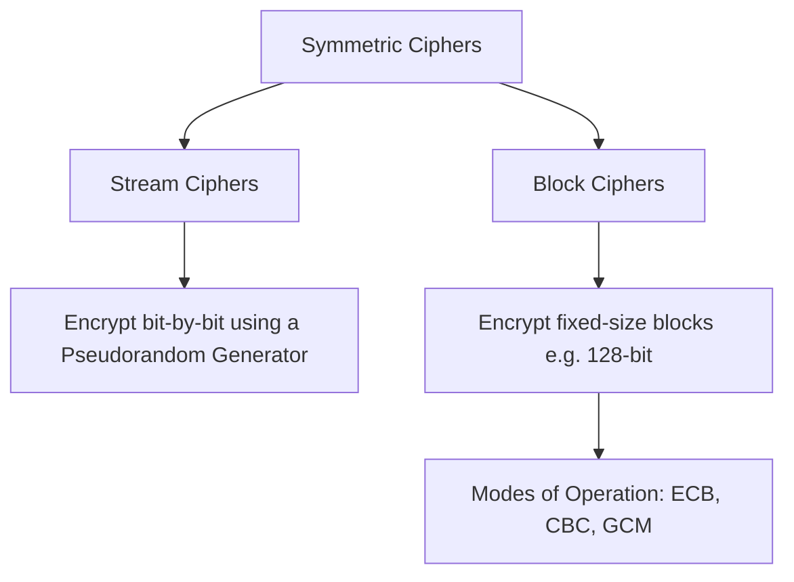
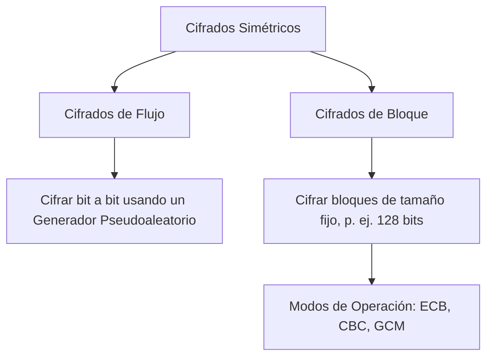

You are the Translation Critic Agent (Agent 4 - Specialized in Translation Quality Assurance). Your job is to strictly validate the translated academic MDX content against the original source content.
Source Language: English
Target Language: "ES"

Original MDX Content (JSX components shown as placeholders for fair comparison):
---
title: "2. Symmetric Encryption & Entropy"
subject: "Computer_Science"
level: "L1"
module: "Symmetric Encryption & Foundations"
order: 2
---

__JSX_SELF_Prerequisites_7__

# 2. Symmetric Encryption & Entropy

Symmetric cryptography represents the workhorse of modern communications. Unlike classical shift and substitution schemes, modern symmetric ciphers operate on bits rather than alphabetic letters, and are backed by rigorous information-theoretic or complexity-theoretic security claims.

In this lesson, we will explore the boundaries of information security. We will mathematically analyze the only cipher that achieves **perfect secrecy**—the One-Time Pad—and study how practical modern symmetric algorithms like the **Advanced Encryption Standard (AES)** balance efficiency and security in the real world.

__JSX_OPEN_Objectives_8__
  __JSX_OPEN_Knowledge_9__
    * Define Shannon Entropy and its relevance to cryptographic uncertainty.
    * Explain the concept of perfect secrecy and prove it mathematically for the One-Time Pad.
    * Contrast stream ciphers and block ciphers.
    * Understand the structural layout of the Advanced Encryption Standard (AES).
  __JSX_CLOSE_Knowledge_0__
  __JSX_OPEN_Skills_10__
    * Compute Shannon entropy for a given probability distribution of messages.
    * Perform bitwise exclusive-OR (XOR) operations for encryption and decryption.
    * Contrast block cipher modes of operation (ECB vs. CBC).
  __JSX_CLOSE_Skills_1__
  __JSX_OPEN_Attitudes_11__
    * Appreciate the elegant synthesis of information theory and computer science.
    * Recognize why security rests on key secrecy rather than algorithm secrecy (Kerckhoffs's Principle).
  __JSX_CLOSE_Attitudes_2__
__JSX_CLOSE_Objectives_3__

---

## Shannon Entropy and Information Theory

Claude Shannon, the father of information theory, introduced the concept of **information entropy** in 1948. Entropy measures the average amount of uncertainty or surprise in a random variable.

### Mathematical Definition
Let \(X\) be a discrete random variable with a finite alphabet \(\mathcal{X}\) and probability mass function \(P(X)\). The Shannon entropy \(H(X)\) in bits is defined as:
\[H(X) = -\sum_{x \in \mathcal{X}} P(X=x) \log_2 P(X=x)\]

If a message is completely predictable, its entropy is 0. If it is a uniformly distributed random choice of \(N\) possibilities, its entropy is \(\log_2(N)\).

__JSX_ATTR_DiagnosticQuiz_12__  |||  |||  __JSX_END_12__

---

## The One-Time Pad and Perfect Secrecy

The One-Time Pad (OTP) was patented by Gilbert Vernam in 1919. It is the only cryptographic system that is mathematically unbreakable, achieving what Shannon termed **perfect secrecy**.

### Mathematical Proof of Perfect Secrecy
An encryption scheme has **perfect secrecy** if the probability distribution of the plaintext is completely independent of the ciphertext. Mathematically, for all messages \(m \in \mathcal{M}\) and ciphertexts \(c \in \mathcal{C}\):
\[P(M = m \mid C = c) = P(M = m)\]

In other words, intercepting the ciphertext gives Eve exactly **zero** new information about the original message, even if Eve has infinite computing power.

### Mechanism of the One-Time Pad
The One-Time Pad operates on binary strings. Given a plaintext \(m \in \{0, 1\}^n\) and a key \(k \in \{0, 1\}^n\) chosen uniformly at random, the encryption is:
\[c = m \oplus k\]
where \(\oplus\) represents the bitwise exclusive-OR (XOR) operator. Decryption is identical:
\[m = c \oplus k\]

### XOR Truth Table
| \(A\) | \(B\) | \(A \oplus B\) |
| :---: | :---: | :------------: |
| 0 | 0 | 0 |
| 0 | 1 | 1 |
| 1 | 0 | 1 |
| 1 | 1 | 0 |

__JSX_SELF_SocraticInput_13__

---

## Modern Symmetric Encryption: Stream vs. Block

Because the One-Time Pad requires a key that is at least as long as the message and can never be reused, it is highly impractical for daily internet use. Modern symmetric cryptography relies on two major design architectures.

### 1. Stream Ciphers
Stream ciphers mimic the One-Time Pad by generating a long, pseudorandom keystream from a short, fixed-length seed key. Encryption is performed by XORing the plaintext stream with this keystream. (e.g., RC4, ChaCha20).

### 2. Block Ciphers
Block ciphers split the plaintext into fixed-size blocks (usually 128 bits) and encrypt each block as a unit using a complex, iterative mathematical function. The most famous block cipher is **AES**.

---

## The Advanced Encryption Standard (AES)

AES, selected by NIST in 2001 after a global competition, is based on a **Substitution-Permutation Network (SPN)**. It operates on a \(4 \times 4\) column-major order matrix of bytes, termed the *state*.

### The Four Steps of an AES Round
AES-128 performs 10 rounds of four mathematical transformations:
1. **SubBytes**: A non-linear byte substitution using a mathematically optimized lookup table (S-Box) to achieve confusion.
2. **ShiftRows**: A transposition step where the last three rows of the state matrix are cyclically shifted to achieve diffusion.
3. **MixColumns**: A linear mixing operation operating on the columns of the state, using matrix multiplication in Galois Field \(GF(2^8)\).
4. **AddRoundKey**: A simple XOR of the state with a round key derived from the master key.

---

## Block Cipher Modes of Operation

Because block ciphers encrypt fixed-size blocks (e.g., 128 bits), we need a **Mode of Operation** to handle messages of arbitrary lengths.

### Electronic Codebook (ECB) Mode
In ECB mode, each block is encrypted independently with the same key:
\[c_i = E(p_i, k)\]
**WARNING: ECB is highly insecure.** If two plaintext blocks are identical, their ciphertexts will be identical, preserving visual patterns (the classic "AES Penguin" vulnerability).

### Cipher Block Chaining (CBC) Mode
To prevent ECB's vulnerability, CBC mode XORs each plaintext block with the previous ciphertext block before encryption, using an **Initialization Vector (IV)** for the first block:
\[c_i = E(p_i \oplus c_{i-1}, k)\]

__JSX_OPEN_Quiz_14__
  __JSX_ATTR_Question_15__ Which block cipher mode allows parallel encryption of blocks? ||| CTR (Counter) mode encrypts counter values and XORs them with the plaintext, meaning each block is independent and can be encrypted in parallel. CBC requires the previous ciphertext block, making encryption strictly sequential. __JSX_END_15__
  __JSX_ATTR_Option_16__ Cipher Block Chaining (CBC) mode __JSX_END_16__
  __JSX_ATTR_Option_17__ Electronic Codebook (ECB) and Counter (CTR) modes __JSX_END_17__
  __JSX_ATTR_Option_18__ Output Feedback (OFB) mode __JSX_END_18__
  __JSX_ATTR_Option_19__ Cipher Feedback (CFB) mode __JSX_END_19__
__JSX_CLOSE_Question_4__
__JSX_CLOSE_Quiz_5__

---

## Card Sort: Symmetric Concepts Match

Match the modern symmetric encryption terms with their descriptions.

__JSX_SELF_CardSort_20__

---

__JSX_ATTR_Summary_21__  __JSX_END_21__

__JSX_SELF_WhatsNext_22__

__JSX_OPEN_References_23__
  * **Shannon, C. E.** (1948). *A Mathematical Theory of Communication*. Bell System Technical Journal.
  * **Daemen, J., & Rijmen, V.** (2002). *The Design of Rijndael: AES - The Advanced Encryption Standard*. Springer-Verlag.
__JSX_CLOSE_References_6__

Translated MDX Content (JSX components shown as placeholders for fair comparison):
---
title: "2. Cifrado Simétrico y Entropía"
subject: "Computer_Science"
level: "L1"
module: "Cifrado Simétrico y Fundamentos"
order: 2
---

__JSX_SELF_Prerequisites_7__

# 2. Cifrado Simétrico y Entropía

La criptografía simétrica representa el caballo de batalla de las comunicaciones modernas. A diferencia de los esquemas clásicos de desplazamiento y sustitución, los cifrados simétricos modernos operan con bits en lugar de letras alfabéticas, y están respaldados por rigurosas afirmaciones de seguridad basadas en la teoría de la información o la teoría de la complejidad.

En esta lección, exploraremos los límites de la seguridad de la información. Analizaremos matemáticamente el único cifrado que logra la **seguridad perfecta**—el One-Time Pad—y estudiaremos cómo los algoritmos simétricos modernos y prácticos, como el **Estándar de Cifrado Avanzado (AES)**, equilibran la eficiencia y la seguridad en el mundo real.

__JSX_OPEN_Objectives_8__
  __JSX_OPEN_Knowledge_9__
    * Definir la Entropía de Shannon y su relevancia para la incertidumbre criptográfica.
    * Explicar el concepto de seguridad perfecta y demostrarlo matemáticamente para el One-Time Pad.
    * Contrastar los cifrados de flujo y los cifrados de bloque.
    * Comprender la estructura del Estándar de Cifrado Avanzado (AES).
  __JSX_CLOSE_Knowledge_0__
  __JSX_OPEN_Skills_10__
    * Calcular la entropía de Shannon para una distribución de probabilidad de mensajes dada.
    * Realizar operaciones bit a bit de OR exclusivo (XOR) para cifrado y descifrado.
    * Contrastar los modos de operación de cifrado por bloques (ECB vs. CBC).
  __JSX_CLOSE_Skills_1__
  __JSX_OPEN_Attitudes_11__
    * Apreciar la elegante síntesis de la teoría de la información y la informática.
    * Reconocer por qué la seguridad se basa en el secreto de la clave y no en el secreto del algoritmo (Principio de Kerckhoffs).
  __JSX_CLOSE_Attitudes_2__
__JSX_CLOSE_Objectives_3__
## Entropía de Shannon y Teoría de la Información

Claude Shannon, el padre de la teoría de la información, introdujo el concepto de **entropía de la información** en 1948. La entropía mide la cantidad promedio de incertidumbre o sorpresa en una variable aleatoria.

### Definición Matemática
Sea \(X\) una variable aleatoria discreta con un alfabeto finito \(\mathcal{X}\) y función de masa de probabilidad \(P(X)\). La entropía de Shannon \(H(X)\) en bits se define como:
\[H(X) = -\sum_{x \in \mathcal{X}} P(X=x) \log_2 P(X=x)\]

Si un mensaje es completamente predecible, su entropía es 0. Si es una elección aleatoria uniformemente distribuida de \(N\) posibilidades, su entropía es \(\log_2(N)\).

__JSX_ATTR_DiagnosticQuiz_12__  |||  |||  __JSX_END_12__

---
## El One-Time Pad y la Secrecía Perfecta

El One-Time Pad (OTP) fue patentado por Gilbert Vernam en 1919. Es el único sistema criptográfico que es matemáticamente irrompible, logrando lo que Shannon denominó **secrecía perfecta**.

### Prueba Matemática de la Secrecía Perfecta
Un esquema de cifrado tiene **secrecía perfecta** si la distribución de probabilidad del texto plano es completamente independiente del texto cifrado. Matemáticamente, para todos los mensajes \(m \in \mathcal{M}\) y textos cifrados \(c \in \mathcal{C}\):
\[P(M = m \mid C = c) = P(M = m)\]

En otras palabras, interceptar el texto cifrado le da a Eve exactamente **cero** información nueva sobre el mensaje original, incluso si Eve tiene una capacidad de cómputo infinita.

### Mecanismo del One-Time Pad
El One-Time Pad opera con cadenas binarias. Dado un texto plano \(m \in \{0, 1\}^n\) y una clave \(k \in \{0, 1\}^n\) elegida uniformemente al azar, el cifrado es:
\[c = m \oplus k\]
donde \(\oplus\) representa el operador OR exclusivo (XOR) a nivel de bits. El descifrado es idéntico:
\[m = c \oplus k\]

### Tabla de Verdad XOR
| \(A\) | \(B\) | \(A \oplus B\) |
| :---: | :---: | :------------: |
| 0 | 0 | 0 |
| 0 | 1 | 1 |
| 1 | 0 | 1 |
| 1 | 1 | 0 |

__JSX_SELF_SocraticInput_13__

---
## Cifrado Simétrico Moderno: Flujo vs. Bloque

Dado que la Libreta de Un Solo Uso (One-Time Pad) requiere una clave que sea al menos tan larga como el mensaje y nunca pueda reutilizarse, es muy poco práctica para el uso diario de internet. La criptografía simétrica moderna se basa en dos arquitecturas de diseño principales.

### 1. Cifrados de Flujo
Los cifrados de flujo imitan la Libreta de Un Solo Uso (One-Time Pad) generando una secuencia de clave pseudoaleatoria larga a partir de una clave semilla corta y de longitud fija. El cifrado se realiza aplicando XOR a la secuencia de texto plano con esta secuencia de clave. (p. ej., RC4, ChaCha20).

### 2. Cifrados de Bloque
Los cifrados de bloque dividen el texto plano en bloques de tamaño fijo (normalmente 128 bits) y cifran cada bloque como una unidad utilizando una función matemática compleja e iterativa. El cifrado de bloque más famoso es **AES**.

---
## El Estándar de Cifrado Avanzado (AES)

AES, seleccionado por el NIST en 2001 después de una competición global, se basa en una **Red de Sustitución-Permutación (SPN)**. Opera sobre una matriz de bytes de \(4 \times 4\) en orden principal por columnas, denominada el *estado*.

### Los Cuatro Pasos de una Ronda AES
AES-128 realiza 10 rondas de cuatro transformaciones matemáticas:
1.  **SubBytes**: Una sustitución de bytes no lineal utilizando una tabla de búsqueda (S-Box) optimizada matemáticamente para lograr confusión.
2.  **ShiftRows**: Un paso de transposición donde las últimas tres filas de la matriz de estado se desplazan cíclicamente para lograr difusión.
3.  **MixColumns**: Una operación de mezcla lineal que opera sobre las columnas del estado, utilizando multiplicación de matrices en el Campo de Galois \(GF(2^8)\).
4.  **AddRoundKey**: Una simple operación XOR del estado con una clave de ronda derivada de la clave maestra.

---
## Modos de Operación de Cifrado por Bloques

Dado que los cifradores por bloques cifran bloques de tamaño fijo (por ejemplo, 128 bits), necesitamos un **Modo de Operación** para manejar mensajes de longitudes arbitrarias.

### Modo Libro de Códigos Electrónico (ECB)
En el modo ECB, cada bloque se cifra de forma independiente con la misma clave:
\[c_i = E(p_i, k)\]
**ADVERTENCIA: ECB es altamente inseguro.** Si dos bloques de texto plano son idénticos, sus textos cifrados serán idénticos, preservando patrones visuales (la clásica vulnerabilidad del "Pingüino AES").

### Modo Encadenamiento de Bloques de Cifrado (CBC)
Para prevenir la vulnerabilidad de ECB, el modo CBC aplica una operación XOR a cada bloque de texto plano con el bloque de texto cifrado anterior antes del cifrado, utilizando un **Vector de Inicialización (IV)** para el primer bloque:
\[c_i = E(p_i \oplus c_{i-1}, k)\]

__JSX_OPEN_Quiz_14__
  __JSX_ATTR_Question_15__ ¿Qué modo de cifrado por bloques permite el cifrado paralelo de bloques? ||| El modo CTR (Contador) cifra valores de contador y los combina con el texto plano mediante XOR, lo que significa que cada bloque es independiente y puede cifrarse en paralelo. CBC requiere el bloque de texto cifrado anterior, lo que hace que el cifrado sea estrictamente secuencial. __JSX_END_15__
  __JSX_ATTR_Option_16__ Modo Encadenamiento de Bloques de Cifrado (CBC) __JSX_END_16__
  __JSX_ATTR_Option_17__ Modos Libro de Códigos Electrónico (ECB) y Contador (CTR) __JSX_END_17__
  __JSX_ATTR_Option_18__ Modo Retroalimentación de Salida (OFB) __JSX_END_18__
  __JSX_ATTR_Option_19__ Modo Retroalimentación de Cifrado (CFB) __JSX_END_19__
__JSX_CLOSE_Question_4__
__JSX_CLOSE_Quiz_5__

---
## Clasificación de Tarjetas: Coincidencia de Conceptos Simétricos

Empareja los términos modernos de cifrado simétrico con sus descripciones.

__JSX_SELF_CardSort_20__

---

__JSX_ATTR_Summary_21__  __JSX_END_21__

__JSX_SELF_WhatsNext_22__

__JSX_OPEN_References_23__
  * **Shannon, C. E.** (1948). *A Mathematical Theory of Communication*. Bell System Technical Journal.
  * **Daemen, J., & Rijmen, V.** (2002). *The Design of Rijndael: AES - The Advanced Encryption Standard*. Springer-Verlag.
__JSX_CLOSE_References_6__

Your validation checklist:
1. Academic Integrity: Is the scientific/academic depth, tone, and accuracy of the original content fully preserved?
2. MDX Components Preservation: Are all MDX elements (like <Quiz>, <Question>, <Option>, <Glossary>, <Video>, <Audio>, <FillInBlanks>, <SolvedProblem>, 
, <SelfEval>, <HistoricalPerson>, <Location>, <Place>, <EntityLink>, <EssayEvaluation>, <OpenQuestion>, <ScientificDebate>, <SpeciesLink>, <ChemicalLink>, <CelestialLink>, etc.) completely present with all their JSX tags and properties intact? Do NOT generate empty components like <CriticalThinking />, <WhatsNext />, <OpenQuestion />, or <ScientificDebate /> without text/children. Do NOT nest wrapper components (e.g. nesting <WhatsNext> inside itself is strictly forbidden).
3. Custom attributes: For <Glossary>, are term/definition translated? For <HistoricalPerson>, are name/lang translated/updated? For <EssayEvaluation>, are prompt/subject translated? Are other properties (like durations, options, gradingSystem, IDs, itemsBase64 payloads) preserved exactly as in the original?
4. Formulas and Code: Are all Math equations ($...$ or $...$) and code blocks kept exactly as they were, untranslated?
5. Zero Translator Commentary: Did the translator introduce any notes, prefixes, or meta-conversational lines (e.g. "Here is the translation:")? If so, reject it.
6. Zero placeholders: Are there any placeholders or unfinished sections?
7. Assessment Integrity: Ensure all translated interactive assessments (<Quiz>, <Question>, <Option>, <DiagnosticQuiz>, <EssayEvaluation>, <UnsolvedExercise>) are complete, fully populated with high-quality, non-empty text matching the target course level, length, and complexity of the subject, and verify that the translation has not broken correct option attributes (e.g. "correct" prop on <Option>, or "correctIndex" on <DiagnosticQuiz>).
8. Academic References and Figure Sources: Do NOT expect or request translation of academic references, book/article/publication titles, author names, or citation texts inside <References> components or itemsBase64 attributes. These must remain exactly as they are in the original to preserve citation integrity.
9. Immutability of Citations and Sources: Verify that "Source:" prefixes and associated bibliographic links/attributions in figure captions or narrative text remain exactly in their original language (typically English) and have not been translated. Verify that quotes (lines starting with '>') have the quote translated to the target course language, followed by its original version in brackets (e.g. `[Original: "Original quote..."]`) if different from the target course language. Ensure that if the target course language matches the quote's original language, only one quote exists (no brackets or duplication). Ensure all citation details (author, book, publisher, etc. after the '—' dash) remain untranslated. Reject the translation if bibliographic citations, original quote blocks, reference metadata, or book titles are translated.

You must output ONLY a valid JSON object matching this structure:
{
  "approved": true or false,
  "critique": "If not approved, explain exactly what is wrong/missing/broken so the translator can correct it. If approved, keep this empty."
}

[REJECT-ONLY REPORTING MANDATE]
If the translation is approved, you MUST set approved: true, and critique: "". You must ONLY report failures/issues. Do not write any explanations or critique if the translation is approved.