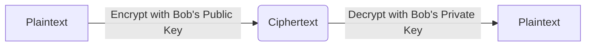

You are a professional academic translator. The Translation Critic Agent has rejected your previous translation with the following critique:

CRITIQUE FROM TRANSLATION CRITIC:
All JSX component IDs have been systematically decremented by 1 compared to the original content. For example, `__JSX_SELF_Prerequisites_8__` became `__JSX_SELF_Prerequisites_7__`, `__JSX_OPEN_Objectives_9__` became `__JSX_OPEN_Objectives_8__`, and so on for all components. All JSX component IDs must be preserved exactly as they are in the original MDX content.

Original MDX Content to Translate:
---
title: "3. Public Key Cryptography & Key Exchange"
subject: "Computer_Science"
level: "L1"
module: "Asymmetric Cryptography"
order: 3
---

__JSX_SELF_Prerequisites_8__

# 3. Public Key Cryptography & Key Exchange

Symmetric cryptography is highly secure and fast, but it suffers from a fundamental flaw: the **key distribution problem**. If Alice and Bob want to communicate securely, how can they agree on a shared secret key in the first place if they have never met, and are communicating over an insecure connection?

In 1976, Whitfield Diffie and Martin Hellman published a revolutionary paper that solved this dilemma. In this lesson, we will study the mathematical foundations of **Asymmetric Cryptography** (Public-Key Cryptography) and analyze the elegant **Diffie-Hellman Key Exchange protocol**.

__JSX_OPEN_Objectives_9__
  __JSX_OPEN_Knowledge_10__
    * Understand the difference between symmetric and asymmetric cryptography.
    * Explain the key distribution problem and how public-key cryptography solves it.
    * Explain the mathematical structure of the Diffie-Hellman Key Exchange.
    * Define the Discrete Logarithm Problem (DLP) and why it acts as a one-way function.
  __JSX_CLOSE_Knowledge_0__
  __JSX_OPEN_Skills_11__
    * Mathematically execute a Diffie-Hellman key exchange with small prime parameters.
    * Formulate modular exponentiations using fast modular exponentiation algorithms.
  __JSX_CLOSE_Skills_1__
  __JSX_OPEN_Attitudes_12__
    * Appreciate how mathematical asymmetry can be used to construct secure communications.
    * Recognize the historical and physical significance of the Diffie-Hellman breakthrough.
  __JSX_CLOSE_Attitudes_2__
__JSX_CLOSE_Objectives_3__

---

## Symmetric vs. Asymmetric Architectures

In symmetric cryptography, both parties share a single, secret key used for both encryption and decryption. In asymmetric cryptography, each party has a **keypair**:
- A **Public Key**, which can be freely distributed to anyone.
- A **Private Key**, which must be kept strictly secret by its owner.

If Alice wants to send a secret message to Bob:
1. Alice encrypts the message using Bob's **Public Key**.
2. Only Bob's matching **Private Key** can decrypt that ciphertext.

---

## The Mathematical Foundation: One-Way Functions

The security of asymmetric cryptography rests on **trapdoor one-way functions**. These are mathematical operations that are extremely easy to calculate in one direction, but practically impossible to reverse unless you possess a specific piece of auxiliary information, known as the "trapdoor."

### Prime Fields and Generator Elements
Let \(p\) be a large prime number. The set of integers modulo \(p\):
\[\mathbb{F}_p = \mathbb{Z}_p = \{0, 1, 2, \dots, p-1\}\]
form a finite mathematical field under modulo addition and multiplication. 

The multiplicative group of this field, denoted \(\mathbb{Z}_p^*\), consists of all integers coprime to \(p\). It is a **cyclic group**, meaning there exists a generator element \(g \in \mathbb{Z}_p^*\) such that every element in the group can be written as \(g^a \pmod p\) for some integer \(a\).

### The Discrete Logarithm Problem (DLP)
Given a prime \(p\), a generator \(g\), and an exponent \(a\), computing:
\[A = g^a \pmod p\]
is computationally trivial (even for 2048-bit numbers) using modular exponentiation.

However, given \(A\), \(g\), and \(p\), finding the integer \(a\) such that:
\[g^a \equiv A \pmod p\]
is incredibly difficult. This is the **Discrete Logarithm Problem (DLP)**, the mathematical barrier protecting many modern cryptographic protocols.

__JSX_ATTR_DiagnosticQuiz_13__  |||  |||  __JSX_END_13__

---

## The Diffie-Hellman Key Exchange Protocol

The Diffie-Hellman protocol allows Alice and Bob to establish a shared secret key over an eavesdropped connection without exchanging the key itself.

### The Protocol Algorithm
1. **Public Parameters Selection**: Alice and Bob agree on a large prime \(p\) and a generator \(g\). These values are public and can be intercepted by Eve.
2. **Private Key Generation**:
   - Alice chooses a private secret integer \(a\).
   - Bob chooses a private secret integer \(b\).
3. **Public Key Computation & Exchange**:
   - Alice computes her public key \(A = g^a \pmod p\) and sends it to Bob.
   - Bob computes his public key \(B = g^b \pmod p\) and sends it to Alice.
4. **Shared Secret Derivation**:
   - Alice receives \(B\) and computes the shared secret \(s\):
     \[s = B^a \pmod p = (g^b)^a \pmod p = g^{ab} \pmod p\]
   - Bob receives \(A\) and computes the shared secret \(s\):
     \[s = A^b \pmod p = (g^a)^b \pmod p = g^{ab} \pmod p\]

Both Alice and Bob have calculated the same value \(s\), which they can now use as the key for symmetric encryption! Eve, who only knows \(g, p, A,\) and \(B\), cannot compute \(g^{ab} \pmod p\) without solving the Discrete Logarithm Problem to find \(a\) or \(b\).

---

## Interactive Code Sandbox: Execute Diffie-Hellman

Below, execute a Diffie-Hellman Key Exchange with small prime numbers to trace the mathematical calculations step-by-step.

__JSX_SELF_CodeSandbox_14__

---

__JSX_OPEN_SolvedExercise_15__
  **Problem:**
  Let \(p = 23\) and \(g = 5\).
  - Alice chooses private key \(a = 6\).
  - Bob chooses private key \(b = 15\).
  Show the values exchanged and verify the shared secret.

  **Solution:**
  1. Alice computes public key \(A\):
     \[A = 5^6 \pmod{23} = 15625 \pmod{23} = 8\]
  2. Bob computes public key \(B\):
     \[B = 5^{15} \pmod{23} = 19\]
  3. Alice receives \(B = 19\) and computes shared secret \(s\):
     \[s = B^a \pmod{23} = 19^6 \pmod{23} = 2\]
  4. Bob receives \(A = 8\) and computes shared secret \(s\):
     \[s = A^b \pmod{23} = 8^{15} \pmod{23} = 2\]

  Both Alice and Bob successfully derive the shared secret \(s = 2\).
__JSX_CLOSE_SolvedExercise_4__

---

__JSX_OPEN_Quiz_16__
  __JSX_ATTR_Question_17__ If Eve intercepts Bob's public key B and Alice's public key A, why can't she just multiply them to get the shared secret? ||| Multiplying Bob's and Alice's public keys gives (g^a) * (g^b) = g^(a+b) mod p. The shared secret is g^(ab) mod p. Multiplying public keys does not yield the exponent multiplication, demonstrating why the protocol is secure. __JSX_END_17__
  __JSX_ATTR_Option_18__ Multiplying them yields g^(a+b) mod p, which is mathematically different from the shared secret g^(ab) mod p. __JSX_END_18__
  __JSX_ATTR_Option_19__ Because multiplying modular integers is extremely slow. __JSX_END_19__
  __JSX_ATTR_Option_20__ Because A and B are decimal floating-point numbers. __JSX_END_20__
  __JSX_ATTR_Option_21__ Because public keys are encrypted with the secret key of the CA. __JSX_END_21__
__JSX_CLOSE_Question_5__
__JSX_CLOSE_Quiz_6__

---

## Card Sort: Asymmetric Matching

Match the key exchange terms with their functions.

__JSX_SELF_CardSort_22__

---

__JSX_ATTR_Summary_23__  __JSX_END_23__

__JSX_SELF_WhatsNext_24__

__JSX_OPEN_References_25__
  * **Diffie, W., & Hellman, M.** (1976). *New Directions in Cryptography*. IEEE Transactions on Information Theory.
  * **Menezes, A. J., van Oorschot, P. C., & Vanstone, S. A.** (1996). *Handbook of Applied Cryptography*. CRC Press.
__JSX_CLOSE_References_7__

Previous Rejected Translation:
---
title: "3. Criptografía de Clave Pública e Intercambio de Claves"
subject: "Ciencias_de_la_Computación"
level: "L1"
module: "Criptografía Asimétrica"
order: 3
---

__JSX_SELF_Prerequisites_7__

# 3. Criptografía de Clave Pública e Intercambio de Claves

La criptografía simétrica es altamente segura y rápida, pero adolece de un defecto fundamental: el **problema de la distribución de claves**. Si Alice y Bob quieren comunicarse de forma segura, ¿cómo pueden acordar una clave secreta compartida en primer lugar si nunca se han conocido y se están comunicando a través de una conexión insegura?

En 1976, Whitfield Diffie y Martin Hellman publicaron un artículo revolucionario que resolvió este dilema. En esta lección, estudiaremos los fundamentos matemáticos de la **Criptografía Asimétrica** (Criptografía de Clave Pública) y analizaremos el elegante **protocolo de Intercambio de Claves Diffie-Hellman**.

__JSX_OPEN_Objectives_8__
  __JSX_OPEN_Knowledge_9__
    * Comprender la diferencia entre criptografía simétrica y asimétrica.
    * Explicar el problema de la distribución de claves y cómo la criptografía de clave pública lo resuelve.
    * Explicar la estructura matemática del Intercambio de Claves Diffie-Hellman.
    * Definir el Problema del Logaritmo Discreto (DLP) y por qué actúa como una función unidireccional.
  __JSX_CLOSE_Knowledge_0__
  __JSX_OPEN_Skills_10__
    * Ejecutar matemáticamente un intercambio de claves Diffie-Hellman con pequeños parámetros primos.
    * Formular exponenciaciones modulares utilizando algoritmos de exponenciación modular rápida.
  __JSX_CLOSE_Skills_1__
  __JSX_OPEN_Attitudes_11__
    * Apreciar cómo la asimetría matemática puede utilizarse para construir comunicaciones seguras.
    * Reconocer la importancia histórica y física del avance de Diffie-Hellman.
  __JSX_CLOSE_Attitudes_2__

---
## Arquitecturas Simétricas vs. Asimétricas

En criptografía simétrica, ambas partes comparten una única clave secreta utilizada tanto para el cifrado como para el descifrado. En criptografía asimétrica, cada parte tiene un **par de claves**:
- Una **Clave Pública**, que puede distribuirse libremente a cualquiera.
- Una **Clave Privada**, que debe ser mantenida estrictamente en secreto por su propietario.

Si Alice quiere enviar un mensaje secreto a Bob:
1. Alice cifra el mensaje usando la **Clave Pública** de Bob.
2. Solo la **Clave Privada** correspondiente de Bob puede descifrar ese texto cifrado.

---
## La Base Matemática: Funciones Unidireccionales

La seguridad de la criptografía asimétrica se basa en **funciones unidireccionales con puerta trasera (trapdoor one-way functions)**. Estas son operaciones matemáticas que son extremadamente fáciles de calcular en una dirección, pero prácticamente imposibles de revertir a menos que se posea una pieza específica de información auxiliar, conocida como la "puerta trasera".

### Campos Primos y Elementos Generadores
Sea \(p\) un número primo grande. El conjunto de enteros módulo \(p\):
\[\mathbb{F}_p = \mathbb{Z}_p = \{0, 1, 2, \dots, p-1\}\]
forma un campo matemático finito bajo la adición y multiplicación módulo.

El grupo multiplicativo de este campo, denotado \(\mathbb{Z}_p^*\), consiste en todos los enteros coprimos con \(p\). Es un **grupo cíclico**, lo que significa que existe un elemento generador \(g \in \mathbb{Z}_p^*\) tal que cada elemento del grupo puede escribirse como \(g^a \pmod p\) para algún entero \(a\).

### El Problema del Logaritmo Discreto (DLP)
Dado un primo \(p\), un generador \(g\) y un exponente \(a\), calcular:
\[A = g^a \pmod p\]
es computacionalmente trivial (incluso para números de 2048 bits) utilizando la exponenciación modular.

Sin embargo, dados \(A\), \(g\) y \(p\), encontrar el entero \(a\) tal que:
\[g^a \equiv A \pmod p\]
es increíblemente difícil. Este es el **Problema del Logaritmo Discreto (DLP)**, la barrera matemática que protege muchos protocolos criptográficos modernos.

__JSX_ATTR_DiagnosticQuiz_12__  |||  |||  __JSX_END_12__

---
## El Protocolo de Intercambio de Claves Diffie-Hellman

El protocolo Diffie-Hellman permite a Alice y Bob establecer una clave secreta compartida a través de una conexión interceptada sin intercambiar la clave en sí.

### El Algoritmo del Protocolo
1. **Selección de Parámetros Públicos**: Alice y Bob acuerdan un número primo grande \(p\) y un generador \(g\). Estos valores son públicos y pueden ser interceptados por Eve.
2. **Generación de Clave Privada**:
   - Alice elige un entero secreto privado \(a\).
   - Bob elige un entero secreto privado \(b\).
3. **Cálculo e Intercambio de Clave Pública**:
   - Alice calcula su clave pública \(A = g^a \pmod p\) y se la envía a Bob.
   - Bob calcula su clave pública \(B = g^b \pmod p\) y se la envía a Alice.
4. **Derivación del Secreto Compartido**:
   - Alice recibe \(B\) y calcula el secreto compartido \(s\):
     \[s = B^a \pmod p = (g^b)^a \pmod p = g^{ab} \pmod p\]
   - Bob recibe \(A\) y calcula el secreto compartido \(s\):
     \[s = A^b \pmod p = (g^a)^b \pmod p = g^{ab} \pmod p\]

Tanto Alice como Bob han calculado el mismo valor \(s\), ¡el cual ahora pueden usar como clave para el cifrado simétrico! Eve, quien solo conoce \(g, p, A,\) y \(B\), no puede calcular \(g^{ab} \pmod p\) sin resolver el Problema del Logaritmo Discreto para encontrar \(a\) o \(b\).

---
## Caja de arena de código interactiva: Ejecutar Diffie-Hellman

A continuación, ejecute un intercambio de claves Diffie-Hellman con números primos pequeños para rastrear los cálculos matemáticos paso a paso.

__JSX_SELF_CodeSandbox_13__

---

__JSX_OPEN_SolvedExercise_14__
  **Problema:**
  Sean \(p = 23\) y \(g = 5\).
  - Alice elige la clave privada \(a = 6\).
  - Bob elige la clave privada \(b = 15\).
  Muestre los valores intercambiados y verifique el secreto compartido.

  **Solución:**
  1. Alice calcula la clave pública \(A\):
     \[A = 5^6 \pmod{23} = 15625 \pmod{23} = 8\]
  2. Bob calcula la clave pública \(B\):
     \[B = 5^{15} \pmod{23} = 19\]
  3. Alice recibe \(B = 19\) y calcula el secreto compartido \(s\):
     \[s = B^a \pmod{23} = 19^6 \pmod{23} = 2\]
  4. Bob recibe \(A = 8\) y calcula el secreto compartido \(s\):
     \[s = A^b \pmod{23} = 8^{15} \pmod{23} = 2\]

  Tanto Alice como Bob derivan con éxito el secreto compartido \(s = 2\).
__JSX_CLOSE_SolvedExercise_3__

---

__JSX_OPEN_Quiz_15__
  __JSX_ATTR_Question_16__ Si Eve intercepta la clave pública B de Bob y la clave pública A de Alice, ¿por qué no puede simplemente multiplicarlas para obtener el secreto compartido? ||| Multiplicar las claves públicas de Bob y Alice da (g^a) * (g^b) = g^(a+b) mod p. El secreto compartido es g^(ab) mod p. Multiplicar las claves públicas no produce la multiplicación de los exponentes, lo que demuestra por qué el protocolo es seguro. __JSX_END_16__
  __JSX_ATTR_Option_17__ Multiplicarlas produce g^(a+b) mod p, lo cual es matemáticamente diferente del secreto compartido g^(ab) mod p. __JSX_END_17__
  __JSX_ATTR_Option_18__ Porque multiplicar enteros modulares es extremadamente lento. __JSX_END_18__
  __JSX_ATTR_Option_19__ Porque A y B son números de coma flotante decimales. __JSX_END_19__
  __JSX_ATTR_Option_20__ Porque las claves públicas están cifradas con la clave secreta de la CA. __JSX_END_20__
__JSX_CLOSE_Question_4__
__JSX_CLOSE_Quiz_5__

---
## Clasificación de Tarjetas: Emparejamiento Asimétrico

Empareja los términos de intercambio de claves con sus funciones.

__JSX_SELF_CardSort_21__

---

__JSX_ATTR_Summary_22__  __JSX_END_22__

__JSX_SELF_WhatsNext_23__

__JSX_OPEN_References_24__
  * **Diffie, W., & Hellman, M.** (1976). *New Directions in Cryptography*. IEEE Transactions on Information Theory.
  * **Menezes, A. J., van Oorschot, P. C., & Vanstone, S. A.** (1996). *Handbook of Applied Cryptography*. CRC Press.
__JSX_CLOSE_References_6__

Please re-translate the Original MDX Content to "ES", correcting all issues highlighted by the critic.
Follow all initial translation rules:
1. Preserve all markdown structure, custom blockquotes, headings, lists, and links.
2. Keep all Math equations (wrapped in $ or $) completely untouched.
3. Do NOT translate technical code blocks or placeholder tokens like __JSX_SELF_...__, __JSX_CLOSE_...__, __JSX_OPEN_...__, __JSX_ATTR_...__, __JSX_END_...__, and source attribution placeholders like __SRC_ATTR_PLACEHOLDER_...__. Preserve them EXACTLY as they are. Do not translate the '|||' separators. Absolutely do NOT append any text, properties, or attributes to these placeholders (for example, never append itemsBase64=... next to __JSX_SELF_References_...__).
4. Translate the title and return ONLY the translated MDX content. Do not include markdown code block wrappers.
5. CRITICAL ACADEMIC INTEGRITY & CITATION RULES:
   - Do NOT translate any bibliographic references, book/article/publication titles, author names, publishers, publication cities, or citation texts. These must remain exactly in their original language to preserve academic citation integrity.
   - Do NOT translate the "Source:" prefix or any associated bibliographic links/attributions in figures, captions, or text.
   - In quote blocks (lines starting with '>'), do NOT translate the author name or the publication details following the '—' dash.
   - Translate the quote content into the target course language, followed by its original version in brackets (e.g., `[Original: "Original quote..."]`) IF the target course language is different from the quote's original language. If the target course language is the same as the quote's original language, only keep the original version (do NOT repeat it or wrap it in brackets). Never translate the original citation text in the brackets.