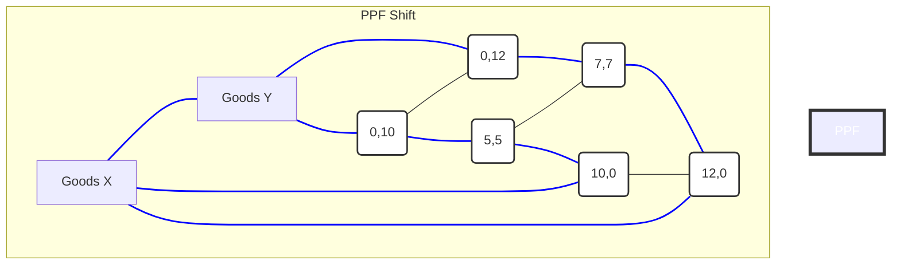

<Prerequisites items={[{ title: "Introduction to Social Sciences", slug: "intro-social-sciences", level: "L0", subject: "Social Sciences" }, { title: "Basic Algebra and Graphing", slug: "basic-algebra-graphing", level: "L0", subject: "Mathematics" }]} />

<DiagnosticQuiz question="Which of the following best describes the fundamental economic problem?" options={["How to maximize profit for businesses.", "How to allocate scarce resources to satisfy unlimited wants.", "How to ensure everyone has equal income.", "How to eliminate all poverty globally."]} correctIndex={1} targetSectionId="section-scarcity-foundation" sectionTitle="The Economic Problem: Scarcity" />

## Introduction to Economic Thinking: Scarcity, Choice, and Opportunity Cost

Welcome to "Introductory Microeconomics"! This course will equip you with the fundamental analytical tools to understand how individuals, firms, and governments make decisions in a world of limited resources. Our journey begins with the most foundational concepts that underpin all economic analysis: <Glossary term="Scarcity" definition="The fundamental economic problem of having seemingly unlimited human wants and needs in a world of limited resources.">scarcity</Glossary>, <Glossary term="Choice" definition="The act of selecting among alternatives, necessitated by scarcity.">choice</Glossary>, and <Glossary term="Opportunity Cost" definition="The value of the next best alternative that was not taken when a decision was made.">opportunity cost</Glossary>. These ideas are not merely abstract academic constructs; they are omnipresent forces shaping every aspect of our daily lives, from personal budgeting to global policy-making.

This lesson will introduce you to the core principles of economic thinking, emphasizing how these concepts form the bedrock of microeconomic models. We will explore the logical structure of these principles, illustrate them with real-world examples, and introduce graphical representations that will become indispensable tools throughout your economic studies. By the end of this lesson, you will possess a robust conceptual framework for analyzing decision-making under constraints, a skill crucial for understanding both individual behavior and broader market dynamics.

### Learning Objectives

Upon successful completion of this lesson, students will be able to:

**Knowledge (Savoir):**
*   **Define** the fundamental economic problem of scarcity and differentiate between wants and needs.
*   **Identify** the four primary factors of production (resources) and explain their role in economic activity.
*   **Explain** the concept of opportunity cost and its significance in economic decision-making.
*   **Describe** the Production Possibilities Frontier (PPF) model, its assumptions, and what it illustrates regarding scarcity, choice, and opportunity cost.
*   **Articulate** the principle of rational decision-making based on marginal analysis.

**Skills (Savoir-faire):**
*   **Apply** the concepts of scarcity, choice, and opportunity cost to analyze real-world individual, business, and governmental decisions.
*   **Construct** and **interpret** a basic Production Possibilities Frontier (PPF) diagram to illustrate trade-offs and economic growth.
*   **Calculate** opportunity cost from given scenarios or graphical representations.
*   **Analyze** decisions using the marginal benefit versus marginal cost framework.

**Attitudes (Posture/Analyse):**
*   **Appreciate** the pervasive nature of scarcity and its implications for all economic agents.
*   **Develop** a critical perspective on resource allocation, recognizing the inherent trade-offs in every decision.
*   **Adopt** a systematic, analytical approach to understanding economic phenomena, moving beyond superficial observations.

---

## 1. The Economic Problem: Scarcity

At the heart of all economic inquiry lies a single, inescapable truth: <Glossary term="Scarcity" definition="The fundamental economic problem of having seemingly unlimited human wants and needs in a world of limited resources.">scarcity</Glossary>. This is the fundamental economic problem, a condition where human wants for goods, services, and resources exceed what is available. It is not about a lack of something, but rather the inability to satisfy all desires simultaneously due to limited means.

> [!NOTE]
> **Scarcity vs. Poverty:** It is crucial to distinguish between scarcity and poverty. Poverty implies a lack of sufficient resources to meet basic needs, whereas scarcity affects everyone, regardless of their wealth. Even the wealthiest individuals and nations face scarcity because their wants and desires for goods, services, and time are still greater than what is available. For instance, a billionaire still cannot buy more than 24 hours in a day, nor can they consume every luxury good simultaneously.

### 1.1 Unlimited Wants vs. Limited Resources

Human wants are virtually <Glossary term="Unlimited Wants" definition="The characteristic of human desires for goods and services to be insatiable, meaning they can never be fully satisfied.">unlimited</Glossary>. As soon as one want is satisfied, another emerges. This applies to basic necessities like food and shelter, as well as to luxuries like entertainment, travel, and advanced technology. Our desires for more and better goods and services, for more leisure time, and for a cleaner environment are boundless.

Conversely, the <Glossary term="Limited Resources" definition="The finite availability of factors of production (land, labor, capital, entrepreneurship) relative to human wants.">resources</Glossary> available to satisfy these wants are finite. Economists categorize these resources, often called <Glossary term="Factors of Production" definition="The inputs used in the production of goods and services to make an economic profit. These include land, labor, capital, and entrepreneurship.">factors of production</Glossary>, into four main types:

1.  **Land (Natural Resources):** This includes all natural resources used in production, such as arable land, forests, mineral deposits, water, and air. It is a finite resource, and its availability can be depleted or degraded.
2.  **Labor (Human Resources):** This refers to the physical and mental effort that people contribute to the production of goods and services. The quantity and quality of labor are limited by population size, education, skills, and health.
3.  **Capital (Physical Capital):** This comprises manufactured resources used to produce other goods and services, such as machinery, tools, buildings, and infrastructure. Financial capital (money) is often used to acquire physical capital, but it is not a factor of production itself.
4.  **Entrepreneurship (Human Ingenuity):** This is the special human resource that combines the other factors of production to create new goods and services, innovate, and take risks. Entrepreneurial talent is rare and crucial for economic progress.

Since wants are unlimited and resources are limited, societies must make choices about what to produce, how to produce it, and for whom to produce it. This is the essence of the economic problem.

<Quiz>
  <Question q="Which of the following best illustrates the concept of scarcity?" explanation="Scarcity means that resources are finite relative to our desires. While a lack of money can prevent someone from buying a car, the fundamental issue is that there aren't enough resources (materials, labor, time) to produce an infinite number of cars for everyone who wants one, even if they had the money. A desert having little water is an example of natural scarcity, but the economic problem extends beyond natural limitations to the human desire for more than what can be produced.">
    <Option text="A person not being able to afford a new car." />
    <Option text="A country having to choose between funding healthcare or education due to budget constraints." correct />
    <Option text="A desert region having very little rainfall." />
    <Option text="A company struggling to find enough skilled workers." />
  </Question>
</Quiz>

---

## 2. Choice and Trade-offs

Because resources are scarce, every decision involves a <Glossary term="Choice" definition="The act of selecting among alternatives, necessitated by scarcity.">choice</Glossary>. When we choose one option, we inherently forgo others. This act of giving up one thing to get another is known as a <Glossary term="Trade-off" definition="The act of giving up one benefit in order to gain another greater benefit.">trade-off</Glossary>.

### 2.1 The Inevitability of Trade-offs

Trade-offs are an unavoidable consequence of scarcity. They occur at every level of economic activity:

*   **Individuals:** A student might choose to spend an evening studying for an exam or working a part-time job. Choosing one means sacrificing the other.
*   **Businesses:** A company might decide to invest in new production machinery or in a marketing campaign. Both are valuable, but resources (money, time) are limited, forcing a choice.
*   **Governments:** A nation's government must decide how to allocate its tax revenues among competing priorities like defense, education, healthcare, and infrastructure. Increasing spending in one area typically means reducing it in another, or increasing taxes/debt.

Understanding trade-offs is the first step towards making informed decisions. It forces us to consider the alternatives and the implications of our choices.

<Quiz>
  <Question q="A government decides to increase spending on national defense. What is the most likely immediate consequence of this decision, assuming a fixed budget?" explanation="When a government has a fixed budget, increasing spending in one area (defense) necessitates reducing spending in another area (like education or healthcare) or increasing taxes/debt. This is a direct illustration of a trade-off due to scarcity. It doesn't automatically mean economic growth or reduced taxes.">
    <Option text="Increased economic growth." />
    <Option text="Reduced taxes for citizens." />
    <Option text="Decreased spending on other public services, such as education or healthcare." correct />
    <Option text="An increase in the national debt, regardless of other spending." />
  </Question>
</Quiz>

---

## 3. Opportunity Cost

The concept of <Glossary term="Opportunity Cost" definition="The value of the next best alternative that was not taken when a decision was made.">opportunity cost</Glossary> is arguably the most fundamental and pervasive principle in economic analysis. It quantifies the true cost of any choice.

### 3.1 Definition and Significance

Opportunity cost is defined as **the value of the next best alternative that was foregone when a decision was made.** It is not merely the monetary cost, but the value of the benefit that could have been received from the best alternative use of the resources.

For example, if you choose to spend an hour studying economics, the opportunity cost is not just the mental effort, but what you *could have done* with that hour instead – perhaps earning money at a part-time job, exercising, or relaxing. If the next best alternative was earning \$15 at your job, then the opportunity cost of studying is \$15 (plus the value of any other benefits you missed).

Understanding opportunity cost is crucial for <Glossary term="Rational Decision Making" definition="A process of making choices that maximizes benefits and minimizes costs, often involving comparing marginal benefits and marginal costs.">rational decision making</Glossary>. By explicitly considering what is given up, individuals, firms, and governments can make more informed choices that align with their objectives.

### 3.2 Explicit vs. Implicit Costs

Opportunity cost often encompasses both <Glossary term="Explicit Costs" definition="Direct monetary payments made to others in the course of running a business or making a decision.">explicit costs</Glossary> and <Glossary term="Implicit Costs" definition="The opportunity costs of using resources that are already owned by the firm or individual, for which no direct monetary payment is made.">implicit costs</Glossary>:

*   **Explicit Costs:** These are direct monetary payments made to others in the course of making a decision. For example, the tuition fees for university, the price of a movie ticket, or the wages paid to employees.
*   **Implicit Costs:** These are the opportunity costs of using resources that are already owned by the firm or individual, for which no direct monetary payment is made. For example, the income you could have earned if you weren't attending university, or the rent a business owner could have received by leasing out a building they own instead of using it for their own business.

The true economic cost of any action is the sum of its explicit and implicit costs.

### 3.3 The Production Possibilities Frontier (PPF)

The <Glossary term="Production Possibilities Frontier (PPF)" definition="A graphical model that illustrates the combinations of two goods or services that an economy can produce efficiently, given its available resources and technology.">Production Possibilities Frontier (PPF)</Glossary>, also known as the Production Possibilities Curve (PPC), is a fundamental economic model that elegantly illustrates the concepts of scarcity, choice, and opportunity cost.

#### 3.3.1 Assumptions of the PPF Model

To simplify the analysis, the PPF model typically operates under several key assumptions:
1.  **Fixed Resources:** The quantity and quality of available resources (land, labor, capital, entrepreneurship) are fixed during the period under consideration.
2.  **Fixed Technology:** The state of technology used in production remains constant.
3.  **Two Goods:** The economy produces only two types of goods or services. This simplification allows for a two-dimensional graphical representation.
4.  **Full Employment and Efficiency:** All available resources are fully employed and utilized efficiently. This means the economy is operating at its maximum potential.

#### 3.3.2 Constructing and Interpreting the PPF

Let's consider a hypothetical economy that can produce only two goods: "Cars" and "Computers."

| Production Possibility | Cars (Units) | Computers (Units) |
| :--------------------- | :----------- | :---------------- |
| A                      | 0            | 1000              |
| B                      | 100          | 900               |
| C                      | 200          | 700               |
| D                      | 300          | 400               |
| E                      | 400          | 0                 |

We can plot these points on a graph with Cars on the x-axis and Computers on the y-axis. Connecting these points forms the PPF.

```mermaid
graph TD
    A[Point A: (0 Cars, 1000 Computers)] --> B[Point B: (100 Cars, 900 Computers)]
    B --> C[Point C: (200 Cars, 700 Computers)]
    C --> D[Point D: (300 Cars, 400 Computers)]
    D --> E[Point E: (400 Cars, 0 Computers)]

    style A fill:#fff,stroke:#333,stroke-width:2px
    style B fill:#fff,stroke:#333,stroke-width:2px
    style C fill:#fff,stroke:#333,stroke-width:2px
    style D fill:#fff,stroke:#333,stroke-width:2px
    style E fill:#fff,stroke:#333,stroke-width:2px

    subgraph PPF Curve
        direction LR
        X[Cars] --- Y[Computers]
        Y --- A
        A --- B
        B --- C
        C --- D
        D --- E
        E --- X
    end

    style PPF Curve fill:#f9f,stroke:#333,stroke-width:4px,color:#fff
```
*Figure 1: A hypothetical Production Possibilities Frontier (PPF) for Cars and Computers.*
*Semantic Description: This is a graphical representation of a Production Possibilities Frontier (PPF). The x-axis represents the quantity of Cars produced, and the y-axis represents the quantity of Computers produced. The curve is concave to the origin, illustrating increasing opportunity costs. Points A, B, C, D, and E are specific production combinations on the frontier, showing the maximum output of one good for a given output of the other. Point A is (0 Cars, 1000 Computers), Point B is (100 Cars, 900 Computers), Point C is (200 Cars, 700 Computers), Point D is (300 Cars, 400 Computers), and Point E is (400 Cars, 0 Computers).*

**Interpretation of the PPF:**

*   **Points on the PPF (e.g., A, B, C, D, E):** These represent efficient production combinations. The economy is fully employing all its resources and technology.
*   **Points inside the PPF (e.g., Point F at 100 Cars, 400 Computers):** These represent inefficient production. The economy is either not fully utilizing its resources (unemployment) or not using them efficiently. It is possible to produce more of both goods without sacrificing either.
*   **Points outside the PPF (e.g., Point G at 300 Cars, 800 Computers):** These represent unattainable production levels given the current resources and technology. They are beyond the economy's current productive capacity.

#### 3.3.3 Opportunity Cost on the PPF

The downward slope of the PPF illustrates <Glossary term="Trade-off" definition="The act of giving up one benefit in order to gain another greater benefit.">trade-offs</Glossary> and <Glossary term="Opportunity Cost" definition="The value of the next best alternative that was not taken when a decision was made.">opportunity cost</Glossary>. Moving from one point to another along the frontier means reallocating resources from the production of one good to another.

Let's calculate the opportunity cost using our table:

*   **Moving from A to B:** To produce the first 100 Cars (from 0 to 100), the economy gives up 100 Computers (from 1000 to 900).
    *   Opportunity Cost of 1 Car = $\frac{\Delta \text{Computers}}{\Delta \text{Cars}} = \frac{1000 - 900}{100 - 0} = \frac{100}{100} = 1$ Computer.
*   **Moving from B to C:** To produce the next 100 Cars (from 100 to 200), the economy gives up 200 Computers (from 900 to 700).
    *   Opportunity Cost of 1 Car = $\frac{900 - 700}{200 - 100} = \frac{200}{100} = 2$ Computers.

Notice that the opportunity cost of producing an additional car increases as more cars are produced. This leads us to the concept of increasing opportunity cost.

#### 3.3.4 Law of Increasing Opportunity Cost

The typical PPF is bowed outward (concave to the origin), reflecting the <Glossary term="Law of Increasing Opportunity Cost" definition="The principle that as production of a good increases, the opportunity cost of producing an additional unit of that good also increases. This is due to resources not being perfectly adaptable for the production of all goods.">Law of Increasing Opportunity Cost</Glossary>. This law states that as an economy produces more of a good, the opportunity cost of producing an additional unit of that good will increase.

Why? Resources are not perfectly adaptable for the production of all goods. When an economy initially shifts resources from computer production to car production, it will first reallocate those resources that are best suited for car production (e.g., engineers skilled in mechanics). As more cars are produced, the economy must start using resources that are less suited for car production (e.g., computer programmers), which means a greater sacrifice of computer production for each additional car.

A straight-line PPF would imply a <Glossary term="Constant Opportunity Cost" definition="A situation where the opportunity cost of producing an additional unit of a good remains the same, regardless of how much of that good is already being produced. This occurs when resources are perfectly interchangeable.">constant opportunity cost</Glossary>, meaning resources are perfectly interchangeable between the production of the two goods, which is rarely the case in reality.

#### 3.3.5 Shifts in the PPF: Economic Growth

The PPF is not static. It can shift outward, representing <Glossary term="Economic Growth" definition="An increase in the total output of an economy over time, often represented by an outward shift of the Production Possibilities Frontier (PPF).">economic growth</Glossary>, or inward, representing economic contraction.

An outward shift of the PPF indicates that the economy can now produce more of both goods than before. This can occur due to:
*   **Increase in Resources:** Discovery of new natural resources, growth in the labor force, or accumulation of more capital.
*   **Technological Advancement:** Improvements in technology that allow for more efficient production of goods and services.
*   **Improvements in Education/Training:** A more skilled workforce can produce more.


*Figure 2: Outward Shift of the Production Possibilities Frontier.*
*Semantic Description: This graph shows two Production Possibilities Frontiers. The initial PPF (blue line) represents combinations of Goods X and Goods Y that can be produced. A second, shifted PPF (dashed blue line) is located further out from the origin, indicating an increase in the maximum possible production of both goods. This outward shift illustrates economic growth, meaning the economy's productive capacity has expanded due to factors like technological advancements or increased resources.*

<Epistemology title="The Evolution of Scarcity in Economic Thought">
The concept of scarcity, while seemingly intuitive today, has evolved significantly in economic thought. Early classical economists like <HistoricalPerson name="Adam_Smith" lang="en">Adam Smith</HistoricalPerson> implicitly recognized scarcity through his discussions of the division of labor and the wealth of nations, but it was not always explicitly framed as the central problem. The <HistoricalPerson name="Thomas_Malthus" lang="en">Malthusian trap</HistoricalPerson> in the late 18th century, which posited that population growth would outstrip food supply, brought the stark reality of resource limits to the forefront.

However, it was not until the early 20th century that economists like <HistoricalPerson name="Lionel_Robbins" lang="en">Lionel Robbins</HistoricalPerson> formally defined economics as "the science which studies human behaviour as a relationship between ends and scarce means which have alternative uses." This definition, published in 1932, firmly established scarcity as the foundational axiom of economic science, moving it beyond mere descriptions of markets to a rigorous analysis of choice under constraint. This formalization allowed for the development of models like the PPF and the systematic study of resource allocation, which continues to be central to modern microeconomics. Critics sometimes argue that this focus on scarcity can overlook issues of distribution and power, but its analytical utility remains undisputed.
</Epistemology>

<Quiz>
  <Question q="A country can produce either 100 units of agricultural goods or 50 units of industrial goods. If it decides to produce 75 units of agricultural goods, what is the opportunity cost in terms of industrial goods, assuming a linear PPF?" explanation="With a linear PPF, the opportunity cost is constant. The trade-off ratio is 100 agricultural goods / 50 industrial goods = 2 agricultural goods per 1 industrial good, or 1 industrial good per 2 agricultural goods. If the country moves from producing 100 agricultural goods (and 0 industrial) to 75 agricultural goods, it has given up 25 agricultural goods. Since 1 industrial good costs 2 agricultural goods, giving up 25 agricultural goods means it can produce 25/2 = 12.5 industrial goods.">
    <Option text="50 units of industrial goods." />
    <Option text="25 units of industrial goods." />
    <Option text="12.5 units of industrial goods." correct />
    <Option text="0 units of industrial goods." />
  </Question>
  <Question q="What does a point *inside* the Production Possibilities Frontier (PPF) signify?" explanation="A point inside the PPF indicates that the economy is not utilizing all its resources or is not using them efficiently. This means it could produce more of one or both goods without sacrificing anything, implying unemployment or underutilization of resources. It does not represent an impossible production level, nor does it necessarily mean economic growth or a constant opportunity cost.">
    <Option text="An unattainable production level." />
    <Option text="Efficient use of resources." />
    <Option text="Unemployment or inefficient use of resources." correct />
    <Option text="Economic growth." />
  </Question>
</Quiz>

---

## 4. Rational Decision Making: Marginal Analysis

Given scarcity and the necessity of making choices, how do individuals and firms make decisions? Economists typically assume <Glossary term="Rational Decision Making" definition="A process of making choices that maximizes benefits and minimizes costs, often involving comparing marginal benefits and marginal costs.">rational decision making</Glossary>, which involves comparing the additional benefits and additional costs of an action. This is known as <Glossary term="Marginal Analysis" definition="The examination of the additional benefits of an activity compared to the additional costs incurred by that same activity.">marginal analysis</Glossary>.

### 4.1 Marginal Benefit vs. Marginal Cost

*   **Marginal Benefit (MB):** The additional satisfaction or utility received from consuming one more unit of a good or service, or from undertaking one more unit of an activity.
*   **Marginal Cost (MC):** The additional cost incurred from consuming one more unit of a good or service, or from undertaking one more unit of an activity. This includes the opportunity cost.

### 4.2 The Decision Rule

A rational decision-maker will choose to undertake an activity as long as the <Glossary term="Marginal Benefit (MB)" definition="The additional satisfaction or utility received from consuming one more unit of a good or service, or from undertaking one more unit of an activity.">marginal benefit</Glossary> is greater than or equal to the <Glossary term="Marginal Cost (MC)" definition="The additional cost incurred from consuming one more unit of a good or service, or from undertaking one more unit of an activity.">marginal cost</Glossary> ($MB \ge MC$). They will continue to do so up to the point where $MB = MC$. Beyond this point, the marginal cost would exceed the marginal benefit, making further units undesirable.

**Example:**
Imagine you are deciding how many hours to study for an exam.
*   The first hour of studying might significantly improve your grade (high MB) with relatively low additional effort (low MC).
*   The second hour might still provide a good improvement (MB) for a bit more effort (MC).
*   As you study more hours, the additional improvement in your grade (MB) might diminish (due to fatigue or diminishing returns to studying), while the additional cost (MC) in terms of lost sleep, leisure, or other activities might increase.
*   You would stop studying when the additional benefit of one more hour of study (e.g., a small increase in your grade) is no longer worth the additional cost (e.g., extreme fatigue, missing an important social event).

This framework helps explain a wide range of decisions, from how many units a firm produces to how many police officers a city hires.

<Quiz>
  <Question q="A student is deciding whether to attend an optional review session for a difficult course. The session costs $10 and takes 2 hours. During those 2 hours, the student could either work at their job for $15/hour or relax. What is the opportunity cost of attending the review session?" explanation="The opportunity cost is the value of the next best alternative foregone. The explicit cost is $10. The implicit cost is the higher of the two alternatives: working for $15/hour * 2 hours = $30, or relaxing (which has a subjective value, but typically less than earning money). So, the next best alternative is working, valued at $30. The total opportunity cost is the explicit cost plus the implicit cost: $10 (session fee) + $30 (lost wages) = $40.">
    <Option text="$10 (the session fee)." />
    <Option text="$30 (the wages they could have earned)." />
    <Option text="$40 (the session fee plus lost wages)." correct />
    <Option text="The value of relaxing for 2 hours." />
  </Question>
</Quiz>

---

## Conclusion

This lesson has laid the groundwork for understanding economic thinking by exploring the foundational concepts of scarcity, choice, and opportunity cost. We have established that scarcity, the fundamental problem of unlimited wants confronting limited resources, necessitates choices at every level of economic activity. These choices inherently involve trade-offs, and the true cost of any decision is its opportunity cost—the value of the next best alternative foregone.

The Production Possibilities Frontier (PPF) model serves as a powerful graphical illustration of these principles, demonstrating efficient resource allocation, the impact of inefficiency, and the potential for economic growth. Finally, we introduced the concept of rational decision-making through marginal analysis, where choices are made by comparing the additional benefits and costs of an action. These core ideas are not isolated concepts but are deeply interconnected, forming the analytical lens through which economists examine the world.

<Summary items={["Scarcity is the fundamental economic problem: unlimited wants versus limited resources (land, labor, capital, entrepreneurship).", "Scarcity necessitates choice, leading to trade-offs at individual, firm, and governmental levels.", "Opportunity cost is the value of the next best alternative foregone when a choice is made, encompassing both explicit and implicit costs.", "The Production Possibilities Frontier (PPF) graphically illustrates scarcity, choice, and opportunity cost, showing efficient production, inefficiency, and economic growth.", "The Law of Increasing Opportunity Cost explains the concave shape of the PPF due to imperfectly adaptable resources.", "Rational decision-making involves marginal analysis, where actions are taken as long as the marginal benefit (MB) is greater than or equal to the marginal cost (MC)."]} />

### Open Reflection Questions & Further Study

1.  Consider a significant personal decision you've made recently (e.g., choosing a university, buying a major item). How did scarcity, choice, and opportunity cost play a role in that decision? What were the explicit and implicit costs?
2.  How might a society's cultural values or political system influence the types of choices it makes regarding resource allocation, even when facing the same fundamental scarcity?
3.  Think about a current global challenge (e.g., climate change, pandemic response). How do the concepts of scarcity and opportunity cost apply to the policy decisions being made to address it? What trade-offs are involved?

These foundational concepts will be revisited and expanded upon as we delve into consumer behavior, firm production, market structures, and government intervention in subsequent lessons. Understanding them deeply is crucial for building a robust comprehension of microeconomics.

---

### End-of-Lesson Evaluation

<Quiz durationLimit={300}>
  <Question q="Which of the following is NOT considered a factor of production in economics?" explanation="Factors of production are the inputs used to produce goods and services. Land, Labor, Capital (physical capital like machinery), and Entrepreneurship are the four main categories. Money (financial capital) is a medium of exchange and a store of value, but it is not directly used in the production process itself; it is used to acquire the factors of production.">
    <Option text="Land" />
    <Option text="Labor" />
    <Option text="Money" correct />
    <Option text="Entrepreneurship" />
  </Question>
  <Question q="An economy is currently producing at a point inside its Production Possibilities Frontier (PPF). What does this indicate?" explanation="A point inside the PPF signifies that the economy is not operating at its full potential. This means there are unused resources (unemployment) or resources are being used inefficiently (underemployment). It is possible to increase the production of one or both goods without sacrificing anything. It does not mean resources are scarce (that's always true), nor that it's unattainable or that opportunity cost is constant.">
    <Option text="The economy is experiencing economic growth." />
    <Option text="The economy's resources are scarce." />
    <Option text="The economy is not efficiently utilizing its resources." correct />
    <Option text="The opportunity cost of production is constant." />
  </Question>
  <Question q="If the Production Possibilities Frontier (PPF) is bowed outward (concave to the origin), what does this imply about opportunity cost?" explanation="A bowed-outward (concave) PPF illustrates the Law of Increasing Opportunity Cost. This means that as an economy produces more of one good, it must give up increasingly larger amounts of the other good. This happens because resources are specialized and not perfectly adaptable for producing all goods. A straight-line PPF would imply constant opportunity cost.">
    <Option text="Opportunity cost is constant." />
    <Option text="Opportunity cost decreases as more of a good is produced." />
    <Option text="Opportunity cost increases as more of a good is produced." correct />
    <Option text="Opportunity cost is zero." />
  </Question>
  <Question q="A firm decides to produce an additional unit of a good. According to marginal analysis, under what condition should the firm make this decision?" explanation="Rational decision-making based on marginal analysis dictates that an action should be taken as long as the additional benefit (marginal benefit) derived from it is greater than or equal to the additional cost (marginal cost) incurred. If MB < MC, the firm should not produce the additional unit.">
    <Option text="When the total revenue from all units exceeds total cost." />
    <Option text="When the marginal cost of the additional unit is less than or equal to its marginal benefit." correct />
    <Option text="When the average cost of production is minimized." />
    <Option text="When the firm can sell all units produced." />
  </Question>
</Quiz>

---

### Glossary

*   <Glossary term="Choice" definition="The act of selecting among alternatives, necessitated by scarcity.">Choice</Glossary>: The act of selecting among alternatives, necessitated by scarcity.
*   <Glossary term="Constant Opportunity Cost" definition="A situation where the opportunity cost of producing an additional unit of a good remains the same, regardless of how much of that good is already being produced. This occurs when resources are perfectly interchangeable.">Constant Opportunity Cost</Glossary>: A situation where the opportunity cost of producing an additional unit of a good remains the same, regardless of how much of that good is already being produced. This occurs when resources are perfectly interchangeable.
*   <Glossary term="Economic Growth" definition="An increase in the total output of an economy over time, often represented by an outward shift of the Production Possibilities Frontier (PPF).">Economic Growth</Glossary>: An increase in the total output of an economy over time, often represented by an outward shift of the Production Possibilities Frontier (PPF).
*   <Glossary term="Explicit Costs" definition="Direct monetary payments made to others in the course of running a business or making a decision.">Explicit Costs</Glossary>: Direct monetary payments made to others in the course of running a business or making a decision.
*   <Glossary term="Factors of Production" definition="The inputs used in the production of goods and services to make an economic profit. These include land, labor, capital, and entrepreneurship.">Factors of Production</Glossary>: The inputs used in the production of goods and services to make an economic profit. These include land, labor, capital, and entrepreneurship.
*   <Glossary term="Implicit Costs" definition="The opportunity costs of using resources that are already owned by the firm or individual, for which no direct monetary payment is made.">Implicit Costs</Glossary>: The opportunity costs of using resources that are already owned by the firm or individual, for which no direct monetary payment is made.
*   <Glossary term="Law of Increasing Opportunity Cost" definition="The principle that as production of a good increases, the opportunity cost of producing an additional unit of that good also increases. This is due to resources not being perfectly adaptable for the production of all goods.">Law of Increasing Opportunity Cost</Glossary>: The principle that as production of a good increases, the opportunity cost of producing an additional unit of that good also increases. This is due to resources not being perfectly adaptable for the production of all goods.
*   <Glossary term="Limited Resources" definition="The finite availability of factors of production (land, labor, capital, entrepreneurship) relative to human wants.">Limited Resources</Glossary>: The finite availability of factors of production (land, labor, capital, entrepreneurship) relative to human wants.
*   <Glossary term="Marginal Analysis" definition="The examination of the additional benefits of an activity compared to the additional costs incurred by that same activity.">Marginal Analysis</Glossary>: The examination of the additional benefits of an activity compared to the additional costs incurred by that same activity.
*   <Glossary term="Marginal Benefit (MB)" definition="The additional satisfaction or utility received from consuming one more unit of a good or service, or from undertaking one more unit of an activity.">Marginal Benefit (MB)</Glossary>: The additional satisfaction or utility received from consuming one more unit of a good or service, or from undertaking one more unit of an activity.
*   <Glossary term="Marginal Cost (MC)" definition="The additional cost incurred from consuming one more unit of a good or service, or from undertaking one more unit of an activity.">Marginal Cost (MC)</Glossary>: The additional cost incurred from consuming one more unit of a good or service, or from undertaking one more unit of an activity.
*   <Glossary term="Opportunity Cost" definition="The value of the next best alternative that was not taken when a decision was made.">Opportunity Cost</Glossary>: The value of the next best alternative that was not taken when a decision was made.
*   <Glossary term="Production Possibilities Frontier (PPF)" definition="A graphical model that illustrates the combinations of two goods or services that an economy can produce efficiently, given its available resources and technology.">Production Possibilities Frontier (PPF)</Glossary>: A graphical model that illustrates the combinations of two goods or services that an economy can produce efficiently, given its available resources and technology.
*   <Glossary term="Rational Decision Making" definition="A process of making choices that maximizes benefits and minimizes costs, often involving comparing marginal benefits and marginal costs.">Rational Decision Making</Glossary>: A process of making choices that maximizes benefits and minimizes costs, often involving comparing marginal benefits and marginal costs.
*   <Glossary term="Scarcity" definition="The fundamental economic problem of having seemingly unlimited human wants and needs in a world of limited resources.">Scarcity</Glossary>: The fundamental economic problem of having seemingly unlimited human wants and needs in a world of limited resources.
*   <Glossary term="Trade-off" definition="The act of giving up one benefit in order to gain another greater benefit.">Trade-off</Glossary>: The act of giving up one benefit in order to gain another greater benefit.
*   <Glossary term="Unlimited Wants" definition="The characteristic of human desires for goods and services to be insatiable, meaning they can never be fully satisfied.">Unlimited Wants</Glossary>: The characteristic of human desires for goods and services to be insatiable, meaning they can never be fully satisfied.

### References

<a id="ref-1"></a>[1] Mankiw, N. G. (2020). *Principles of Microeconomics* (9th ed.). Cengage Learning. [https://www.cengage.com/c/principles-of-microeconomics-9e-mankiw/9780357038314/](https://www.cengage.com/c/principles-of-microeconomics-9e-mankiw/9780357038314/)
<a id="ref-2"></a>[2] McConnell, C. R., Brue, S. L., & Flynn, S. M. (2021). *Microeconomics: Principles, Problems, and Policies* (22nd ed.). McGraw-Hill Education. [https://www.mheducation.com/highered/product/microeconomics-principles-problems-policies-mcconnell-brue-flynn/9781260232531.html](https://www.mheducation.com/highered/product/microeconomics-principles-problems-policies-mcconnell-brue-flynn/9781260232531.html)
<a id="ref-3"></a>[3] Robbins, L. (1932). *An Essay on the Nature and Significance of Economic Science*. Macmillan. [https://www.mises.org/library/essay-nature-and-significance-economic-science](https://www.mises.org/library/essay-nature-and-significance-economic-science)
<a id="ref-4"></a>[4] Smith, A. (1776). *An Inquiry into the Nature and Causes of the Wealth of Nations*. W. Strahan and T. Cadell. [https://www.gutenberg.org/ebooks/3300](https://www.gutenberg.org/ebooks/3300)