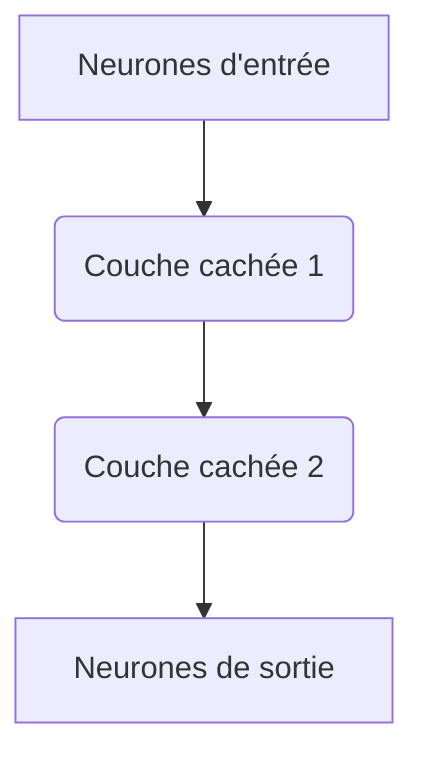
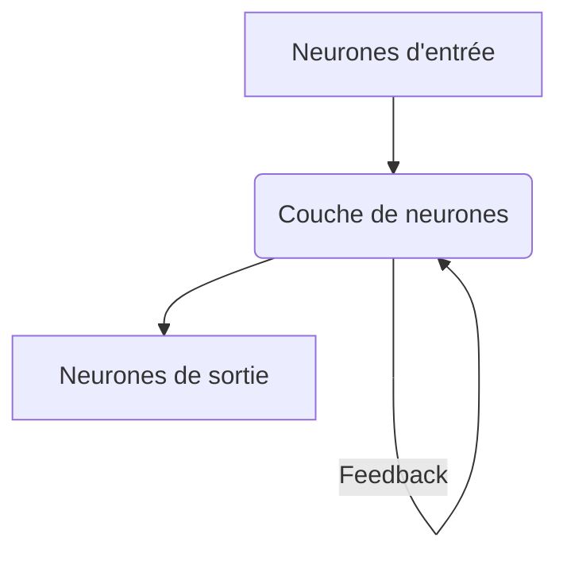

<Prerequisites itemsBase64="W3sidGl0bGUiOiJJbnRyb2R1Y3Rpb24gw6AgbGEgQmlvcGh5c2lxdWUgTmV1cm9uYWxlIiwic2x1ZyI6ImJpb3BoeXNpcXVlLW5ldXJvbmFsZS1pbnRybyIsImxldmVsIjoiTDIiLCJzdWJqZWN0IjoiQmlvcGh5c2lxdWUifSx7InRpdGxlIjoiQmFzZXMgZGUgbCfDiWxlY3Ryb3BoeXNpb2xvZ2llIiwic2x1ZyI6ImVsZWN0cm9waHlzaW9sb2dpZS1iYXNlcyIsImxldmVsIjoiTDIiLCJzdWJqZWN0IjoiTmV1cm9zY2llbmNlcyJ9XQ==" />

<DiagnosticQuiz question="Quel est le principal avantage de l'utilisation de modèles neuronaux simplifiés (comme le modèle Intégrateur-et-Tireur) par rapport à des modèles plus détaillés (comme Hodgkin-Huxley) pour l'étude des réseaux neuronaux à grande échelle ?" options="Ils capturent tous les détails biophysiques des neurones individuels.|||Ils permettent une analyse mathématique et une simulation computationnelle plus efficaces des réseaux complexes.|||Ils sont plus précis pour prédire le comportement de décharge d'un neurone isolé.|||Ils ne nécessitent aucune connaissance des propriétés membranaires." correctIndex="1" targetSectionId="section-pourquoi-simplifier" sectionTitle="Pourquoi Simplifier ? Le Dilemme de la Complexité Neuronale" />

## Introduction

Le cerveau humain, avec ses quelque 86 milliards de neurones interconnectés par des trillions de synapses, représente l'un des systèmes les plus complexes connus. Comprendre comment cette machinerie biologique génère la pensée, la perception et l'action est un défi colossal. La biophysique neuronale nous a dotés de modèles détaillés, tels que le modèle de <HistoricalPerson name="Alan_Hodgkin" lang="fr" bio="Physiologiste et biophysicien britannique, lauréat du prix Nobel de physiologie ou médecine en 1963 pour ses travaux sur les mécanismes ioniques de la conduction nerveuse.">Hodgkin (1914 - 1998)</HistoricalPerson> et <HistoricalPerson name="Andrew_Huxley" lang="fr" bio="Physiologiste et biophysicien britannique, lauréat du prix Nobel de physiologie ou médecine en 1963 pour ses travaux sur les mécanismes ioniques de la conduction nerveuse.">Huxley (1917 - 2012)</HistoricalPerson>, qui décrivent avec une fidélité remarquable la dynamique du potentiel d'action au niveau d'un neurone unique. Cependant, l'intégration de ces modèles biophysiquement riches dans des réseaux de millions ou de milliards de neurones devient rapidement prohibitive en termes de ressources computationnelles et d'analyse.

C'est ici qu'interviennent les modèles neuronaux simplifiés. Cette leçon explorera la nécessité et la puissance de ces modèles, qui, en sacrifiant une partie de la complexité biologique, nous offrent une fenêtre sur la dynamique collective des réseaux neuronaux. Nous débuterons par une justification épistémologique de la simplification, puis nous plongerons dans les détails des modèles fondamentaux comme l'Intégrateur-et-Tireur (Integrate-and-Fire) et le Leaky Integrate-and-Fire (LIF). Nous introduirons ensuite les concepts clés de la connectivité et de la dynamique des réseaux, jetant les bases pour comprendre comment des comportements complexes peuvent émerger de l'interaction de ces unités simplifiées. L'objectif n'est pas de nier la richesse biologique, mais de trouver le juste équilibre entre réalisme et tractabilité pour explorer les principes fondamentaux de l'organisation et du fonctionnement des réseaux neuronaux.

<CriticalThinking title="Le Défi de l'Échelle en Neurosciences Computationnelles">
La modélisation du cerveau à l'échelle de ses 86 milliards de neurones, chacun décrit par des équations biophysiques complexes, est une tâche computationnellement insurmontable avec les technologies actuelles. Si nous ne pouvons pas simuler chaque détail, comment pouvons-nous être certains que les simplifications que nous choisissons ne nous font pas passer à côté de mécanismes fondamentaux pour la cognition ou la conscience ? Quel est le "bon" niveau d'abstraction pour une question scientifique donnée ?
</CriticalThinking>

## Objectifs d'Apprentissage

### Savoir (Connaissances)
*   **Analyser** les compromis entre la complexité biophysique et la simplicité computationnelle dans la modélisation neuronale.
*   **Distinguer** les caractéristiques fondamentales et les équations des modèles Intégrateur-et-Tireur et Leaky Integrate-and-Fire.
*   **Identifier** les principaux types de connectivité synaptique (excitatrice, inhibitrice) et d'architectures de réseaux (feedforward, récurrents).

### Savoir-faire (Compétences)
*   **Dériver** le comportement de décharge d'un neurone Intégrateur-et-Tireur ou Leaky Integrate-and-Fire en réponse à un courant d'entrée constant.
*   **Évaluer** l'impact des paramètres clés (seuil, constante de temps membranaire) sur la dynamique de décharge des neurones simplifiés.
*   **Concevoir** des schémas de connectivité de base pour des réseaux neuronaux simplifiés afin d'illustrer des principes fonctionnels.

### Posture/Analyse (Attitudes)
*   **Critiquer** les hypothèses sous-jacentes aux modèles neuronaux simplifiés et leurs implications pour l'interprétation des résultats.
*   **Apprécier** la puissance des approches de modélisation computationnelle pour sonder les principes d'organisation des systèmes biologiques complexes.
*   **Développer** une approche rigoureuse pour la validation des modèles par rapport aux données expérimentales et l'analyse de leurs limites.

---

## 1. Pourquoi Simplifier ? Le Dilemme de la Complexité Neuronale

### 1.1. Hypothèse : La Complexité Biologique comme Obstacle à l'Analyse de Réseau

Les neurones biologiques sont des entités extraordinairement complexes. Un neurone typique possède un soma, des dendrites ramifiées qui reçoivent des milliers d'entrées synaptiques, et un axone qui peut s'étendre sur de longues distances pour transmettre des signaux. La dynamique de son potentiel de membrane est régie par une multitude de canaux ioniques voltage-dépendants et ligand-dépendants, des pompes ioniques, et des processus métaboliques actifs. Le modèle de Hodgkin-Huxley, par exemple, décrit le potentiel d'action en utilisant quatre équations différentielles non linéaires couplées pour les conductances ioniques du sodium et du potassium, en plus de l'équation du potentiel de membrane.

> "Le cerveau est un système d'une complexité stupéfiante, et tenter de le comprendre en modélisant chaque détail biophysique de chaque neurone est une tâche qui dépasse nos capacités computationnelles actuelles et notre compréhension conceptuelle." — <HistoricalPerson name="Christof_Koch" lang="fr" bio="Neuroscientifique allemand, connu pour ses travaux sur la conscience et la modélisation neuronale.">Christof Koch (né en 1956)</HistoricalPerson>, *The Quest for Consciousness: A Neurobiological Approach*, Roberts and Company Publishers, Colorado, 2004, p. 123.

Cette citation souligne le défi fondamental : si nous voulions simuler un réseau de seulement un million de neurones, chacun décrit par un modèle de Hodgkin-Huxley, le coût computationnel deviendrait astronomique. Chaque neurone nécessiterait la résolution numérique de plusieurs équations différentielles à chaque pas de temps, multiplié par le nombre de synapses et leurs dynamiques. L'analyse de la dynamique émergente d'un tel système serait quasi impossible, masquée par la profusion de détails.

### 1.2. Modélisation : La Nécessité de l'Abstraction

Pour surmonter cette barrière, les neurosciences computationnelles ont adopté une stratégie d'abstraction. L'idée est de capturer les propriétés essentielles du comportement neuronal – principalement la capacité à intégrer des entrées et à générer des potentiels d'action (spikes) – tout en ignorant les détails biophysiques moins pertinents pour la dynamique du réseau. Cette approche est analogue à la physique où, pour étudier le mouvement d'un objet, on le modélise souvent comme un point matériel, ignorant sa structure interne complexe.

<CriticalThinking title="Le Paradoxe de la Simplification">
La simplification est une arme à double tranchant en science. D'une part, elle rend les systèmes complexes traitables. D'autre part, elle risque de masquer des mécanismes cruciaux ou d'introduire des artefacts. Comment les scientifiques peuvent-ils s'assurer que les simplifications qu'ils opèrent ne compromettent pas la validité de leurs conclusions, en particulier lorsqu'ils étudient des phénomènes émergents comme la conscience ou la cognition ?
</CriticalThinking>

<HistoricalFact title="Les Origines de la Modélisation Neuronale Simplifiée" date="1907">
Le concept de neurone comme unité "tout ou rien" a été formalisé dès 1907 par <HistoricalPerson name="Louis_Lapicque" lang="fr" bio="Physiologiste français, pionnier de l'électrophysiologie, célèbre pour son modèle 'intégrateur-et-tireur' du neurone.">Louis Lapicque (1866 - 1952)</HistoricalPerson>, bien avant les travaux de Hodgkin et Huxley. Son modèle, souvent considéré comme le précurseur des modèles Intégrateur-et-Tireur, décrivait comment un neurone intègre des stimuli électriques jusqu'à atteindre un seuil de décharge.

</HistoricalFact>

### 1.3. Objectifs des Modèles Simplifiés

Les modèles neuronaux simplifiés, souvent appelés "modèles de neurones à spike" ou "neurones de point", visent à :
1.  **Réduire la complexité computationnelle** : Permettre la simulation de réseaux de grande taille.
2.  **Faciliter l'analyse mathématique** : Rendre les propriétés du réseau plus accessibles à l'étude théorique.
3.  **Mettre en évidence les principes fondamentaux** : Isoler les mécanismes clés de l'intégration et de la transmission de l'information.
4.  **Servir de briques de construction** : Fournir des unités de base pour explorer les architectures de réseaux et les dynamiques émergentes.

Ces modèles ne cherchent pas à reproduire chaque détail biophysique, mais plutôt la fonction d'entrée-sortie du neurone : recevoir des signaux, les intégrer, et, si un seuil est atteint, émettre un potentiel d'action.

<Quiz>
  <Question q="Quelle est la principale raison d'utiliser des modèles neuronaux simplifiés pour étudier les réseaux neuronaux à grande échelle ?" explanation="Les modèles biophysiques détaillés sont trop coûteux en calcul pour simuler des réseaux de millions de neurones. La simplification permet de rendre ces simulations réalisables.">

    
    
    
    
  

</Question>
  <Question q="Quel est l'objectif principal d'un modèle de neurone 'point' ?" explanation="Un neurone point est une abstraction qui se concentre sur l'intégration des entrées et la production de spikes, sans modéliser la morphologie dendritique ou axonale détaillée.">

    
    
    
    
  

</Question>
</Quiz>

---

## 2. Le Modèle Intégrateur-et-Tireur (Integrate-and-Fire, I&amp;F)

Le modèle Intégrateur-et-Tireur est l'un des modèles neuronaux les plus simples et les plus anciens, mais il reste fondamental pour comprendre les bases de l'intégration neuronale.

### 2.1. Modélisation : Dérivation du Modèle

Le neurone est représenté comme un simple circuit RC (résistance-condensateur) où la membrane agit comme un condensateur ($C_m$) et la résistance de fuite comme une résistance ($R_m$). Le potentiel de membrane ($V_m$) évolue en réponse à un courant d'entrée ($I(t)$).

L'équation de base décrivant la dynamique du potentiel de membrane est donnée par :
$$ C_m \frac{dV_m}{dt} = - \frac{V_m - E_L}{R_m} + I(t) $$
où :
*   $C_m$ est la capacité membranaire (en Farads, F).
*   $V_m$ est le potentiel de membrane (en Volts, V).
*   $E_L$ est le potentiel de repos (potentiel de fuite, en V).
*   $R_m$ est la résistance membranaire (en Ohms, $\Omega$).
*   $I(t)$ est le courant d'entrée total (en Ampères, A).

En réarrangeant l'équation et en définissant la constante de temps membranaire $\tau_m = R_m C_m$ (en secondes, s) et la résistance $R_m$, on obtient :
$$ \tau_m \frac{dV_m}{dt} = - (V_m - E_L) + R_m I(t) $$

Ce modèle est appelé "Intégrateur-et-Tireur" car il intègre le courant d'entrée au fil du temps. Lorsque le potentiel de membrane $V_m$ atteint un <Glossary term="Seuil de décharge" definition="Valeur critique du potentiel de membrane qu'un neurone doit atteindre pour déclencher un potentiel d'action.">seuil de décharge</Glossary> ($V_{th}$), le neurone émet un potentiel d'action (un "spike"). Immédiatement après la décharge, le potentiel de membrane est réinitialisé à une valeur de repos ($V_{reset}$), et le neurone entre dans une <Glossary term="Période réfractaire" definition="Brève période suivant un potentiel d'action pendant laquelle le neurone est incapable de générer un nouveau potentiel d'action, ou nécessite un stimulus beaucoup plus fort.">période réfractaire</Glossary> absolue pendant laquelle il ne peut pas décharger à nouveau, quelle que soit l'entrée.

### 2.2. Comportement de Décharge

Considérons un courant d'entrée constant $I_0$. Si $I_0$ est suffisamment grand pour amener $V_m$ au-dessus de $E_L$, le potentiel de membrane va augmenter.

La solution de l'équation différentielle pour un courant constant $I_0$ (en supposant $E_L = 0$ pour simplifier) est :
$$ V_m(t) = R_m I_0 (1 - e^{-t/\tau_m}) + V_0 e^{-t/\tau_m} $$
où $V_0$ est le potentiel initial.

Si le neurone est au repos ($V_m(0) = E_L$) et un courant $I_0$ est appliqué, le potentiel de membrane augmente exponentiellement vers une valeur d'équilibre $E_L + R_m I_0$. Si cette valeur d'équilibre dépasse le seuil $V_{th}$, le neurone finira par décharger.

Le temps $T_{spike}$ nécessaire pour atteindre le seuil $V_{th}$ à partir de $V_{reset}$ (en supposant $E_L=0$) est donné par :
$$ V_{th} = R_m I_0 (1 - e^{-T_{spike}/\tau_m}) + V_{reset} e^{-T_{spike}/\tau_m} $$
En résolvant pour $T_{spike}$ :
$$ T_{spike} = \tau_m \ln \left( \frac{R_m I_0 - V_{reset}}{R_m I_0 - V_{th}} \right) $$
La fréquence de décharge ($f$) est alors $1 / (T_{spike} + T_{ref})$, où $T_{ref}$ est la durée de la période réfractaire.

<SolvedExercise title="Calcul du temps de décharge pour un neurone I&amp;F">
Un neurone Intégrateur-et-Tireur a les paramètres suivants :
- Capacité membranaire $C_m = 10 \text{ nF}$
- Résistance membranaire $R_m = 100 \text{ M}\Omega$
- Potentiel de repos $E_L = -70 \text{ mV}$
- Seuil de décharge $V_{th} = -50 \text{ mV}$
- Potentiel de réinitialisation $V_{reset} = -70 \text{ mV}$
- Période réfractaire $T_{ref} = 2 \text{ ms}$

Un courant constant $I_0 = 0.25 \text{ nA}$ est appliqué. Calculez le temps nécessaire pour que le neurone décharge pour la première fois à partir du potentiel de repos, et sa fréquence de décharge en régime stationnaire (après la première décharge).

**Solution :**
1.  **Calcul de la constante de temps membranaire $\tau_m$ :**
    $\tau_m = R_m C_m = (100 \times 10^6 \text{ } \Omega) \times (10 \times 10^{-9} \text{ F}) = 1 \text{ s} = 1000 \text{ ms}$.

2.  **Calcul du potentiel d'équilibre $V_{eq}$ si le courant était maintenu indéfiniment :**
    $V_{eq} = E_L + R_m I_0 = -70 \text{ mV} + (100 \times 10^6 \text{ } \Omega) \times (0.25 \times 10^{-9} \text{ A})$
    $V_{eq} = -70 \text{ mV} + 25 \text{ mV} = -45 \text{ mV}$.
    Puisque $V_{eq} = -45 \text{ mV}$ est supérieur au seuil $V_{th} = -50 \text{ mV}$, le neurone va décharger.

3.  **Calcul du temps $T_{spike}$ pour atteindre le seuil à partir de $V_{reset}$ (qui est égal à $E_L$ ici) :**
    L'équation générale pour le potentiel de membrane est $V_m(t) = V_{eq} - (V_{eq} - V_{reset}) e^{-t/\tau_m}$.
    Nous voulons trouver $t$ tel que $V_m(t) = V_{th}$.
    $V_{th} = V_{eq} - (V_{eq} - V_{reset}) e^{-T_{spike}/\tau_m}$
    $-50 = -45 - (-45 - (-70)) e^{-T_{spike}/1000}$
    $-50 = -45 - (25) e^{-T_{spike}/1000}$
    $-5 = -25 e^{-T_{spike}/1000}$
    $0.2 = e^{-T_{spike}/1000}$
    $\ln(0.2) = -T_{spike}/1000$
    $T_{spike} = -1000 \times \ln(0.2) \approx -1000 \times (-1.6094) \approx 1609.4 \text{ ms} = 1.6094 \text{ s}$.
    Ceci est le temps pour la première décharge à partir du repos. Pour les décharges suivantes, le potentiel est réinitialisé à $V_{reset}$, donc le calcul est le même.

4.  **Calcul de la fréquence de décharge $f$ :**
    La période totale d'un cycle de décharge est $T_{cycle} = T_{spike} + T_{ref}$.
    $T_{cycle} = 1609.4 \text{ ms} + 2 \text{ ms} = 1611.4 \text{ ms} = 1.6114 \text{ s}$.
    $f = 1 / T_{cycle} = 1 / 1.6114 \text{ s} \approx 0.6206 \text{ Hz}$.
</SolvedExercise>

<Quiz>
  <Question q="Quelle est la principale simplification du modèle Intégrateur-et-Tireur par rapport à un neurone biologique ?" explanation="Le modèle I&amp;F ne décrit pas la forme complexe du potentiel d'action ni les mécanismes ioniques sous-jacents. Il se contente de réinitialiser le potentiel après avoir atteint un seuil.">

    
    
    
    
  

</Question>
  <Question q="Si la résistance membranaire ($R_m$) d'un neurone I&amp;F augmente, comment cela affecte-t-il le temps nécessaire pour atteindre le seuil de décharge pour un courant d'entrée constant ?" explanation="Une augmentation de la résistance membranaire signifie que le même courant d'entrée produira une plus grande dépolarisation (V=RI), et la constante de temps membranaire (tau_m = R_m C_m) augmentera également, ralentissant l'intégration mais augmentant l'amplitude finale. L'effet dominant est que le potentiel atteindra le seuil plus rapidement car la dépolarisation est plus forte.">

    
    
    
    
  

</Question>
</Quiz>

---

## 3. Le Modèle Leaky Integrate-and-Fire (LIF)

Le modèle Leaky Integrate-and-Fire (LIF) est une amélioration du modèle I&amp;F qui introduit une fuite membranaire plus réaliste, permettant au potentiel de membrane de revenir à son potentiel de repos en l'absence de courant d'entrée. C'est le modèle de neurone à spike le plus couramment utilisé en neurosciences computationnelles en raison de son bon équilibre entre simplicité et réalisme.

### 3.1. Modélisation : Équation Différentielle du LIF

L'équation du LIF est la même que celle de l'I&amp;F, mais elle est souvent écrite en mettant l'accent sur la constante de temps membranaire $\tau_m$ :
$$ \tau_m \frac{dV_m}{dt} = - (V_m - E_L) + R_m I(t) $$
où les termes sont définis comme précédemment :
*   $\tau_m = R_m C_m$ est la <Glossary term="Constante de temps membranaire" definition="Mesure de la rapidité avec laquelle le potentiel de membrane d'un neurone change en réponse à un courant d'entrée. Elle est le produit de la résistance et de la capacité de la membrane.">constante de temps membranaire</Glossary>.
*   $V_m$ est le potentiel de membrane.
*   $E_L$ est le potentiel de repos (potentiel de fuite).
*   $R_m$ est la résistance membranaire.
*   $I(t)$ est le courant d'entrée total.

La différence cruciale avec le modèle I&amp;F "pur" est que le terme $-(V_m - E_L)$ représente un courant de fuite qui tend à ramener le potentiel de membrane vers $E_L$ en l'absence de courant d'entrée. Si $I(t)=0$, alors $\tau_m \frac{dV_m}{dt} = - (V_m - E_L)$, ce qui signifie que $V_m$ décroît exponentiellement vers $E_L$.

Comme pour l'I&amp;F, lorsque $V_m$ atteint le seuil $V_{th}$, un spike est généré, et $V_m$ est réinitialisé à $V_{reset}$ pour une durée de période réfractaire $T_{ref}$.

### 3.2. Comportement de Décharge

Pour un courant d'entrée constant $I_0$, le potentiel de membrane évolue selon :
$$ V_m(t) = E_L + R_m I_0 + (V_{reset} - (E_L + R_m I_0)) e^{-t/\tau_m} $$
Cette équation décrit l'évolution du potentiel de membrane à partir de $V_{reset}$ jusqu'à ce qu'il atteigne $V_{th}$.

Le temps $T_{spike}$ pour atteindre le seuil $V_{th}$ à partir de $V_{reset}$ est donné par :
$$ T_{spike} = \tau_m \ln \left( \frac{E_L + R_m I_0 - V_{reset}}{E_L + R_m I_0 - V_{th}} \right) $$
La fréquence de décharge ($f$) est $1 / (T_{spike} + T_{ref})$.

Une caractéristique importante du LIF est qu'il ne déchargera que si le courant d'entrée $I_0$ est suffisant pour dépolariser le neurone au-delà de son seuil de décharge. Plus précisément, le potentiel de membrane d'équilibre $V_{eq} = E_L + R_m I_0$ doit être supérieur à $V_{th}$. Si $I_0 < (V_{th} - E_L) / R_m$, le neurone ne déchargera jamais, quelle que soit la durée d'application du courant. C'est une propriété plus réaliste que celle du modèle I&amp;F pur, qui déchargerait toujours si le courant est positif.

<DidYouKnow>
Le modèle LIF, malgré sa simplicité, peut reproduire une grande variété de comportements de décharge observés dans les neurones biologiques, comme l'adaptation de la fréquence de décharge ou la décharge en salves, en y ajoutant quelques mécanismes d'adaptation simples (par exemple, des courants ioniques lents). Cela en fait un outil polyvalent pour la modélisation de réseaux.
</DidYouKnow>

<UnsolvedExercise question="Un neurone Leaky Integrate-and-Fire a les paramètres suivants : constante de temps membranaire $\tau_m = 40 \text{ ms}$, potentiel de repos $E_L = -70 \text{ mV}$, seuil de décharge $V_{th} = -50 \text{ mV}$, potentiel de réinitialisation $V_{reset} = -70 \text{ mV}$, résistance membranaire $R_m = 20 \text{ M}\Omega$, et une période réfractaire $T_{ref} = 5 \text{ ms}$. Un courant constant $I_0 = 1.1025 \text{ nA}$ est appliqué. Quelle est la fréquence de décharge en régime stationnaire (en Hz) ?" correctAnswer={10.0} tolerance={0.01} placeholder="Entrez la fréquence en Hz..." hint="Calculez d'abord le potentiel d'équilibre $V_{eq}$, puis le temps $T_{spike}$ pour atteindre le seuil, et enfin la fréquence en tenant compte de la période réfractaire." solution="1. **Calcul du potentiel d'équilibre $V_{eq}$ :**
   $V_{eq} = E_L + R_m I_0 = -70 \text{ mV} + (20 \times 10^6 \text{ } \Omega) \times (1.1025 \times 10^{-9} \text{ A})$
   $V_{eq} = -70 \text{ mV} + 22.05 \text{ mV} = -47.95 \text{ mV}$.
   Puisque $V_{eq} = -47.95 \text{ mV}$ est supérieur au seuil $V_{th} = -50 \text{ mV}$, le neurone va décharger.

2.  **Calcul du temps $T_{spike}$ pour atteindre le seuil à partir de $V_{reset}$ :**
    $T_{spike} = \tau_m \ln \left( \frac{V_{eq} - V_{reset}}{V_{eq} - V_{th}} \right)$
    $T_{spike} = 40 \text{ ms} \ln \left( \frac{-47.95 - (-70)}{-47.95 - (-50)} \right)$
    $T_{spike} = 40 \text{ ms} \ln \left( \frac{22.05}{2.05} \right)$
    $T_{spike} = 40 \text{ ms} \ln(10.756) \approx 40 \text{ ms} \times 2.375 \approx 95 \text{ ms}$.

3.  **Calcul de la fréquence de décharge $f$ :**
    La période totale d'un cycle de décharge est $T_{cycle} = T_{spike} + T_{ref}$.
    $T_{cycle} = 95 \text{ ms} + 5 \text{ ms} = 100 \text{ ms} = 0.1 \text{ s}$.
    $f = 1 / T_{cycle} = 1 / 0.1 \text{ s} = 10 \text{ Hz}$.">
</UnsolvedExercise>

<Quiz>
  <Question q="Quelle est la principale différence entre le modèle Intégrateur-et-Tireur (I&amp;F) pur et le modèle Leaky Integrate-and-Fire (LIF) ?" explanation="Le LIF inclut un terme de fuite qui ramène activement le potentiel de membrane vers le potentiel de repos en l'absence de stimulation, ce qui est une caractéristique biologique essentielle. L'I&amp;F pur n'a pas ce mécanisme de retour au repos.">

    
    
    
    
  

</Question>
  <Question q="Si le courant d'entrée $I_0$ appliqué à un neurone LIF est inférieur à un certain seuil, que se passe-t-il ?" explanation="Pour qu'un neurone LIF décharge, le courant d'entrée doit être suffisant pour que le potentiel d'équilibre ($E_L + R_m I_0$) dépasse le seuil de décharge ($V_{th}$). Si ce n'est pas le cas, le potentiel de membrane ne fera que s'approcher de $V_{eq}$ sans jamais atteindre $V_{th}$.">

    
    
    
    
  

</Question>
</Quiz>

---

## 4. Introduction aux Réseaux de Neurones Simplifiés

Une fois que nous avons des modèles simplifiés pour les neurones individuels, l'étape suivante est de les connecter pour former des réseaux. La dynamique collective de ces réseaux est ce qui nous permet de comprendre des fonctions cérébrales complexes.

### 4.1. Connectivité et Synapses

Les neurones communiquent via des synapses. Dans les modèles simplifiés, une synapse est généralement représentée par un poids synaptique ($w_{ij}$) qui module l'effet du spike du neurone présynaptique $j$ sur le neurone postsynaptique $i$.

*   **Synapses excitatrices** : Augmentent la probabilité de décharge du neurone postsynaptique en le dépolarisant. Elles sont modélisées par des poids synaptiques positifs ($w_{ij} > 0$).
*   **Synapses inhibitrices** : Diminuent la probabilité de décharge du neurone postsynaptique en l'hyperpolarisant ou en le stabilisant loin du seuil. Elles sont modélisées par des poids synaptiques négatifs ($w_{ij} < 0$).

Le courant synaptique total $I_{syn}(t)$ reçu par un neurone $i$ est la somme des contributions de tous les neurones présynaptiques connectés, modulées par leurs poids synaptiques et la dynamique temporelle de la synapse (souvent modélisée par une fonction exponentielle ou alpha pour simuler l'ouverture et la fermeture des canaux ioniques postsynaptiques).

<InteractiveDiagram title="La Synapse Chimique Simplifiée" type="custom" hotspotsBase64="W3siaWQiOiJwcmUiLCJuYW1lIjoiTmV1cm9uZSBQcsOpc3luYXB0aXF1ZSIsIngiOjIwLCJ5IjozMCwiZGVzY3JpcHRpb24iOiJOZXVyb25lIMOpbWV0dGFudCBsZSBzaWduYWwgc291cyBmb3JtZSBkZSBwb3RlbnRpZWwgZCdhY3Rpb24uIEwnYXJyaXbDqWUgZCd1biBwb3RlbnRpZWwgZCdhY3Rpb24gZMOpY2xlbmNoZSBsYSBsaWLDqXJhdGlvbiBkZSBuZXVyb3RyYW5zbWV0dGV1cnMuIn0seyJpZCI6InZlcyIsIm5hbWUiOiJWw6lzaWN1bGVzIGRlIE5ldXJvdHJhbnNtZXR0ZXVycyIsIngiOjM1LCJ5Ijo0NSwiZGVzY3JpcHRpb24iOiJQZXRpdHMgc2FjcyBjb250ZW5hbnQgbGVzIG5ldXJvdHJhbnNtZXR0ZXVycywgcXVpIGZ1c2lvbm5lbnQgYXZlYyBsYSBtZW1icmFuZSBwcsOpc3luYXB0aXF1ZSBwb3VyIGxpYsOpcmVyIGxldXIgY29udGVudSBkYW5zIGxhIGZlbnRlIHN5bmFwdGlxdWUuIn0seyJpZCI6ImZlbnRlIiwibmFtZSI6IkZlbnRlIFN5bmFwdGlxdWUiLCJ4Ijo1MCwieSI6NTUsImRlc2NyaXB0aW9uIjoiRXNwYWNlIMOpdHJvaXQgZW50cmUgbGVzIG1lbWJyYW5lcyBwcsOpc3luYXB0aXF1ZSBldCBwb3N0c3luYXB0aXF1ZSwgw6AgdHJhdmVycyBsZXF1ZWwgbGVzIG5ldXJvdHJhbnNtZXR0ZXVycyBkaWZmdXNlbnQuIn0seyJpZCI6InJlY2VwdGV1ciIsIm5hbWUiOiJSw6ljZXB0ZXVycyBQb3N0c3luYXB0aXF1ZXMiLCJ4Ijo3MCwieSI6NjAsImRlc2NyaXB0aW9uIjoiUHJvdMOpaW5lcyBzcMOpY2lhbGlzw6llcyBzdXIgbGEgbWVtYnJhbmUgZHUgbmV1cm9uZSBwb3N0c3luYXB0aXF1ZSBxdWkgbGllbnQgbGVzIG5ldXJvdHJhbnNtZXR0ZXVycywgcHJvdm9xdWFudCBsJ291dmVydHVyZSBkZSBjYW5hdXggaW9uaXF1ZXMgZXQgbW9kaWZpYW50IGxlIHBvdGVudGllbCBkZSBtZW1icmFuZSBwb3N0c3luYXB0aXF1ZS4ifSx7ImlkIjoicG9zdCIsIm5hbWUiOiJOZXVyb25lIFBvc3RzeW5hcHRpcXVlIiwieCI6ODAsInkiOjcwLCJkZXNjcmlwdGlvbiI6Ik5ldXJvbmUgcmVjZXZhbnQgbGUgc2lnbmFsLiBMYSBtb2RpZmljYXRpb24gZGUgc29uIHBvdGVudGllbCBkZSBtZW1icmFuZSBwZXV0IGxlIGTDqXBvbGFyaXNlciAoZXhjaXRhdGlvbikgb3UgbCdoeXBlcnBvbGFyaXNlciAoaW5oaWJpdGlvbikuIn1d" />
*Figure 5 : Diagramme interactif d'une synapse chimique simplifiée. Explorez les composants clés et leur rôle dans la transmission synaptique.*

### 4.2. Architectures de Réseaux

Les réseaux de neurones peuvent être organisés selon différentes architectures :

#### 4.2.1. Réseaux Feedforward (à propagation avant)
Dans ces réseaux, l'information circule dans une seule direction, des couches d'entrée vers les couches de sortie, sans boucles de rétroaction.

*Figure 6 : Schéma d'un réseau feedforward. L'information progresse séquentiellement des neurones d'entrée vers les neurones de sortie, sans boucles de rétroaction. Chaque neurone d'une couche ne reçoit des entrées que des neurones de la couche précédente.*

Ces réseaux sont souvent utilisés pour des tâches de classification ou de reconnaissance de motifs où l'ordre temporel des entrées n'est pas primordial. L'activité de chaque neurone dépend uniquement de l'activité des neurones des couches précédentes.

#### 4.2.2. Réseaux Récurrents
Les réseaux récurrents se caractérisent par la présence de boucles de rétroaction, où l'activité d'un neurone peut influencer sa propre activité future ou celle de neurones en amont.

*Figure 7 : Schéma d'un réseau récurrent. Les neurones de la couche intermédiaire ont des connexions de rétroaction (boucles), permettant au réseau de maintenir une 'mémoire' de son activité passée et de traiter des séquences temporelles.*

Ces boucles confèrent au réseau une "mémoire" et la capacité de générer des dynamiques temporelles complexes, ce qui les rend adaptés à la modélisation de processus cognitifs comme la mémoire de travail, la prise de décision ou la génération de rythmes.

> "Le cerveau n'est pas une machine de Turing, mais un système dynamique récurrent, où l'information est traitée non seulement par la propagation avant, mais aussi par des boucles de rétroaction complexes qui modulent et affinent l'activité neuronale." — <HistoricalPerson name="Gerald_Edelman" lang="fr" bio="Biologiste américain, lauréat du prix Nobel pour ses travaux sur la structure des anticorps, et théoricien de la conscience.">Gerald Edelman (1929 - 2014)</HistoricalPerson>, *Bright Air, Brilliant Fire: On the Matter of the Mind*, Basic Books, New York, 1992, p. 78.

### 4.3. Les Pionniers des Réseaux Neuronaux Artificiels

Les idées de modélisation de réseaux de neurones simplifiés ont une longue histoire.
<HistoricalPerson name="Warren_McCulloch" lang="fr" bio="Neurophysiologiste et cybernéticien américain, pionnier des réseaux de neurones artificiels avec Walter Pitts.">Warren McCulloch (1898 - 1969)</HistoricalPerson> et <HistoricalPerson name="Walter_Pitts" lang="fr" bio="Mathématicien et logicien américain, co-auteur avec Warren McCulloch du premier modèle mathématique d'un neurone artificiel.">Walter Pitts (1923 - 1969)</HistoricalPerson> ont publié en 1943 un article fondateur, "A Logical Calculus of the Ideas Immanent in Nervous Activity"<a id="ref-src-1" href="#ref-1">1</a>, qui proposait un modèle de neurone binaire (tout ou rien) et montrait comment de tels neurones pouvaient être connectés pour réaliser des opérations logiques. Ce travail a jeté les bases des réseaux neuronaux artificiels et de la cybernétique.

<PointOfView topic="La Nature de l'Intelligence : Symbolique vs. Connexionniste" perspectives={[
  {"author":"Noam Chomsky (né en 1928)", "view":"L'intelligence humaine repose sur des structures innées et symboliques, comme une grammaire universelle. Les réseaux neuronaux, par leur nature statistique et associative, ne peuvent pas capturer la richesse de la cognition humaine, qui nécessite des règles explicites et une capacité de raisonnement symbolique."},
  {"author":"Geoffrey Hinton (né en 1947)", "view":"L'intelligence émerge de l'apprentissage et de l'interaction de vastes réseaux de neurones simples. Les capacités cognitives complexes peuvent être apprises à partir de données, sans nécessiter de règles symboliques explicites pré-programmées, et les réseaux de neurones profonds en sont la preuve."}
]} />

<Quiz>
  <Question q="Quelle est la principale caractéristique d'un réseau neuronal feedforward ?" explanation="Dans un réseau feedforward, l'information ne circule que dans une direction, des entrées vers les sorties, sans boucles de rétroaction.">

    
    
    
    
  

</Question>
  <Question q="Quel type de synapse augmente la probabilité de décharge du neurone postsynaptique ?" explanation="Les synapses excitatrices dépolarisent la membrane postsynaptique, la rapprochant du seuil de décharge.">

    
    
    
    
  

</Question>
</Quiz>

---

## 5. Dynamique de Population et Synchronisation

L'un des aspects les plus fascinants de l'étude des réseaux neuronaux est la manière dont des comportements collectifs complexes peuvent émerger de l'interaction de neurones individuels. La dynamique de population fait référence à l'activité agrégée d'un groupe de neurones, et la synchronisation est un phénomène clé de cette dynamique.

### 5.1. Interprétation : Comportement Collectif des Réseaux

Lorsque des neurones sont connectés en réseau, leur activité individuelle s'influence mutuellement, conduisant à des motifs d'activité à l'échelle de la population. Ces motifs peuvent inclure :
*   **Oscillations** : Des fluctuations rythmiques du potentiel de membrane ou de la fréquence de décharge d'une population de neurones. Ces oscillations sont observées à différentes fréquences (alpha, bêta, gamma, thêta, delta) et sont associées à divers états cognitifs et fonctions cérébrales.
*   **Synchronisation** : L'alignement temporel des potentiels d'action de plusieurs neurones. Une synchronisation accrue peut indiquer une communication efficace entre les neurones ou un traitement d'information cohérent.
*   **Activités en salve (bursting)** : Des périodes de décharge rapide de potentiels d'action suivies de périodes de silence.

### 5.2. Importance Fonctionnelle de la Synchronisation

La synchronisation neuronale est un phénomène omniprésent dans le cerveau et est impliquée dans de nombreuses fonctions :
*   **Codage de l'information** : La synchronisation pourrait servir de mécanisme pour regrouper des informations pertinentes ou pour renforcer la saillance de certains stimuli. Par exemple, des neurones codant pour des caractéristiques similaires d'un objet pourraient se synchroniser pour représenter cet objet de manière cohérente.
*   **Intégration de l'information** : Des neurones synchronisés peuvent avoir un impact plus fort et plus fiable sur leurs cibles postsynaptiques que des neurones déchargeant de manière asynchrone, facilitant ainsi l'intégration spatio-temporelle des entrées.
*   **Attention et conscience** : La synchronisation des oscillations gamma (30-80 Hz) est souvent corrélée avec l'attention sélective et l'intégration des caractéristiques sensorielles en une perception cohérente.
*   **Mémoire** : Les oscillations thêta (4-8 Hz) dans l'hippocampe sont cruciales pour la formation et la récupération de la mémoire spatiale, agissant comme un rythme organisateur pour l'activité neuronale.

<BrilliantIdea title="Le 'Binding Problem' et la Synchronisation">
Le "Binding Problem" (problème de la liaison) en neurosciences fait référence à la question de savoir comment le cerveau intègre différentes caractéristiques d'un objet (couleur, forme, mouvement) traitées par des aires cérébrales distinctes pour former une perception unifiée. Une hypothèse brillante, proposée par Christof Koch (né en 1956) et <HistoricalPerson name="Francis_Crick" lang="fr" bio="Biologiste moléculaire britannique, co-découvreur de la structure en double hélice de l'ADN et théoricien de la conscience.">Francis Crick (1916 - 2004)</HistoricalPerson>, est que la synchronisation transitoire de l'activité neuronale dans les aires pertinentes pourrait être le mécanisme sous-jacent à cette intégration.
</BrilliantIdea>

<Epistemology title="Controverses autour de la Synchronisation Neuronale">
Bien que la synchronisation soit largement observée et corrélée à diverses fonctions cognitives, son rôle causal exact reste un sujet de débat intense. Certains chercheurs soutiennent qu'elle est un épiphénomène, une conséquence de l'activité neuronale plutôt qu'un mécanisme actif de traitement de l'information. D'autres la considèrent comme un "code temporel" fondamental, essentiel à la communication neuronale et à l'organisation des processus cognitifs. Les défis méthodologiques pour manipuler sélectivement la synchronisation *in vivo* sans altérer l'activité moyenne des neurones rendent cette question difficile à trancher.
</Epistemology>

*Vidéo 1 : Oscillations et synchronisation neuronales - Cette vidéo explique de manière concise les concepts d'oscillations neuronales et de synchronisation, et leur importance dans le fonctionnement cérébral.*
[Accéder directement à la ressource](https://www.youtube.com/watch?v=xYgJ1h1Q_3w)

*Audio 1 : Son d'activité de réseau neuronal simulée - Un exemple auditif de l'activité de décharge synchronisée et asynchrone dans un réseau neuronal simulé, illustrant la complexité des patterns temporels.*

<DataChart title="Fréquence de Décharge Moyenne et Synchronisation" type="bar" xAxisLabel="Condition" yAxisLabel="Valeur" unit="" data={[{"label":"Activité Asynchrone","value":50},{"label":"Activité Synchronisée","value":80}]} />
*Figure 9 : Graphique comparatif de l'activité neuronale. La barre 'Activité Synchronisée' montre une fréquence de décharge moyenne plus élevée ou une mesure de cohérence accrue par rapport à l'activité asynchrone, illustrant l'impact de la synchronisation sur la dynamique de population et potentiellement sur l'efficacité de la transmission d'information.*

<Quiz>
  <Question q="Qu'est-ce que la synchronisation neuronale ?" explanation="La synchronisation neuronale est l'alignement temporel des potentiels d'action de plusieurs neurones, ce qui peut renforcer leur impact collectif.">

    
    
    
    
  

</Question>
  <Question q="Pourquoi la synchronisation neuronale est-elle considérée comme importante pour des fonctions cognitives comme l'attention ?" explanation="La synchronisation, en particulier dans les bandes de fréquences comme les gamma, est souvent associée à l'intégration d'informations et à la focalisation de l'attention, permettant une communication plus efficace entre les régions cérébrales.">

    
    
    
    
  

</Question>
</Quiz>

---

## 6. Limites et Perspectives des Modèles Simplifiés

Les modèles neuronaux simplifiés sont des outils puissants, mais il est crucial de comprendre leurs limites pour les utiliser judicieusement.

### 6.1. Analyse Critique des Hypothèses

Les modèles I&amp;F et LIF reposent sur des simplifications majeures :
*   **Neurone ponctuel** : Ils ignorent la morphologie dendritique et axonale complexe, ainsi que la propagation des signaux le long de ces structures. Les dendrites ne sont pas de simples câbles passifs ; elles peuvent effectuer des calculs non linéaires locaux et jouer un rôle actif dans l'intégration synaptique.
*   **Potentiel d'action idéalisé** : Le spike est traité comme un événement instantané de type "tout ou rien", sans modéliser les courants ioniques sous-jacents qui le génèrent. Cela signifie que les propriétés fines du spike (durée, forme, amplitude, adaptation) ne sont pas capturées, ce qui peut être crucial pour certains phénomènes.
*   **Synapses simplifiées** : La dynamique des neurotransmetteurs, des récepteurs et des seconds messagers est souvent réduite à une simple modulation du courant postsynaptique, ignorant des phénomènes comme la plasticité dépendante du temps de spike (STDP) ou la facilitation/dépression synaptique.
*   **Homogénéité** : Souvent, les neurones d'un réseau sont supposés avoir des propriétés identiques, ce qui est rarement le cas dans la réalité biologique où l'hétérogénéité neuronale est la règle et peut avoir des implications fonctionnelles importantes.

Ces simplifications sont valides lorsque l'on s'intéresse principalement à la dynamique de décharge et à l'interaction au niveau du réseau. Cependant, elles deviennent problématiques si l'on veut étudier des phénomènes dépendants de la morphologie neuronale (par exemple, l'intégration spatiale des entrées dendritiques), des propriétés détaillées des canaux ioniques (par exemple, l'adaptation de la décharge due à des courants de potassium lents), ou des mécanismes de plasticité synaptique complexes.

### 6.2. Quand ces modèles sont-ils suffisants ? Quand ne le sont-ils pas ?

Les modèles I&amp;F et LIF sont suffisants pour :
*   Étudier la dynamique de décharge et la fréquence de décharge en réponse à des courants d'entrée.
*   Explorer la synchronisation et les oscillations dans de grands réseaux.
*   Modéliser l'apprentissage et la plasticité synaptique à l'échelle du réseau, en se concentrant sur les règles de modification des poids synaptiques.
*   Comprendre les principes d'organisation des réseaux neuronaux (par exemple, l'équilibre excitation-inhibition, la formation de motifs d'activité).

Ils sont insuffisants pour :
*   Analyser les propriétés biochimiques et biophysiques détaillées des canaux ioniques et leurs interactions.
*   Modéliser la propagation des potentiels d'action le long des axones myélinisés et non myélinisés, et les délais de conduction.
*   Étudier les calculs dendritiques non linéaires ou l'intégration spatio-temporelle complexe des entrées qui dépendent de la géométrie neuronale.
*   Comprendre les effets de neuromodulateurs spécifiques sur des sous-types de canaux ioniques ou les mécanismes de régulation homéostatique.

### 6.3. Ouverture vers des Modèles Plus Complexes

Lorsque les questions de recherche exigent plus de détails biophysiques, les modèles simplifiés cèdent la place à des modèles plus complexes :
*   **Modèles multi-compartimentaux** : Divisent le neurone en plusieurs segments (compartiments) interconnectés, chacun avec ses propres propriétés membranaires et canaux ioniques. Cela permet de modéliser la propagation des signaux dans les dendrites et les axones, et l'intégration spatiale des entrées.
*   **Modèles de Hodgkin-Huxley** : Décrivent les dynamiques des canaux ioniques voltage-dépendants avec une grande précision, permettant d'étudier la forme et les propriétés intrinsèques des potentiels d'action.
*   **Modèles à champ moyen (Mean-Field Models)** : Au lieu de simuler chaque neurone individuellement, ces modèles décrivent l'activité moyenne d'une population de neurones par des équations différentielles continues, ce qui est utile pour des réseaux très grands où la dynamique individuelle est moins pertinente que le comportement collectif.

Le choix du modèle dépend toujours de la question scientifique posée. Un bon modélisateur sait choisir le niveau d'abstraction approprié pour maximiser la pertinence et la tractabilité de son approche.

<WhatsNext title="Vers l'Intelligence Artificielle et la Modélisation du Cerveau">
Les modèles neuronaux simplifiés que nous avons étudiés sont les ancêtres des neurones artificiels utilisés dans les réseaux de neurones profonds (Deep Learning) en intelligence artificielle. Bien que les neurones artificiels modernes soient encore plus abstraits (souvent sans dynamique temporelle explicite), ils partagent le même principe d'intégration d'entrées et de production d'une sortie non linéaire. Comprendre les bases de la modélisation neuronale biologique est essentiel pour apprécier les avancées et les limites des architectures d'IA inspirées du cerveau, et pour guider le développement de futures générations d'algorithmes d'apprentissage bio-inspirés. La recherche actuelle explore également les réseaux de neurones à spike (SNN) qui intègrent la dynamique temporelle des spikes, promettant une efficacité énergétique et des capacités de traitement de l'information accrues.
</WhatsNext>

---

## Conclusion : Synthèse &amp; Discussion

Cette leçon nous a plongés dans le monde des modèles neuronaux simplifiés, des outils indispensables pour démystifier la complexité des réseaux neuronaux. Nous avons vu que la simplification n'est pas une faiblesse, mais une stratégie délibérée pour rendre l'étude des systèmes neuronaux à grande échelle mathématiquement et computationnellement traitable.

Les modèles simplifiés nous ont permis d'explorer des concepts fondamentaux tels que l'intégration temporelle, le seuil de décharge, la période réfractaire, et l'émergence de dynamiques collectives comme la synchronisation. Cependant, il est impératif de toujours garder à l'esprit les hypothèses sous-jacentes et les limites de ces modèles. Le choix du modèle doit être guidé par la question scientifique spécifique.

Pour aller plus loin, vous pourriez explorer comment ces modèles sont utilisés pour simuler des phénomènes comme l'apprentissage hebbien, la formation de cartes topographiques, ou la génération de rythmes moteurs. Comment les propriétés individuelles des neurones (par exemple, l'hétérogénéité des paramètres) peuvent-elles influencer la dynamique globale d'un réseau ? Quels sont les défis actuels dans la validation de ces modèles par rapport aux données expérimentales *in vivo* ? La modélisation neuro-computationnelle est un domaine en constante évolution, à l'intersection de la biologie, des mathématiques, de la physique et de l'informatique, offrant des perspectives fascinantes pour comprendre l'un des plus grands mystères de la nature : le cerveau.

---

## Évaluation Finale

<Quiz durationLimit={900}>
  <Question q="Décrivez les principes fondamentaux du modèle Leaky Integrate-and-Fire (LIF) et expliquez en quoi il représente une amélioration par rapport au modèle Intégrateur-et-Tireur (I&amp;F) pur. Mentionnez au moins deux paramètres clés du modèle LIF et leur rôle." explanation="Le modèle LIF décrit le potentiel de membrane comme un circuit RC avec un courant de fuite qui ramène le potentiel vers le potentiel de repos ($E_L$). Il intègre les courants d'entrée jusqu'à atteindre un seuil ($V_{th}$), après quoi il décharge un spike et est réinitialisé à $V_{reset}$. L'amélioration par rapport à l'I&amp;F pur est l'inclusion explicite du courant de fuite, ce qui rend le comportement de retour au repos plus réaliste et introduit un seuil de courant minimal pour la décharge. Les paramètres clés incluent la constante de temps membranaire ($\tau_m = R_m C_m$) qui détermine la vitesse d'intégration, le seuil de décharge ($V_{th}$) qui déclenche le spike, et la période réfractaire ($T_{ref}$) qui empêche une décharge immédiate après un spike.">

    
    
    
    
  

</Question>
  <Question q="Un neurone LIF a une constante de temps membranaire $\tau_m = 20 \text{ ms}$, un potentiel de repos $E_L = -65 \text{ mV}$, un seuil de décharge $V_{th} = -45 \text{ mV}$, un potentiel de réinitialisation $V_{reset} = -65 \text{ mV}$, une résistance membranaire $R_m = 10 \text{ M}\Omega$, et une période réfractaire $T_{ref} = 3 \text{ ms}$. Un courant constant $I_0 = 2.5 \text{ nA}$ est appliqué. Calculez la fréquence de décharge de ce neurone en régime stationnaire (en Hz)." explanation="true">

 V_&#123;th&#125; = -45 \text&#123; mV&#125;$, donc le neurone décharge. 3. Calcul du temps $T_&#123;spike&#125;$: $T_&#123;spike&#125; = \tau_m \ln \left( \frac&#123;V_&#123;eq&#125; - V_&#123;reset&#125;&#125;&#123;V_&#123;eq&#125; - V_&#123;th&#125;&#125; \right) = 20 \text&#123; ms&#125; \ln \left( \frac&#123;-40 - (-65)&#125;&#123;-40 - (-45)&#125; \right) = 20 \text&#123; ms&#125; \ln \left( \frac&#123;25&#125;&#123;5&#125; \right) = 20 \text&#123; ms&#125; \ln(5) \approx 20 \text&#123; ms&#125; \times 1.6094 \approx 32.188 \text&#123; ms&#125;$. 4. Calcul de la fréquence $f$: $T_&#123;cycle&#125; = T_&#123;spike&#125; + T_&#123;ref&#125; = 32.188 \text&#123; ms&#125; + 3 \text&#123; ms&#125; = 35.188 \text&#123; ms&#125; = 0.035188 \text&#123; s&#125;$. $f = 1 / T_&#123;cycle&#125; \approx 1 / 0.035188 \approx 28.42 \text&#123; Hz&#125;$.">
    
    
    
    
  

</Question>
  <Question q="Comparez les architectures de réseaux feedforward et récurrents en termes de flux d'information et de capacités fonctionnelles. Donnez un exemple de tâche pour laquelle chaque type de réseau serait particulièrement adapté." explanation="Les réseaux feedforward ont un flux d'information unidirectionnel des entrées vers les sorties, sans boucles de rétroaction. Ils sont adaptés aux tâches de classification statique, comme la reconnaissance d'images. Les réseaux récurrents possèdent des boucles de rétroaction, permettant à l'activité passée d'influencer l'activité future, ce qui leur confère une 'mémoire' et la capacité de traiter des séquences temporelles, comme la reconnaissance vocale ou la génération de langage.">

    
    
    
    
  

</Question>
  <Question q="Expliquez pourquoi la synchronisation neuronale est considérée comme un phénomène important dans le cerveau et discutez d'une controverse majeure concernant son rôle fonctionnel." explanation="La synchronisation neuronale, l'alignement temporel des décharges de plusieurs neurones, est importante car elle peut renforcer la communication neuronale, faciliter l'intégration d'informations provenant de différentes aires cérébrales, et est corrélée à des fonctions cognitives comme l'attention et la conscience. Une controverse majeure est de savoir si la synchronisation est un mécanisme causal actif de traitement de l'information (un 'code temporel') ou simplement un épiphénomène, une conséquence de l'activité neuronale sans rôle fonctionnel direct.">

    
    
    
    
  

</Question>
  <Question q="Quelles sont les principales limites des modèles neuronaux simplifiés (I&amp;F, LIF) par rapport aux modèles biophysiques détaillés comme Hodgkin-Huxley ? Dans quels contextes ces limites deviennent-elles critiques ?" explanation="Les modèles simplifiés ignorent la morphologie dendritique et axonale, traitent le potentiel d'action comme un événement ponctuel sans modéliser les courants ioniques sous-jacents, et simplifient la dynamique synaptique. Ces limites deviennent critiques lorsque la question de recherche concerne des phénomènes dépendant de la géométrie neuronale (calculs dendritiques), des propriétés fines des canaux ioniques (adaptation de la décharge), ou des mécanismes de plasticité synaptique complexes.">

    
    
    
    
  

</Question>
</Quiz>

### Glossaire

**Constante de temps membranaire** : Mesure de la rapidité avec laquelle le potentiel de membrane d'un neurone change en réponse à un courant d'entrée. Elle est le produit de la résistance et de la capacité de la membrane. [[Wikipédia](https://fr.wikipedia.org/wiki/Wikip%C3%A9dia)]
**Période réfractaire** : Brève période suivant un potentiel d'action pendant laquelle le neurone est incapable de générer un nouveau potentiel d'action, ou nécessite un stimulus beaucoup plus fort. [[Wikipédia](https://fr.wikipedia.org/wiki/P%C3%A9riode_r%C3%A9fractaire)]
**Potentiel de membrane** : Différence de potentiel électrique entre l'intérieur et l'extérieur de la membrane cellulaire d'un neurone, cruciale pour la transmission des signaux nerveux. [[Wikipédia](https://fr.wikipedia.org/wiki/Potentiel_de_membrane)]
**Seuil de décharge** : Valeur critique du potentiel de membrane qu'un neurone doit atteindre pour déclencher un potentiel d'action. [[Wikipédia](https://fr.wikipedia.org/wiki/Wikip%C3%A9dia)]

<GoingFurther title="Pour aller plus loin...">
  <GoingFurtherItem title="Neural Dynamics: From Single Neurons to Networks and Models of Cognition" type="book" description="Un ouvrage de référence complet qui couvre en profondeur les modèles neuronaux, des neurones uniques aux réseaux complexes, avec des applications à la cognition. Indispensable pour tout étudiant avancé en neurosciences computationnelles. Auteurs: Wulfram Gerstner, Werner M. Kistler, Richard Naud, Liam Paninski." />
  <GoingFurtherItem title="Theoretical Neuroscience: Computational and Mathematical Modeling of Neural Systems" type="book" description="Un autre classique qui fournit une base solide en modélisation neuronale, avec des chapitres dédiés aux modèles de neurones à spike et à la dynamique des réseaux. Auteurs: Peter Dayan, Laurence F. Abbott." />
  <GoingFurtherItem title="Spiking Neuron Models: An Introduction" type="book" description="Ce livre est spécifiquement dédié aux modèles de neurones à spike, offrant une introduction détaillée aux modèles I&amp;F, LIF et leurs extensions, ainsi qu'à leurs applications dans les réseaux. Auteur: Wulfram Gerstner." />
  <GoingFurtherItem title="The Hodgkin-Huxley Model" type="research" url="https://www.ncbi.nlm.nih.gov/pmc/articles/PMC1393081/" description="L'article original de Hodgkin et Huxley de 1952, 'A quantitative description of membrane current and its application to conduction and excitation in nerve', est un chef-d'œuvre de la biophysique et une lecture essentielle pour comprendre les fondements des modèles neuronaux détaillés." />
  <GoingFurtherItem title="A Logical Calculus of the Ideas Immanent in Nervous Activity" type="research" url="https://www.cs.cmu.edu/~epxing/Class/10715/reading/McCulloch.and.Pitts.pdf" description="L'article fondateur de McCulloch et Pitts (1943) qui a introduit le concept de neurone artificiel et jeté les bases des réseaux neuronaux et de la cybernétique. Une lecture historique fascinante." />
  <GoingFurtherItem title="Scholarpedia: Integrate-and-fire models" type="website" url="http://www.scholarpedia.org/article/Integrate-and-fire_models" description="Une ressource en ligne fiable et peer-reviewed pour des informations détaillées sur les modèles Intégrateur-et-Tireur et leurs variantes." />

</GoingFurther>

<References itemsBase64="W3sibnVtIjoxLCJ0ZXh0IjoiTWNDdWxsb2NoLCBXLiBTLiwgJmFtcDsgUGl0dHMsIFcuICgxOTQzKS4gQSBMb2dpY2FsIENhbGN1bHVzIG9mIHRoZSBJZGVhcyBJbW1hbmVudCBpbiBOZXJ2b3VzIEFjdGl2aXR5LiAqQnVsbGV0aW4gb2YgTWF0aGVtYXRpY2FsIEJpb3BoeXNpY3MqLCA1KDQpLCAxMTUtMTMzLiA8YSBocmVmPVwiaHR0cHM6Ly9zY2hvbGFyLmdvb2dsZS5jb20vc2Nob2xhcj9xPU1jQ3VsbG9jaCUyQyUyMFcuJTIwUy4lMkMlMjAlMjZhbXAlM0IlMjBQaXR0cyUyQyUyMFcuJTIwKDE5NDMpLiUyMEElMjBMb2dpY2FsJTIwQ2FsY3VsdXMlMjBvZiUyMHRoZSUyMElkZWFzJTIwSW1tYW5lbnQlMjBpbiUyME5lcnZvdXMlMjBBY3Rpdml0eS4lMjAqQnVsbGV0aW4lMjBvZiUyME1hdGhlbWF0aWNhbCUyMEJpb3BoeXNpY3MqJTJDJTIwNSg0KSUyQyUyMDFcIiB0YXJnZXQ9XCJfYmxhbmtcIiByZWw9XCJub29wZW5lciBub3JlZmVycmVyXCIgY2xhc3M9XCJ0ZXh0LWluZGlnby00MDAgaG92ZXI6dW5kZXJsaW5lIGhvdmVyOnRleHQtaW5kaWdvLTMwMCB0cmFuc2l0aW9uLWNvbG9yc1wiPmh0dHBzOi8vd3d3LmNzLmNtdS5lZHUvfmVweGluZy9DbGFzcy8xMDcxNS9yZWFkaW5nL01jQ3VsbG9jaC5hbmQuUGl0dHMucGRmLjwvYT4iLCJzY2hvbGFyVXJsIjoiaHR0cHM6Ly9zY2hvbGFyLmdvb2dsZS5jb20vc2Nob2xhcj9xPU1jQ3VsbG9jaCUyQyUyMFcuJTIwUy4lMkMlMjAlMjZhbXAlM0IlMjBQaXR0cyUyQyUyMFcuJTIwKCkuJTIwQSUyMExvZ2ljYWwlMjBDYWxjdWx1cyUyMG9mJTIwdGhlJTIwSWRlYXMlMjBJbW1hbmVudCUyMGluJTIwTmVydm91cyUyMEFjdGl2aXR5LiUyMEJ1bGxldGluJTIwb2YlMjBNYXRoZW1hdGljYWwlMjBCaW9waHlzaWNzJTJDJTIwKCklMkMlMjAtLiUyMGh0dHBzJTNBIiwic2Nob2xhclRleHQiOiJHb29nbGUgU2Nob2xhciJ9XQ==" />