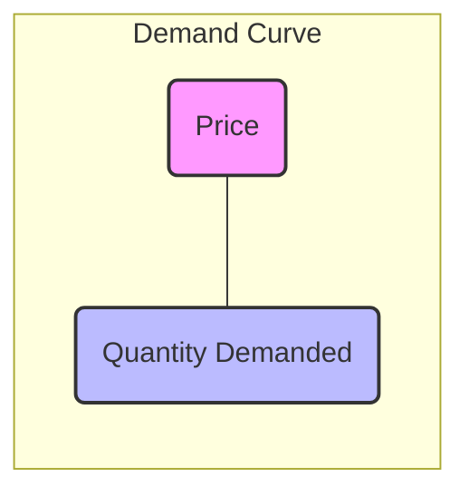
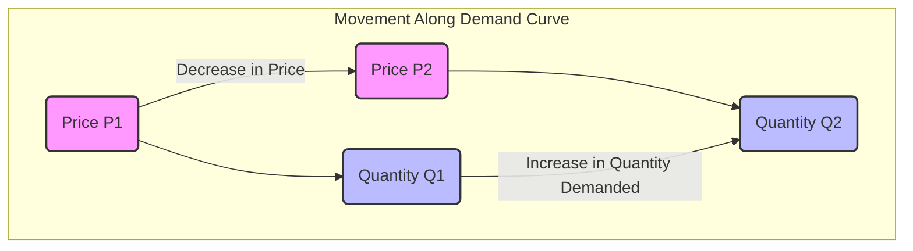
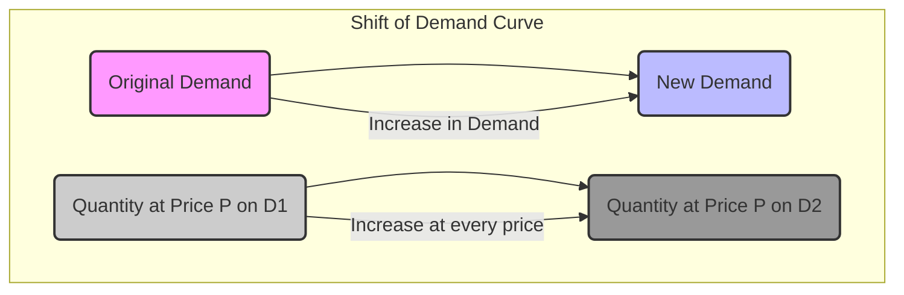
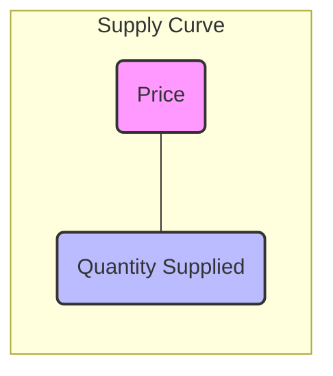
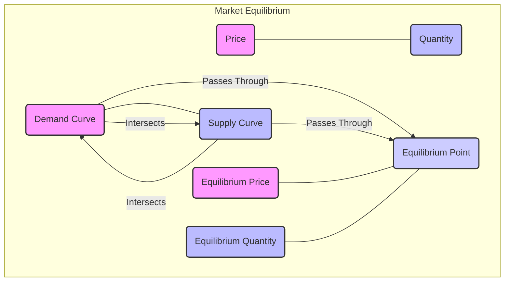
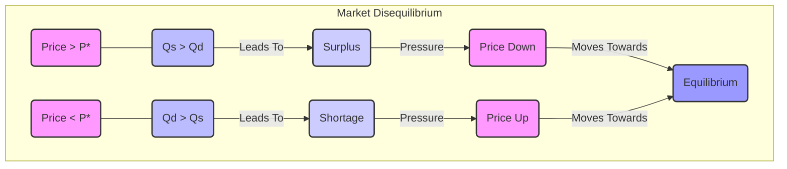

<Prerequisites items={[{ title: "Introduction to Economic Thinking", slug: "intro-economic-thinking", level: "L1", subject: "Microeconomics" }, { title: "Basic Algebra and Graphing", slug: "basic-math-for-economics", level: "Foundation", subject: "Mathematics" }]} />

<DiagnosticQuiz
  question="Which of the following best describes the primary role of prices in a market economy?"
  options={[
    "To determine the total wealth of a nation.",
    "To allocate scarce resources and signal information to buyers and sellers.",
    "To ensure that all goods are distributed equally among the population.",
    "To prevent competition among businesses."
  ]}
  correctIndex={1}
  targetSectionId="section-market-equilibrium"
  sectionTitle="Market Equilibrium: Where Supply Meets Demand"
/>

## Introduction: Unveiling the Invisible Hand

Welcome to the foundational lesson on "Supply and Demand: The Mechanics of Markets," a cornerstone of microeconomic analysis. In this course, we embark on a journey to understand how millions of individual decisions by consumers and producers coalesce to determine the prices and quantities of goods and services exchanged in an economy. This model, often attributed to the insights of <HistoricalPerson name="Adam_Smith" lang="en">Adam Smith</HistoricalPerson>'s "invisible hand," provides a powerful framework for analyzing market behavior, predicting responses to policy changes, and understanding the allocation of scarce resources.

We will move beyond simplistic notions to build a robust understanding, starting from fundamental assumptions and progressing through graphical and algebraic derivations. While powerful, it is crucial to recognize the model's limitations and the critical perspectives that enrich our understanding of complex economic realities.

### Learning Objectives

Upon successful completion of this lesson, you will be able to:

**Knowledge (Savoir):**
*   **Define** the concepts of a market, demand, supply, and market equilibrium.
*   **Identify** the key determinants that influence both demand and supply.
*   **Distinguish** between a change in quantity demanded/supplied and a change in demand/supply.
*   **Explain** the mechanisms by which markets adjust to surpluses and shortages.

**Skills (Savoir-faire):**
*   **Construct** and **interpret** demand and supply schedules and curves from given data.
*   **Derive** market equilibrium price and quantity both graphically and algebraically.
*   **Analyze** the impact of various exogenous shocks (e.g., changes in income, technology, government policies) on market equilibrium.
*   **Apply** the supply and demand model to explain real-world market phenomena.

**Attitudes (Posture/Analyse):**
*   **Appreciate** the power and limitations of simplified economic models in explaining complex phenomena.
*   **Develop** a critical perspective on market interventions and their potential unintended consequences.
*   **Foster** an analytical approach to understanding economic news and policy debates.

---

## 1. The Concept of a Market: An Arena of Exchange

At its core, economics is the study of how societies allocate their scarce resources. Markets are the primary institutions through which this allocation occurs in most modern economies.

<Glossary term="Market" definition="A market is a place or system where buyers and sellers interact to exchange goods, services, or resources. This interaction determines prices and quantities traded.">A market</Glossary> is not necessarily a physical location, but rather a mechanism that facilitates the exchange of goods and services between buyers (demanders) and sellers (suppliers). It is the aggregate of all potential buyers and sellers of a particular good or service.

> [!NOTE]
> **Market vs. Physical Location:** While historically markets were often physical places (e.g., a town square), in modern economics, the concept is much broader. The internet has created vast virtual markets, and even abstract concepts like the "labor market" or "stock market" function as markets without a single physical location. The key is the interaction and exchange.

### 1.1. The Role of Prices

Prices are the central coordinating mechanism in a market economy. They serve as signals that convey information between buyers and sellers, guiding their decisions.

*   **For Buyers:** A higher price signals greater scarcity or higher production cost, prompting buyers to consume less or seek alternatives. A lower price encourages more consumption.
*   **For Sellers:** A higher price signals increased profitability, encouraging sellers to produce more. A lower price discourages production.

This dynamic interaction, mediated by prices, ensures that resources are directed to where they are most valued.

<Quiz>
  <Question q="Which of the following best defines a market in economic terms?" explanation="A market is defined by the interaction of buyers and sellers for exchange, not necessarily a physical location or a government-controlled entity. It's about the mechanism of exchange.">
    <Option text="A physical location where goods are sold." />
    <Option text="A system where buyers and sellers interact to exchange goods and services." correct />
    <Option text="An institution controlled by the government to set prices." />
    <Option text="A place where only producers meet to discuss production quotas." />
  </Question>
</Quiz>

---

## 2. Demand: The Buyer's Perspective

<Glossary term="Demand" definition="Demand refers to the quantity of a good or service that consumers are willing and able to purchase at various prices during a specific period, all else being equal.">Demand</Glossary> represents the behavior of buyers in a market. It reflects their willingness and ability to purchase a good or service.

### 2.1. The Law of Demand

The <Glossary term="Law of Demand" definition="The Law of Demand states that, all else being equal (ceteris paribus), as the price of a good or service increases, the quantity demanded decreases, and vice versa.">Law of Demand</Glossary> is a fundamental principle in economics:

> **Ceteris Paribus**, as the price of a good or service increases, the quantity demanded decreases, and conversely, as the price decreases, the quantity demanded increases.

<Glossary term="Ceteris Paribus" definition="A Latin phrase meaning 'all other things being equal.' It is used in economics to isolate the effect of one variable by assuming all other relevant variables remain constant.">Ceteris Paribus</Glossary> is crucial here. It means we are holding all other factors that could influence demand constant, focusing solely on the relationship between price and quantity demanded.

This inverse relationship can be explained by two effects:
1.  **Substitution Effect:** As the price of a good rises, consumers tend to substitute it with relatively cheaper alternatives.
2.  **Income Effect:** As the price of a good rises, the purchasing power of consumers' income effectively falls, leading them to buy less of all goods, including the one whose price has increased.

### 2.2. Demand Schedule and Demand Curve

A <Glossary term="Demand Schedule" definition="A demand schedule is a table that shows the quantity of a good or service that consumers are willing and able to purchase at different prices during a specific period.">demand schedule</Glossary> is a table that lists the quantity of a good that consumers are willing and able to purchase at various prices.

**Table 1: Demand Schedule for Coffee**

| Price per Cup (\$) | Quantity Demanded (Cups per Day) |
| :----------------- | :------------------------------- |
| 5                  | 10                               |
| 4                  | 20                               |
| 3                  | 30                               |
| 2                  | 40                               |
| 1                  | 50                               |

A <Glossary term="Demand Curve" definition="A demand curve is a graphical representation of the demand schedule, showing the inverse relationship between price (on the y-axis) and quantity demanded (on the x-axis). It typically slopes downwards.">demand curve</Glossary> is a graphical representation of the demand schedule. By convention, price (P) is plotted on the vertical (y) axis, and quantity demanded (Qd) is plotted on the horizontal (x) axis. The demand curve typically slopes downwards from left to right, illustrating the Law of Demand.

```mermaid
graph TD
    A[Price ($)] --> B(Quantity Demanded)
    style A fill:#f9f,stroke:#333,stroke-width:2px
    style B fill:#bbf,stroke:#333,stroke-width:2px
```
<div aria-label="Conceptual diagram showing the inverse relationship between price and quantity demanded. An arrow points from 'Price ($)' to 'Quantity Demanded', indicating that changes in price affect quantity demanded.">
    <p>Figure 1: Conceptual Flow of Price Impact on Quantity Demanded</p>
</div>


<div aria-label="Conceptual diagram showing the axes for a demand curve, with Price on the vertical axis and Quantity Demanded on the horizontal axis.">
    <p>Figure 2: Axes for a Demand Curve</p>
</div>

```mermaid
graph TD
    A[Price ($)] --> B[Quantity Demanded]
    B -- Decreases as Price Increases --> A
    B -- Increases as Price Decreases --> A
    style A fill:#f9f,stroke:#333,stroke-width:2px
    style B fill:#bbf,stroke:#333,stroke-width:2px
```
<div aria-label="Conceptual diagram illustrating the inverse relationship of the Law of Demand. As Price increases, Quantity Demanded decreases, and as Price decreases, Quantity Demanded increases.">
    <p>Figure 3: Illustration of the Law of Demand</p>
</div>

### 2.3. Mathematical Representation of Demand

A linear demand curve can be represented by an equation:

$Q_d = a - bP$

Where:
*   $Q_d$ is the quantity demanded.
*   $P$ is the price.
*   $a$ is the quantity demanded when the price is zero (the x-intercept if price is on the y-axis, or the y-intercept if quantity is on the y-axis, but standard is P on y-axis).
*   $b$ is the slope of the demand curve (specifically, the change in quantity demanded for a one-unit change in price, $\frac{\Delta Q_d}{\Delta P}$). Since the relationship is inverse, $b$ is typically positive, making the term $-bP$ negative.

For example, using the data from Table 1, we can find the equation.
If $P=1, Q_d=50$ and $P=5, Q_d=10$.
Slope $b = \frac{\Delta Q_d}{\Delta P} = \frac{10-50}{5-1} = \frac{-40}{4} = -10$.
So, $Q_d = a - 10P$.
Substitute a point, e.g., $50 = a - 10(1) \implies 50 = a - 10 \implies a = 60$.
Thus, the demand equation is $Q_d = 60 - 10P$.

### 2.4. Determinants of Demand (Shifters of the Demand Curve)

While price causes a movement *along* the demand curve, other factors can cause the entire demand curve to shift. These are known as the <Glossary term="Determinants of Demand" definition="Non-price factors that can cause the entire demand curve to shift, indicating a change in the quantity demanded at every given price.">determinants of demand</Glossary>:

1.  **Income ($Y$):**
    *   **Normal Goods:** As income increases, demand for these goods increases (e.g., restaurant meals, new cars).
    *   **Inferior Goods:** As income increases, demand for these goods decreases (e.g., instant noodles, public transport if private car ownership becomes affordable).
2.  **Prices of Related Goods ($P_r$):**
    *   **Substitutes:** Goods that can be used in place of another. If the price of a substitute rises, demand for the original good increases (e.g., if the price of tea rises, demand for coffee increases).
    *   **Complements:** Goods that are typically consumed together. If the price of a complement rises, demand for the original good decreases (e.g., if the price of sugar rises, demand for coffee might decrease).
3.  **Tastes and Preferences ($T$):** Changes in consumer preferences can significantly shift demand (e.g., a new health trend increases demand for organic food).
4.  **Expectations ($E$):**
    *   **Future Prices:** If consumers expect prices to rise in the future, current demand may increase.
    *   **Future Income:** If consumers expect their income to rise, current demand for certain goods may increase.
5.  **Number of Buyers ($N$):** An increase in the number of potential buyers in the market will increase overall demand (e.g., population growth, new markets opening).

### 2.5. Change in Quantity Demanded vs. Change in Demand

It is crucial to distinguish between these two concepts:

*   **Change in Quantity Demanded:** This refers to a movement *along* a given demand curve, caused solely by a change in the price of the good itself.
    *   *Example:* If the price of coffee falls from \$4 to \$3, the quantity demanded increases from 20 to 30 cups (moving down the curve).
*   **Change in Demand:** This refers to a shift of the *entire* demand curve, caused by a change in one of the non-price determinants of demand.
    *   *Example:* If a new study reveals health benefits of coffee, demand for coffee will increase at every price, shifting the entire demand curve to the right.


<div aria-label="Conceptual diagram showing a movement along a demand curve. A decrease in price from P1 to P2 leads to an increase in quantity demanded from Q1 to Q2, illustrating a change in quantity demanded.">
    <p>Figure 4: Change in Quantity Demanded (Movement Along the Curve)</p>
</div>


<div aria-label="Conceptual diagram showing a shift of the entire demand curve. An increase in demand shifts the curve from D1 to D2, meaning a greater quantity is demanded at every given price.">
    <p>Figure 5: Change in Demand (Shift of the Curve)</p>
</div>

<Quiz>
  <Question q="If the price of gasoline increases, what happens to the quantity of gasoline demanded?" explanation="According to the Law of Demand, an increase in price leads to a decrease in the quantity demanded, assuming all other factors remain constant. This is a movement along the demand curve.">
    <Option text="The quantity demanded increases." />
    <Option text="The quantity demanded decreases." correct />
    <Option text="The demand curve shifts to the right." />
    <Option text="The demand curve shifts to the left." />
  </Question>
  <Question q="Which of the following would cause the demand curve for smartphones to shift to the right?" explanation="A shift to the right (increase in demand) is caused by non-price factors. An increase in consumer income (for a normal good like smartphones) would lead to higher demand at every price. A price increase causes a movement along the curve, not a shift. A decrease in the number of buyers or a decrease in the price of a substitute would shift demand to the left.">
    <Option text="An increase in the price of smartphones." />
    <Option text="A decrease in consumer income." />
    <Option text="A successful advertising campaign for smartphones." correct />
    <Option text="A decrease in the number of smartphone buyers." />
  </Question>
</Quiz>

---

## 3. Supply: The Seller's Perspective

<Glossary term="Supply" definition="Supply refers to the quantity of a good or service that producers are willing and able to offer for sale at various prices during a specific period, all else being equal.">Supply</Glossary> represents the behavior of sellers in a market. It reflects their willingness and ability to produce and sell a good or service.

### 3.1. The Law of Supply

The <Glossary term="Law of Supply" definition="The Law of Supply states that, all else being equal (ceteris paribus), as the price of a good or service increases, the quantity supplied increases, and vice versa.">Law of Supply</Glossary> is another fundamental principle:

> **Ceteris Paribus**, as the price of a good or service increases, the quantity supplied increases, and conversely, as the price decreases, the quantity supplied decreases.

This direct relationship is intuitive: producers are motivated by profit. A higher price for their output makes production more profitable, encouraging them to increase the quantity they offer for sale. Conversely, a lower price reduces profitability, leading them to reduce output.

### 3.2. Supply Schedule and Supply Curve

A <Glossary term="Supply Schedule" definition="A supply schedule is a table that shows the quantity of a good or service that producers are willing and able to offer for sale at different prices during a specific period.">supply schedule</Glossary> is a table that lists the quantity of a good that producers are willing and able to sell at various prices.

**Table 2: Supply Schedule for Coffee**

| Price per Cup (\$) | Quantity Supplied (Cups per Day) |
| :----------------- | :------------------------------- |
| 5                  | 50                               |
| 4                  | 40                               |
| 3                  | 30                               |
| 2                  | 20                               |
| 1                  | 10                               |

A <Glossary term="Supply Curve" definition="A supply curve is a graphical representation of the supply schedule, showing the direct relationship between price (on the y-axis) and quantity supplied (on the x-axis). It typically slopes upwards.">supply curve</Glossary> is a graphical representation of the supply schedule. With price (P) on the vertical axis and quantity supplied (Qs) on the horizontal axis, the supply curve typically slopes upwards from left to right, illustrating the Law of Supply.

```mermaid
graph TD
    A[Price ($)] --> B(Quantity Supplied)
    style A fill:#f9f,stroke:#333,stroke-width:2px
    style B fill:#bbf,stroke:#333,stroke-width:2px
```
<div aria-label="Conceptual diagram showing the direct relationship between price and quantity supplied. An arrow points from 'Price ($)' to 'Quantity Supplied', indicating that changes in price affect quantity supplied.">
    <p>Figure 6: Conceptual Flow of Price Impact on Quantity Supplied</p>
</div>


<div aria-label="Conceptual diagram showing the axes for a supply curve, with Price on the vertical axis and Quantity Supplied on the horizontal axis.">
    <p>Figure 7: Axes for a Supply Curve</p>
</div>

```mermaid
graph TD
    A[Price ($)] --> B[Quantity Supplied]
    B -- Increases as Price Increases --> A
    B -- Decreases as Price Decreases --> A
    style A fill:#f9f,stroke:#333,stroke-width:2px
    style B fill:#bbf,stroke:#333,stroke-width:2px
```
<div aria-label="Conceptual diagram illustrating the direct relationship of the Law of Supply. As Price increases, Quantity Supplied increases, and as Price decreases, Quantity Supplied decreases.">
    <p>Figure 8: Illustration of the Law of Supply</p>
</div>

### 3.3. Mathematical Representation of Supply

A linear supply curve can be represented by an equation:

$Q_s = c + dP$

Where:
*   $Q_s$ is the quantity supplied.
*   $P$ is the price.
*   $c$ is the quantity supplied when the price is zero (the x-intercept if price is on the y-axis).
*   $d$ is the slope of the supply curve ($\frac{\Delta Q_s}{\Delta P}$). Since the relationship is direct, $d$ is typically positive.

For example, using the data from Table 2:
If $P=1, Q_s=10$ and $P=5, Q_s=50$.
Slope $d = \frac{\Delta Q_s}{\Delta P} = \frac{50-10}{5-1} = \frac{40}{4} = 10$.
So, $Q_s = c + 10P$.
Substitute a point, e.g., $10 = c + 10(1) \implies 10 = c + 10 \implies c = 0$.
Thus, the supply equation is $Q_s = 10P$.

### 3.4. Determinants of Supply (Shifters of the Supply Curve)

Similar to demand, non-price factors can cause the entire supply curve to shift. These are the <Glossary term="Determinants of Supply" definition="Non-price factors that can cause the entire supply curve to shift, indicating a change in the quantity supplied at every given price.">determinants of supply</Glossary>:

1.  **Input Prices ($P_i$):** The cost of resources used in production (e.g., labor, raw materials, energy). If input prices rise, production becomes less profitable, and supply decreases (shifts left).
2.  **Technology ($T_e$):** Advances in technology can reduce production costs or increase efficiency, leading to an increase in supply (shifts right).
3.  **Expectations ($E$):** If producers expect future prices to rise, they might reduce current supply to sell more later at a higher price.
4.  **Number of Sellers ($N_s$):** An increase in the number of firms in the market will increase overall supply.
5.  **Government Policies ($G$):**
    *   **Taxes:** Increase production costs, decreasing supply.
    *   **Subsidies:** Reduce production costs, increasing supply.
    *   **Regulations:** Can increase costs or restrict production, decreasing supply.

### 3.5. Change in Quantity Supplied vs. Change in Supply

*   **Change in Quantity Supplied:** This refers to a movement *along* a given supply curve, caused solely by a change in the price of the good itself.
    *   *Example:* If the price of coffee rises from \$3 to \$4, the quantity supplied increases from 30 to 40 cups (moving up the curve).
*   **Change in Supply:** This refers to a shift of the *entire* supply curve, caused by a change in one of the non-price determinants of supply.
    *   *Example:* If a new, more efficient coffee harvesting technology is introduced, supply of coffee will increase at every price, shifting the entire supply curve to the right.


<div aria-label="Conceptual diagram showing a movement along a supply curve. An increase in price from P1 to P2 leads to an increase in quantity supplied from Q1 to Q2, illustrating a change in quantity supplied.">
    <p>Figure 9: Change in Quantity Supplied (Movement Along the Curve)</p>
</div>


<div aria-label="Conceptual diagram showing a shift of the entire supply curve. An increase in supply shifts the curve from S1 to S2, meaning a greater quantity is supplied at every given price.">
    <p>Figure 10: Change in Supply (Shift of the Curve)</p>
</div>

<Quiz>
  <Question q="What happens to the supply curve for wheat if there is a significant drought that destroys a large portion of the crop?" explanation="A drought reduces the available raw materials (inputs) for wheat production, making it harder and more costly to produce. This is a non-price factor that decreases supply, shifting the entire supply curve to the left.">
    <Option text="The supply curve shifts to the right." />
    <Option text="The supply curve shifts to the left." correct />
    <Option text="There is a movement upwards along the supply curve." />
    <Option text="There is a movement downwards along the supply curve." />
  </Question>
  <Question q="If the government offers a subsidy to producers of electric vehicles, what is the likely impact on the market for electric vehicles?" explanation="A subsidy reduces the effective cost of production for firms, making it more profitable to produce electric vehicles at any given price. This will increase the supply of electric vehicles, shifting the supply curve to the right.">
    <Option text="The supply curve shifts to the left." />
    <Option text="The demand curve shifts to the right." />
    <Option text="The supply curve shifts to the right." correct />
    <Option text="There is a movement along the supply curve to a lower quantity." />
  </Question>
</Quiz>

---

<div id="section-market-equilibrium">
## 4. Market Equilibrium: Where Supply Meets Demand
</div>

The interaction of demand and supply determines the <Glossary term="Market Equilibrium" definition="Market equilibrium is a state where the quantity demanded equals the quantity supplied at a specific price, known as the equilibrium price. At this point, there is no tendency for the price to change.">market equilibrium</Glossary>. This is the point where the forces of supply and demand are balanced.

### 4.1. Equilibrium Price and Quantity

The <Glossary term="Equilibrium Price" definition="The equilibrium price is the price at which the quantity demanded by consumers exactly equals the quantity supplied by producers.">equilibrium price</Glossary> ($P^*$) is the price at which the quantity demanded ($Q_d$) equals the quantity supplied ($Q_s$). The corresponding quantity is the <Glossary term="Equilibrium Quantity" definition="The equilibrium quantity is the quantity of a good or service bought and sold at the equilibrium price.">equilibrium quantity</Glossary> ($Q^*$).

At this point, there is no pressure for the price to change, as all buyers willing to pay the equilibrium price can find a seller, and all sellers willing to sell at that price can find a buyer.

**Table 3: Combined Demand and Supply Schedules for Coffee**

| Price (\$) | Quantity Demanded | Quantity Supplied | Market Condition | Pressure on Price |
| :--------- | :---------------- | :---------------- | :--------------- | :---------------- |
| 5          | 10                | 50                | Surplus (40)     | Downward          |
| 4          | 20                | 40                | Surplus (20)     | Downward          |
| **3**      | **30**            | **30**            | **Equilibrium**  | **None**          |
| 2          | 40                | 20                | Shortage (20)    | Upward            |
| 1          | 50                | 10                | Shortage (40)    | Upward            |

From Table 3, we can see that the equilibrium price is \$3, and the equilibrium quantity is 30 cups per day.

### 4.2. Graphical Determination of Equilibrium

When the demand and supply curves are plotted on the same graph, their intersection point represents the market equilibrium.


<div aria-label="Conceptual diagram showing market equilibrium. The Demand Curve (downward sloping) and Supply Curve (upward sloping) intersect at the Equilibrium Point, which determines the Equilibrium Price and Equilibrium Quantity.">
    <p>Figure 11: Market Equilibrium Concept</p>
</div>

### 4.3. Algebraic Determination of Equilibrium

To find the equilibrium algebraically, we set the quantity demanded equal to the quantity supplied:

$Q_d = Q_s$

Using our example equations:
$Q_d = 60 - 10P$
$Q_s = 10P$

Set them equal:
$60 - 10P = 10P$
$60 = 20P$
$P = \frac{60}{20}$
$P^* = 3$

Now, substitute $P^* = 3$ into either the demand or supply equation to find $Q^*$:
Using demand: $Q_d = 60 - 10(3) = 60 - 30 = 30$
Using supply: $Q_s = 10(3) = 30$
So, $Q^* = 30$.

The equilibrium is $P^* = \$3$ and $Q^* = 30$ cups, matching our table.

### 4.4. Surplus and Shortage: Market Adjustments

When the market is not in equilibrium, there are forces that push the price towards equilibrium.

*   **Surplus (Excess Supply):** Occurs when the market price is *above* the equilibrium price. At this higher price, $Q_s > Q_d$.
    *   Sellers are willing to supply more than buyers are willing to purchase.
    *   This leads to unsold goods, prompting sellers to lower prices to clear inventory.
    *   As prices fall, quantity demanded increases, and quantity supplied decreases, moving towards equilibrium.

*   **Shortage (Excess Demand):** Occurs when the market price is *below* the equilibrium price. At this lower price, $Q_d > Q_s$.
    *   Buyers are willing to purchase more than sellers are willing to supply.
    *   This leads to empty shelves and frustrated buyers, prompting sellers to raise prices.
    *   As prices rise, quantity demanded decreases, and quantity supplied increases, moving towards equilibrium.


<div aria-label="Conceptual diagram illustrating market adjustments from disequilibrium. If Price is above equilibrium, a Surplus occurs, leading to downward pressure on price. If Price is below equilibrium, a Shortage occurs, leading to upward pressure on price. Both pressures move the market towards equilibrium.">
    <p>Figure 12: Market Adjustment Mechanisms</p>
</div>

<Quiz>
  <Question q="If the current market price for a product is above the equilibrium price, what will occur?" explanation="When the price is above equilibrium, the quantity supplied exceeds the quantity demanded, resulting in a surplus. This surplus will put downward pressure on the price as sellers compete to sell their excess inventory.">
    <Option text="A shortage, leading to an increase in price." />
    <Option text="A surplus, leading to a decrease in price." correct />
    <Option text="A shortage, leading to a decrease in price." />
    <Option text="A surplus, leading to an increase in price." />
  </Question>
  <Question q="Given the demand equation $Q_d = 100 - 2P$ and the supply equation $Q_s = 3P$, what is the equilibrium price?" explanation="To find the equilibrium price, set quantity demanded equal to quantity supplied: $100 - 2P = 3P$. Add $2P$ to both sides: $100 = 5P$. Divide by 5: $P = 20$.">
    <Option text="$P = 10$" />
    <Option text="$P = 20$" correct />
    <Option text="$P = 25$" />
    <Option text="$P = 50$" />
  </Question>
</Quiz>

---

## 5. Changes in Market Equilibrium: Analyzing Shifts

The power of the supply and demand model lies in its ability to predict how changes in underlying conditions affect market outcomes. When one of the non-price determinants of demand or supply changes, the respective curve shifts, leading to a new equilibrium.

### 5.1. Impact of Shifts in Demand

*   **Increase in Demand (Demand Curve Shifts Right):**
    *   At the original price, there is now a shortage ($Q_d > Q_s$).
    *   This shortage puts upward pressure on price.
    *   The new equilibrium will have a higher price and a higher quantity.
    *   *Example:* A new scientific study proves that chocolate is good for health. Demand for chocolate increases.

*   **Decrease in Demand (Demand Curve Shifts Left):**
    *   At the original price, there is now a surplus ($Q_s > Q_d$).
    *   This surplus puts downward pressure on price.
    *   The new equilibrium will have a lower price and a lower quantity.
    *   *Example:* A recession leads to a decrease in consumer income, reducing demand for luxury goods.

### 5.2. Impact of Shifts in Supply

*   **Increase in Supply (Supply Curve Shifts Right):**
    *   At the original price, there is now a surplus ($Q_s > Q_d$).
    *   This surplus puts downward pressure on price.
    *   The new equilibrium will have a lower price and a higher quantity.
    *   *Example:* A technological innovation dramatically reduces the cost of producing solar panels. Supply of solar panels increases.

*   **Decrease in Supply (Supply Curve Shifts Left):**
    *   At the original price, there is now a shortage ($Q_d > Q_s$).
    *   This shortage puts upward pressure on price.
    *   The new equilibrium will have a higher price and a lower quantity.
    *   *Example:* A natural disaster destroys a significant portion of a country's agricultural output. Supply of food decreases.

### 5.3. Simultaneous Shifts in Supply and Demand

When both curves shift simultaneously, the impact on either equilibrium price or quantity will be indeterminate, depending on the relative magnitudes of the shifts.

*   **Case 1: Both Demand and Supply Increase (Both Shift Right)**
    *   Equilibrium Quantity ($Q^*$) will definitely increase.
    *   Equilibrium Price ($P^*$) is indeterminate (could increase, decrease, or stay the same) depending on which shift is larger.
        *   If demand increases more than supply, $P^*$ rises.
        *   If supply increases more than demand, $P^*$ falls.
        *   If they increase by the same magnitude, $P^*$ stays the same.

*   **Case 2: Both Demand and Supply Decrease (Both Shift Left)**
    *   Equilibrium Quantity ($Q^*$) will definitely decrease.
    *   Equilibrium Price ($P^*$) is indeterminate.

*   **Case 3: Demand Increases (Right) and Supply Decreases (Left)**
    *   Equilibrium Price ($P^*$) will definitely increase.
    *   Equilibrium Quantity ($Q^*$) is indeterminate.

*   **Case 4: Demand Decreases (Left) and Supply Increases (Right)**
    *   Equilibrium Price ($P^*$) will definitely decrease.
    *   Equilibrium Quantity ($Q^*$) is indeterminate.

> [!NOTE]
> **Mnemonic for Simultaneous Shifts:** When both curves shift, one variable (either P or Q) will change unambiguously, and the other will be ambiguous. If both curves shift in the *same direction* (both right or both left), then quantity is unambiguous. If they shift in *opposite directions* (one right, one left), then price is unambiguous.

<Epistemology title="The 'Invisible Hand' and its Critics">
    The concept of supply and demand, and the idea that markets naturally tend towards equilibrium, is often associated with <HistoricalPerson name="Adam_Smith" lang="en">Adam Smith</HistoricalPerson>'s metaphor of the "invisible hand" from his 1776 work, *The Wealth of Nations* <sup>[[1](#ref-1)]</sup>. Smith argued that individuals pursuing their self-interest in a free market inadvertently promote the general welfare of society. The supply and demand model provides a formal mechanism for this idea, showing how decentralized decisions lead to an efficient allocation of resources.

    However, this model is not without its critics and limitations. Early economists like <HistoricalPerson name="Jean-Baptiste_Say" lang="en">Jean-Baptiste Say</HistoricalPerson> emphasized the self-regulating nature of markets, but later economists, particularly during the Great Depression, questioned this. <HistoricalPerson name="John_Maynard_Keynes" lang="en">John Maynard Keynes</HistoricalPerson> famously challenged the notion that markets always self-correct to full employment, arguing for government intervention to manage aggregate demand <sup>[[2](#ref-2)]</sup>.

    Modern criticisms of the pure supply and demand model include:
    *   **Information Asymmetry:** Buyers and sellers often do not have perfect information, leading to inefficient outcomes.
    *   **Externalities:** The model often fails to account for costs or benefits imposed on third parties not involved in the transaction (e.g., pollution from production).
    *   **Market Power:** The assumption of many small buyers and sellers (perfect competition) is often violated, with monopolies or oligopolies having the power to influence prices.
    *   **Public Goods:** Markets struggle to provide public goods efficiently due to non-excludability and non-rivalry.
    *   **Behavioral Economics:** Challenges the assumption of perfectly rational economic agents, showing how psychological biases influence decisions.

    While the supply and demand model remains a powerful analytical tool, a nuanced understanding requires acknowledging these real-world complexities and limitations. It serves as a foundational building block, but not the complete picture of economic reality.
</Epistemology>

<Quiz>
  <Question q="What is the effect on the equilibrium price and quantity of coffee if a new, highly efficient coffee bean harvesting machine is invented (reducing production costs), and simultaneously, a new scientific study reveals that drinking coffee significantly reduces the risk of heart disease?" explanation="The new machine increases supply (shifts supply right), which tends to decrease price and increase quantity. The health study increases demand (shifts demand right), which tends to increase price and increase quantity. Both effects increase quantity, so equilibrium quantity will definitely increase. However, the effect on price is ambiguous: it depends on which shift is larger. If supply increases more than demand, price falls. If demand increases more than supply, price rises. If they increase by the same amount, price stays the same.">
    <Option text="Equilibrium price increases, equilibrium quantity decreases." />
    <Option text="Equilibrium price decreases, equilibrium quantity increases." />
    <Option text="Equilibrium quantity increases, and the effect on equilibrium price is indeterminate." correct />
    <Option text="Equilibrium price increases, and the effect on equilibrium quantity is indeterminate." />
  </Question>
  <Question q="If the price of a substitute good for product X decreases, what will happen to the equilibrium price and quantity of product X?" explanation="A decrease in the price of a substitute good will make consumers switch from product X to the now cheaper substitute. This causes the demand for product X to decrease (shift left). A decrease in demand leads to a lower equilibrium price and a lower equilibrium quantity for product X.">
    <Option text="Equilibrium price increases, equilibrium quantity decreases." />
    <Option text="Equilibrium price decreases, equilibrium quantity increases." />
    <Option text="Equilibrium price and quantity both increase." />
    <Option text="Equilibrium price and quantity both decrease." correct />
  </Question>
</Quiz>

---

## 6. Applications of Supply and Demand: Real-World Interventions

The supply and demand model is not just theoretical; it provides a framework for understanding the effects of government interventions in markets.

### 6.1. Price Ceilings

A <Glossary term="Price Ceiling" definition="A price ceiling is a legal maximum price that can be charged for a good or service. To be effective, it must be set below the equilibrium price.">price ceiling</Glossary> is a legal maximum on the price at which a good can be sold.
*   **To be effective (binding),** the price ceiling must be set *below* the equilibrium price.
*   **Consequences:**
    *   Creates a persistent <Glossary term="Shortage" definition="A market condition where the quantity demanded exceeds the quantity supplied at a given price, typically below the equilibrium price. Also known as excess demand.">shortage</Glossary> ($Q_d > Q_s$).
    *   Leads to non-price rationing mechanisms (e.g., waiting lists, black markets, discrimination).
    *   *Example:* Rent control in cities.

### 6.2. Price Floors

A <Glossary term="Price Floor" definition="A price floor is a legal minimum price that can be charged for a good or service. To be effective, it must be set above the equilibrium price.">price floor</Glossary> is a legal minimum on the price at which a good can be sold.
*   **To be effective (binding),** the price floor must be set *above* the equilibrium price.
*   **Consequences:**
    *   Creates a persistent <Glossary term="Surplus" definition="A market condition where the quantity supplied exceeds the quantity demanded at a given price, typically above the equilibrium price. Also known as excess supply.">surplus</Glossary> ($Q_s > Q_d$).
    *   Government may have to buy the surplus (e.g., agricultural price supports) or firms may face unsold inventory.
    *   *Example:* Minimum wage (a price floor in the labor market).

### 6.3. Taxes and Subsidies (Brief Introduction)

*   **Taxes:** A tax on a good effectively increases the cost for producers or reduces the effective price for consumers. This typically shifts the supply curve (for a tax on producers) or demand curve (for a tax on consumers) and leads to a higher equilibrium price paid by consumers and a lower equilibrium quantity.
*   **Subsidies:** A subsidy is a payment from the government to producers or consumers. It effectively reduces the cost for producers or increases the effective price for consumers. This typically shifts the supply curve (for a subsidy to producers) or demand curve (for a subsidy to consumers) and leads to a lower equilibrium price paid by consumers and a higher equilibrium quantity.

The supply and demand model helps us analyze who bears the burden of a tax (tax incidence) or who benefits from a subsidy, which depends on the relative responsiveness of demand and supply (elasticities, a topic for a future lesson).

---

## Summary & Conclusion

This lesson has provided a comprehensive introduction to the fundamental concepts of supply and demand, the bedrock of microeconomic analysis. We began by defining the market as an arena of exchange, where prices serve as crucial signals. We then meticulously dissected the behavior of buyers through the Law of Demand, its graphical and algebraic representations, and the non-price determinants that shift the demand curve. Similarly, we explored the seller's perspective via the Law of Supply, its graphical and algebraic forms, and the factors that influence supply.

The core of our analysis converged on market equilibrium, the point where the forces of supply and demand balance, determining the unique equilibrium price and quantity. We examined how markets naturally adjust to disequilibrium conditions (surpluses and shortages) and how shifts in either demand or supply lead to new equilibrium outcomes. Finally, we touched upon real-world applications, illustrating how government interventions like price ceilings and floors can create unintended consequences, and how taxes and subsidies alter market dynamics.

<Summary items={["A market is an interaction between buyers and sellers where prices coordinate exchange.", "The Law of Demand states an inverse relationship between price and quantity demanded, ceteris paribus.", "The Law of Supply states a direct relationship between price and quantity supplied, ceteris paribus.", "Demand and supply curves are graphical representations, and their shifts are caused by non-price determinants.", "Market equilibrium occurs where quantity demanded equals quantity supplied, determining equilibrium price and quantity.", "Surpluses (excess supply) and shortages (excess demand) drive prices towards equilibrium.", "Shifts in demand or supply lead to new equilibrium points, with simultaneous shifts potentially causing indeterminate outcomes for price or quantity.", "Government interventions like price ceilings and floors can create shortages or surpluses, respectively."]} />

### Open Reflection Questions & Further Study

*   Consider a recent news event involving a significant price change for a common good (e.g., gasoline, housing, a popular tech gadget). How would you use the supply and demand model to explain this change? What factors likely shifted?
*   Think about a product you consume regularly. What are its main substitutes and complements? How would a change in their prices affect your demand for that product?
*   The model assumes rational actors. How might behavioral economics, which considers psychological biases, challenge or refine our understanding of demand and supply?
*   Explore the concept of "market failure" in more detail. When do markets *not* efficiently allocate resources, and what role might government play in such cases? (This will be covered in later lessons, but it's good to start thinking about it now).

This foundational understanding of supply and demand will serve as an indispensable tool as we delve into more complex microeconomic topics, including elasticity, consumer choice, firm behavior, and market structures.

---

## Evaluation

<Quiz durationLimit={300}>
  <Question q="Which of the following events would cause a movement along the demand curve for beef, rather than a shift of the entire curve?" explanation="A movement along the demand curve is caused solely by a change in the price of the good itself. All other options (new health report, increase in income, decrease in price of a substitute) are non-price determinants that would shift the entire demand curve.">
    <Option text="A new scientific report linking beef consumption to health benefits." />
    <Option text="An increase in consumer income." />
    <Option text="A decrease in the price of chicken (a substitute for beef)." />
    <Option text="A decrease in the price of beef." correct />
  </Question>
  <Question q="If the market for organic vegetables is initially in equilibrium, and then a new, highly efficient organic farming technique is developed, what is the most likely immediate effect on the equilibrium price and quantity of organic vegetables?" explanation="A new, highly efficient farming technique reduces production costs, which increases the supply of organic vegetables (shifts the supply curve to the right). An increase in supply, with unchanged demand, leads to a lower equilibrium price and a higher equilibrium quantity.">
    <Option text="Equilibrium price increases, equilibrium quantity decreases." />
    <Option text="Equilibrium price decreases, equilibrium quantity increases." correct />
    <Option text="Equilibrium price and quantity both increase." />
    <Option text="Equilibrium price and quantity both decrease." />
  </Question>
  <Question q="Consider the market for luxury cars. If a global economic recession causes a significant decrease in average consumer income, and simultaneously, a major technological breakthrough substantially reduces the cost of producing luxury cars, what can be said about the new equilibrium?" explanation="A decrease in consumer income (for a normal good like luxury cars) decreases demand (shifts demand left), which tends to decrease both price and quantity. A technological breakthrough reduces production costs, increasing supply (shifts supply right), which tends to decrease price and increase quantity. Both effects push the price down, so equilibrium price will definitely decrease. However, the effect on quantity is ambiguous: demand decrease pushes quantity down, while supply increase pushes quantity up. The net effect on quantity depends on the relative magnitudes of the shifts.">
    <Option text="Equilibrium price will increase, and equilibrium quantity will decrease." />
    <Option text="Equilibrium price will decrease, and the effect on equilibrium quantity is indeterminate." correct />
    <Option text="Equilibrium quantity will increase, and the effect on equilibrium price is indeterminate." />
    <Option text="Both equilibrium price and quantity will decrease." />
  </Question>
  <Question q="A binding price floor in a market will typically lead to:" explanation="A binding price floor is set above the equilibrium price. At this higher price, producers are willing to supply more than consumers are willing to buy, resulting in a surplus (excess supply). It does not cause a shortage, nor does it necessarily lead to a new equilibrium at a lower price.">
    <Option text="A shortage." />
    <Option text="A surplus." correct />
    <Option text="A new equilibrium at a lower price." />
    <Option text="An increase in demand." />
  </Question>
</Quiz>

### Glossary

*   <Glossary term="Ceteris Paribus" definition="A Latin phrase meaning 'all other things being equal.' It is used in economics to isolate the effect of one variable by assuming all other relevant variables remain constant.">Ceteris Paribus</Glossary>
*   <Glossary term="Demand" definition="Demand refers to the quantity of a good or service that consumers are willing and able to purchase at various prices during a specific period, all else being equal.">Demand</Glossary>
*   <Glossary term="Demand Curve" definition="A demand curve is a graphical representation of the demand schedule, showing the inverse relationship between price (on the y-axis) and quantity demanded (on the x-axis). It typically slopes downwards.">Demand Curve</Glossary>
*   <Glossary term="Demand Schedule" definition="A demand schedule is a table that shows the quantity of a good or service that consumers are willing and able to purchase at different prices during a specific period.">Demand Schedule</Glossary>
*   <Glossary term="Determinants of Demand" definition="Non-price factors that can cause the entire demand curve to shift, indicating a change in the quantity demanded at every given price.">Determinants of Demand</Glossary>
*   <Glossary term="Determinants of Supply" definition="Non-price factors that can cause the entire supply curve to shift, indicating a change in the quantity supplied at every given price.">Determinants of Supply</Glossary>
*   <Glossary term="Equilibrium Price" definition="The equilibrium price is the price at which the quantity demanded by consumers exactly equals the quantity supplied by producers.">Equilibrium Price</Glossary>
*   <Glossary term="Equilibrium Quantity" definition="The equilibrium quantity is the quantity of a good or service bought and sold at the equilibrium price.">Equilibrium Quantity</Glossary>
*   <Glossary term="Law of Demand" definition="The Law of Demand states that, all else being equal (ceteris paribus), as the price of a good or service increases, the quantity demanded decreases, and vice versa.">Law of Demand</Glossary>
*   <Glossary term="Law of Supply" definition="The Law of Supply states that, all else being equal (ceteris paribus), as the price of a good or service increases, the quantity supplied increases, and vice versa.">Law of Supply</Glossary>
*   <Glossary term="Market" definition="A market is a place or system where buyers and sellers interact to exchange goods, services, or resources. This interaction determines prices and quantities traded.">Market</Glossary>
*   <Glossary term="Market Equilibrium" definition="Market equilibrium is a state where the quantity demanded equals the quantity supplied at a specific price, known as the equilibrium price. At this point, there is no tendency for the price to change.">Market Equilibrium</Glossary>
*   <Glossary term="Price Ceiling" definition="A price ceiling is a legal maximum price that can be charged for a good or service. To be effective, it must be set below the equilibrium price.">Price Ceiling</Glossary>
*   <Glossary term="Price Floor" definition="A price floor is a legal minimum price that can be charged for a good or service. To be effective, it must be set above the equilibrium price.">Price Floor</Glossary>
*   <Glossary term="Shortage" definition="A market condition where the quantity demanded exceeds the quantity supplied at a given price, typically below the equilibrium price. Also known as excess demand.">Shortage</Glossary>
*   <Glossary term="Supply" definition="Supply refers to the quantity of a good or service that producers are willing and able to offer for sale at various prices during a specific period, all else being equal.">Supply</Glossary>
*   <Glossary term="Supply Curve" definition="A supply curve is a graphical representation of the supply schedule, showing the direct relationship between price (on the y-axis) and quantity supplied (on the x-axis). It typically slopes upwards.">Supply Curve</Glossary>
*   <Glossary term="Supply Schedule" definition="A supply schedule is a table that shows the quantity of a good or service that producers are willing and able to offer for sale at different prices during a specific period.">Supply Schedule</Glossary>
*   <Glossary term="Surplus" definition="A market condition where the quantity supplied exceeds the quantity demanded at a given price, typically above the equilibrium price. Also known as excess supply.">Surplus</Glossary>

### References

<a id="ref-1"></a>[1] Smith, A. (1776). *An Inquiry into the Nature and Causes of the Wealth of Nations*. W. Strahan and T. Cadell. [Available at Project Gutenberg](https://www.gutenberg.org/files/3300/3300-h/3300-h.htm)
<a id="ref-2"></a>[2] Keynes, J. M. (1936). *The General Theory of Employment, Interest and Money*. Macmillan. [Available at Marxists Internet Archive](https://www.marxists.org/reference/subject/economics/keynes/general-theory/)
<a id="ref-3"></a>[3] Mankiw, N. G. (2020). *Principles of Microeconomics* (9th ed.). Cengage Learning. [Publisher's page for the book](https://www.cengage.com/c/principles-of-microeconomics-9e-mankiw/9780357038382/)
<a id="ref-4"></a>[4] McConnell, C. R., Brue, S. L., & Flynn, S. M. (2021). *Microeconomics: Principles, Problems, and Policies* (22nd ed.). McGraw-Hill Education. [Publisher's page for the book](https://www.mheducation.com/highered/product/microeconomics-principles-problems-policies-mcconnell-brue-flynn/9781260205050.html)
